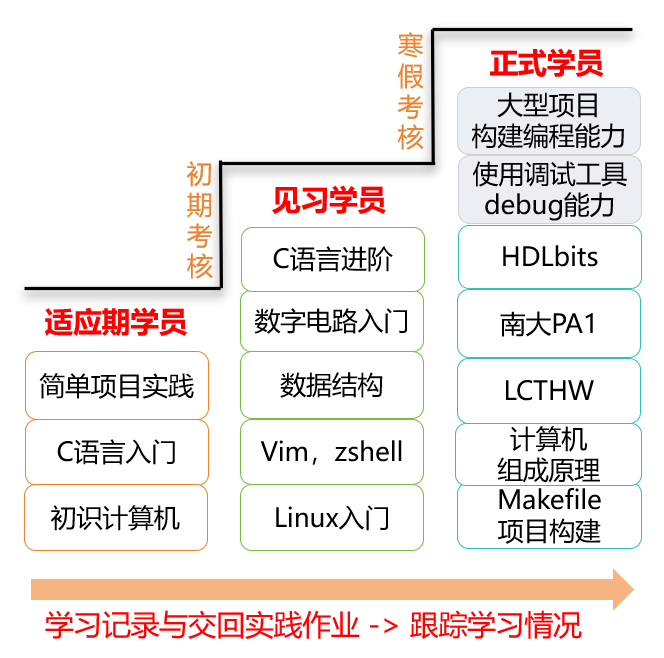

# 太原理工大学"一生一芯"工作室前置讲义

本作品由 ***许鹏远及后续核心负责人*** 共同创作，采用 CC BY-SA 4.0 协议授权。

## 在线地址

[先研实验室前置学习讲义](https://tyut-ysyx-studio.github.io/Pre-docs/)

## 设计宗旨

本讲义在"一生一芯"计划现有教学内容的基础上，结合太原理工大学课程培养方案，专为大一零基础学生设计。将预学习阶段细分为【适应期学员、见习学员、正式学员】三个阶段，通过明确的阶段目标与正反馈机制，帮助学员稳步建立学习信心。讲义难度循序渐进，以基础内容为主，降低入门门槛，同时融入扩展任务以进一步夯实计算机基础能力。



太原理工大学"一生一芯"工作室成立详情：[查看公众号推文](https://mp.weixin.qq.com/s/n5LLUQzq49h1lqLF4oNsig)

"一生一芯"计划官网：[https://ysyx.oscc.cc/](https://ysyx.oscc.cc/)

## 技术栈

基于 [VitePress](https://vitepress.dev/) 构建，部署于 GitHub Pages。

本地预览：

```
npm install
npm run dev
```

## 参与贡献

我们欢迎社区贡献！如果你发现了文本或格式问题，可以：

- 在 [Issues](https://github.com/TYUT-YSYX-studio/Pre-docs/issues) 中留言反馈
- 直接提交 Pull Request 修复

详细的贡献流程、分支命名规范和 Commit 格式，请参阅 [CONTRIBUTING.md](./CONTRIBUTING.md)。

> [!CAUTION]
> 本文档采用 CC BY-SA 4.0 协议：https://creativecommons.org/licenses/by-sa/4.0/deed.en
> 转载或使用时须注明所有者"太原理工大学一生一芯工作室"及 GitHub 仓库地址：https://github.com/TYUT-YSYX-studio/Pre-docs
> 如需进行二次创作，请以相同许可协议（CC BY-SA 4.0）开源

第二期前置讲义，敬请期待。
