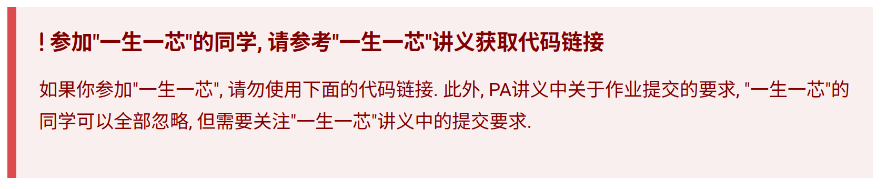
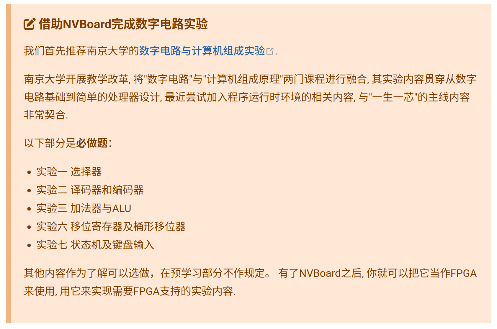

# 预学习过渡阶段

学习情况：在大家完成寒假研学内容之后，至此大家就完成了**数字设计，数字电路，复习 C 语言，数据结构与算法**的学习，额外的我们还学习了**项目框架构建，makefile 的使用，debug 工具的使用等等计算机基础知识**。能力强的同学额外完成了**计算机组成原理**的学习。这也意味着大家是时候去官网尝试预学习讲义了。

学习目标：视自己的个人情况，在**两个月内**完成预学习内容，进行预学习答辩。这也意味着接下来的时间分配很自由，交给大家自主分配，一定要合理分配时间！**不要懈怠，给自己一个明确的 DDL**，如下给出参考时间表：

> [!TIP]
> 南大数字电路实验——15h
> PA1——35h
> 数电实验一周半完成，PA1 两周完成；预计四月初即可通过预学习答辩

## 南大数字电路实验

> [!TIP]
> 注意！PA0 中绝大多数操作我们**已经学习并实践过**了，因此请认真阅读按照如下这一部分讲义进行，**请勿盲目按照 PA0 中讲义操作**！

### A. 获取工具及框架源码

首先，我们需要安装 PA 中需要的工具：

```
apt-get install build-essential    # build-essential packages, include binary utilities, gcc, make, and so on
apt-get install man                # on-line reference manual
apt-get install gcc-doc            # on-line reference manual for gcc
apt-get install gdb                # GNU debugger
apt-get install git                # revision control system
apt-get install libreadline-dev    # a library used later
apt-get install libsdl2-dev        # a library used later
```

**随后阅读如下讲义以获取 PA 代码：**

PA0 获取包部分讲义：[https://ysyx.oscc.cc/docs/ics-pa/0.6.html#getting-source-code](https://ysyx.oscc.cc/docs/ics-pa/0.6.html#getting-source-code)

> [!TIP]
> 当你发现如下提醒时，阅读该讲义:L[https://ysyx.oscc.cc/docs/2306/preliminary/0.2.html](https://ysyx.oscc.cc/docs/2306/preliminary/0.2.html) 获取属于 YSYX 的代码框架



### B. Verilator 仿真环境搭建

[https://ysyx.oscc.cc/docs/2306/preliminary/0.4.html](https://ysyx.oscc.cc/docs/2306/preliminary/0.4.html)

**从这里开始，我们就要在自己的 Linux 上进行数字设计的编程学习了，逐步搭建电路器件并进行仿真，直到最后设计出一款属于自己的 CPU！**

### C. 南大数字电路实验

实现 YSYX 预学习讲义中如下内容。



## 一生一芯课程 PA

PA 是我们后续学习中非常重要的一部分内容，目前我们已经把 PA0 相关的基础知识进行了补全，至此，我们可以开始 PA1 的学习了，在完成 PA1 的学习后，我们就可以报名预学习答辩了。

## 考察方式

不断更新学习记录，我们会不定期检查学习记录；学习效果不好的同学会线下约谈。

本作品《"太理工一生一芯工作室前置讲义寒假研学篇"》由 许鹏远 创作，并采用 CC BY-SA 4.0 协议进行授权。

遵循 CC BY-SA 4.0 开源协议：[https://creativecommons.org/licenses/by-sa/4.0/deed.en](https://creativecommons.org/licenses/by-sa/4.0/deed.en)

转载或使用请标注所有者：许鹏远，太理“一生一芯”工作室
