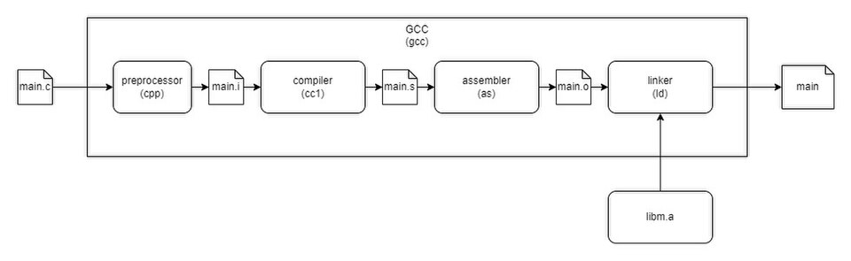
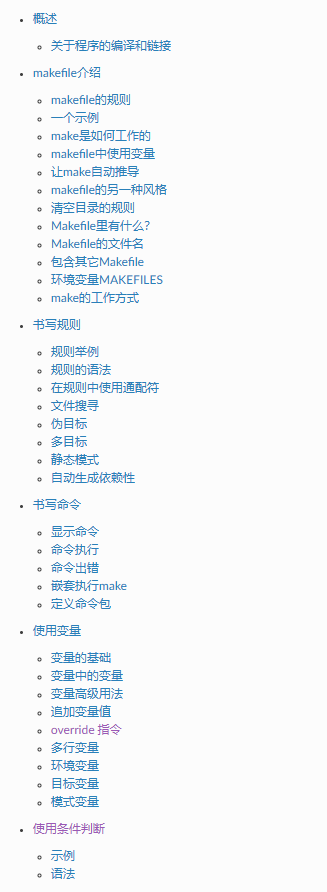
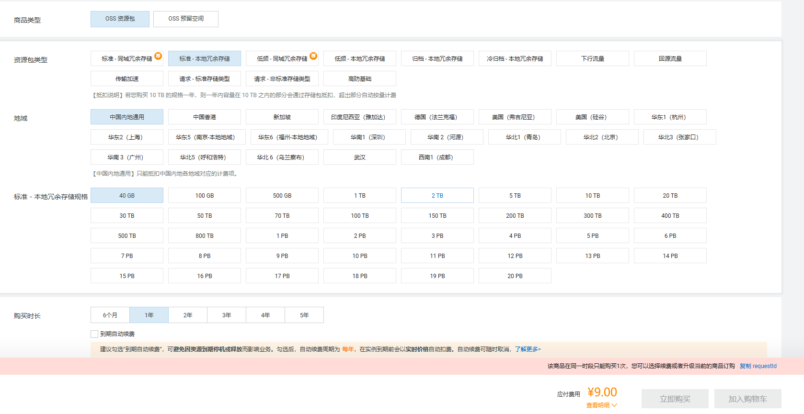
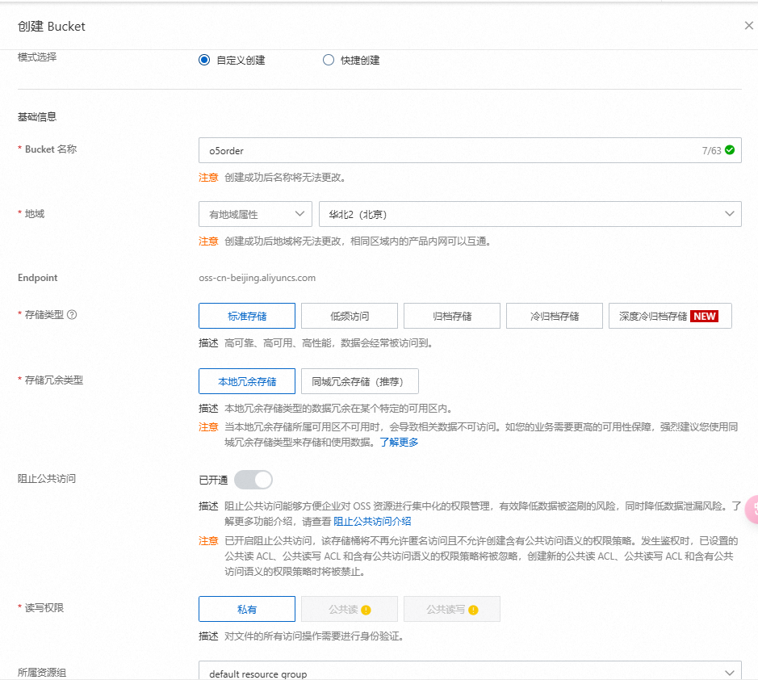
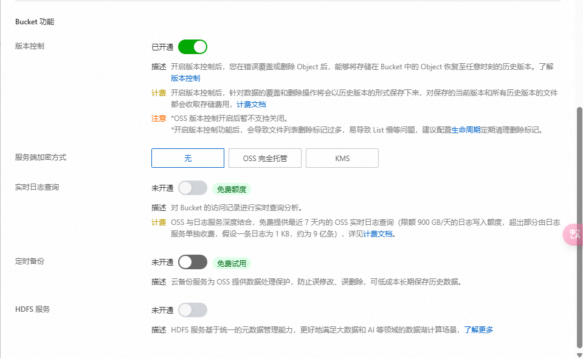
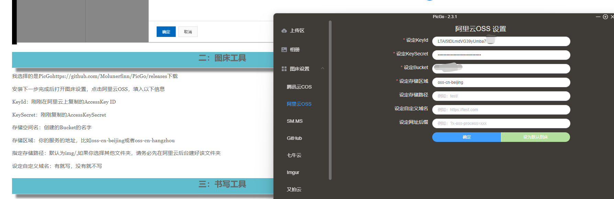

# “一生一芯”太理工作室正式学员第一次学习路线

目前学习情况：大家的 Linux 经过多周的学习，已经达到了正常使用没有问题的水平，对基础命令也有了很好的理解和使用，同时也用上了属于自己的学习记录表，并配置好了图床，至此我们平常学习的基础设施就全部搭建完毕了，**同时记得记录平常学习到学习记录表上哦！**

本次学习目标：在 Linux 上正式运行 C 程序，搞懂 C 程序是怎么在自己的电脑上跑起来的，随后我们就将学习**项目构建的必需语言**——**makefile**，利用 makefile 语言我们将可以把很复杂的项目一键编译运行，是未来我们做大型项目的必备知识，是计算机工作技术栈的必备一环，现阶段先将笔记做扎实，在之后进行实践大家会对 makefile 有一个更好的理解；目前仅需要将我们要求的章节学习完毕，实践部分只需构建简单的 C 项目即可

**xpy 碎碎念：**

makefile 后面那些奇怪的符号大多都是 shell 语法中使用到的，可能学一下 shell 脚本语言会更容易理解一些，至于自动变量以及很多 makefile 的逐层引入，还有很多 gcc 变量等等，这些极其繁琐，都是编译原理即编译器、链接器等使用的，比如 CFLAGS，LDFLAGS，【**这些在手册里都是几百页的内容**】，要把这些全弄懂难度很高，而且绝对会忘，这个在你之后接触大的工程，即寒假左右，对这里会有一个比较好的理解和认知，现在去全部学懂，也很难用出来，用不出来很快就会忘记，makefile 同样作为一门语言，而且是很特殊的语言，学好的方法是**多看大型项目中的 makefile 是怎么写的，怎么把各组件链接起来的**，这样才能把 makefile 学个差不多，这样只学理论是学不会的，之后**寒假接触的 Learn  C the hard way 以及寒假之后的 NJU PA 就是两个很不错的 makefile 练习项目**，之后实践学习即可

我们本次**并没有**要求大家 makefile 学到很好、学到可以应用的阶段也是这个原因，不接触大的项目，makefile 学不到明白，而让大家自己写一个很复杂的大型项目需要的时间很多而且难度很高，很多人目前还不具备这样的能力，因此目前 makefile 只是学会简单的知识，知道怎么用即可

# 学习任务：

## **C 程序编译流程与 GNU C 编译器（GCC）**

### C 程序编译流程

众所周知：C 程序源码并不能直接运行，必须先编译成可执行文件之后才能运行。那么，你的 C 语言程序是怎么由 `main.c` 变成 `a.out` 的呢？在你按下 IDE 的 "compile and run（编译并运行）" 按钮背后又发生了什么呢？无论是通过终端还是 IDE，背后的编译流程如下图所示：



可以看到，C 代码的编译分为四个主要阶段：**预处理**、**编译**、**汇编** 和 **链接**。预处理器负责处理宏指令，生成 `.i` 文件；编译器将代码翻译成汇编语言文件 `.s`；汇编器将汇编代码转为目标文件 `.o`；最终链接器将目标文件与库文件结合生成可执行文件。

通过这个流程，我们可以清楚地理解代码编译的各个环节，进而更好地解决实际问题，例如宏定义错误、符号未定义等。接下来，让我们深入探讨每个步骤的细节。

1. **预处理阶段（Preprocessing）**
   预处理器（`cpp`）的任务是处理代码中的所有预处理指令，例如 `#include`、`#define` 等。经过这一步，源文件 `main.c` 会被扩展为一个纯文本文件 `main.i`，其中所有的宏都被替换（简简单单的字符串替换），头文件内容被展开。预处理的结果不会改变程序逻辑，但会影响后续的编译，因此如果遇到头文件找不到或者宏替换错误，大多是这个阶段的问题。
   例如，这是一段预处理前的代码：
   ```c
   ```

#include <stdio.h>
#define PI 3.14

int main() {
printf("PI = %f\n", PI);
return 0;
}

```

经过预处理后：

>[!TIP] 
**等等！貌似****#include****语句在预处理阶段就是在复制头文件？**
Yeah，你没看错，`#include`语句在预处理过程中就是把整个头文件 copy 过来，放在`#include`语句标记的地方，就是这么简单

1. **编译阶段（Compilation）**
	编译器（`cc1`）的任务是将预处理后的代码（`main.i`）翻译成汇编代码（`main.s`）。在这个阶段，代码中的 C 语法会被解析，检查是否符合 C 语言规范，然后翻译成特定平台的汇编语言。如果代码中出现了语法错误，比如缺少分号、函数未定义等，通常是在这个阶段报错。
	例如：
	```c
int main() {
    return 0;
}
```

经过编译后的汇编代码（目标架构：`x86_64`）

经过编译后的汇编代码（目标架构：`riscv32`）

1. **汇编阶段（Assembly）**
   汇编器（`as`）将汇编代码（`main.s`）转换成目标文件（`main.o`），即机器能够直接识别的二进制代码。目标文件中包含代码的二进制形式，但还不能独立运行，因为它缺少库函数的定义（如 `printf` 等）。
2. **链接阶段（Linking）**
   链接器（`ld`）的任务是将目标文件（`main.o`）与必要的库文件（如 `libc`）结合起来，生成最终的可执行文件（如 `a.out`）。在这个过程中，链接器会：

   - 将外部符号（如 `printf`）与库函数的定义关联起来；
   - 合并多个目标文件（如果有）；
   - 优化重定位符号的地址。

**总结：完整的编译过程可以简单总结为以下几步：**

1. **预处理**：处理头文件和宏，生成扩展代码；
2. **编译**：将扩展代码转换为汇编代码；
3. **汇编**：将汇编代码转换为目标文件；
4. **链接**：将目标文件和库结合，生成可执行文件。

### GNU C 编译器（GCC）

GNU C 编译器（GCC, GNU Compiler Collection 的 C 部分）是由 GNU 项目开发的一个强大的开源 C 编译器。它是 Linux 系统中最常用的编译器之一，支持多种平台和硬件架构，可以完成从源码到可执行程序的整个编译过程。

GCC 的主要特点：

1. **全面的 C 支持**：支持 ANSI C、ISO C 和 GNU 扩展语法。
2. **多平台支持**：支持不同的硬件架构（如 x86、ARM、RISC-V 等）。
3. **优化能力强**：提供多种优化级别（`-O1`、`-O2`、`-O3`）以提升性能。
4. **模块化编译**：允许分步骤查看编译过程的各个阶段结果（如预处理、汇编、链接）。
5. **调试信息生成**：支持生成调试信息（`-g`），方便结合调试工具（如 `gdb`）。

GCC 的编译流程完全符合典型的 C 程序编译流程（如上述的编译流程）：

1. **预处理（Preprocessing）**
   使用预处理器（`cpp`）处理宏定义（`#define`）、头文件包含（`#include`）、条件编译（`#if`）等，将代码展开为纯 C 源文件。
2. **编译**（**Compilation）**
   将预处理后的纯 C 源文件转换为汇编代码（`main.s`），这是面向特定架构的指令代码。
3. **汇编（Assembly）**
   将汇编代码转换为目标文件（`main.o`），即二进制机器代码。
4. **链接（Linking）**
   将目标文件与标准库（如 `libc`）链接，生成最终的可执行文件（如 `a.out`）。

**GCC 的常用选项**

<table>
<tr>
<td>**选项**<br/></td><td>**功能**<br/></td></tr>
<tr>
<td>`-o <file>`<br/></td><td>指定输出文件名称，默认为`a.out`（不指定的情况下）<br/></td></tr>
<tr>
<td>`-E`<br/></td><td>仅进行预处理，输出`.i`文件<br/></td></tr>
<tr>
<td>`-S`<br/></td><td>仅生成汇编代码，输出`.s`文件<br/></td></tr>
<tr>
<td>`-c`<br/></td><td>仅生成目标文件（不链接），输出`.o`文件<br/></td></tr>
<tr>
<td>`-Wall`<br/></td><td>启用所有警告（`warning`）<br/></td></tr>
<tr>
<td>`-Werror`<br/></td><td>将所有警告（`warning`）转化为错误（`error`）<br/></td></tr>
<tr>
<td>`-g`<br/></td><td>启用调试信息，配合`gdb`使用<br/></td></tr>
<tr>
<td>`-fsanitize=address`<br/></td><td>启用ASAN，一个运行时内存错误检查工具<br/></td></tr>
<tr>
<td>`-fsanitize=undefined`<br/></td><td>启用UBSAN，一个运行时未定义行为（**U**ndefined **B**ehavior）检查工具<br/></td></tr>
<tr>
<td>`-O0/-O1/-O2/-O3`等<br/></td><td>启用不同级别的优化，`-O3`为最高优化等级，`-O0`不进行任何优化<br/></td></tr>
</table>

> [!TIP]
> 来自 LZJ 学长的碎碎念：更多用法请 RTFM。`man gcc`，请

## **GNU Make**

如果我的项目有很多文件的话，手动编译并链接似乎有点太麻烦了。有没有一种更简单，更高效的源码构建方式呢？答案是有的——GNU Make，它通过一个文件 Makefile 来实现自动化编译链接等等操作。Makefile 带来的好处就是——“自动化编译”，一旦写好，只需要一个 `make` 命令，整个工程完全自动编译，极大的提高了软件开发的效率。 `make` 是一个命令工具，是一个解释 Makefile 中指令的命令工具，一般来说，大多数的 IDE 都有这个命令，比如：Devc++ 的 make，Visual C++ 的 nmake，Linux 下 GNU 的 make，也就是大家在各种 IDE 中按下的“编译并执行”。可见，Makefile 都成为了一种在工程方面的编译方法。

推荐的一些 Make 教程：

- [20 分钟 Makefile 光速入门教程_哔哩哔哩_bilibili](https://www.bilibili.com/video/BV1tyWWeeEpp) （在最后介绍了 CMake，是一种跨平台的更现代的构建系统）
- [跟我一起写 Makefile — 跟我一起写 Makefile 1.0 文档](https://seisman.github.io/how-to-write-makefile/)（推荐）
- [https://www.gnu.org/software/make/manual/make.html](https://www.gnu.org/software/make/manual/make.html) （官方文档，RTFM）
- [Makefile Tutorial by Example](https://makefiletutorial.com/)（Maybe 需要科学上网）

大家需要学习的内容包括：



> [!TIP]
> 学到函数之前结束，**makefile**** ****介绍部分是下面内容的总结；变量和命令书写，书写规则是本次学习的核心内容**

> [!TIP]
> **起于 C 语言但不止于 C 语言**
> Make & Makefile 最开始是用于 C 语言项目构建的，但是 ，Make 很强大，完全可以用于其他语言的项目构建与其他操作，只要某个文件有变化，就需要重新构建的项目，都可以用 Make 构建。

> [!TIP]
> **不来试试吗？**
> 工程性质的东西是要用才能学会的，请你将之前的大作业拆分成为各个模块，写出 Makefile 来组织你的项目，要求：

- `make build` 一键编译
- `make run` 一键运行（没有编译出可执行文件的时候直接编译出可执行文件再运行）
- `make clean` 清理所有的构建文件（`.o` 文件，可执行文件）

## **图床**

如果你对我们为什么推荐使用 md 语法记笔记感到困惑的话，看一下下面这篇文章吧！

了解 MarkDown： [https://kchen.cc/2015/10/05/Markdown-Manual/](https://kchen.cc/2015/10/05/Markdown-Manual/)

参考以下我们的提示以及该博客部署你的图床：

[https://www.cnblogs.com/nullering/p/15216310.html](https://www.cnblogs.com/nullering/p/15216310.html)

### 1.购买阿里云 oss：



> [!TIP]
> 购买界面如上，有优惠券会便宜一些，1 年 2 年都可以

### 2.创建 bucket

详细如下：





> [!TIP]
> 注意：创建完毕后请进入控制台将这个“阻止公共访问”关闭


### 3/4 步参考博客操作创建用户及分配权限

### 5.配置 picgo

图中的设定 bucket 即是你**阿里云 oss 设置时的 bucket 名称**



准确配置后，在“上传区”进行测试，拖拽图片上传，提示上传成功则上述步骤正确操作，反之则返回检查上述操作是否正确

> [!TIP]
> 如果你遇到什么无法解决的问题或很困惑的地方，及时在群里积极提问哦！

### 6.typora 设置

参考博客最后一部分，picgo 路径就是你安装群里 picgo 安装包时安装的位置，选定对应文件即可

---

## **提交作业**

1.将大作业改为使用 makefile，执行 `make run` 就可以运行**（实现灰框部分的任务）**，将这部分文件打包命名“C 语言”文件夹提交

> [!TIP]
> 也可以自己写多个多文件执行程序练手，比如改进你的<u>终端.c</u>：main.c （主函数 main 其中调用其他函数），lib.c（存放小型函数比如 list，help，do 等功能） ，add_function（存放另外函数比如排序 sort 等其他程序） 三个 C 语言文件，最后通过 make run 运行

2.写一篇**关于**** ****makefile**** ****学习的**** ****m****ark****d****own ****笔记**，其中**涵盖一些图片**，将该 md 文件交回，我们会检查相关图床配置是否正确

将以上两部分打包到大文件夹并压缩，命名为“专业班级-姓名”交回到邮箱 YunDing_YSYX@163.com

**截止时间：****本****周六晚十点**

---

## 拓宽视野（选学）

### **GNU 编译器套装（GNU Compiler Collection）**

GCC 是 GNU Compiler Collection（GNU 编译器集合）的简称，最初是指 GNU C Compiler（GNU C 语言编译器），但随着功能的不断扩展，现在已经成为支持多种编程语言的编译器套件，包括但不限于 C、C++、Objective-C、Fortran、Ada 和 Go 等。GCC 是由 GNU 项目开发的，作为自由软件，它遵循 GNU 通用公共许可证（GPL）发布。

- C 编译器 `gcc`
- C++ 编译器 `g++`
- Fortran 编译器 `gfortran`
- Rust 编译器 `gccrs`
- Go 编译器 `gccgo`

GCC 2019 年约有 1500 万行代码，是现有最大的自由程序之一。

> [!TIP]
> **GCC 是怎么分析出源码中的语法的？**
> 这一块涉及到了编译原理，这里有一个简单的科普视频，简单了解就好
> [https://www.bilibili.com/video/BV1cd4y1u7Wm/](https://www.bilibili.com/video/BV1cd4y1u7Wm/)

### **编译型语言，解释型语言与 JIT 及时编译（Just-In-Time Compilation）**

- 编译型语言
  编译型语言类似于提前准备一场晚宴：你会按照食谱准备所有食材并提前完成烹饪，保存好后直接上桌。
  **特点：**

  - **一次性编译**：代码在运行前，通过编译器一次性翻译为机器码。
  - **运行速度快**：由于程序已编译为机器码，运行时无需额外翻译。
  - **跨平台性较弱**：编译后的程序针对特定平台，需为不同平台单独编译。
  - **调试较复杂**：编译后的机器码与源代码差距较大，调试依赖额外工具。
    **代表语言**：C、C++、Rust、Go 等。
- 解释型语言
  解释型语言类似于做菜时依赖食谱逐步操作：每次需要做一道菜，都要打开食谱，一步步执行说明。
  **特点：**

  - **逐行执行**：通过解释器逐行读取并执行代码。
  - **跨平台性强**：解释器屏蔽了平台差异，实现“一次编写，处处运行”。
  - **调试方便**：源代码直接运行，便于快速定位问题。
  - **性能较低**：运行时动态翻译代码会增加开销。
    **代表语言**：Python、JavaScript、Ruby 等。
- JIT（及时编译）
  JIT 编译类似于在烹饪时，提前批量处理高频步骤（如切洋葱），从而提高效率。
  **特点：**

  - **动态编译**：程序运行时，JIT 分析“热点代码”（高频运行的部分），将其编译为机器码以优化性能。
  - **性能提升**：结合解释和编译优势，在运行中实现接近编译型语言的速度。
  - **适应性优化**：JIT 根据实际运行环境优化，如缓存、内存分配等。
    **代表语言**：Java、C# 等。

本作品《"太理工一生一芯工作室前置讲义正式学员培养篇"》由 许鹏远 创作，并采用 CC BY-SA 4.0 协议进行授权。

遵循 CC BY-SA 4.0 开源协议：[https://creativecommons.org/licenses/by-sa/4.0/deed.en](https://creativecommons.org/licenses/by-sa/4.0/deed.en)

转载或使用请标注所有者：许鹏远，太理“一生一芯”工作室
