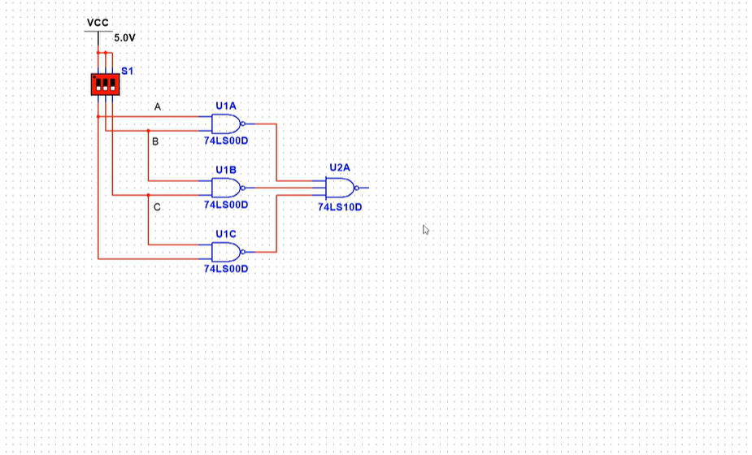

# “一生一芯”太理工作室正式学员第二次学习路线

学习情况：经过一周的 makefile 学习，大家应当可以利用 makefile 系统性地跑通 C 多文件构成的小型程序而只用一个 make 命令，这就是正经的编程需要：C 文件，makefile，git 版本控制，组合起来就是一个大型程序。大家的 C 语言学到这个程度就基本满足需要了，**接下来到寒假的时间，需要大家根据自己的大作业完成情况，空闲时去完善，巩固自己的 C 语言**；在寒假我们会重开 C 语言方面作业，**这段时间千万不要把 C 语言完全抛弃，不然之后就不好拾起来了**。

学习目标：接下来一个月，我们将进行数字电路基础学习：数字电路是我们将来学习过程中非常重要的一个基础知识，与之后的数字设计、机组等知识都会进行串联，学好数字电路极为重要，否则将来的学习将会非常吃力

# 学习任务

以下视频的**第一章内容 01-21 和第三章 39-41 完成学习**，第二章内容选学，用来了解电路很底层的知识，对我们来说没有必要去学，想要去了解材料 TTL，MOS 管以及模电等相关知识的可以去看一看（该部分涉及模电，难度较高，去了解也要花不少时间）

[https://www.bilibili.com/video/BV1A3411z7Mf?spm_id_from=333.788.videopod.episodes&vd_source=4ec31615294fd2510d5fd40f0183648f](https://www.bilibili.com/video/BV1A3411z7Mf?spm_id_from=333.788.videopod.episodes&vd_source=4ec31615294fd2510d5fd40f0183648f)

该课程非常适合零基础的同学，讲的很细很好，同时课程搭配上如下的 multisim 实践仿真环节讲解，但是注意：

> [!TIP]
> multisim 软件不需要大家安装和使用（与我们关系不大），大家**只需要跟着课程学习电路搭建即可**，学习小规模电路设计与仿真跑通，因此课程中的仿真环节看懂电路之后就可以跳过，仿真演示不需要全部看，我们的重心不在这里
> 如下视频中截图的示例：
> 只需要搞懂这个电路有什么效果即可，各器件名称比如“74LS00D”等**不需要学习**

> [!TIP]
> 学习任务就这么点，是不是觉得任务量有点少呢？
> 其实不少，这一个月请**自觉使用 linux 学习 C 语言，makefile 等相关内容**，我们在这里不强制性安排相关任务作业
> **不要在未来再返回去学习 C 语言和 makefile，甚至连 Linux 操作都忘的一干二净！！！**

# 学习作业

1.随时记录自己的学习记录，一定要如实记录，我们会不定期查看各位的学习情况。

2.数电学习内容量大，纸质笔记极其不方便且效率低，所以我们要求大家用自己配置好图床的 md 语法记笔记，而配置图床就是确保你的笔记在别的电脑上也可以查看的必要操作

最后将自己的 md 笔记放入一个文件夹里，文件夹命名为 **你的姓名-专业班级，****然后压缩为⼀个压缩文件即可。**

**请****严格按照上述要求****发送到邮箱：****YunDing_YSYX@163.commailto:YunDing_YSYX@163.com**

> [!TIP]
> **再次强调：**
> 一定不要放下 Linux，C，makefile 相关的实践，之前两个月写的代码自己都可以在 Linux 上重新完善，用 makefile 串联，或者搞成 lib 库形式链接，大家要学的还有很多，不能把之前学了的知识忘掉。

本作品《"太理工一生一芯工作室前置讲义正式学员培养篇"》由 许鹏远 创作，并采用 CC BY-SA 4.0 协议进行授权。

遵循 CC BY-SA 4.0 开源协议：[https://creativecommons.org/licenses/by-sa/4.0/deed.en](https://creativecommons.org/licenses/by-sa/4.0/deed.en)

转载或使用请标注所有者：许鹏远，太理“一生一芯”工作室
