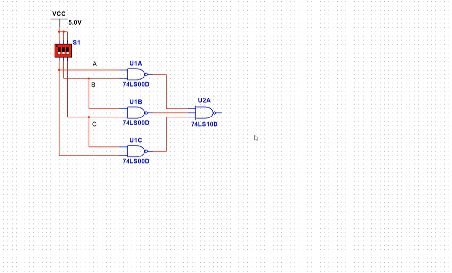

# “一生一芯”太理工作室正式学员第五次学习路线

目前学习情况：大家学完上周的学习内容后，已经学到了**同步电路搭建，同步异步电路分析**等重要知识点，这些是未来设计电路使用硬件设计语言时，你脑子中应该想出的电路图。

本次学习目标：本周我们学的内容相对轻松很多，只需要了解各种计数器的设计，了解各计数器构成差别即可，重点在最后一节**寄存器，这也是我们寒假前的技术路线学习最后一周，至此数电部分知识完结；**接下来全力辅助大家的期末考试（当然你学业复习的很好了，可以做一做群里的特殊作业或者继续补技术基础），从 21 号开始工作室全天开放一直到大家考试，大家届时可以来工作室学习课业，鼓励互相讨论解决学业上的难题。

# 学习任务

以下视频**迁移至百度网盘**（b 站充电付费）** 第五章学习结束：25-37（38 无用跳过）**

百度网盘：链接:[https://pan.baidu.com/s/1ULe0T6iMSXSJlFXeFORV1g](https://pan.baidu.com/s/1ULe0T6iMSXSJlFXeFORV1g)    提取码:pma7

> [!TIP]
> 推荐度盘先进行下载，度盘的下载速度大家都应该知道有多慢，下载到 37 节即可，第六章第七章内容我们不会进行学习

该课程非常适合零基础的同学，讲的很细很好，同时课程搭配上如下的 multisim 实践仿真环节讲解，但是注意：

> [!TIP]
> multisim 软件不需要大家安装和使用（与我们关系不大），大家**只需要跟着课程学习电路搭建即可**，学习小规模电路设计与仿真跑通，因此课程中的仿真环节看懂电路之后就可以跳过，仿真演示不需要全部看，我们的重心不在这里
> 如下视频中截图的示例：
> 只需要搞懂这个电路有什么效果即可，各器件名称比如“74LS00D”等**不需要学习**

> [!TIP]
> 学习任务就这么点，是不是觉得任务量有点少呢？
> 其实不少，这一个月请**自觉使用 linux 学习 C 语言，makefile 等相关内容**，我们在这里不强制性安排相关任务作业
> **不要在未来再返回去学习 C 语言和 makefile，甚至连 Linux 操作都忘的一干二净！！！**

# 学习作业

1.随时记录自己的学习记录，一定要如实记录，我们会不定期查看各位的学习情况。

2.数电学习内容量大，纸质笔记极其不方便且效率低，所以我们要求大家用自己配置好图床的 md 语法记笔记，而配置图床就是确保你的笔记在别的电脑上也可以查看的必要操作

最后将自己的 md 笔记放入一个文件夹里，文件夹命名为 **你的姓名-专业班级，****然后压缩为⼀个压缩文件即可。**

**请****严格按照上述要求****发送到邮箱：****YunDing_YSYX@163.commailto:YunDing_YSYX@163.com**

> [!TIP]
> **再次强调：**
> 一定不要放下 Linux，C，makefile 相关的实践，之前两个月写的代码自己都可以在 Linux 上重新完善，用 makefile 串联，或者搞成 lib 库形式链接，大家要学的还有很多，不能把之前学了的知识忘掉。

本作品《"太理工一生一芯工作室前置讲义正式学员培养篇"》由 许鹏远 创作，并采用 CC BY-SA 4.0 协议进行授权。

遵循 CC BY-SA 4.0 开源协议：[https://creativecommons.org/licenses/by-sa/4.0/deed.en](https://creativecommons.org/licenses/by-sa/4.0/deed.en)

转载或使用请标注所有者：许鹏远，太理“一生一芯”工作室
