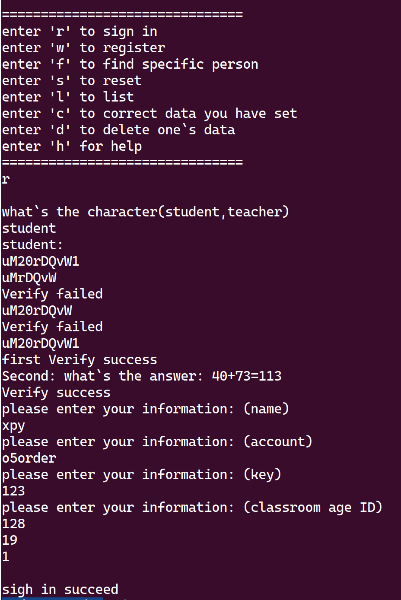
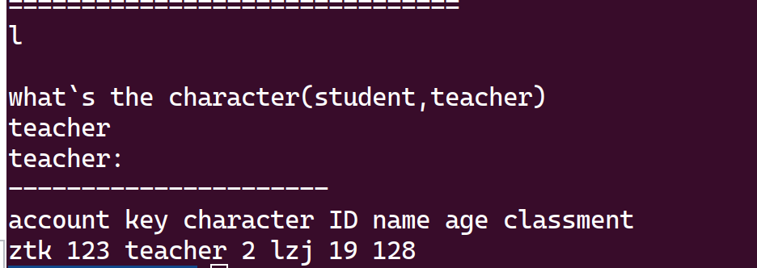
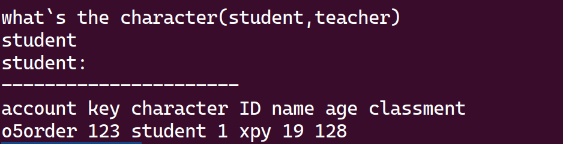
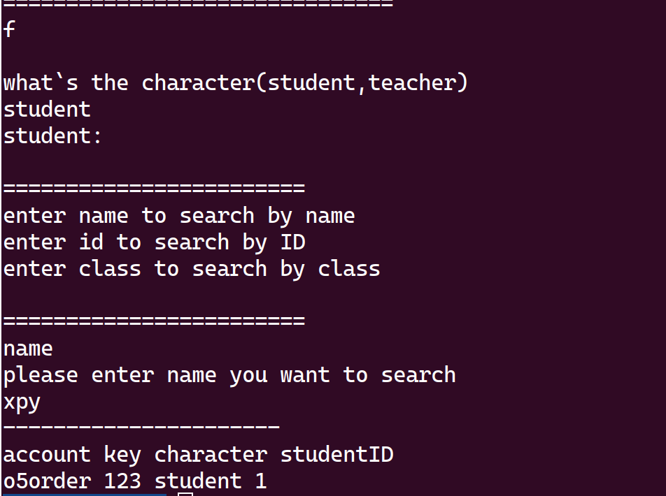
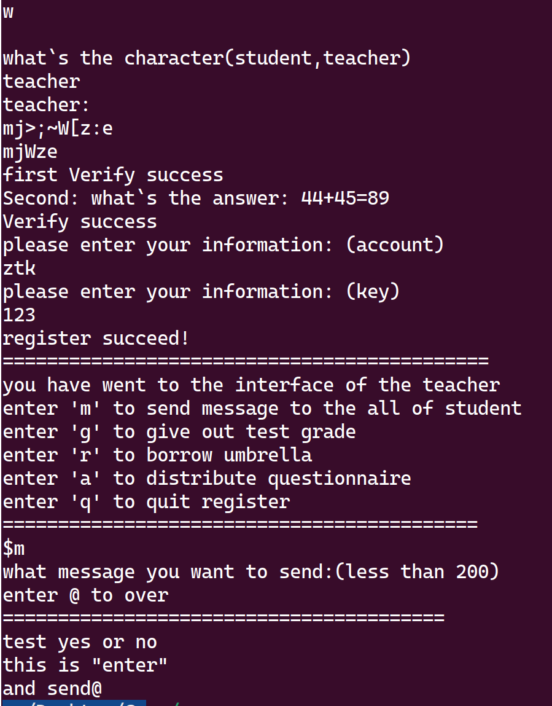
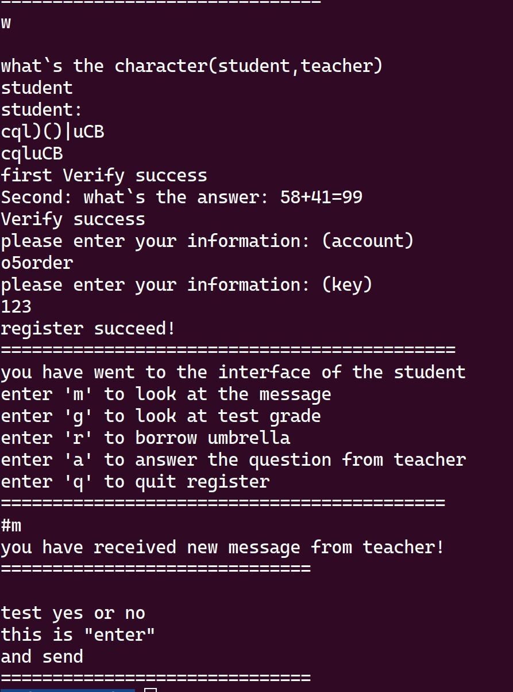
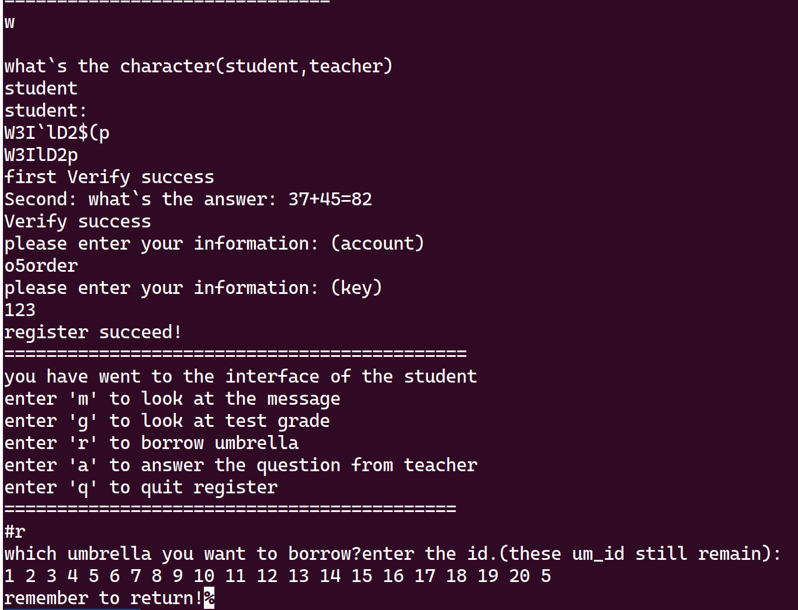
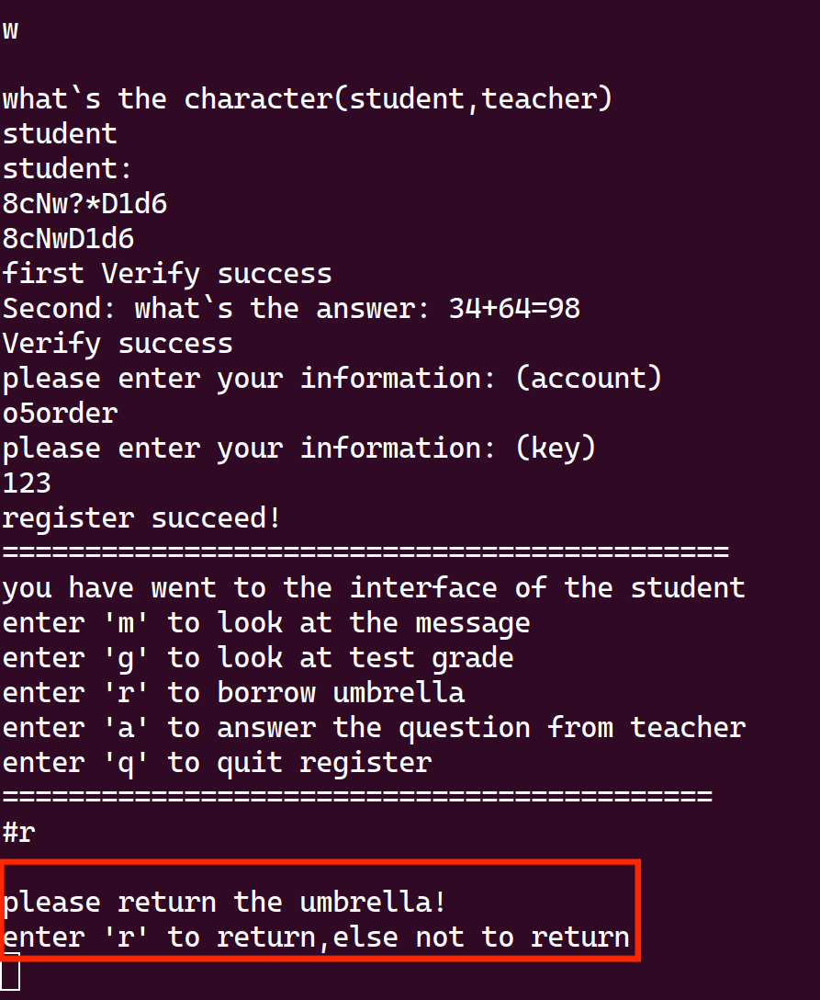
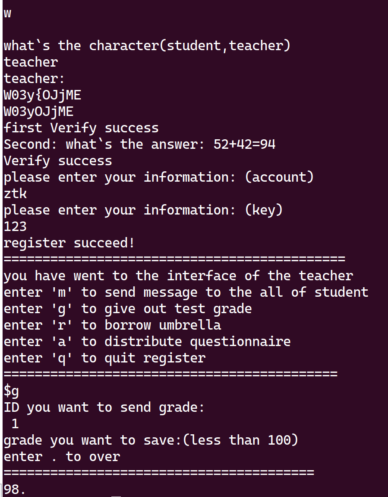
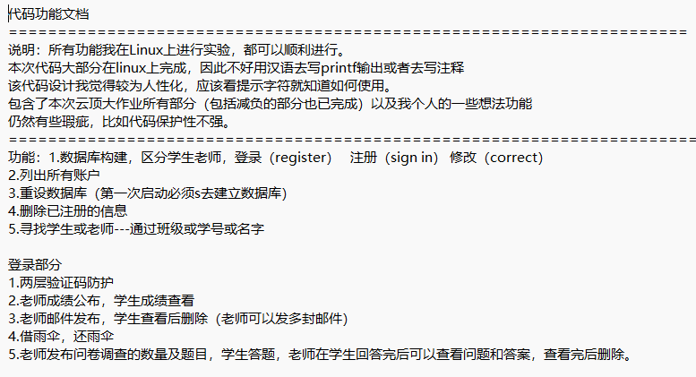

# “一生一芯”太理工作室见习学员结业大作业

**曾有鲤鱼池中抬望眼**

** 奋勇跃起腾飞万丈险**

** 终是龙行四海立浪尖**

** 光耀门楣凭此慰苍天**

** 吾等凿壁偷光萤囊雪**

** 亦可闻鸡起舞祈亮剑**

** 如那三尺微命逆浪跃**

** 此乃大梦⼀场黄粱间**

** ⸺《鲤鱼跃寒门》**

# 预防针

> [!TIP]
> 大作业有信心做出加强版的同学，可以不做基础版本；（比如群里那几个天天摸鱼的）
> **做基础版本的同学也要去尝试做加强版**，做了基础版我们会对你们的加强版作业要求有所降低
> 交作业时基础版加强版一起交回即可，做多少交多少，就算完全无从下手也要写个框架出来或者交一份文档说明思路

（小朋友）许鹏远学长：大作业**为期两周**，基础版大作业实际上是不难的，不如说比较简单，基础版大作业在上一年，适应期第三周就基本完成了，而大家已经学了一个半月的适应期了，我相信基础版大作业对大家来说不算什么。完成加强版大作业的同学就 C 语言毕业了，虽然看上去很难而且很多，实际上确实很难（ps：你们的不少学长学姐当时也没做出来，彻彻底底的完整版本更是只有一个完成的），所以也不用压力很大，做完的收获绝对会很大，而且这样的教务管理系统是可以**跨平台使用**的，他不香吗？别忘了，你才刚度过两个月大学生活，能写出来这样的程序已经比不少大二大三的人强了，同学们加油吧！

# 学习内容

完成 C 语言所有基本知识点学习

⽂件操作：[https://www.bilibili.com/video/BV1Kx411c78z](https://www.bilibili.com/video/BV1Kx411c78z)

> [!TIP]
> 文件操作这里的知识很多，很乱；建议在实践中学习，使用多文件进行编程，多做一些实践，验证文件函数的使用，不要盲从网上的博客，结合自己的实践，综合一份自己对于文件操作的理解笔记，加强版大作业就不会那么难了

# PRO&MAX 大作业

作业要求：

1. 本次作业会在适应期通过阶段以及寒假前的面试中起一部分参考作用，考查认真程度。
2. 本次作业需要书写代码功能⽂档（readme.md/txt），可以参考软著中用户使用文档书写内容，实现让用户理解如何使用即可。
3. 在本作业讲义中的内容不允许复制到功能文档中。
4. 功能⽂档可以采⽤ markdown ⽂档编写，也可以使用 vim 直接编写 txt 文件。
5. 以下功能不要求全部完成，自由发挥，⽀持自己扩展。有⼀定修改的同学注意说明如何使用（例 如：⽤学号当个⼈账号），结合个⼈所学积累发挥自己所⻓，所呈现的代码用于适应期最后学员个人考核。
6. 数据参考后自行思考，自行编辑。
7. 有能力的同学自行扩展 。

> [!TIP]
> 在开发时，你应该不定时对你的代码使⽤ git 提交，以保证程序版本的连贯性，和开发过程的⾼效率。 每次提交的信息不作要求，自己可以看懂即可。分⽀与标签使用随意

## 基础版

> [!TIP]
> 注：基础版考察的更多是知识的掌握情况，对之前做的编程习题培养的编程思想的考察，更多考察的是你这一个月学到的编程思维。

### 超市老板

题目要求：

你是⼀个超市的老板，超市里面有很多的商品，包括{"牛奶","面包","⽅便面","矿泉水","火腿肠","溜溜梅","薄荷糖","⾖腐干","辣条","纸巾"},对应的价格是{3,2,5,1,1.5,5,10,1,0.5,1}

要求：

1. 试编写⼀个程序，要求输入对应的商品名称可以查询该商品的单价
2. 自行输⼊购买的商品种类和数量（不可以预先设定） 可以自动实现对商品的总价进行清算
3. 列出购物的小票（购买的商品名称单价购买个数总价） 要求对于小票中的商品进⾏同种商品的合并，比如多次输⼊“面包”的时候，可以在小票中<u>只显示一次合并的数量</u>

---

小票如下：

商品名 单价 数量

面包      2      2

牛奶      3      6

总价     22

---

而不是

---

小票如下：

商品名 单价 数量

面包      2      1

牛奶      3      6

⾯包      2      1

总价     22

1. 增加添加商品的功能：添加新商品名称、单价、数量后，可以同正常商品一样满足以上要求
2. 该程序可以由你的 Shell 模拟器调用

> [!TIP]
> 提示：多种要求是否相互独立，相互独立的话怎么做更好

### 动态数组

> [!TIP]
> 你也许需要先了解：malloc，realloc 等内存函数，[动态数组](https://blog.csdn.net/qq_63883017/article/details/127700569)，[数据结构的内存表⽰](https://www.hello-algo.com/chapter_data_structure/classification_of_data_structure/#312)。
> 现在你需要⽤指针实现⼀个动态数组

改进你的排序程序，将静态数组的实现方式改为动态数组的方式

排序总结如下：

**排序**

**题目解释：**

用户需输入 10 个整数，程序对其进行排序。

**要求:**

1. 奇数全在前面，偶数全在后面，并且按照从小到大的顺序输出。
2. 完成排序并输出后增加选择，输入 1 可以添加新数字，仍要求奇数全在前面，偶数全在后面，并且按照从小到大的顺序输出。输入 0 退出。

### Shell 升级

将你的 Shell 作业修改为多文件编译，将用户程序的函数实现在文件中

这里的用户程序至少包括：排序，超市老板

---

## 加强版

### 教务管理系统

> [!TIP]
> 基础要求：

#### 操作界面设计

以自己的方式设置使用界面，要求**符合人机交互逻辑**。

#### 登录注册模块

实现基本的登录注册，以区分登录用户

1. **使用总数据表中已经存在的用户信息进行登录**。
2. 错误的密码或非法用户登录无法成功。
3. 登录与验证码模块进行联动。
4. 实现学生与教师不同⾝份登录，并使用标识符区分。
5. 实现注册功能，可以注册⼀个新用户，并且为新用户创建新的数据表，并且区分学生与老师的数据表。
6. 注册提交信息：班级、姓名、学号、年龄。并检测输入的数据格式是否正确。 例如：学号、年龄应该全是数字，姓名应该全为汉字或者字母 + 空格。

#### 登录验证码模块

两层防护：

1. 在登录以及注册过程中，自动生成随机的 10 位验证码，其中有效字符为数字和大小写字母。

   1. 验证码应该随机⽣成。
      例如：
      验证码：--**7&5*ad
      请输⼊验证码：75ad
2. 使用数学推导式强化验证码。

   1. 其中的数字和运算符应该随机生成
      例如：
      验证码：13+5-7=?
      请输⼊验证码：11
3. 输⼊次数限制，3 次后验证失效，登录失败，给出提示信息，并**结束程序运行**

> [!TIP]
> 以上功能模块实际演示，注意：英文有误，大家自行纠错。。。。提示信息大家自己来，这里只给一个例子

student 身份注册：

#### 教师学员界面模块

登陆后实现教师学生两个不同界面，并在该界面下提示该用户的功能。

> [!TIP]
> 教师与学生应该看到不同的提示界面，因为登录身份不同，二者的基础功能、权限不相同

#### 数据存储模块

通过文件处理操作实现对**教师****及****学生****的个人数据库**以及**教师和学生的****总用户****数据表**。

1. 个⼈数据表与总数据表。 个人数据表存储个人相关信息，总数据表存储系统总信息。
2. 出现修改时，实现总数据表与个人数据表数据⼀起修改。
3. 对特定数据库可以重新构建。 提示：以文件操作的形式可以实现**数据库**

例如：user.txt

账号，密码，角色，id

> [!TIP]
> 数据自行设置，不可使用上述数据
> 实际演示：

L 列出所有学生或老师账号

#### 学生查询模块

可以实现对**特定学生或老师**的查询

1. 依据学生**班级**查询所有学生。
2. 依据学生**学号**查询学生详细信息。
3. 依据学生**姓名**查询学生详细信息。

> [!TIP]
> 实际演示，注意：英文有误，大家自行纠错。。。。提示信息大家自己来，这里只给一个例子

#### 邮箱模块

教师可以编辑信息发送给所有特定班级学生，随后学生再次登录时会显示教师的邮件信息。

1. 信息设置字数限制。
2. 学生收到信息后删除该信息，该学生下次登陆时**不会显示**
3. 老师可以发多份邮件，**只有在学生登录时**会将邮件信息全部显示并删除

> [!TIP]
> 实际演示，登录老师身份发送邮件

> [!TIP]
> 实际演示，登录学生身份查看邮件

#### 智能雨伞借还模块

老师和学生都可以借还雨伞，雨伞一共有二十把

1. 每一把有对应的序号
2. 同一把雨伞被借走后，在还回前，不能再借
3. 借雨伞时，自动列出所有雨伞情况，如：

Which umbrella do you want to borrow? enter the id.(these um_id still remain):

1 3 4 5 6 7 8 。。。。 19 20

1. 借仍未归还的雨伞时，有信息提醒该雨伞已被借走
2. 借雨伞未还的人在**每次登录教务管理系统时，自动提醒归还雨伞**
3. 归还后一切恢复如初

> [!TIP]
> 实际演示，登录学生身份借雨伞

再次登录提醒归还：

#### 成绩批改模块

老师身份可以公布成绩，学生那里可以查询成绩

1. 老师可以进入该模块，以学生学号下发考试情况，包括考试名称，考试分数两部分
2. 学生可以进入该模块，查看每次考试的情况

> [!TIP]
> 实际演示，登录老师身份发布成绩

#### 问卷发布回答模块

老师身份可以向所有学生发布问卷，学生那里可以回答问卷，回答完毕后老师身份能得到问卷及回答情况

1. 老师身份编辑问卷的问题（限制字数）
2. 学生视角登录该模块，可以看到未回答的问卷，选择指定问卷进行回答
3. 回答后学生视角消失，不能重复作答
4. 回答后，老师模块可以查看公布的问卷，得到学生回答情况，随后自动删除

#### 退出模块

无论老师和学生身份，在上面事务进行完之后，可以安全退出管理系统，提醒安全退出后结束程序运行

> [!TIP]
> 以上所有功能能实现多少实现多少，难度是肯定有的，交作业时用代码功能 txt 文档说清楚实现了哪些功能即可
> 同时，请注意这是用户程序，一个不读你原码的人应该只通过你的输出信息，就能知道该程序应该怎么使用，逼人读开发手册可不是一个好程序，因此**合理的程序运行提醒**很重要

代码功能文档示例：

## 作业提交

**截止时间：11 月 16 日晚十点**

文件夹命名为 **你的姓名-专业班级，****（PS：我们作业提交还是有一些命名不规范的，我们也会进行记录，细节决定成败）**

1. 基础版大作业打包到一个文件夹内，文件夹命名为**”基础“**
2. 增强版大作业打包到一个文件夹内，文件夹命名为**”增强“**

最后将二者放入**你的姓名-专业班级文件夹的文件夹内，**压缩为⼀个压缩文件（右键压缩/Commpress 即可）。

**请****严格按照上述要求****发送到邮箱：****yunding_ysyx@163.commailto:yunding_ysyx@163.com**

本作品《"太理工一生一芯工作室前置讲义见习学员培养篇"》由 许鹏远 创作，并采用 CC BY-SA 4.0 协议进行授权。

遵循 CC BY-SA 4.0 开源协议：[https://creativecommons.org/licenses/by-nc-sa/4.0/deed.en](https://creativecommons.org/licenses/by-nc-sa/4.0/deed.en)

转载或使用请标注所有者：许鹏远，太理“一生一芯”工作室
