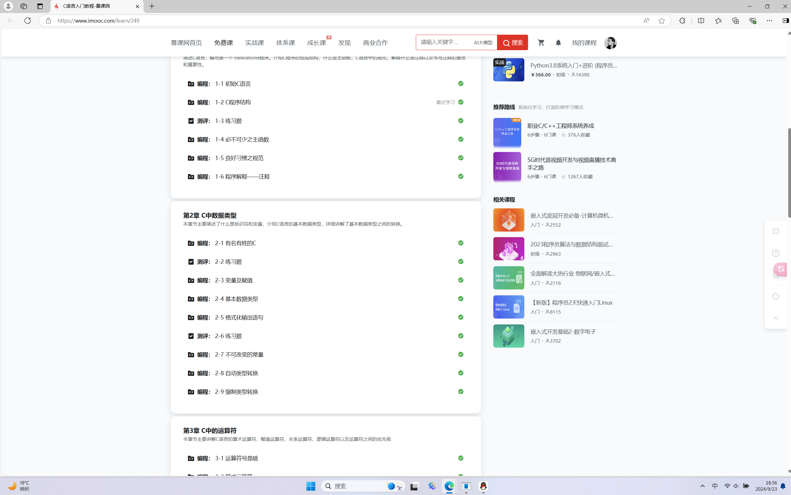

# “一生一芯”太理工作室见习学员第一次学习路线

**兰生幽谷，不为莫服而不芳。**

**舟在江海，不为莫乘而不浮。**

**君子行义，不为莫知而止休。**

**——《淮南子·说山训》**

**注意：适应期考核期为两个多月，届时我们会根据作业情况、学习记录（一个月后安排）等等各方面安排面试，进行更深一步的培养。**

**请大家在****国庆节假期结束前****至少完成前置任务、基本实操任务和提高任务。有思路但是不知道如何实现可以写清楚思路。**

## 认识计算机（了解计算机基础操作的可跳过）

- 各种常见的文件格式与打开方法

  - exe（可执行文件）：可以直接双击打开的文件
  - zip/rar/tar/tar.gz/tar.xz 等（压缩文件）：需要解压缩软件（如 7-zip，bandizip）才能打开的文件，可以将多个文件或文件夹打包为一个文件
  - iso（光盘映像文件）：广义上将这个格式也算是一种压缩文件，可以使用解压缩软件打开。一般这种格式的文件中存放的是系统的安装程序或影像音频（DVD，VCD 等）。这种文件格式可以将其存储的内容刻录到实体光盘中
  - md（Markdown 文档）：是一种以纯文本格式存储的文件，可以被支持 Markdown 的编辑器渲染为带格式的文档。将来我们会经常接触使用
  - torrent（BT 种子）：如果你用过迅雷或者其他支持 BT 下载的软件，你应该对它不陌生，需要使用 BT 下载器打开
  - txt（纯文本文档）：是一种是一种以纯文本格式存储的文件，不含任何格式
  - c（C 语言源码）：是一种是一种以纯文本格式存储的文件
  - cpp/cc（C++ 语言源码）：是一种是一种以纯文本格式存储的文件
  - py（Python 语言源码）：是一种是一种以纯文本格式存储的文件
  - v（Verilog 语言源码）：是一种是一种以纯文本格式存储的文件
- 什么是剪贴板

剪贴板是临时存放你复制/剪切了内容的地方，里面的内容可以是文字，也可以是图片，甚至可以是文件

- 如何截图
  - 使用 Windows/Linux 自带的截图工具

按下 PrintScreen（PrtSc）之后，你的操作系统会自动打开自带的截图工具。

如果没有打开，则已经直接将整个画面放在了剪贴板上了，直接在需要用的地方粘贴即可（Windows 下也可以用 Win+Shift+S 组合键呼出截图工具）

- 使用第三方截图工具（QQ/微信，snipaste，flameshot 等）

这里的使用步骤网上均可找到，请 STFW

- 什么是操作系统，Windows/Linux 又是什么

操作系统是现代计算机的必不可少的软件组成部分，所有的程序（包括但不限于：游戏，办公软件，浏览器）都在上面运行，没有操作系统的话，在计算机上运行程序是一件很艰难的事情。

Windows 是全球最主流的（商业）桌面操作系统，由微软公司开发，相信你从小到大接触的电脑都运行着不同版本的 Windows，最新的 Windows 是 Windows 11。

Linux 是另一个操作系统，覆盖的领域非常广，从手机到个人电脑再到服务器，都有它的身影。**它的一大特点是 Free（免费/自由），是开源操作系统。**安卓系统也是基于 Linux 的。而 Linux 对开发者很友好，这也是我们选择它的原因。很快你就会体会到这一点。（PS：其实我们使用的是 GNU/Linux 系统，如果你对这个名词有疑问，请 STFW，并顺带了解 GNU 计划与自由软件运动）

## 

## 前置任务——如何科学地提问

#### 学会提问

你在学习中的第⼀个任务，就是现在仔细阅读<u>提问的智慧</u>和<u>别像弱智⼀样提问</u>这两篇⽂章，想一想你对"好的提问"以及"通过 STFW 和 RTFM 独⽴解决问题"的看法。

我们设置这道题并不是为了故意浪费⼤家的时间，也不是为了禁⽌⼤家提出任何问题，⽽是为了让⼤家知道"什么是正确的"。当你愿意为这些"正确的做法"去努⼒，并且尝试⽤专业的⽅式提出问题的时 候，你就已经迈出了成为"成为专业⼈⼠"的第⼀步。

#### ⼤佬三连: STFW, RTFM, RTFSC

尝试在上述⽂章中寻找并理解这三个缩写的含义。

你可能会觉得字母 F 冒犯了你，但事实上这个字⺟的含义从来都不是重点，它只是更显示出这三个缩写背后的幽默故事⽽更容易被⼤家记住⽽已。例如，RTFSC 起源于 Linux 之父 Linus Torvalds 在 1991 年 4 ⽉ 1 ⽇回复邮件中的第⼀句话，⽬前在⽹上还能搜到当时的邮件列表。有趣的是，Andrew S. Tanenbaum 在<u>Lessons Learned from 30 Years of MINIX</u>⼀⽂中把这封邮件作为 MINIX 操作系统容易学习的⼀个例⼦：还处于学⽣时代的 Linus Torvalds 在 10 天之内就把 MINIX 学得差不多了。

## 基本实操任务

### 安装 Ubuntu 虚拟机

- 安装系统：Ubuntu22.04.5（64 位机 Desktop）
- 安装⽅式：VMware 虚拟机或双系统（如有选择，请⾃⾏操作，不推荐初学者操作）
- 虚拟机版本：VMware Workstation Pro 17

**备注：如果想要使⽤其他 Linux 发⾏版或者正在使⽤其他 Linux 发⾏版的，可以使⽤，并且在可预⻅的 【⼀个⽉内】不会有任何问题。在后续的“一生一芯”学习中，讲义使用的是 Debian 系的 Ubuntu，因此 Debian 系的主流版本基本不会遇到什么问题，Arch 系的交叉编译工具链会有点问题，RedHat 系未经我们测试，可能会存在问题。**

**免责声明：如果你使用其他发行版出现问题，我们是不负责的，请自行 STFW 解决。**

- 资源站：
  - VMware：见群文件
  - Ubuntu 官⽹：<u>[https://ubuntu.com/](https://ubuntu.com/)</u>
  - Ubuntu 安装教学博客（图文）：<u>[https://juejin.cn/post/7122273969520001061](https://juejin.cn/post/7122273969520001061)</u>
  - Linux 安装与操作教学视频：<u>[https://www.imooc.com/learn/175](https://www.imooc.com/learn/175)</u>

#### 教学内容

1. 观看【Ubuntu 安装教学博客】，同时完成 Ubuntu22.04（64 位机）的光盘⽂件下载与 VMware Workstation Pro 17 的安装。

   1. 注：这⾥仅仅需要下载 Ubuntu，但是不需要做其他的操作了，⽽ VMware 则需要各位安装好，选择“仅为个人使用”
2. 观看【Linux 安装与操作教学视频】的【1-1】到【2-7】（不做 2-8）但是我们安装的操作系统与视频中不同，VMware 也与视频中不同，不要跟着视频操作(如果你熟悉 Linux 系统的安装与操作与 GNU/Linux 系统及其发行版，大可跳过这一部分)。

   1. 我们安排这部分的教学内容，并不是要各位做⼀些无用功，而是要对 GNU/Linux 系统及其发行版有⼀定的了解。
   2. 【Linux 安装与操作教学视频】讲解十分详细，但是出于视频摄制年代早，其中提到的 CentOS 已经不再维护 LTS 版本，⽽是仅仅维护滚动发⾏版；⽽ CentOS 本⾝在后续的学习中⸺特别是 CPU&OS ⽅向⸺会带来很多问题，于是我们选择使⽤稳定版的 Ubuntu22.04（LTS），并且 VMware 也使⽤最新的 17
   3. 如果你担心 CentOS 学习的内容会与 Ubuntu 不同的话，其实⼤可放⼼，因为 CentOS 与 Ubuntu 的差距并不是那么⼤，仅仅在软件安装命令上有细微的差距。
3. 再次观看【Ubuntu 安装教学博客】，并完成 Ubuntu 安装。注意事项：

   1. **使⽤的 VMware 和 Ubuntu 请不要依据视频中的版本与资源。**** **
   2. 虚拟机硬件兼容性请选择 17.xxxx 以上，Ubuntu 安装时选择 CPU 核心数量 4-8 核及以上**（CPU 个数 1，然后更改每个 CPU 的核心数量）**，或者根据你的电脑的实际情况分配资源，内存⼤于 4GB，磁盘空间⼤于 30GB（强烈建议安排 100GB）。
   3. 安装 Ubuntu 时，在欢迎界⾯请选择英⽂直接安装，键盘请选择美或英的英语键盘。如果你觉得使⽤英⽂操作系统对你有点困难，请多背单词。记住，如果你做计算机领域的东西⽽只会⽤中⽂，约等于你去上厕所⼿⾥却只有砂纸⼀样。
   4. 安装过程中，用户名请输⼊个⼈名字每个字的拼音缩写 + 学号后两位。例如（姓名：小朋友，学号：2024001123；设置的用户名则为：xpy23。）
      1. 我们之所以要这么做，是希望各位不要拿⽹上的截图糊弄了事，而是希望各位真的认认真真的学习过的。
      2. 如果你⼀直在使用 Ubuntu 或其他 Linux 系统，那么你不需要做任何修改。
4. 完成所有【考核要求】内容

#### 考核要求

1. 完成所有教学内容的要求。
2. 完成【Linux 安装与操作教学视频】提供的网站（Linux 达人养成计划）中的所有练习题并截图完成信息。 如下所示，请务必截当前页面所有信息（右下角的时间日期，学习内容情况）。注意截图请截到两个章节的学习情况，可以分开截两张。 注意要完成视频观看，如图所示，打上勾勾的就是完成。**如果有学习过相关内容或者觉得学习内容过于简单****，可以不⽤将视频看完，但是练习题还是要做完的，并且记得在提交截图时在截图上 P 上 【已经学过】、【过于简单】等字样。**

1. 提供 Linux 命令行的截图，并且在命令行中输⼊【姓名拼音全拼_学号】如图所示，请使用小窗模式，截图全部内容。

注意图中的【xpy69】字样是被截图者的用户名，你不需要与这个保持一致。同时案例的终端也是经过用户配置的，你不需要和案例保持一致。

## 提高任务

### 计算机教育中缺失的⼀课

接下来我会为⼤家提供⼀个着眼于工具、命令行、⽂本编辑器、Git 等，将会与⼤家朝夕相处的基础设施的课程。

我们会依据你当前的学习内容，给你推荐对应的课程，并且相信当你掌握了这些知识后，能够大幅提升你的效率。

#### 学习内容

鉴于你这周依据学习了 GNU/Linux 的使⽤，并且也接触到了 Shell，我们为你提供这个课程： 【课程概览与 shell】<u>[https://missing-semester-cn.github.io/2020/course-shell/](https://missing-semester-cn.github.io/2020/course-shell/)</u>

**请仔细阅读上述⽂档，完成【课程概览与 shell】的所有课后作业。如果可以的话，网页内提供了课程视频，能够帮助你更快的理解。**

### C 语言

C 语言作为万物基石，在我们随后的日子里至关重要，希望大家更加主动学习 C 语言，在国庆节结束后，就会迎来我们真正的编程作业！

#### 学习内容

C 语言推荐学习书籍：《C Primer Plus》（基础）《C 与指针》（对指针讲的很透彻）《C 陷阱与缺陷》（涵盖了初学到进阶的各种常见错误）《C 专家编程》《C 程序设计语言》（黑皮书，主要是从标准角度讲解，写的很精练，由 C 语言的创造者所编写，但是不推荐一上来就看，对 C 有一定了解之后再看）

C 语言推荐学习视频：<u>[https://www.bilibili.com/video/BV1XZ4y1S7e1/?vd_source=4ec31615294fd2510d5fd40f0183648f](https://www.bilibili.com/video/BV1XZ4y1S7e1/?vd_source=4ec31615294fd2510d5fd40f0183648f)</u>（翁恺老师⼀⼤特征就是讲课详细，但是带来的代价就是视频长，讲课相当慢；**推荐 1.5-2 倍速且搭配跳转食用**）

C 语言推荐练习习题：<u>[https://www.imooc.com/learn/249](https://www.imooc.com/learn/249)</u>（虽然比较简单，但是用于练手还是可以的——某软件学长碎碎念：这和一些老师会安排的 C 语言课后作业会有一些重复，所以学校的 C 语言课和作业会非常轻松）

#### 思维练习作业

对个人思维有一定的训练，**该作业理论上学到循环结束即可完全完成。**

**基础练习：实现一个自己的 Shell**

请使用 C 语⾔设计⼀个属于自己的 Shell，具体要求如下：

1. 用户启动程序后，可以看到提示符 **(terminal) >** 的输出，并且打印提示性文字**输入 1 或者 2 执行程序，输出 0 退出程序。 **

⽰例如下：

1. 需要注意的是，上述的 **terminal** 请替换为名字拼⾳⾸字⺟缩写 + 学号后两位。例如：姓名是 张呆呆，学号是 2023011323，那么这⾥就替换为：**(zdd23) >** 。
2. 注意，在(zdd23) > ，右括号与右尖角号之后各有⼀个空格以追求美观，如行首红色部分所示。
3. 键⼊ 1 或者 2 可以继续执⾏程序，打印出** 程序正在执⾏。。。 **后换⾏，继续打印程序执行结束。 后结束程序。

如图所示：

1. 键入 0 后直接结束程序

如图所示：

1. 如果用户输⼊了不存在的指令，也就是除了 1、2 和 0 之外的指令，输出** 指令错误！ **并结束程序。

如图所示：

#### 拔高

在设计完成之后，想一想这样的模拟器可以做到什么？又如何做到输入 1 或 2 运行程序后不退出，还可以再输入 1 或 2 运行程序呢？那么可不可以把输入 1 和 2 运行的程序不再是只输出字符，而是**换成真正的程序**呢？

如果以上问题你有答案，那么就请将你设计的程序进一步改进吧！

我们这里提供两个程序供大家完成：

1. 请使用 C 语⾔设计程序以判断闰年，能够接收用户输⼊的年份，输出当前年份是不是闰年。（如果 不知道什么是闰年，请百度。。。）

效果如下：

1. 请使用 C 语⾔设计⼀个九九乘法表输出程序，在软件运行时，输出⼀个九九乘法表。输出内容正确即可，格式不限。

效果如下：

在完成这些之后，大家可以试着想一想怎么样可读性更强，怎么优化自己的代码？或许在你 C 语言进一步学习之后会有思路，如果你有你的思路，就请实践然后用注释的方法注明你的想法

- **心得：**理解**“先完成，后完美”**的开发思想，以最快的速度，写出⼀版可以使⽤的 Demo，尽管它存在各种问题，但是你应该感到自豪！

自豪之余，请切记，我们刚踏⼊万里长征的第一步。请保持⼀颗好奇的⼼，计算机的世界仍有大片未知等着你探索。不断修改迭代你的代码吧。千里之行，始于足下。

- **碎碎念：这个作业可以在 Windows 上完成，但是国庆结束之后我们就会到 Linux 上编程，因此鼓励大家除此之外去探究 linux 上【你的虚拟机】如何编程，跑程序。**
- **如果你进度超前/有一定的基础，欢迎继续往后学习**

（——py 学长注：目前不清楚大家水平如何，如果所有这些作业加拔高作业在国庆节前就已经全部完成，并且觉得过于简单，欢迎来联系我们，我将提供下一步的拔高作业！）

## 作业提交

**基本实操部分任务：**将图片放在一个文件夹里，文件夹命名为 **你的姓名-专业班级，**

**提高任务：**

**1.**C 语⾔相关代码作业以题⽬命名，如 Shell 模拟器.c。如果你的**拔高思考问题**解决并实现了，那么请将它命名为 Shell 模拟器-优化.c；

**2.**计算机教育缺失的一课，相关内容命名为 shell 即可

**3.**一起放入基本实操部分创建的文件夹中即可。

最后将以上**你的姓名-班级文件夹**压缩为⼀个压缩⽂件（右键压缩即可）。

**范例请参考文件夹内另一个文件**

**请****严格按照上述要求****发送到邮箱：yunding_ysyx@163.com**

## 碎碎念

**小朋友（许鹏远）学长的碎碎念**

大家一上来就看到这么多的学习内容和作业，感觉无从下手？或者难度很大？

实际上两周的时间去完成是绰绰有余的，大家合理安排时间，劳逸结合；可以收获一个充实的国庆假期！同时，以上作业请保持**学术诚信，不要抄袭，不要过度依赖 AI****，能力培养是一朝一夕的**，偷懒欠下的思维能力培养将来迟早要还，另外，我们的作业设置主要目的是启人思考，大家完成之后可以多想想完成之后这个东西可以怎么改进，有什么作用；我们鼓励大家多思考，多实践。

我也是**零基础**过来的，一步步走到今天这一步；我相信大家也有这个实力做到更好，相信**世上无难事，只要肯登攀。**

另外，大家不要对于我们的任务感到过度害怕，尽自己所能就可以，另外不用过于在乎他人的进度，每一份思考都是自己的，每个人基础也不同，因此只要我们都能有所收获就好。

**提前祝愿大家圆满完成第一次任务！大家加油！**

**硅基生物（李振杰）学长的碎碎念**

在宣讲会群里以及正式学习群里都有看到大家对英语的恐惧，大部分人是看到一大片英语就发怵。我刚开始其实也一样，但是英语是我们之后要克服的一大障碍，学计算机不可避免的会面对很多英语资料，其实它们真的没你想象的那么难，也就是多了几个不认识的单词而已。

其实只要上手翻译就会发现没那么难，实在不行还有机器翻译来帮助我们理解。**我想说的是：Just do it! 千万不要停滞不前，勇敢去做就好。**大概能看明白是什么意思就好，我们又不是去参加什么翻译大赛 hhhh，不需要有多精准/优美。

然后就是专业不对口的问题，我本人就是矿物加工工程的，不能说是不对口吧，也能说是完全不相关了 hhhhhhhh。很多计算机的，软件同学们的觉得这个和自己不是很对口，感觉自己是做软件的，这个东西是专门给集成电路的同学搞的，其实并不是。做这个能对计算机相关/电气相关/电子信息相关的专业都有很大的提升。其他专业的同学如果想转专业/跨专业考研的也很有用。

但是我想说的是：**没必要这么功利，一个大学生能在自己的校园时光里自己设计 CPU，并带着它毕业，这不是一件很酷的事情吗？Just for fun！**别去纠结自己专业对不对口，既然感兴趣就好好学，机会都是自己创造的，不是等机会上门的。

**旅鼠（章廷宽）学长的碎碎念**

在完成这些任务以及进行未来各种学习的过程中，可能会遇到不少问题、bug，卡了很久才解决；或者去探究某些事情时，最终发现自己走进了“错误的道路”。但是你要始终记住，所做的一切不会毫无意义，一定会在未来的某个点让你感谢那时的迷惘，它们都化为了你那时侃侃而谈、看透迷雾的宝物。所以在这些时候，绝不要懊悔或恼怒，只要从中学会了真知、收获了新理解，这就是物超所值的。

此外，学习到新东西，没必要将一切的细节都刨根问底：在计算机这种涉及面广而深且复杂的领域，更是如此。而计算机的学习又必须落实到实践上去。例如你拿到 Linux 那众多的命令，记不住、记不全，那就启动你的 Linux，多打打交道吧。毕竟这也不是考试，你可以连接到互联网的大数据库，尽情查阅你所不熟的、想要的。在一点点的忘了-查询使用-又忘了-再次查询使用过程中，你也很快就熟练了。

本作品《"太理工一生一芯工作室前置讲义见习学员培养篇"》由 许鹏远 创作，并采用 CC BY-SA 4.0 协议进行授权。

遵循 CC BY-SA 4.0 开源协议：[https://creativecommons.org/licenses/by-nc-sa/4.0/deed.en](https://creativecommons.org/licenses/by-nc-sa/4.0/deed.en)

转载或使用请标注所有者：许鹏远，太理“一生一芯”工作室
