# “一生一芯”太理工作室见习学员第二次学习路线

**古之立大事者，**

**不惟有超世之才，**

**亦必有坚韧不拔之志。**

——**苏轼《晁错论》**

**注意：本周作业重在****Linux 环境学习和 C 语言学习****，因此我们没有出很难的编程题，希望大家这周也能好好学习，认真对待；否则下周作业我们出的编程题大家可能就应付不了了，以及最后的大作业如果没有这些基础，是绝对做不出来的，希望大家可以持之以恒，不中途放弃！**

## 预防针

**交作业一定要看提交作业部分的具体方式！确认提交作业的格式正确**

**小朋友（许鹏远）学长的碎碎念**

本次作业看上去很多，实际上完成起来很快，必做基础任务除了 C 语言部分，其他部分都可以很快完成，只需要动动手，学完即可，更多的是大家之后一直接触从而熟络的这个过程。因此实际上我们的作业**集中在 C 语言部分的学习**，大家会在上一次作业学完循环之后这次学完函数和数组部分知识，这是我们的**大头任务**；希望大家可以**合理安排时间，每天都抽出两三个小时时间学习技术**，那么作业是绝对可以顺利完成的，大家的晚自习时间或是空课时间都可以拿出电脑学习技术；另外，注意劳逸结合哦！这个作业量只要合理安排时间并且不要摆，那么是不会给大家太大压力的。学完这些内容后我们的编程环境就变得高端大气上档次了（-v-），之后可以做很多有趣的事情，希望大家加油，诸君共勉！

未来大家的编程环境：

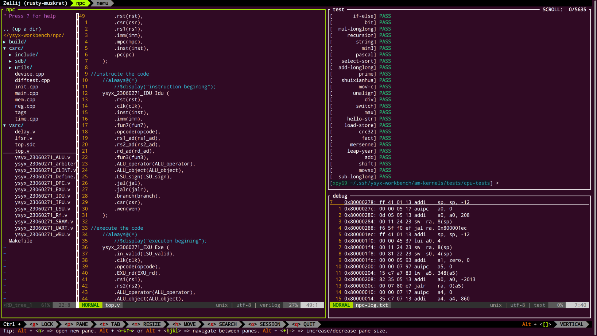

**硅基生物（李振杰）学长的碎碎念**

学习呢，是一个持久的过程。提问是这个过程中很重要的一个环节，学会科学的提问是很必要的。与此同时也要有一定的自己解决问题的能力，也需要一定的翻译能力。上周的学习大家也体会到了英语的重要性，很多信息都是英文的，总是得走出舒适圈去试着翻译的。

其次就是代码风格，好的代码可读性很高，看着很舒服，是能做到不言自明的。可以自行 STFW 然后确定自己的代码风格，该缩进的地方缩进，该对齐的地方对齐，变量名也是有意义的，而不是 abcd...。那么说了这么多，好的代码风格是怎样的：

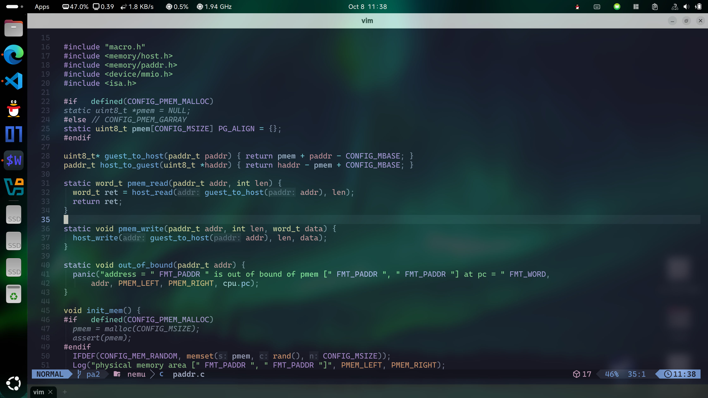

希望大家之后 coding 的时候能写出健全美观的代码。

**旅鼠（章廷宽）学长的碎碎念**

相信大家真的接触到 Linux 时，会先被它完全不同于 Windwos 等日常直接使用的操作系统的黑窗口吓到——一切的操作都要通过敲入一个个字母组合来执行。诚然，这么多的指令，是都需要我们熟练使用，就跟 C 语言的那些函数、将来马上要学的 Git 一样。有人可能要问，是不是应该一个个抄写、背下来。但你要知道的是，计算机世界中，我们做这些实践的成本是很低的，只要动动手指就行。也就是，你大可以**多多实践、多多试错**——做好备份/快照就行。所以也完全没有必要纠结在某一些东西记不住——当你用到时，再次查阅、学习。在不断的实践、熟悉中，这一切也就变得游刃有余了。

## 必做基础学习内容及任务（按顺序完成）

### 0.字符编码与乱码原因（学习即可）

根据以下链接学习字符编码与乱码原因相关内容，**之后提交的源码都要使用 UTF-8 编码**（**Linux 默认就是**，Devcpp 默认是 GB2312/GBK 编码）。如果使用不匹配的编码打开文件会乱码（比如说使用 UTF-8 编码方式打开 GBK 编码的文件）。

<u>[https://www.paicoding.com/article/detail/305](https://www.paicoding.com/article/detail/305)</u>
<u>[https://www.hello-algo.com/chapter_data_structure/character_encoding/](https://www.hello-algo.com/chapter_data_structure/character_encoding/)</u>

<u>[https://blog.csdn.net/xuan196/article/details/115127416](https://blog.csdn.net/xuan196/article/details/115127416)</u>

### 1.Markdown（码字神器）

Markdown 是一种轻量级的标记语言，可用于在纯文本文档中添加格式化元素。Markdown 由 John Gruber 于 2004 年创建，如今已成为世界上最受欢迎的标记语言之一。它有以下几个优点：

1. 专注于文字内容；
2. 纯文本，易读易写，可以方便地纳入版本控制；
3. 语法简单，没有什么学习成本，能轻松在码字的同时做出美观大方的排版。

有了 Markdown，就可以轻松记录笔记。你可以自己 STFW 寻找 Markdown 教程，这里我们给几个推荐的教程：

- <u>[https://markdown.com.cn/](https://markdown.com.cn/)</u>
- （交互式）[Markdown Tutorial](https://www.markdowntutorial.com/zh-cn/)

Markdown 需要渲染，**这里我们推荐使用****Typora（群文件有破解版）**或者 VSCode 下的 Markdown Preview Enhance 插件或者 Office Viewer 插件（这个类似 Typora，所见即所得）。之后的笔记就用 Markdown 写。

效果展示：

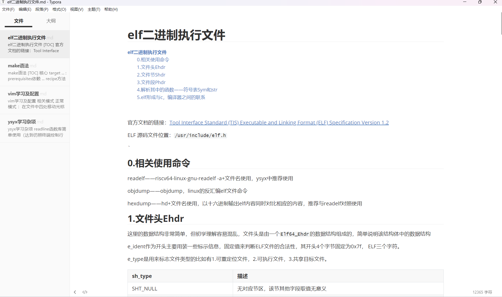

**注意：接下来的所有作业都会在 Linux（你的虚拟机）上进行**

### 2.APT 包管理器（学习了解即可）

APT 是 Debian 及其衍生（如 Ubuntu）的 **Linux 软件包管理器**。APT 可以自动下载，配置，安装二进制或者源代码格式的软件包，因此简化了 Linux 系统上管理软件的过程。

APT 需要 root 权限，如果提示 **Permission denied**，看看自己是不是没有**给权限（sudo）**。

#### 常用的一些指令

- 更新系统中的软件包列表：**apt update**
- 升级软件包：**apt upgrade**
- 安装指定的软件命令：**apt install <package_name>**
- 安装多个软件包：**apt install <package_1> <package_2> <package_3>**
- 更新指定的软件命令：**apt update <package_name>**
- 显示软件包具体信息,例如：版本号，安装大小，依赖关系等等：**apt**** ****show <package_name>**
- 删除软件包命令：**apt remove <package_name>**
- 清理不再使用的依赖和库文件:   **apt autoremove**
- 移除软件包及配置文件: **apt purge <package_name>**
- 查找软件包命令：**apt search <keyword>**

### 3.中文输入法（使用 fcitx5 后端）（安装使用即可）

众所周知，在计算机的世界里要输入中文，需要中文输入法，我们来引导大家安装中文输入法

- Step 1：检查系统中文环境

在系统设置（Setting）——区域与语言（Region & Language）——管理安装语言        （Manage Installed Languages）——Install/Remove Languages 里找到 Chinese（simplified）并选中，最后 Apply System Wide

- 安装 fcitx5

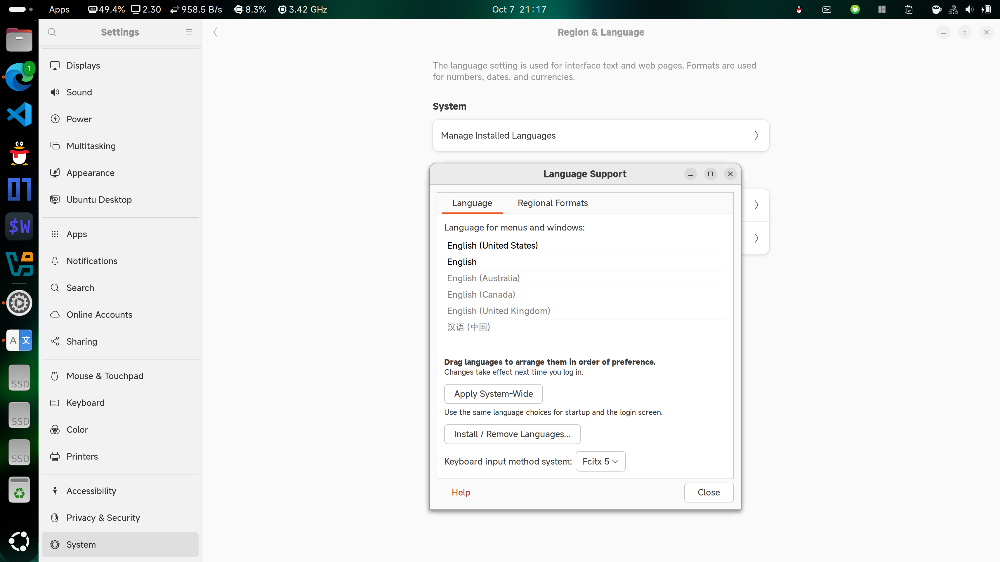

```shell
**$ sudo apt install fcitx5**
**$ sudo apt install fcitx5-chinese-addons**
**$ sudo apt install fcitx5-frontend-gtk3 fcitx5-frontend-gtk2**
**$ sudo apt install fcitx5-frontend-qt5 kde-config-fcitx5**
```

- 卸载 ibus（ibus 与 fcitx5 之间可能有点冲突）

```shell
**$ sudo apt remove ibus**
```

- 配置默认输入法，在终端中输入然后选择 fcitx5

```shell
**$ im-config**
```

- 使用 gnome-tweaks 来设置 fcitx5 为开机自启动

首先安装 gnome-tweaks

```shell
**$ sudo apt install gnome-tweaks**
```

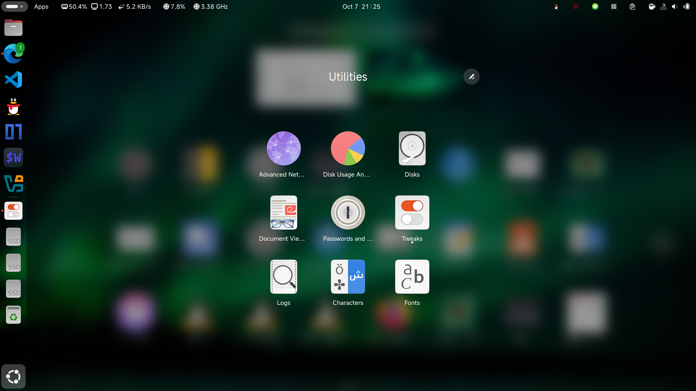

从应用菜单中找到 tweaks（在 Utilities 文件夹里）并打开，将 fcitx5 设置为开机自启动


- 设置拼音输入法

在应用菜单中找到 Fcitx5 Configuration，从右侧菜单中找到“Pinyin”添加到左侧，然后 Apply，就大功告成啦！


**PS：fcitx5 的其他配置请自行 STFW；安装也可以参照网上的其他教程。**

**PSS：fcitx5 中英文切换默认是 Ctrl+Space**

### 4.Vim 的安装与使用（真正的编程环境）

Vim 被称为**编辑器之神**。对于大多数人来说，Vim 有着一个比较陡峭的学习曲线。这意味着开始学习的时候可能会进展缓慢，但是一旦掌握一些基本操作之后，能大幅度提高编辑效率。

（PS：用习惯 Vim 了之后不管什么软件都想上 Vim 键位，我的 VSCode 已经换 Vim 模式了   ——LZJ，不用鼠标只用键盘的编程模式是真舒服——XPY）

#### Vim 的安装

```shell
**$ sudo apt install vim**
```

#### Vim 的使用及配置

**以下是两个必做任务**：

1. 用 Vim 自带的 vimtutor 进行练习（基础要求 Lesson1-Lesson3，学有余力的可以做完，整篇做完需要 20min 左右），安装完 Vim 之后直接在**命令行里输入 vimtutor** 即可进入练习程序。
   （PS：全英文大家要努力看懂哦！实在看不懂的话可以对照这个：<u>[https://blog.csdn.net/qq_40395874/article/details/116047253](https://blog.csdn.net/qq_40395874/article/details/116047253)</u>）
2. 计算机教育中缺失的一课 1/15：编辑器（Vim）

<u>[https://missing-semester-cn.github.io/2020/editors/](https://missing-semester-cn.github.io/2020/editors/)</u>

**课后题只需要做 2，5，6，7 即可**

另外，一些推荐了解性选做教程如下：

- 菜鸟教程 Linux vi/vim

<u>[https://www.runoob.com/linux/linux-vim.html](https://www.runoob.com/linux/linux-vim.html)</u>

- vim 配置学习

<u>[https://zhuanlan.zhihu.com/p/145793963](https://zhuanlan.zhihu.com/p/145793963)</u>

**从中选择你需要的安装使用即可**

效果展示：（不要求一样，大家自己用的舒服就可以了）

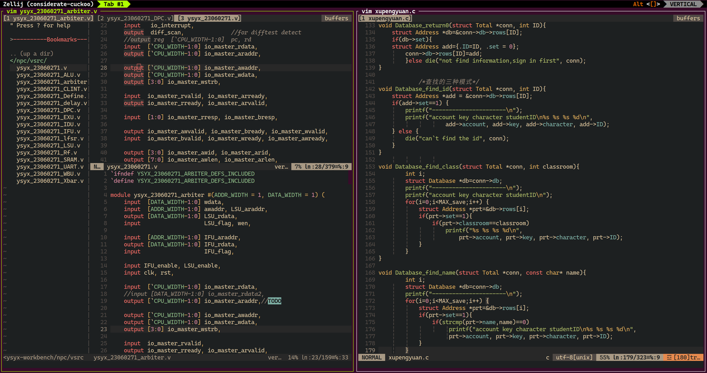

**总结****：**vim 部分学习你需要做的工作是配置自己的编程生产环境，因此自己用的舒服即可，后续学到更多也可以继续配置你自己的 vim。

### 5.终端复用器——Tmux（安装使用即可）

你可能会很疑惑，终端能不能也“分屏”，这样只需要打开一个终端就能干很多活了，不需要 vim 开一个，apt 开一个，gcc 开一个.......

这时候，终端复用器就派上用场了。它可以实现“分屏”效果，大大提升我们干活/Coding 的效率，就像这样：

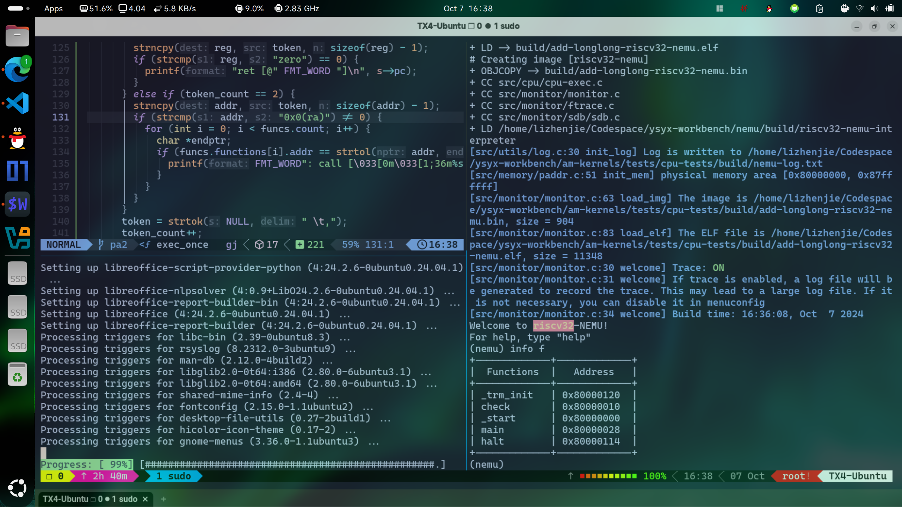

#### cTmux 的安装

```shell
**$ sudo apt install tmux**
```

#### Tmux 的使用和配置

**Tmux 使用教程：**<u>[https://docs.hpc.sjtu.edu.cn/login/tmux.html](https://docs.hpc.sjtu.edu.cn/login/tmux.html)</u>

如果想自定义你的 Tmux 的话，是完全 OK 的，上面这张图片就是配置后的 Tmux

**Tmux 配置教程：**<u>[https://hamvocke.com/blog/a-guide-to-customizing-your-tmux-conf/](https://hamvocke.com/blog/a-guide-to-customizing-your-tmux-conf/)</u>

**考核要求：安装使用即可，配置随个人意愿**

> [!TIP]
> 终端复用器进阶：如果你对繁琐难看的 tmux 界面和配置感到厌烦，想了解其他的终端复用器，我们推荐先了解使用一下 zellij 吧！
> 还想了解更多？欢迎大家 Bing 或 Google！

### 6.C 语言（请在 linux 环境下完成）

**注意：在做之前确保你安装了 vim 和 gcc**

```shell
**$ sudo apt install vim gcc**
```

#### 基础学习内容及作业（必做）

本周学习内容：

**函数，数组**（PS：如果你好好做了第一次的作业，那么你应该已经学完了循环，如果没有，Sorry！这周作业对你来说可能有些多了。。。）

**如何在 Linux 下运行你的程序（需要用到 gcc，暂时不展开它的其他用法）：**

```shell
**$ gcc <source_code.c>    #不指定程序名，在当前目录下输出a.out**
**$ gcc <source_code.c> -o <program_name>    #指定程序名**
```

**例如：**

```shell
**$ ls**
**program1.c  program2.c**
**$ gcc program1.c -o prog_1**
**$ ls**
**program1.c  program2.c  prog_1**
**$ ./prog_1**
<程序prog_1（源码program1.c）的运行输出>
**$ gcc program2.c**
**$ ls**
**program1.c  program2.c  prog_1  a.out**
**$ ./a.out**
<程序a.out（源码program2.c）的运行输出>
```

**LZJ 学长的碎碎念：为什么我们要让大家学 tmux 呢，因为这样就可以：（太方便了不是吗）**

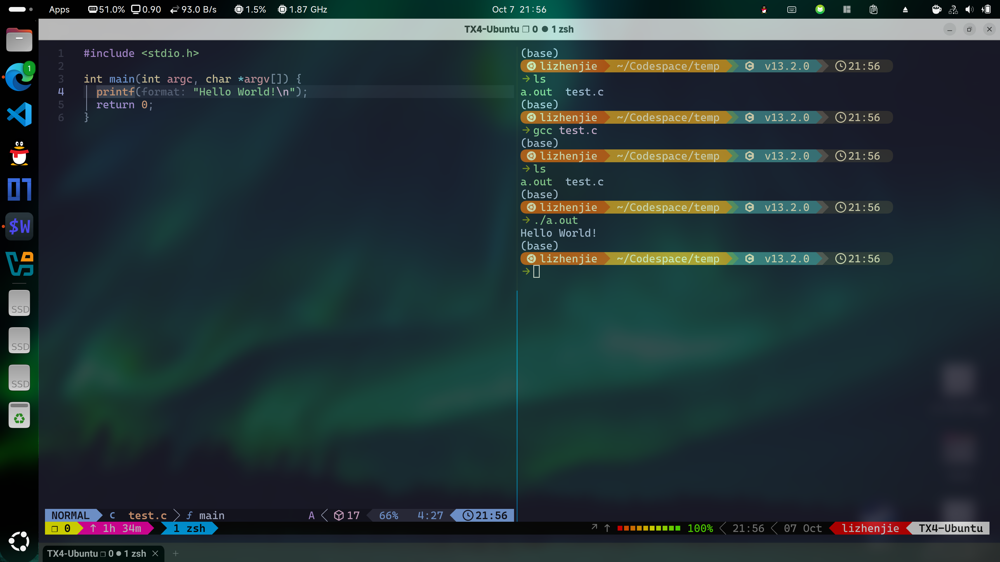

**（碎碎念：我们知道本周 C 语言学习任务会有一些多，大家要花时间去消化知识，因此我们不会给出难的编程作业，下面任务是 C 语言最基础的学习内容，****任选其一做完即可****）**

##### 选择 1.C 语言推荐书籍：

- 《C Primer Plus》（基础）
- 《C 与指针》（对指针讲的很透彻）
- 《C 陷阱与缺陷》（涵盖了初学到进阶的各种常见错误）
- 《C 专家编程》（讲解了一些 C 的高级用法）
- 《C 程序设计语言》（黑皮书，主要是从标准角度讲解，写的很精练，由 C 语言的创造者所编写，但是不推荐一上来就看，对 C 有一定了解之后再看）
- Linux C 编程一站式学习<u>[https://akaedu.github.io/book/](https://akaedu.github.io/book/)</u>

**以上书籍对应范围：结束函数，数组部分学习**

##### 选择 2.C 语言推荐视频：

<u>[https://www.bilibili.com/video/BV1XZ4y1S7e1/?vd_source=4ec31615294fd2510d5fd40f0183648f](https://www.bilibili.com/video/BV1XZ4y1S7e1/?vd_source=4ec31615294fd2510d5fd40f0183648f)</u>，**对应范围：看到第 80p 数组结束**（翁恺老师⼀⼤特征就是讲课详细，但是带来的代价就是视频长，讲课相当慢；**推荐 1.5-2 倍速且搭配跳转食用，尤其是题目讲解部分**，直接上手实践即可，不要一直参考老师的思路）

##### 选择 3.C 语言推荐练习习题：（基础即可，提高作业不要求做）

基础：<u>慕课</u><u>[https://www.imooc.com/learn/249](https://www.imooc.com/learn/249)</u>（**对应范围：4-6 章**）（虽然比较简单，但是用于练手还是可以的）

提高：<u>头歌湖南工业大学 C 语言题目</u><u>[https://www.educoder.net/paths/klbm7gto](https://www.educoder.net/paths/klbm7gto)</u>（——某软件学长碎碎念：难度高一些，但是这和咱们一些老师会安排的 C 语言课后作业大部分重复，所以学校的 C 语言课和作业会非常轻松）

#### 提高学习作业（必做）

**排序**

**题目解释：**

用户需输入 10 个整数，程序对其进行排序。

**要求:**

奇数全在前面，偶数全在后面，并且按照从小到大的顺序输出。

**例如**：

输入：9  96  23  21  6  200  2  28  92  10

输出：9  21  23  2  6  10  28  92  96  200

**效果演示：**


## 拔高作业（挑战自己）

**PS****：**以下三个任务，全部完成就是非常优秀了，全部完成难度比较高，完成多少都可以，交回即可。这三个题大家不仅要有对应的基础知识，还需要多加思考，比较锻炼思维，大家加油！

### 1.Shell 模拟器

继续改进你的 Shell 模拟器，想必你选择做拔高作业已经学完了函数部分，那么请你用函数编程的思想将以下两个程序做进你的 Shell 内，让你的 Shell 可以用 1，2 启用这两个程序（函数）。

类似这样：

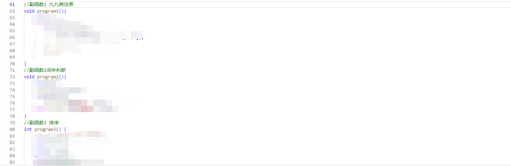

**效果示例：（这样的形式即可，输出大家自定）**

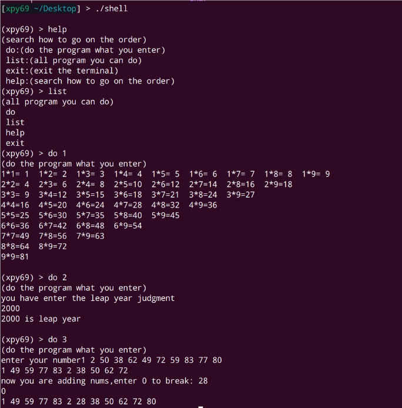

### 2.两数之和

给定一个整数数组 nums 和一个整数目标值 target（自己出一个），请你在该数组中找出和为目标值 target 的那两个整数，并返回它们的数组下标。

你可以假设每种输入只会对应一个答案，并且你不能使用两次相同的元素。

你可以按任意顺序返回答案，**只会存在一个有效答案****。**

**PS：不要面向结果编程！！！**

**输出效果演示（输出格式按照这个来）：**

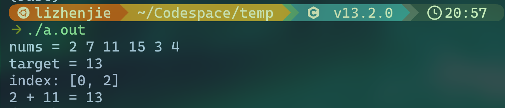

**思考题（给进度超前的同学）：**如何把这个封装成一个函数，然后接受任意一个整数数组呢？

### 3.排序改进

将提高作业的程序进行改进

完成排序并输出后增加选择，输入 1 可以添加新数字，仍要求奇数全在前面，偶数全在后面，并且按照从小到大的顺序输出。输入 0 退出。

**效果展示：**

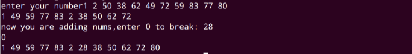

## 作业提交

将图片放在一个文件夹里，文件夹命名为 **你的姓名-专业班级****，（PS：我们第一次作业提交还是有一些命名不规范的，我们也会进行记录，细节决定成败）**

**必做基础任务：**

1. **Markdown 部分作业，请提交你的 md 文档（**里面内容为名字-专业班级），参考文件包内范例即可。
2. **APT** 为必用工具，因此这里不用提交相关凭证（此部分不用提交）
3. **Vim** 也是必用工具**，**这里提交的作业为你的**~/.vimrc**，**以及**你打开一个 C 语言文件编程时的**编程环境截图**，具体参考文件包内的范例。
4. **Tmux**，提交作业提交你的 Shell 截图即可，具体参考文件包内的范例。
5. **C 语言基础作业：**

   1. 选择 1 或 2：**请提交你用 md 做的学习笔记（键位实在是不熟可以纸质）**，过程中你实践做的**程序**也需要放在文件夹里命名为 C 语言提交。
   2. 选择 3：请提交**慕课**完成 **4-6 章或者头歌**（难度较高，建议有基础的人去尝试**）**完成** 5，6 部分编程作业的截图**。命名为 C 语言。

示例截图如下：


1. **C 语言提高作业：****C** 原文件命名为排序放入 C 语言文件夹即可。
2. **C 语言拔高作业：**如果你完成了 Shell 任务，那么只应该有一个 C 文件——Shell，反之给到程序对应的名字提交即可。

（XPY 学长留言：有一部分同学 C 语言已经几乎学完了，那么本周作业对他来说很轻松，请来找我，我会布置其他的拔高作业）

最后将以上**你的姓名-专业班级文件夹**压缩为⼀个压缩⽂件（右键压缩/Commpress 即可）。

**范例请参考文件夹内另一个文件**

**虚拟机发邮件**：

- 浏览器打开邮箱网站发送；（就和实体机一样，最方便快捷）
- 小蓝鸟 thunderbird 亦可，具体方式请上网查询（提示：现代邮箱需要使用 POP3/IMAP/SMTP/Exchange/CardDAV/CalDAV 服务，不能使用密码）；
- 或者建立共享文件夹，将作业打包到 win 上，然后发送邮件。具体方法也请自己查询。

**请****严格按照上述要求****发送到邮箱：yunding_ysyx@163.com**

## 拓展视野

学累了吗？不如来练练打字？<u>[https://dazidazi.com/](https://dazidazi.com/)</u>

### 编译流程与 GCC 编译器

C 程序是怎么从源代码变成可执行文件的？这就需要编译器了。

在你的 DevCpp 或者 Visual Studio 上，可能就只是一个按键的事，但是在这之后又发生了什么呢？

对这个过程感兴趣的同学可以去搜索关于 C 语言编译运行相关的知识，了解即可。

### 芯片是怎么制造的

<u>[https://www.bilibili.com/video/BV1kjxLeBEBD](https://www.bilibili.com/video/BV1kjxLeBEBD)</u>

本作品《"太理工一生一芯工作室前置讲义见习学员培养篇"》由 许鹏远 创作，并采用 CC BY-SA 4.0 协议进行授权。

遵循 CC BY-SA 4.0 开源协议：[https://creativecommons.org/licenses/by-nc-sa/4.0/deed.en](https://creativecommons.org/licenses/by-nc-sa/4.0/deed.en)

转载或使用请标注所有者：许鹏远，太理“一生一芯”工作室
