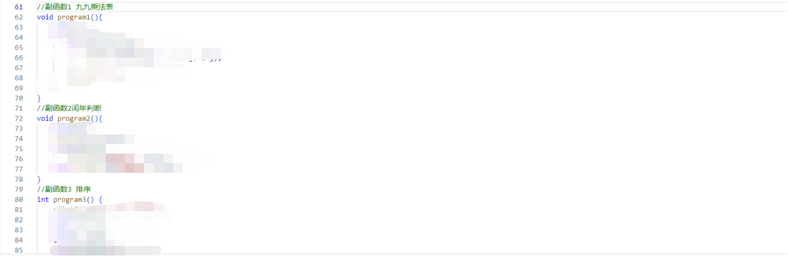
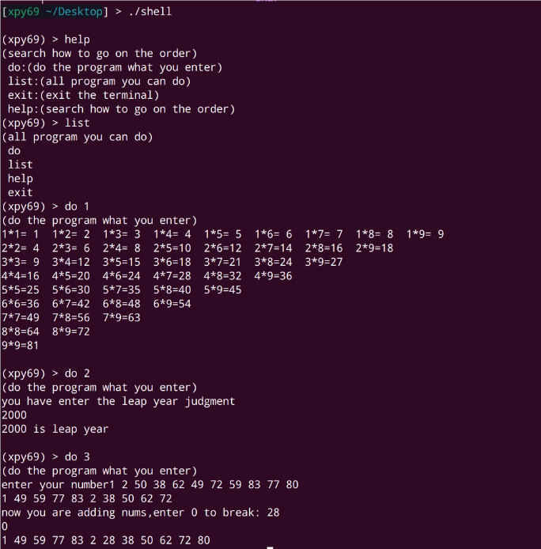
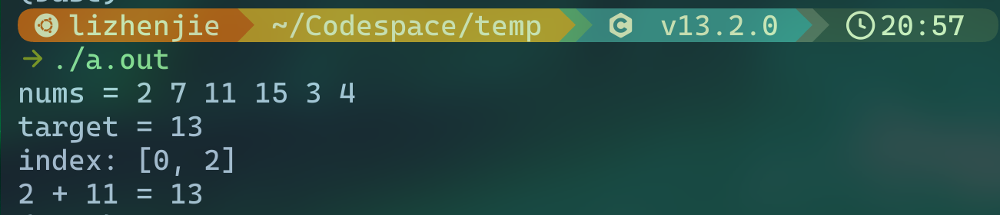

# “一生一芯”太理工作室见习学员第三次学习路线

**北风吹，吹我庭前柏树枝。**

**树坚不怕风吹动，节操棱棱还自持。**

**冰霜历尽心不移，况复阳和景渐宜。**

**闲花野草尚葳蕤，风吹柏枝将何为？**

**北风吹，能几时？**

**——于谦《北风吹》**

小朋友的碎碎念：在上次作业提交情况中，我们看到上了一些强度，不少人就出现了掉队现象，因此本次作业全是基础内容，希望大家能在这一周里**补足基础，完成上周作业未完成的内容**。希望大家知道：伟大的作品，不是靠力量而是靠坚持才完成的。大家要坚持下去，找到适合自己的学习方式，适合自己的学习节奏。

硅基生物的碎碎念：在上周的作业中我们发现，**绝大多数人的 Linux 操作是不过关的**。而且根据前两周的情况，**很多人作业文档是一点不看的，终端给出的报错和提示是一点不看的。**这对于大家之后的学习很不利，如果大家还是这种态度的话，那我们也不能说什么。但是请记住**“前面落下的，之后总会加倍奉还的”**，相信有些人已经体会到了。

> [!TIP]
> 本周学习任务以复习为主
> 一个合格的搜索工具：[必应](https://cn.bing.com/?mkt=zh-CN)，远强于百度。

# 基础复习任务

## GNU/Linux 及该环境下工具链的基本使用

### **学习（复习）内容：**

- [https://missing-semester-cn.github.io/2020/course-shell/](https://missing-semester-cn.github.io/2020/course-shell/)（眼熟吗）
- [常用的 Linux 命令介绍：13 个基本命令和 Shell 脚本编程_哔哩哔哩_bilibili](https://www.bilibili.com/video/BV1Uv4y127tU)

以上内容要认真【学】哦，视频后半部分内容涉及到 shell 脚本语法，大家不用过于深究，学习使用基本命令即可。

### **实操任务：**目录与文本操作

> [!TIP]
> **在做作业之前，请注意：**

- **全部使用终端完成，不要使用图形界面**
- **明确：**什么是文件，什么是目录
- **遇到问题：**STFW，RTFM（man-page 永远是你的朋友）

1. 在家目录下创建目录 `file_operation`
2. 切换到该目录，使用 `pwd` 命令输出当前目录路径
3. 分别使用以下几种方式创建文件 `a.fasta`：

   1. `echo` 命令 + 重定向
   2. `touch` 命令 + nano 编辑器
   3. vim 编辑器
4. `a.fasta` 内容如下：

   ```
   ```

> MCHU - Calmodulin - Human, rabbit, bovine, rat, and chicken
> ADQLTEEQIAEFKEAFSLFDKDGDGTITTKELGTVMRSLGQNPTEAELQDMINEVDADGNGTID
> FPEFLTMMARKMKDTDSEEEIREAFRVFDKDGNGYISAAELRHVMTNLGEKLTDEEVDEMIREA
> DIDGDGQVNYEEFVQMMTAK*

```
	1. 使用`file`命令查看文件信息，使用`cat`命令、`less`命令查看文件内容
	2. 分别使用相对路径和绝对路径的方式列出`file_operation`目录下的文件以及大小
	3. 用vim编辑器重复`a.fasta`文本内容：
	4. `a.fasta`事后结果应为：
	```
>MCHU - Calmodulin - Human, rabbit, bovine, rat, and chicken
ADQLTEEQIAEFKEAFSLFDKDGDGTITTKELGTVMRSLGQNPTEAELQDMINEVDADGNGTID
FPEFLTMMARKMKDTDSEEEIREAFRVFDKDGNGYISAAELRHVMTNLGEKLTDEEVDEMIREA
DIDGDGQVNYEEFVQMMTAK*
>MCHU - Calmodulin - Human, rabbit, bovine, rat, and chicken
ADQLTEEQIAEFKEAFSLFDKDGDGTITTKELGTVMRSLGQNPTEAELQDMINEVDADGNGTID
FPEFLTMMARKMKDTDSEEEIREAFRVFDKDGNGYISAAELRHVMTNLGEKLTDEEVDEMIREA
DIDGDGQVNYEEFVQMMTAK*
```

```
1. 将`a.fasta`拷贝为`b.fasta`
2. 使用`vim`编辑器寻找`b.fasta`中第一次出现的`GQNPTEA`字符，并将其后内容删除并保存
3. 将`a.fasta`移动到`/tmp`目录
4. 将`b.fasta`文件压缩为`b.fasta.tar.gz`，压缩级别为8（提示：使用`tar`命令，具体操作请RTFM&STFW）
5. 解压`b.fasta.tar.gz`
6. 删除`b.fasta`与`file_operation`目录
7. 使用`history`命令查看自己完成该练习的过程
8. 利用`man`命令阅读练习中使用过命令的详细说明，比如`man ls`，`man vim`，`man cat`等。
```

> [!TIP]
> 作业提交要求：
> 提交你的 `.bash_history/.zsh_history`

## Linux 环境配置

上次作业的基本内容，如果还没有搞清楚，那就去继续探究吧！

1.[vimrc 认识与基础](https://zhuanlan.zhihu.com/p/514133694)——vimrc 并不是一定要装插件的哦！

2.继续用你配置的环境进行编程

## C 语言编程

主方向：消化巩固所学内容，学有余力可以先去了解指针概念

### 编程作业（上周的拔高作业）

### 1.Shell 模拟器

> [!TIP]
> 继续改进你的 Shell 模拟器，请你用函数编程的思想将以下两个程序做进你的 Shell 内，让你的 Shell 可以用 1，2 启用这两个程序（函数）。

类似这样：



**效果示例：（这样的形式即可，输出大家自定）**



### 2.两数之和

给定一个整数数组 nums 和一个整数目标值 target（自己出一个），请你在该数组中找出和为目标值 target 的那两个整数，并返回它们的数组下标。

你可以假设每种输入只会对应一个答案，并且你不能使用两次相同的元素。

你可以按任意顺序返回答案，**只会存在一个有效答案。**

**PS：不要面向结果编程！！！**

**输出效果演示（输出格式按照这个来）：**



**思考题（给进度超前的同学）：**如何把这个封装成一个函数，然后接受任意一个整数数组呢？

### 3.排序改进

完成排序并输出后增加选择，输入 1 可以添加新数字，仍要求奇数全在前面，偶数全在后面，并且按照从小到大的顺序输出。输入 0 退出。

**效果展示：**


## 作业提交

### 本次作业

将图片放在一个文件夹里，文件夹命名为 **你的姓名-专业班级，****（PS：我们作业提交还是有一些命名不规范的，我们也会进行记录，细节决定成败）**

**必做基础任务：**

1. **基础工具使用：**提交 `.bash_history/.zsh_history` 文件即可。
2. **C 语言作业：**如果你完成了 Shell 任务，那么只应该有一个 C 文件——命名为 Shell.c 即可。

（XPY 学长留言：有一部分同学 C 语言已经几乎学完了，那么本周作业对他来说很轻松，继续巩固即可）

最后将以上**你的姓名-专业班级文件夹**压缩为⼀个压缩⽂件（右键压缩/Commpress 即可）。

### 上次作业

> [!TIP]
> 第二次作业未提交的请及时补交。
> 并在邮件中备注：第二次作业补交

**请****严格按照上述要求****发送到邮箱：yunding_ysyx@163.com**

本作品《"太理工一生一芯工作室前置讲义见习学员培养篇"》由 许鹏远 创作，并采用 CC BY-SA 4.0 协议进行授权。

遵循 CC BY-SA 4.0 开源协议：[https://creativecommons.org/licenses/by-nc-sa/4.0/deed.en](https://creativecommons.org/licenses/by-nc-sa/4.0/deed.en)

转载或使用请标注所有者：许鹏远，太理“一生一芯”工作室
