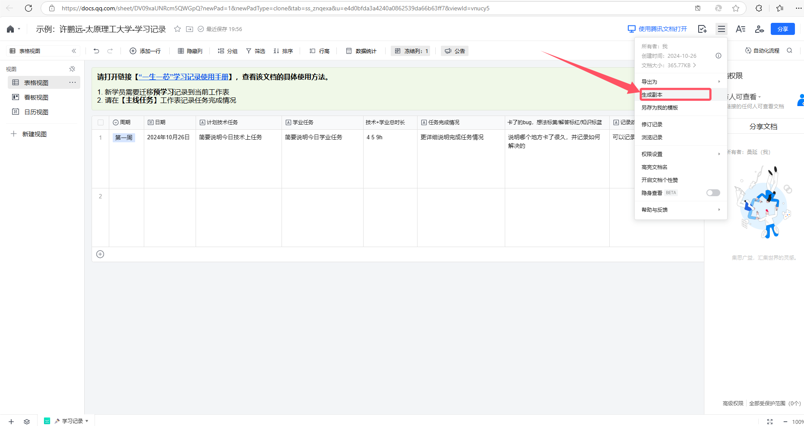
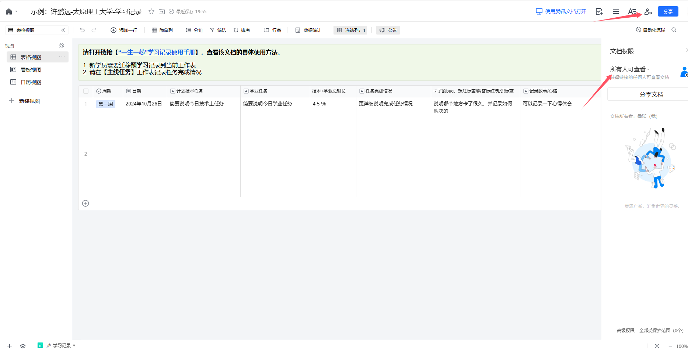

# “一生一芯”太理工作室见习学员第四次学习路线

**大鹏一日同风起，扶摇直上九万里。**

**假令风歇时下来，犹能簸却沧溟水。**

**世人见我恒殊调，闻余大言皆冷笑。**

**宣父犹能畏后生，丈夫未可轻年少。**

**⸺《上李邕》李白**

> [!TIP]
> 本次作业结束后，我们会清理相当一部分不交作业的人离开该社区，之后会有一批人进入该社区，继续培养，<u>他们同现在的大家会差一个半月进度，进度跟不上的可以从这次重新开始</u>

# 必做任务

## 1.完成“一生一芯”报名

[https://ysyx.oscc.cc/signup](https://ysyx.oscc.cc/signup)，相关后续提示加群，可以进入围观，预学习交流群为后续预学习答辩前夕需要，可进入，现阶段用处不大。问问题在太理的社区群即可，官群问问题必须要符合“[提问的智慧](https://github.com/ryanhanwu/How-To-Ask-Questions-The-Smart-Way/blob/main/README-zh_CN.md)”和“[别像弱智一样提问](https://github.com/tangx/Stop-Ask-Questions-The-Stupid-Ways/blob/master/README.md)”。

> [!TIP]
> 完成报名后提交报名后的截图，26 日前报名过的同学可跳过，不要求截图，这部分同学我们有之前的报名记录。

## 2.准备学习记录表

[https://docs.qq.com/sheet/DV09xaUNRcm5QWGpQ?newPad=1&newPadType=clone&tab=ss_znqexa&u=e4d0bfda3a4240a0862539da66b63ff7&viewId=vnucy5](https://docs.qq.com/sheet/DV09xaUNRcm5QWGpQ?newPad=1&newPadType=clone&tab=ss_znqexa&u=e4d0bfda3a4240a0862539da66b63ff7&viewId=vnucy5)

1. 以上是记录表的副本，点开链接后如下操作：

1. 创建一个自己的副本，其中表格内容自己可以更改，随后切换权限到所有人可查看

1. 随后将你的表格放入这里：[https://docs.qq.com/sheet/DV3BIell3RUdVYVJY?no_promotion=1&tab=BB08J2](https://docs.qq.com/sheet/DV3BIell3RUdVYVJY?no_promotion=1&tab=BB08J2)

> [!TIP]
> 学习记录表是大家接下来的好帮手，能很好地帮助大家复盘每一天遇到的问题，用处非常大，这里给大家提供一份学长的学习记录表：（可以看到的是随意发癫，问题不大，没必要非常严肃对待）
> [https://docs.qq.com/sheet/DWk9BdXVrRXdvcHJl?tab=ss_znqexa&_t=1717317532016&viewId=vnucy5&u=e4d0bfda3a4240a0862539da66b63ff7](https://docs.qq.com/sheet/DWk9BdXVrRXdvcHJl?tab=ss_znqexa&_t=1717317532016&viewId=vnucy5&u=e4d0bfda3a4240a0862539da66b63ff7)
> 在大家进入“一生一芯”学习时，学习记录也是一份凭证，会跟着你走完整个“一生一芯”学习阶段；之后我们进入云顶书院正式学习和下一阶段的面试这也是参考内容；同时在之后大家写简历时，学习记录表是可以写到简历上的，含金量很高，用处很大。
> 要注意的是：每天晚上或早晨进行复盘，顺带就进行学习记录，养成良好的习惯，未来你会感谢你自己的

## 3.C 语言

### 学习内容

**选择 1.C 语言推荐书籍：**

- 《C Primer Plus》（基础）
- 《C 与指针》（对指针讲的很透彻）
- 《C 陷阱与缺陷》（涵盖了初学到进阶的各种常见错误）
- 《C 专家编程》（讲解了一些 C 的高级用法）
- 《C 程序设计语言》（黑皮书，主要是从标准角度讲解，写的很精练，由 C 语言的创造者所编写，但是不推荐一上来就看，对 C 有一定了解之后再看）
- Linux C 编程一站式学习

**以上书籍对应范围：结束指针，结构体部分学习**

**选择 2.C 语言推荐视频：**

<u>[https://www.bilibili.com/video/BV1XZ4y1S7e1/?vd_source=4ec31615294fd2510d5fd40f0183648f](https://www.bilibili.com/video/BV1XZ4y1S7e1/?vd_source=4ec31615294fd2510d5fd40f0183648f)</u>，**对应范围：81 开始看到第 100p 结构体结束**（翁恺老师⼀⼤特征就是讲课详细，但是带来的代价就是视频长，讲课相当慢；**推荐 1.5-2 倍速且搭配跳转食用，尤其是题目讲解部分**，直接上手实践即可，不要一直参考老师的思路）

### 必做题目

#### a.C 语言练习习题

<u>1.</u><u>头歌湖南工业大学 C 语言题目</u><u> </u>第 7 部分和第 8 部分习题完成（有做不出来的题就跳过，问题不大，这里的题难度是有的，我当时一个小时写一道题，确实有难度）

（——某软件学长碎碎念：难度高一些，但是这和咱们一些老师安排的 C 语言课后作业绝大部分重复，所以学校的 C 语言课和作业会非常轻松）

> [!TIP]
> **指针的知识尤为重要，结构体在面向对象编程过程中是尤为重要的一种数据结构，大家要认真学习，是 C 语言最基础的学习内容，****头歌指针和结构体部分内容为必做**
> **做了哪些截图哪些即可，只要自己思考过就好，要的是大家能有所收获！**

#### b.Shell 改进

要求  ：

1. 将 Shell 调用其他程序的命令换掉，使用 do  命令调⽤，调⽤时将 program1  替换为用户程序的名字，如：do sum 调用求和程序，do sort 调用排序程序。
2. 能够将命令本⾝和命令的参数分开 a. 示例：命令本⾝为 do ，其参数为 sum  ，执⾏程序 1 时，输⼊ do sum，二者可分开，如果命令参数（不含调用的程序）那么就提示换一个程序，并执行 list 命令。
3. 将数字调用的命令，都使用字符串实现

   1. 具体实现： list  、 do 、 exit  、 help
4. 为每个指令添加⼀个功能描述，描述自行设计，请全部以英⽂书写。（用于 help 调出查看每个命令功能）
5. 添加更多指令：

   1. do [arg1]  ：[arg1]参数⽤于传递所执⾏的程序的名字
   2. list  ：列出所有可执⾏的程序名字
   3. help  ：列出所有 Shell 可执⾏命令与其功能描述
   4. exit  ：退出 Shell 程序

效果如下：

> [!TIP]
> 其中的 1，2，3 换成自己程序的名字，调用结果也按自己的来，即原有排序等程序调用即可，不必额外更改其他程序，英文注释部分大家按自己的想法来，不用看我的示例

### 4.git——高效的版本控制工具

学习链接：[https://www.liaoxuefeng.com/wiki/896043488029600](https://www.liaoxuefeng.com/wiki/896043488029600)（到“删除⽂件”⼀节即可——完成第五部分）

必做任务：[https://learngitbranching.js.org/?locale=zh_CN](https://learngitbranching.js.org/?locale=zh_CN)   完成基础篇即可

> [!TIP]
> 要求：完成学习链接内容的学习，完成必做任务的题并截图
> 大家可以将这一个月做的练习题合并到一个文件夹内，用 git init 创建仓库，日后可以推到 Github 上
> **尤其是做特殊作业的同学**，learn C the hard way 就要用 git 管理版本，非常方便。

目前 git 学习就以上的基础内容，其他内容后续展开。

> [!TIP]
> 以上作业无论是 C 语言还是 git，很多东西是需要记下来的，这时候请不要忘了你的好帮手——md 语法记笔记，日后可以帮你全局搜索，快速拾起遗忘的记忆

## 作业提交

文件夹命名为 **你的姓名-专业班级，****（PS：我们作业提交还是有一些命名不规范的，我们也会进行记录，细节决定成败）**

**必做基础任务：**

1. 报名截图（26 日之前已经报名的同学不需要提交截图）
2. 向社区学习记录总表放入自己的学习记录表
3. C 语言头歌任务完成的截图， 最终版 ShellC 文件
4. git 必做任务完成的截图。

最后将以上**你的姓名-专业班级文件夹**压缩为⼀个压缩⽂件（右键压缩/Commpress 即可）。

**请****严格按照上述要求****发送到邮箱：****yunding_ysyx@163.commailto:yunding_ysyx@163.com**

## 接下来计划：

大家在完成本周作业提交后（11 月 2 日晚十点截止），就有足够的能力去迎接大作业（持续两周）—— 一份用 C 语言谱写的美妙程序，我考虑到大家进度、能力不同，我出了两个大作业，选择做提高作业的同学不用再做普通版本的大作业。做完普通大作业的同学也可以届时挑战提高版大作业。

提高版本大作业基础要求——熟练运用文件操作函数、指针、结构体，并且会使用 Asan，valgrind 内存检测工具

本作品《"太理工一生一芯工作室前置讲义见习学员培养篇"》由 许鹏远 创作，并采用 CC BY-SA 4.0 协议进行授权。

遵循 CC BY-SA 4.0 开源协议：[https://creativecommons.org/licenses/by-nc-sa/4.0/deed.en](https://creativecommons.org/licenses/by-nc-sa/4.0/deed.en)

转载或使用请标注所有者：许鹏远，太理“一生一芯”工作室
