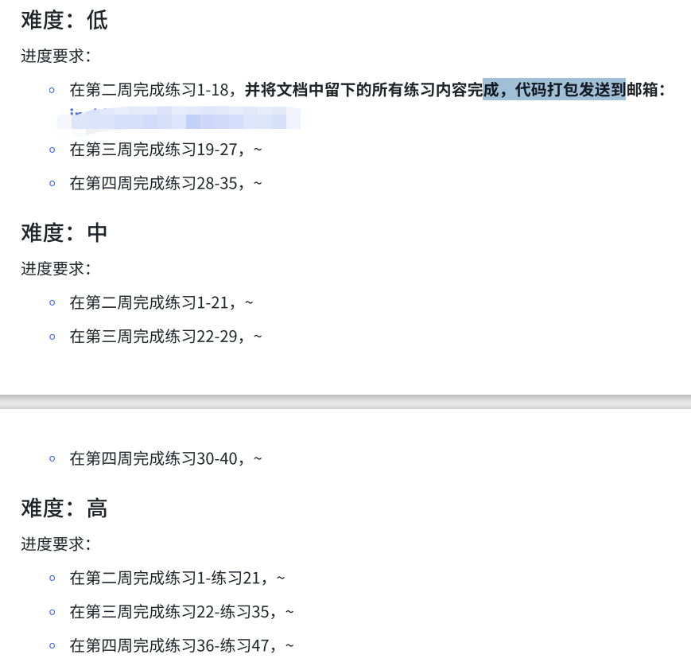

# 特别的爱，给特别的你（加强版学习任务）

本学习任务适用于技术能力强基础好的同学，在过去我发现不少同学渴望完成更多的技术学习，我特此开了⼀个加强版的学习任务，希望你们能在这里有更大的收获！

> [!TIP]
> 做加强版学习任务，**并不意味着你不需要做平常的作业**。
> 多学的内容都是**“一生一芯”预学习答辩**需要的内容之一，你们能力很强，现在去学习更多知识没有坏处
> **提醒**：C 语言的所有作业，都应该在 Linux 系统中完成！

## C 语言

### 学习资料：

【Learn C the hard way】：[https://wizardforcel.gitbooks.io/lcthw/content/preface.html](https://wizardforcel.gitbooks.io/lcthw/content/preface.html)

备用网站：[http://www.cntofu.com/book/25/introduction.md](http://www.cntofu.com/book/25/introduction.md)

### 考核方式：

与其他同学⼀样在周六晚上交当周作业

### 进度要求：

1. 10 月 21 日-10 月 26 日  完成练习 1-10
2. 10 月 28 日-11 月 2 日    完成练习 11-15
3. 11 月 4 日-11 月 9 日      完成练习 16-18

---

## 计算机缺失的一课

### 学习资料：

【Missing-Semester】：[https://missing-semester-cn.github.io/](https://missing-semester-cn.github.io/)

### 考核方式：

与其他同学⼀样在周六晚上交当周作业

### 进度要求：

1. 10 月 21 日-10 月 26 日【Shell 工具和脚本】
2. 10 月 28 日-11 月 2 日 【命令行环境】、【版本控制(Git)】

> [!TIP]
> 注意：涉及到远程设备的部分可以跳过，此部分知识涉及到网络层面。

---

## github

### 学习资料：

注册自己的 github 账号，平常用 typora 或其他软件（markdown 语法）记录笔记，并用 git 工具将你的笔记上传到 github 上。当然，你也可以把你做的 learn C the hard way 代码传上 github。

这里关于 ssh 协议以及相关知识鼓励大家多了解多学习

### 考核时间：

长期作业，记得及时更新你 github 库中的内容。

### 考核方式：

交作业邮件附上你的 github 账号即可。

> [!TIP]
> 注意：该任务 win 端也可以做，不要求在 linux 端完成。

---

## xpy 学长的碎碎念：

对比上一年，我的要求降低了很多，我相信大家有能力一路做下来。**以上全部内容在当时要求是一周内全部完成的，同时也要完成必做任务**。我给大家拆分为了三周完成，我之所以做出这样的一个坡度，是希望更多同学可以来尝试这份特殊任务。而且经由上一年我的个人实践，是可以在规定时间内完成的，量也不算太大。望同学们加油！

以下是我当时遇到的“拔尖”作业量：

---

## 作业提交

> [!TIP]
> 注意：

将文档中留下的所有练习内容完成，**代码**打包发给负责自己的学长

**何事居穷道不穷，乱时还与静时同。 **

**家山虽在干戈地，弟侄常修礼乐风。**

** 窗竹影摇书案上，野泉声入砚池中。**

** 少年辛苦终身事，莫向光阴惰寸功。**

** ⸺《题弟侄书堂》杜荀**

本作品《"太理工一生一芯工作室前置讲义见习学员培养篇"》由 许鹏远 创作，并采用 CC BY-SA 4.0 协议进行授权。

遵循 CC BY-SA 4.0 开源协议：[https://creativecommons.org/licenses/by-nc-sa/4.0/deed.en](https://creativecommons.org/licenses/by-nc-sa/4.0/deed.en)

转载或使用请标注所有者：许鹏远，太理“一生一芯”工作室
