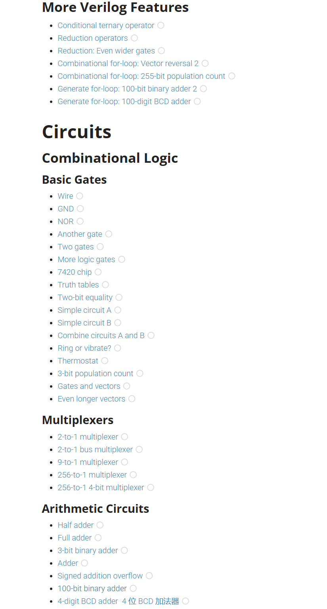
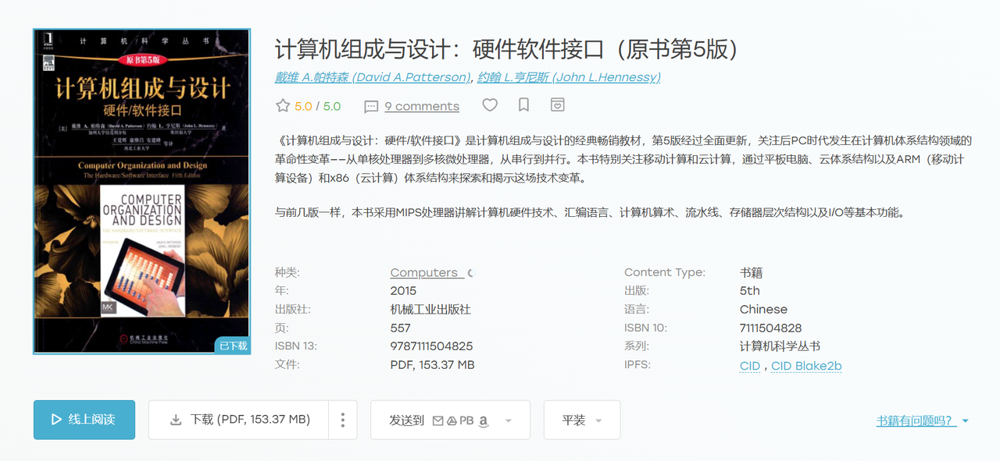
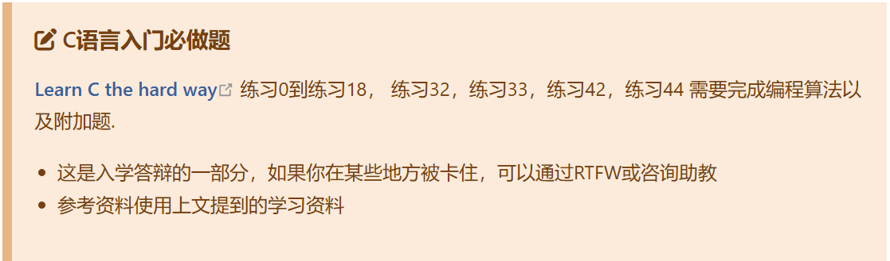

# “一生一芯”太理工作室一组寒假研学第三次学习路线

学习情况：经过年前两周的学习，大家完成了数字设计理论学习，数据结构，LCTHW 实践内容，部分同学已经学完了计组的绝大部分内容。

学习目标：Verilog 实践练习和 LCTHW 数据结构实践，有能力的同学彻底完结计组知识。

# 学习任务

## 数字设计

**记住 verilog 的本质是硬件描述语言而不是硬件设计语言，因此你需要去了解行为级建模，数据流建模，结构化建模的区别，以及为什么我们不推荐使用行为级建模。**

相关推荐学习资料：

html 文档学习：[Verilog 实践部分文档学习](https://vlab.ustc.edu.cn/guide/doc_verilog.html)（可以在这上面直接学习相关的语法——**重实践**）

推荐的自学课程：[中科大的 Verilog OJ 平台](https://verilogoj.ustc.edu.cn/oj/)(需要注册并登录)，推荐边看书边练手。实际部分掌握不错的**可以跳过该课程**

> [!TIP]
> **推荐学习方法：****看书作为理论学习，****Verilog 实践**文档作为实践学习，然后就可以上手**中科大的 verilog 实践 OJ 平台**了，全部知识学完之后，就可以开始**拔高部分的数字设计 HDLbits OJ 做题网站**学习了**。**（这两个平台有一些题目是重复的，做过一遍可以跳过）

# 学习作业

1. 随时**记录自己的学习记录**，一定要如实记录，我们会不定期查看各位的学习情况。
2. [Learn C The Hard Way](https://wizardforcel.gitbooks.io/lcthw/content/) 中第 **17，18 节完成，20-25 需要学习，但是附加题不强制要求学习。最后将章节练习任务放在命名为“C”的文件夹中。**

> [!TIP]
> **只需交回 17，18 的附加题练习任务，其他部分学习实操练习即可。**
> ——不需交回并不是不重要，而是这部分附加题出的并没有那么好。。。但是此部分学习内容还是很不错的，所以大家学懂这部分的学习内容即可。

1. Verilog 实践：[Verilog 在线学习网站](https://hdlbits.01xz.net/wiki/Main_Page)——veilog 学习实践，全英文（在这里推荐一个浏览器插件：**沉浸式翻译**，如果看不懂的话，就用这个插件配合学习吧！），**完成到 3.2sequential logic 时序逻辑计数器结束，中间 3.1.4 的卡诺图部分可跳过，最后完成部分上传截图即可**

> [!TIP]
> 进度快的同学继续向后做即可，做腻了可以选择拔高或选做的其他部分内容
> 这里如果有卡住的题可以跳过

最后将以上内容放入一个文件夹里，文件夹命名为 **你的姓名-专业班级，****然后压缩为一个压缩文件即可。**

**请****严格按照上述要求****发送到邮箱：****YunDing_YSYX@163.commailto:YunDing_YSYX@163.com**

我相信这个寒假不少同学会充分利用这个黄金时间学习技术，那么以上的学习内容肯定是不够你学的，因此我准备了这个部分内容。

# 选做

## 计算机组成原理

### 地位

考研 408 数据结构 操作系统 **计算机组成原理** 计算机网络，计算机知识硬件部分精华科目，理工科学生必修课之一，无论考研还是工作都占据极其重要的地位，同时更是我们后续实践的基础科目。

> [!TIP]
> **为什么有这么重要的地位呢？**
> 那就要知道机组具体学的内容了，以下是机组完整学习的思维导图，大家自取了解：
> _链接：__[https://pan.baidu.com/s/1YDMg_OsAa2Kn5wpj7k99JA?pwd=9999](https://pan.baidu.com/s/1YDMg_OsAa2Kn5wpj7k99JA?pwd=9999)__ 提取码：9999_
> 看完之后，你应该就明白为何如此重要了——这不就是我们设计芯片的基础蓝图吗？
> 第六七章的 IO 和总线部分难度大，内容多，大家在后续才会接触，因此我们寒假只需要学习完第五章处理器即可。

### 内容

以下视频的 **CH5 最后一章内容学习**，记得随手 typora 记录笔记和继续自己的学习记录哦！

[https://www.bilibili.com/video/BV1Ba4y1V7GD/?vd_source=4ec31615294fd2510d5fd40f0183648f](https://www.bilibili.com/video/BV1Ba4y1V7GD/?vd_source=4ec31615294fd2510d5fd40f0183648f)

机组部分学习会大量涉及你学过的**数电**知识，如果当时没有好好学，那就要比较吃力了。

> [!TIP]
> 注意！该课程是使用教材为 **MIPS 指令集版本**，我们之后设计芯片，使用的是 **RISCV 指令集版本**，但是考虑到该课程体系完善，效果好，指令集思想是相通的，因此我们仍然选择了该视频课程，配套书籍为黑皮书：计算机组成与设计：硬件软件接口，图示如下（**群内有电子版资料**），想搭配书籍的同学可以参考——不推荐纯看书，黑皮书阅读难度大，知识点深而且广，很难理清知识点。
> 因此，**也可以选择你觉得好的计组课程或者硬啃黑皮书**，学到知识就好！

> [!TIP]
> **学完机组我能干什么？**
> 1.为之后的数字设计，硬件设计，芯片设计等等相关方面打基础，缺少机组知识你将寸步难行
> 2.对考研有很大的帮助
> 3.硬件相关学校课程你的修读难度会很低

### 任务

交回相关 markdown 笔记（我们**推荐**大家进行**总结归纳和心得记录**，这真的很有帮助），以此说明你完成了此部分的学习。

# 拔高

## 数字设计

数字设计重要性不言而喻，因此拔高部分你可以选择继续学习数字设计，学的越多越好，并搭配实践学习；[Verilog 在线学习网站](https://hdlbits.01xz.net/wiki/Main_Page)中**一二三四章**都非常推荐学习，所以加油吧！

> [!TIP]
> **那我机组部分的实践内容嘞？**
> 机组的学习内容就决定，它**学到的很多是思想**，是**整体的架构，**这就意味**机组实践内容需要你技术栈更全更深**，因此机组实践内容还要向后放，简单部分实践在之后会有一部分，处理器设计方面内容则需要寒假开学之后，视个人进度逐步进行实践。

## Learn C the hard way

LCTHW：[https://wizardforcel.gitbooks.io/lcthw/content/preface.html](https://wizardforcel.gitbooks.io/lcthw/content/preface.html) 其中的 **26、37-41、43、45-47 不需要学习**，性价比比较低，不推荐学习，**其他内容我们都很推荐学习**，想要技术很强的话，都可以试着去学习，并在其中锻炼自己 gdb 等 debug 工具使用和相关能力思维。

**其中有关“一生一芯”的必须完成部分如下**：

## 一生一芯课程 PA

PA 是我们后续学习中非常重要的一部分内容，目前我们已经把 PA0 相关的基础知识进行了补全，大家**可以去尝试 PA0 的相关内容学习**，不过想开 PA1 还需要一些时间，PA1 的内容需要数据结构，Lchtw 都学到不错的地步并具备一定的编程思想，然后就需要你的时间和精力花费了。

> [!TIP]
> 说这么多，其实就是告诉大家 **PA1 部分的学习内容难度很高**，可能会花费不少时间，同时这也是后续预学习答辩的重要内容之一，所以如果**你想挑战自己的能力极限**，那现在去做 PA1 也是可以的，加油！

---

以上就是拔高作业的全部内容，说实话如果你能在这个寒假把以上内容全做完，意味着——》寒假结束后一个月内即可参加预学习答辩并顺利通过，正式进入“一生一芯”项目，后续继续保持学习，那么你的技术将比我更强！暑假你完全可以凭借自己的实力进入线下基地。**但是也请大家劳逸结合，考虑自己的能力和精力，合理学习，不要为了求快，去燃烧自己的热情与生命，这样是非常得不偿失的**，

> [!TIP]
> **难度这么高几乎无法完成，那拔高作业布置这么多是为什么？**

1. 想让大家明白自己要学的内容还有很多。
2. 让大家可以自由选择拔高的学习内容，以上三项，皆可自由选择学习，不存在非常强烈的关联先后关系。
3. 并没有要求大家拔高作业全部完成，而是根据自己情况，可以完成多少就完成多少。

本作品《"太理工一生一芯工作室前置讲义寒假研学篇"》由 许鹏远 创作，并采用 CC BY-SA 4.0 协议进行授权。

遵循 CC BY-SA 4.0 开源协议：[https://creativecommons.org/licenses/by-sa/4.0/deed.en](https://creativecommons.org/licenses/by-sa/4.0/deed.en)

转载或使用请标注所有者：许鹏远，太理“一生一芯”工作室
