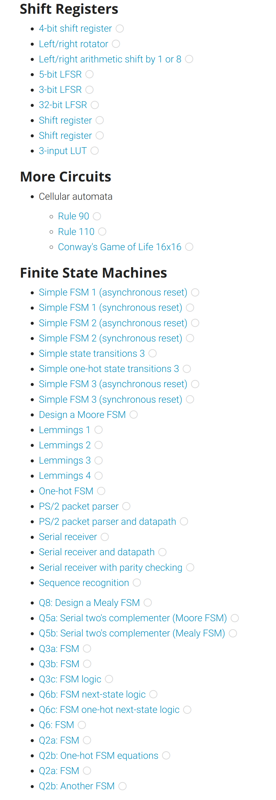
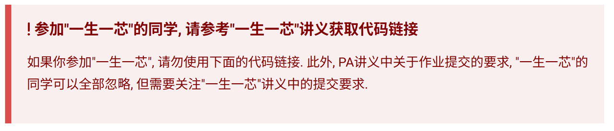
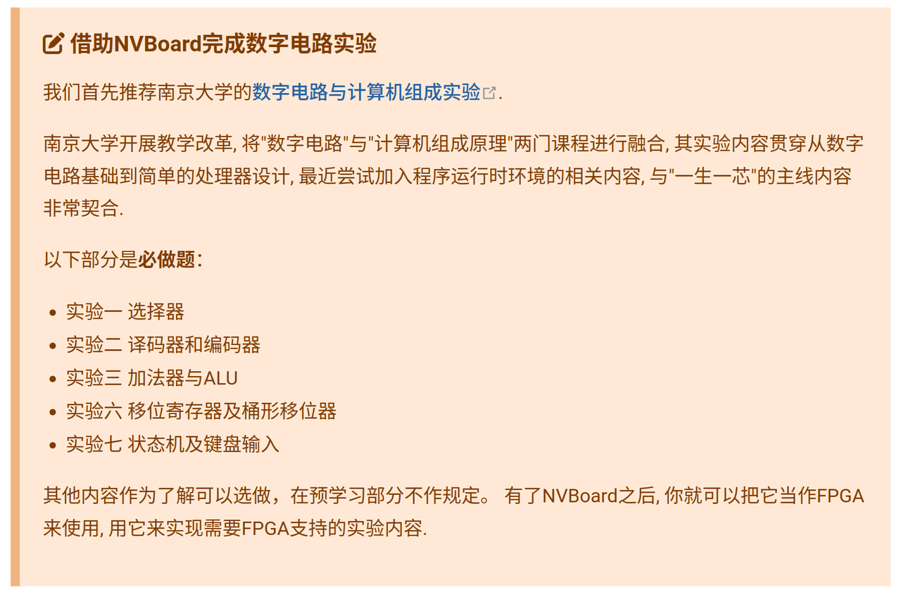

# “一生一芯”太理工作室一组寒假研学最终次学习路线

学习目标：结束本次寒假研学学习内容，至此大家就完成了**数字设计，数字电路，复习 C 语言，数据结构与算法**的学习，额外的我们还学习了**项目框架构建，makefile 的使用，debug 工具的使用等等计算机基础知识**。能力强的同学额外完成了**计算机组成原理**的学习。接下来大家入学后，大家已经有能力完成入学答辩的核心内容了——南大数电实验与 PA，大家加油！不出意外，开学一两个月内会有不少同学通过预学习答辩。

> [!TIP]
> 预防针：本次作业有一定难度：
> C 语言部分迎来多种知识杂糅运用——你们会学到编译链接偏底层的知识，又要学习数据结构的具体实现过程；你可能会在这一部分的学习过程中处于懵逼状态，看不懂代码，看不懂他的实现目的；这时，我推荐大家问 AI，ai 可以帮你**总结出这一部分的知识点**，也可以帮你理**清楚实现目的**，但是**不要过度相信 AI**，**可疑的部分一定要去上网查**，**或者问同学或学长**。
> 数字设计迎来很难的一章——有限状态机，思路理不清楚很有可能坐一天也想不出来，这时候就试着画**画图**吧！理清楚思路再写这部分代码效果会好很多哦！并且这一部分是有固定套路的，大家在做了很多道相关题之后，**做笔记归纳总结**，就可以悟出状态机的构建流程了！

# 学习作业

1. 随时**记录自己的学习记录**，一定要如实记录，我们会不定期查看各位的学习情况。
2. [Learn C The Hard Way](https://wizardforcel.gitbooks.io/lcthw/content/) 中 **28-31 节完成，****这四节内容大家会学着****构建自己的代码框架——这是所有项目起步必备的一环**，随后我们将开始数据结构实践内容，**完成 32，33，42，44 四节内容学习**

> [!TIP]
> 本次这部分作业的**附加题不要求实现**，只需要实现此部分内容中的必做部分即：如，**28-31** 节理解框架构建和运行过程；**32、33、42、44** 学会数据结构和算法的具体实现过程。
> 最后将章节练习任务放在命名为“C”的文件夹中。这些是之后入学答辩考察的一部分 OvO
> 至此，我们复习 C 语言与数据结构和算法的学习结束，**这部分已经完成的同学可以选择拔高中的 PA 作业。**

1. Verilog 实践：[Verilog 在线学习网站](https://hdlbits.01xz.net/wiki/Main_Page)——veilog 学习实践，全英文（在这里推荐一个浏览器插件：**沉浸式翻译**，如果看不懂的话，就用这个插件配合学习吧！），**完成如下的 Shift Registers 与 Finite State Machines 的内容，中间的可跳过，最后完成部分上传截图即可**

> [!TIP]
> 有限状态机部分题目有很多重复，大家对这里有自己的方法和理解即可，**可以跳过重复性较高的题！！**
> 至此，我们数字设计部分学习结束。若已完成这部分，可选择拔高中的南大数电实践。




最后将以上内容放入一个文件夹里，文件夹命名为 **你的姓名-专业班级，****然后压缩为一个压缩文件即可。**

**请****严格按照上述要求****发送到邮箱：****YunDing_YSYX@163.commailto:YunDing_YSYX@163.com**

# 拔高

## 南大数字电路实验

> [!TIP]
> 注意！PA0 中绝大多数操作我们已经学习并实践过了，因此请认真阅读按照如下这一部分讲义进行，请勿盲目按照 PA0 中讲义操作！

### A. 获取工具及框架源码

首先，我们需要安装 PA 中需要的工具：

```bash
apt-get install build-essential    # build-essential packages, include binary utilities, gcc, make, and so on
apt-get install man                # on-line reference manual
apt-get install gcc-doc            # on-line reference manual for gcc
apt-get install gdb                # GNU debugger
apt-get install git                # revision control system
apt-get install libreadline-dev    # a library used later
apt-get install libsdl2-dev        # a library used later
```

**随后阅读如下讲义以获取 PA 代码：**

PA0 获取包部分讲义：[https://ysyx.oscc.cc/docs/ics-pa/0.6.html#getting-source-code](https://ysyx.oscc.cc/docs/ics-pa/0.6.html#getting-source-code)

> [!TIP]
> 当你发现如下提醒时，阅读该讲义:L[https://ysyx.oscc.cc/docs/2306/preliminary/0.2.html](https://ysyx.oscc.cc/docs/2306/preliminary/0.2.html) 获取属于 YSYX 的代码框架



### B. Verilator 仿真环境搭建

[https://ysyx.oscc.cc/docs/2306/preliminary/0.4.html](https://ysyx.oscc.cc/docs/2306/preliminary/0.4.html)

**从这里开始，我们就要在自己的 Linux 上进行数字设计的编程学习了，逐步搭建电路器件并进行仿真，直到最后设计出一款属于自己的 CPU！**

### C. 南大数字电路实验

实现 YSYX 预学习讲义中如下内容。



## 一生一芯课程 PA

PA 是我们后续学习中非常重要的一部分内容，目前我们已经把 PA0 相关的基础知识进行了补全，至此，我们可以开始 PA1 的学习了，我们离入学答辩的距离越来越近了。

本作品《"太理工一生一芯工作室前置讲义寒假研学篇"》由 许鹏远 创作，并采用 CC BY-SA 4.0 协议进行授权。

遵循 CC BY-SA 4.0 开源协议：[https://creativecommons.org/licenses/by-sa/4.0/deed.en](https://creativecommons.org/licenses/by-sa/4.0/deed.en)

转载或使用请标注所有者：许鹏远，太理“一生一芯”工作室
