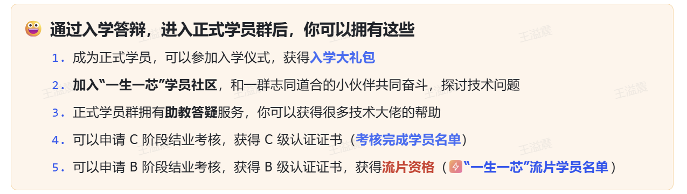

<div align="center">

# 太原理工大学先进计算机系统实验室（ACSL）过渡讲义

>
# 并轨

</div>

自寒假结束，我们的讲义越来越靠近一生一芯的官方讲义，有不少地方也需要大家直接跳转进行学习。现在也终于到了正式宣布“并轨”消息的时候了。

往后我们将不再或极少提供如往常一般的“特供”讲义，而是将学习的自由交还给你们。但这并不是说我们完全不再提供帮助，我们的帮助仅仅在形式上发生了变化，将由讲义转变为分享会。

既然已经并轨，自然也就无需区分基础部分和拔高部分，以下是本周的学习任务：

# E4——手册行为和编码规范

对于C语言手册和`RISC-V`手册来说，它们都是用于描述规范的手册。以大家更为熟悉的`RISC-V`手册为例，它并不告诉你处理器的具体设计，而是规定你的处理器应当实现什么样的功能，是对实现的约束。而像是我们在`Linux`中使用的`man`命令查看的手册，其告诉我们的仅仅是如何使用某程序（命令），是对使用的约束。

于是通过不完全归纳法，我们可以将手册大致分为两类：标准手册和使用手册，或者说规范实现类手册和规范使用类手册。

> [!TIP]
> # C语言标准规范
>
> 阅读一生一芯官方讲义——[手册行为和编码规范](https://ysyx.oscc.cc/docs/2407/e/4.html#%E6%89%8B%E5%86%8C%E8%A1%8C%E4%B8%BA%E5%92%8C%E7%BC%96%E7%A0%81%E8%A7%84%E8%8C%83)，大致了解C语言标准手册是如何规范其实现（如何规范编译器实现）的，并完成其中的练习。

> [!TIP]
> # RTFM or STFW
>
> 阅读C99标准中`6.3.2.1 Lvalues, arrays, and function designators`部分，并尝试自行`STFW`，然后尝试从C语言标准的角度解释为什么以下代码都是正确的。完成后你还可以思考为什么我们在此时`STFW`要远远优于`RTFM`。
>
> ```C
> #include <stdio.h>
>
> void f(char* str){
>     printf("%s\n", str);
> }
>
> typedef void (F)(char*);
> F *func = &f;
>
> int main(){
>     (&f)("first");                // 
>     func("second");
>     (*func)("third");
>     (*f)("fourth");
>     (**********func)("fifth");
>
>     return 0;
> }
> ```
>
> ## 支持GUI输入输出的程序
>
> 在`支持GUI输入输出的程序`之前，请先完成PA0并获取一生一芯的框架代码，[PA0链接](https://ysyx.oscc.cc/docs/ics-pa/PA0.html)。

> [!TIP]
> # minirvEMU运行EMU
>
> 阅读[支持GUI输入输出的程序](https://ysyx.oscc.cc/docs/2407/e/4.html#%E6%94%AF%E6%8C%81gui%E8%BE%93%E5%85%A5%E8%BE%93%E5%87%BA%E7%9A%84%E7%A8%8B%E5%BA%8F)，为minirvEMU添加图形显示功能
>
> 至此，E4阶段结束
>
# E5——STFW \+ RTFM搭建Verilator仿真环境

## RTL仿真

阅读[RTL仿真\(Simulation\) \- 功能验证](https://ysyx.oscc.cc/docs/2407/e/5.html#e5-%E4%BB%8Ertl%E4%BB%A3%E7%A0%81%E5%88%B0%E5%8F%AF%E6%B5%81%E7%89%87%E7%89%88%E5%9B%BE)，完成至`打印并查看波形`。

# TimeLine

既然后续我们不再提供“特供”讲义，那么我们就有必要给出一些进度参考：

- 第四周（本周）：本讲义内容。

- 第五周：

    - 完成E5 [RTL仿真\(Simulation\) \- 功能验证](https://ysyx.oscc.cc/docs/2407/e/5.html#rtl%E4%BB%BF%E7%9C%9F-simulation-%E5%8A%9F%E8%83%BD%E9%AA%8C%E8%AF%81)部分全部内容。

    - 中间部分涉及数字后端知识，可以作为拓展知识了解，暂时无需深究，赶进度可跳转至[若干代码风格和规范](https://ysyx.oscc.cc/docs/2407/e/5.html#%E8%8B%A5%E5%B9%B2%E4%BB%A3%E7%A0%81%E9%A3%8E%E6%A0%BC%E5%92%8C%E8%A7%84%E8%8C%83)继续学习。

    - 完成E5 NJU数电实验的实验二、实验三和实验六。

- 第六周：

    - 完成全部E5内容。

- 第七、八周：

    - 完成PA1。

    - 报名入学答辩。

    - 预计四月下旬会有第一批同学报名入学答辩。

# 入学答辩

## 答辩

如果你完成了上述的所有内容，你就可以去申请一生一芯官方的入学答辩了，通过答辩的可以拥有以下，这也是很多人目标的流片的第一步。

**报名之前请先联系你的负责人**。




