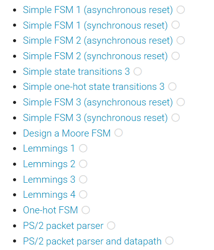
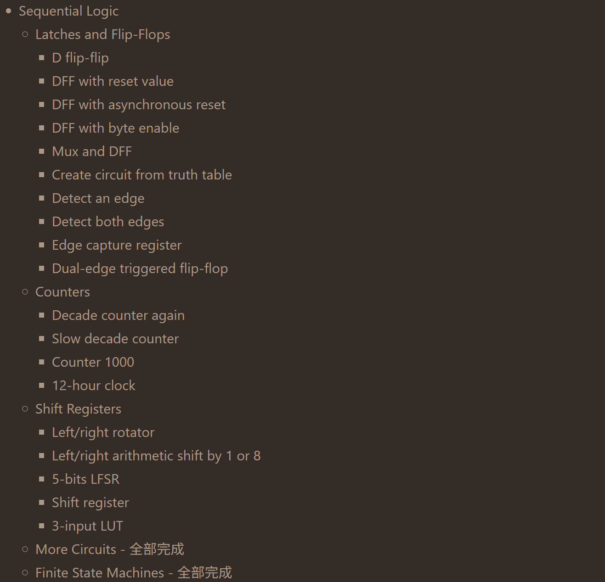
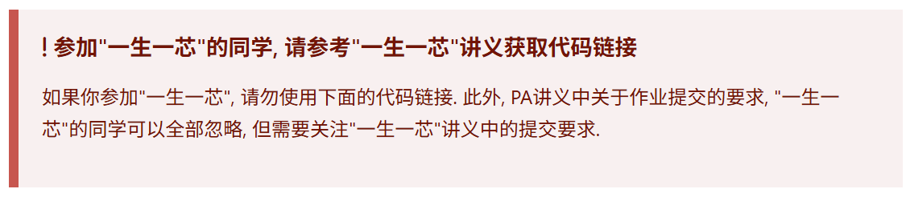

# 太理先研实验室（ACSL）正式学员第二次学习路线

**学习目标**：继续Verilog和LCTHW实践练习，逐步衔接一生一芯官方讲义，学习更为底层的编译流程，最终用C语言完成较为简单的指令集模拟器。

# 数字设计

我们在寒假的时候就学习过状态机的概念，无非就是电路在不同的状态转移罢了，本周我们需要通过Verilog完成状态机的设计。这是数字设计相当困难的一章，思路理不清楚很有可能坐一天也想不出来，这时候就可以试着**画图，**理清楚思路再写这部分代码效果会好很多！并且这一部分是有固定套路的，大家在做了很多道相关题之后，**做笔记归纳总结**，就可以悟出状态机的构建流程了。

同时有的题目网站给出的示例代码并不是特别好，有的时候**完全推翻重新写**会比按照网站给出的示例写快不少，且思路更加清晰。

> [!TIP]
> # Verilog
>
> 本周你需要完成[HDLBits](https://hdlbits.01xz.net/wiki/Main_Page)中的如下任务，这里如果遇到卡住很久的题可以先跳过，同时有限状态机部分题目有很多重复，大家需要对这里有自己的方法和理解，提交你的截图即可。（在这里推荐一个浏览器插件：**沉浸式翻译**，如果看不懂的话，就用这个插件配合学习吧！）
>
> 
>
> 我们培养的是硬件思维，需要头脑中先有电路再下手写代码，这也是为什么我们需要先学习使用Logisim搭建数字电路，再来学习数字设计，虽然我们后面不再使用Logisim进行处理器设计，但Logisim的使用经验应该已经帮助你建立了"电路思维"：数字电路设计只做两件事，"实例化"和"连线"。你接下来使用HDL来设计数字电路时，头脑中也需要将HDL代码和Logisim的使用经验建立关联：你只不过是换了一种方式来设计电路，但本质上还是在进行"实例化"和"连线"的工作，因此你应该能根据你编写的代码想象到电路的逻辑结构，**要记住Verilog的本质是硬件描述语言而不是传统的编程语言。**

# Learn C the hard way
> [!TIP]
> # Learn C the hard way
>本周完成其中的第**19，21\~22，24\~25，27**章（其中遇到卡了很久的题目可以先跳过）。
>
>【Learn C the hard way】：https://wizardforcel\.gitbooks\.io/lcthw/content/preface\.html
>
>将你完成的所有练习放入一个名为`lcthw`的文件夹，并将该文件夹放入作业提交文件夹中。
>
>**该部分的学习实操练习即可，不需要交回附加题。**
>
>——不需交回并不是不重要，而是这部分附加题出的并没有那么好。。。但是此部分学习内容还是很不错的，所以大家学懂这部分的学习内容即可。

# 从源代码到可执行文件（1）

## 预处理

在很久以前，我们就已经知晓了预处理不过是单纯的文本替换而已。预处理主要包含以下工作：

- 头文件包含

- 宏替换

- 去掉注释

- 连接因断行符\(行尾的`\`\)而拆分的字符串

- 处理条件编译`#ifdef`/`#else`/`#endif`

- 处理字符串化操作符`#`

- 处理标识符连接操作符`##`

其他功能相对来说比较容易理解，现在，我们最关心的是编译器如何寻找头文件。

> [!TIP]
> # 编译器如何寻找头文件
>
> `gcc`有一个选项`--verbose`可用于显示编译链接时的详细信息。具体的，你需要自己编写任意程序\(假设为`test.c`\)，并使用`gcc -E test.c --verbose > /dev/null`命令查看编译器从哪里找到了`#include <...>`模式的头文件。
>
# 优先级

当同一个头文件名能够对应多个头文件时，编译器会以什么样的优先级选择包含的那个头文件呢？通过`STFW`和`RTFM`，利用`-I`选项及`--verbose`选项找出同名头文件包含的优先级。

最后，将答案整理为文档，命名为`pheader.md`，并将该文档放入作业提交文件夹中。

## 编译

我们在小学二年级就学过，编译的结果是汇编代码。我们又知道汇编代码都是一堆助记符，是我们恐怖直立猿能够理解的各种符号化表达，因此汇编代码实际上是可读的文本（字符集合）。

编译流程又可以再继续划分：

- [词法分析](https://ysyx.oscc.cc/docs/2407/e/4.html#%E8%AF%8D%E6%B3%95%E5%88%86%E6%9E%90)

- [语法分析](https://ysyx.oscc.cc/docs/2407/e/4.html#%E8%AF%AD%E6%B3%95%E5%88%86%E6%9E%90)

- [语义分析](https://ysyx.oscc.cc/docs/2407/e/4.html#%E8%AF%AD%E4%B9%89%E5%88%86%E6%9E%90)

- [中间代码生成](https://ysyx.oscc.cc/docs/2407/e/4.html#%E4%B8%AD%E9%97%B4%E4%BB%A3%E7%A0%81%E7%94%9F%E6%88%90)

- [编译优化](https://ysyx.oscc.cc/docs/2407/e/4.html#%E7%BC%96%E8%AF%91%E4%BC%98%E5%8C%96)

- [目标代码生成](https://ysyx.oscc.cc/docs/2407/e/4.html#%E7%9B%AE%E6%A0%87%E4%BB%A3%E7%A0%81%E7%94%9F%E6%88%90)

以上超链接能够直接跳转一生一芯E4讲义中的相关小节，你可以阅读相应的内容后再继续接下来的任务。

> [!TIP]
> # 编译优化
>
> 在编译优化领域有个笑话，大致可以简化成这样：
>
> 程序员：用for循环计算1到12345所有数之和并输出。
>
> 编译器：这还用算？
>
> 现在你需要通过编写代码来验证这条笑话。不过在此之前我们并没有学习过`x86`的汇编，因此你需要安装面向`RISC-V`架构的`gcc`，运行命令`apt-get install g++-riscv64-linux-gnu`。
>
> 安装完成后，通过对比`riscv64-linux-gnu-gcc -O0 -S a.c`和其他级别优化生成的汇编代码来验证你的想法。
>
> 完成以后，将你对这个优化的理解写入一份文档中，重命名为`ponder.md`，并将该文档放入作业提交文件夹中。
>
> 未完待续
>
> 下一篇 从源代码到可执行文件（2）将于下周开放
>
> 感兴趣的同学可以继续阅读[一生一芯官方讲义](https://ysyx.oscc.cc/docs/2407/e/4.html#%E4%BA%8C%E8%BF%9B%E5%88%B6%E6%96%87%E4%BB%B6%E7%9A%84%E7%94%9F%E6%88%90%E5%92%8C%E6%89%A7%E8%A1%8C)提前学习
>
# 指令集模拟器

> [!TIP]
> # sEMU
>
> 阅读[一生一芯官方讲义sEMU部分](https://ysyx.oscc.cc/docs/2407/e/4.html#%E6%8C%87%E4%BB%A4%E9%9B%86%E6%A8%A1%E6%8B%9F%E5%99%A8-%E5%8F%AF%E4%BB%A5%E6%89%A7%E8%A1%8C%E7%A8%8B%E5%BA%8F%E7%9A%84%E7%A8%8B%E5%BA%8F)并用**C语言**代码编写`sEMU`模拟器。
>
> 完成后将你的文件或文件夹命名为`sEMU`，并放入作业提交文件夹中。

> [!NOTE]
> # **作业提交**
> 1. HDLBits的截图命名为`Verilog`并放到`姓名-专业班级-Great-15`文件夹中。
>
> 2. `lcthw`文件夹也放在上述文件夹里。
>
> 3. 其他在讲义中提及需要提交的文件按要求进行整理提交。
>
> 4. 如果你学有余力完成了下面的拔高内容，则把文件夹重命名，格式为`姓名-专业班级-NewStar-15`。
>
> 5. 将你的作业压缩为zip格式并提交到[作业提交表单](https://fa45epzd9c7.feishu.cn/share/base/form/shrcnu1t7JRQeiCWwVNb3uDjVDd)。
>
# 拔高内容

## Learn C the hard way

**这是“一生一芯”的必须完成部分如下**：

虽然一生一芯的讲义划定了学习的范围，但想要技术很强的话，我们建议都可以试着去学习。

> [!TIP]
> # Learn C the hard way
>
> 其中的**26、37\-41、43、45\-47不需要学习**，性价比比较低，不推荐学习，**其他内容我们都很推荐学习**，想要技术很强的话，都可以试着去学习，并在其中锻炼自己gdb等debug工具使用和相关能力思维。
>
> 【Learn C the hard way】：https://wizardforcel\.gitbooks\.io/lcthw/content/preface\.html
>
> 将你完成的所有练习放入一个名为`lcthw`的文件夹，并将该文件夹放入作业提交文件夹中。

> [!TIP]
> ## 数字设计
> HDLBITS的最终目标是状态机（FSM）全部完成，如果你对自己的verilog感到自信或学有余力，努力提前去完成他们吧！

 

## 一生一芯课程PA
PA是我们后续学习中非常重要的一部分内容，目前我们已经把PA0相关的基础知识进行了补全，大家**可以去尝试PA0的相关内容学习**，而后面的PA1是一生一芯预学习答辩的主要内容之一，如果你想挑战自己，现在去尝试PA1也是没问题的。

> [!TIP]
># PA0
>https://ysyx\.oscc\.cc/docs/ics\-pa/PA0\.html
>当你发现如下提醒时，阅读该讲义:https://ysyx\.oscc\.cc/docs/2407/e/3\.html获取属于一生一芯的代码框架

## 一生一芯E4阶段讲义

进度较快的你已经有足够的实力与ysyx的官方讲义接轨了，完成ysyxE阶段的学习之后即可参加项目组的预学习答辩，答辩通过即成为ysyx项目组的正式成员，并且收到一份来自项目组的入学大礼包！

**为了帮助大家更好地完成任务，我们还准备了一份`minirvEMU`的框架代码，目前正在内测阶段，对于已经学习到这里的同学可以联系你的负责人获取框架代码。（当然，理解这份框架代码也不容易，你也可以选择自己从0开始写，我们很支持的）**

# E4

E4阶段的讲义看起来非常长，但细细看来，你会发现很多似曾相识的东西，这其实就是我们之前讲义埋下的伏笔了，[一生一芯E4讲义](https://ysyx.oscc.cc/docs/2407/e/4.html)

阅读并跟着讲义完成其中的实操任务，并最终完成`minirvEMU`，**并为其添加图形显示功能**。

如果你继续往后写，到达`支持GUI输入输出的程序`时，请先完成PA0并获取一生一芯的框架代码

