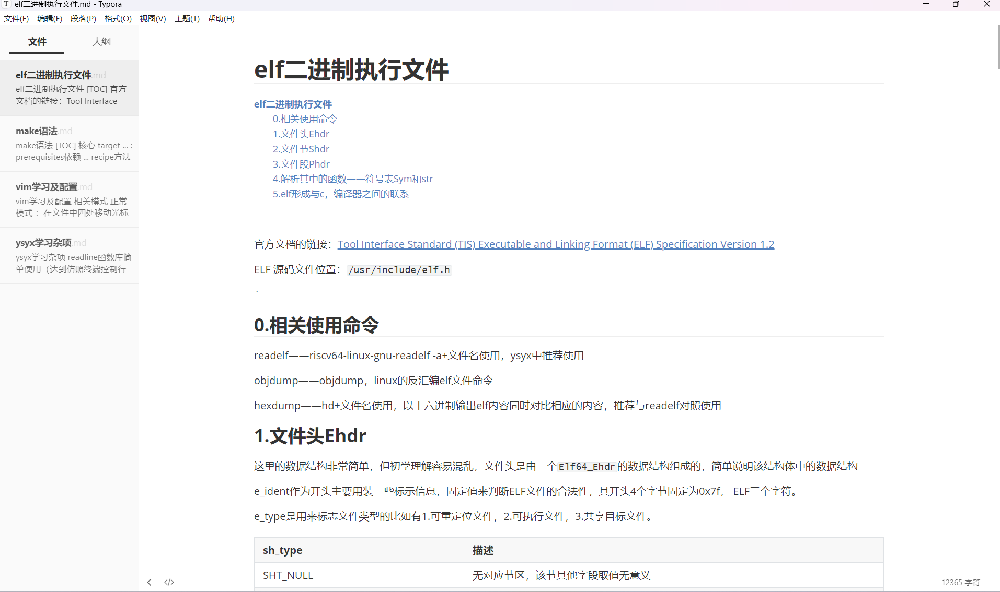
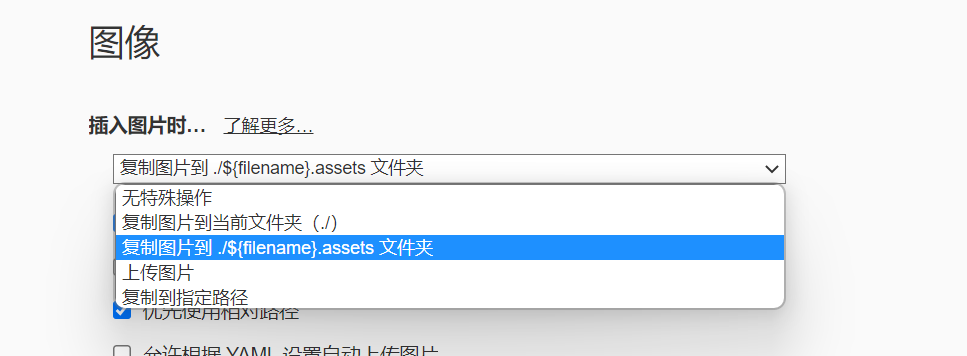
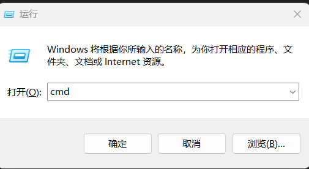
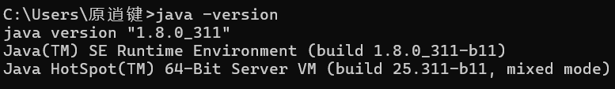
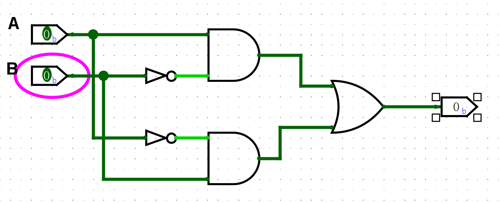
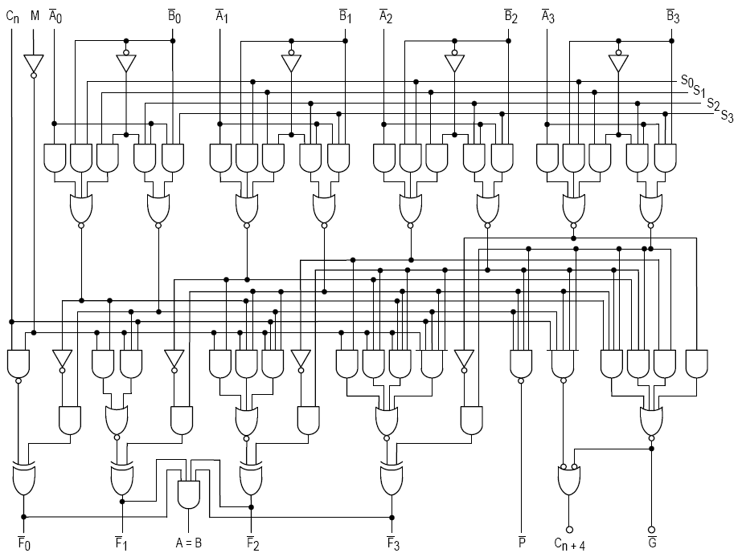
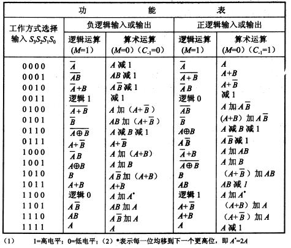

# 太理先研实验室（ACSL）见习学员第一次学习路线

<strong>工欲善其事必先利其器——《论语·卫灵公》</strong>

接下来一个月，我们将进行数字电路基础的学习：数字电路是我们将来学习过程中非常重要的一个基础知识，与之后的数字设计、机组等知识都会进行串联，学好数字电路极为重要，否则将来的学习将会非常吃力。

<strong>但在接下来到寒假的时间，需要大家根据自己的大作业完成情况，空闲时去完善，巩固自己的C语言，这段时间千万不要把C语言完全抛弃，不然之后就不好拾起来了。</strong>

# Markdown（码字神器）

在适应期的时候就有部分同学有记笔记的需求，但手写笔记对于我们的学习来说又太过低效。这里为大家提供一种新的记笔记方式：Markdown

Markdown 是一种轻量级的标记语言，可用于在纯文本文档中添加格式化元素。Markdown 由 John Gruber 于 2004 年创建，如今已成为世界上最受欢迎的标记语言之一。它有以下几个优点：

1. 专注于文字内容；

2. 纯文本，易读易写，可以方便地纳入版本控制；

3. 语法简单，没有什么学习成本，能轻松在码字的同时做出美观大方的排版。

有了 Markdown，就可以轻松<strong>记录笔记</strong>。你可以自己 STFW 寻找 Markdown 教程，这里我们给几个推荐的教程：

- https://markdown.com.cn/
- （交互式）[Markdown Tutorial](https://www.markdowntutorial.com/zh-cn/)

> [!TIP]
> # <strong>记笔记</strong>
>
> Markdown 是一种纯文本格式的标记语言，它本身只是带有特殊符号（如 `<strong>#</strong>`、``、`<strong>-</strong>` 等）的原始文本，不能直接以美观的排版形式显示。要让它变成我们看到的标题、加粗、列表等样式，必须经过一个叫“渲染”的过程，<strong>这里我们推荐使用Typora（群文件有破解版）</strong>或者 VSCode 下的 Markdown Preview  Enhance 插件或者 Office Viewer 插件（这个类似Typora，所见即所得）。之后的笔记就用 Markdown写。包括我们的讲义也都是用Markdown写的

效果展示：

> [!WARNING]
> ## <strong>图片</strong>
>
> 因为 Markdown 文件是纯文本文件，所以用户无法在 Markdown 文件中直接插入图片文件，而是通过在 Markdown 文件中引用文件路径，但你依旧可以通过复制粘贴，手动拖拽的方式来插入图片。

打开Typora左上角的文件 -> 偏好设置 -> 图像。

当你选择复制图片到文件夹时，它会自动在你的md文档当前的目录下新建一个 `${filename}.assets` 文件夹来存储你的图片，每次当你上传图片的时候，图片都会被复制一份放入该文件夹中，这样当你在原来位置删掉图片时，也不会对你的md文档造成影响。

# Logisim

## Logisim<strong>安装和使用</strong>

> [!WARNING]
> ## <strong>Logisim</strong>
>
> Logisim是一款图形化的数字电路设计软件，用户可以通过拖动相应的电路组件来设计数字电路并仿真运行。后续我们使用的是 Logisim-evolution，它是 Logisim 的升级版，提供了更丰富的组件。但为了描述简便，下文我们还是使用`Logisim`来指代这个升级版。

<strong>去群文件里下载windows或者mac对应的压缩包，</strong>解压之后跟着后面的操作来：

<strong>如果你使用Window</strong>

解压后你会看到两个文件`jdk-17_windows-x64_bin.exe`和`logisim-evolution-3.8.0-x86.msi`， 请先运行`jdk-17_windows-x64_bin.exe`配置Java环境（你只需要调整一下下载路径然后下一步即可）， 然后运行`logisim-evolution-3.8.0-x86.msi`进行安装。

<strong>如果你使用Mac OS</strong>：

解压后你会看到两个文件`jdk-17_macos-x64_bin.dmg`和`logisim-evolution-3.8.0.dmg`， 请先运行`jdk-17_macos-x64_bin.dmg`配置Java环境， 然后运行`logisim-evolution-3.8.0.dmg`进行安装。

> [!TIP]
> # <strong>安装Logisim</strong>
>
> 根据上述步骤安装Logisim，安装后, 尝试打开Logisim, 检查软件能否正确运行。

### 注意Java版本

> [!WARNING]
> # 注意自己的Java版本
>
> Logisim 需要 Java16 以上的版本，在这里我们推荐Java17版本。如果有玩 我的世界 等需要java的经历 那么你的java大概率在这之前就已经下载完成了，那么此时需要你去检查一下自己安装的Java版本，请进行如下操作。

### 查看当前Java版本：

#### <strong>方法1：</strong>

`Win + R`-> 输入`cmd` 打开终端。

在终端输入 `java -version`  如果报错 可以尝试`java --version`。

如果你是<strong>Java17</strong>那么会显示。

如果显示上面的内容，那么恭喜你可以直接<strong>跳过Java切换</strong>，进入下一个任务。

如果是下面这种或者不是<strong>17.0.11</strong><strong>可以去参考下方的Java指北</strong>。

如果你和我一样显示<strong> 1.8.0_311 版本或其他非Java17版本，</strong>那么需要切换下载Java16以上版本，我们这里使用 <strong>Java17。</strong>

#### <strong>方法2：</strong>

`Win + R` -> 输入 `control`打开控制面板。
程序 -> 程序与功能。

找到

> [!TIP]
> # <strong>如果你当前 Java 版本不是 Java17 需要切换</strong>
>
> <strong>根据这个</strong><strong>切换JAVA版本指北</strong><strong>，来进行版本的切换。</strong>

## 探索Logisim

安装Logisim以后你一定会想知道这个能做什么，怎么操作。

> [!TIP]
> # 切换中文语言（可选）
>
> 如果你的英文阅读能力尚可，我们还是建议你使用英文语言。如果你希望切换到中文版本，可以通过点击菜单的`File->Preferences`，在弹出的对话框中选择`International`选卡，然后将`Language`设置为`中文`。
>
> 但中文翻译有的词汇使用并不标准，例如将`library`翻译为`图书馆`. 因此后续讲义中介绍Logisim时主要还是给出英文词汇, 并在括号中给出中文版的翻译。

可以参考 <strong>Help(帮助)->Tutorial(教程)</strong>来设计第一个属于你的数字电路！！！

对于一个电路模块来说，输入和输出是非常重要的：输出能够帮助用户直接观察电路的运行结果，而改变输入能够检查电路在各种状态下的行为是否符合预期。简单探索过Logisim后，此处介绍一些常用的输入输出元件：

- 输入元件: Button(按钮), Dip Switch(拨码开关)
- 输出元件: LED, 7-Segment Display(7段数码管)

> [!TIP]
> # RTFM了解元件的功能
>
> 在官方文档的目录中找到`Library Reference(电路元件库参考手册)->Input/Output library(输入/输出)`，阅读上述输入输出元件的功能。

# 数字电路

计算机分为硬件与软件，而数字电路就是计算机硬件的“细胞”和“神经”，所有计算机硬件的核心功能都由数字电路实现。数字电路是用来处理数字信号的电路，而数字信号简单来说是指`0`和`1`这两种离散的信号。这里的`0`和`1`并不是数学意义上的自然数，它是指信号的两种不同状态，为了简单叙述，就分别称它们为`0`和`1`。为了和数学上的`0`和`1`区分开来，有时候也将上面两种状态称为`逻辑0`和`逻辑1`。

与数字信号相对的是模拟信号，模拟信号通常是连续的，例如电流，电压等都属于模拟信号。用来处理模拟信号的电路称为模拟电路，不过在处理器设计中，我们很少关注它。

我们后期研究的处理器芯片本质上也是处理`0`和`1`这两种信号的芯片。要学习处理器芯片设计，数字电路的知识是基础。而要学习数字电路，就是需要学习信息在数字电路中是如何表示，处理和存储的。具体地, 你将会了解:

- 如何表示 - 数字信号`0`和`1`在数字电路中的物理含义。
- 如何处理 - 门电路和组合逻辑电路的工作原理。
- 如何存储 - 时序逻辑电路的工作原理。

<strong>真正领略数字电路的世界</strong>

> [!WARNING]
> 数电学习内容量大，纸质笔记极其不方便且效率低，所以我们要求大家用md语法记笔记，非常建议做好笔记，以便以后回头看它，别让未来的自己不能共情现在的自己。

> [!TIP]
> # <strong>必做任务</strong>
>
> 你可以先去看以下视频的
>
> - **第一章内容01-21**<strong>（其中的卡诺图化简，相关专业的同学可能需要为了考试而学习它，但在"一生一芯"这种面向动手实践的项目中，你几乎不会使用它，所以了解即可）</strong>
> - **第三章内容41-43**<strong>（仿真环节用你的Logisim来亲自实践一下）</strong>
>
> https://www.bilibili.com/video/BV1A3411z7Mf?spm_id_from=333.788.videopod.episodes&vd_source=4ec31615294fd2510d5fd40f0183648f
>
> 第二章部分内容选学，用来了解电路很底层的知识，对我们来说没有必要去学，想要去了解材料TTL，模电等相关知识的可以去看一看（该部分涉及模电，难度较高，去了解也要花不少时间，且对一生一芯的后续学习不是必要的）。

该课程非常适合零基础的同学，讲的很细很好，同时课程搭配上如下的multisim实践仿真环节讲解，但是注意：

> [!WARNING]
> # 注意事项
>
> - multisim软件不需要大家安装和使用（我们直接使用logisim），大家<strong>只需要跟着课程学习电路搭建即可，</strong>也需要你自己去Logisim中实现自己的想法。
> - 课程中的仿真环节（即用multisim搭建电路的环节）看懂电路之后就可以跳过，仿真演示不需要全部看，我们的重心不在这里。
>     - 如下视频中截图的示例，只需要搞懂这个电路有什么效果即可，各器件名称比如“74LS00D”等**不需要学习**<strong>。</strong>

## 初试Logisim

> [!TIP]
> # <strong>简单的数电练习</strong>
>
> 这是一个非常简单和基础的数电逻辑门的搭建结果，请参照所给示例用Logisim搭建出来并给出它的<strong>真值表</strong>，尝试自己分析该电路的效果与作用。
>
> 将你们用Logisim搭建的电路命名为`main`复制到作业提交的文件夹中，之后我们还会要求你多次提交这个文件。
>
> 真值表要求写到纸上，拍照，<strong>图片命名为</strong>`简单的数电练习`。
>
> 如果觉得熟悉的话，可以将这个作业的图片重命名为他的正确名字。

# 作业提交

> [!NOTE]
> # <strong>作业提交</strong>
>
> 1. 提交你们用Logisim搭建的电路: 提交保存后的`main.circ`文件即可，并将这个文件复制到`姓名-专业班级-Great-6`文件夹中。
> 
> 2. <strong>数字电路部分</strong>需要提交你的<strong>Markdown</strong>笔记，也放在上述文件夹里并进行压缩。
> 
> 3. 如果你学有余力完成了下面的拔高内容，则把文件夹重命名，格式为`姓名-专业班级-NewStar-6`。
> 
> 4. 将你的作业压缩为zip格式并提交到<strong>见习学员第一周</strong><strong>提交表单</strong>中。
> 

# 拔高内容

> [!WARNING]
> <strong>千万不要用AI帮你化简逻辑表达式。</strong>

> [!TIP]
> # 进阶练习
>
> 更近一步吧，我们来增加一点点难度！
>
> 依旧是给出对应的真值表！

## 知识拓展

这是<strong> 74181集成电路</strong>内部的组合逻辑电路，这是一个简单的四位ALU单元。

> [!NOTE]
> # 什么是ALU单元
>
> ALU是计算机处理器中执行所有算术和逻辑操作的部件。它是执行计算的中心，可以执行加法、减法、乘法、除法等算术操作。

我们之后会"手搓"一个ALU单元，但只是一个基础的简单的 ALU 单元，并没有74181集成电路复杂，大家可以当兴趣了解。

74181集成电路，就是基于刚刚写的拔高的加强，仔细观察可以发现在74181集成电路中有很多<strong>复用</strong>刚刚拔高中的基础逻辑元件，这依旧是实例化思想的体现。

这是74181集成电路的功能表，可以通过四位信号来实现16种不同的逻辑功能。
以正逻辑为例，B3～B0和A3～A0是两个操作数，F3～F0为输出结果。C-l表示最低位的外来进位，Cn+4是7418l向高位的进位；P、G可供先行进位使用。M用于区别算术运算还是逻辑运算；S3～S0的不同取值可实现不同的运算。
例如，当M=0，S3～S0=0110时，74181作算术运算。
