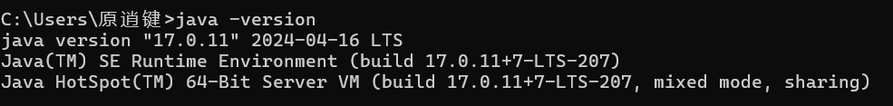

# 切换Java版本

#### 切换Java环境版本（如果显示为17或以上版本可以忽略这部分）

##### 1\.删除Path 路径

我以Win11操作系统做演示
**打开设置 \-\> 系统 \-\> 系统信息**

**打开高级系统设置 \-\> 环境变量 \-\> 点击Path \-\> 点击编辑**

然后删除**所有**的javapath 

像这些

##### 2\.给Path添加变量

点击编辑

添加如下内容

%JAVA\_HOME%\\bin

%JAVA\_HOME%\\jre\\bin

##### 3\.创建系统变量

###### 1\.创建 CLASSPATH

变量名： CLASSPATH

变量值    \.;%JAVA\_HOME%\\lib;%JAVA\_HOME%\\lib\\tools\.jar
注意不要把 空格 复制进去 

效果

###### 2\.创建 JAVA\_HOME

变量名：JAVA\_HOME

变量值：%JAVA\_HOME17% 或者 %JAVA\_HOME8%
完成所有步骤后 可以通过改变这个变量的变量值 切换 java8 或 java 17

###### 
3\.创建 JAVA17 JAVA8 路径

重复创建操作 
**注意！！！**
JAVA\_HOME17 

JAVA\_HOME8

两个变量对于的内容为 你java的 jdk文件的路径

最终效果

**成功了！！！**

最后你就可以通过切换JAVA\_HOME的值来实现 Java8 和Java17 的丝滑切换 ~~（我的世界Java模式丝滑切换bushi）~~

更详细内容请参考https://www\.cnblogs\.com/interdrp/p/17068514\.html

