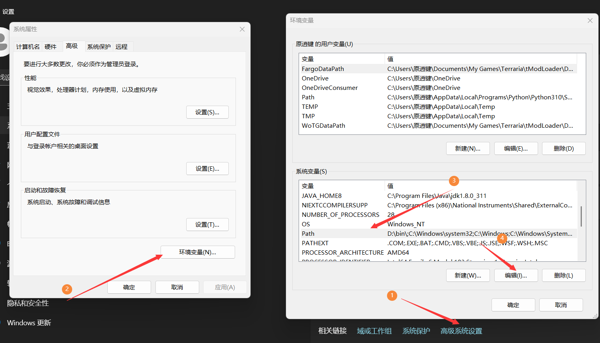
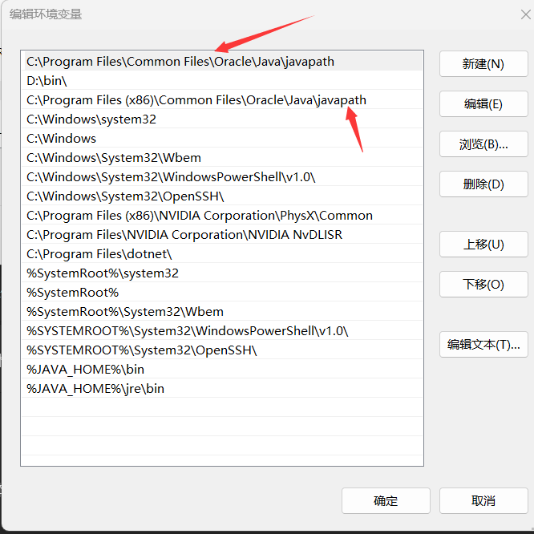
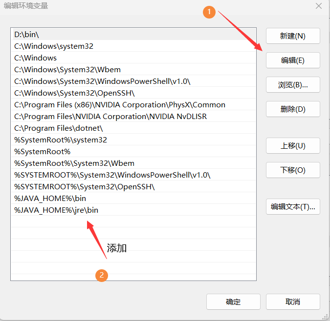
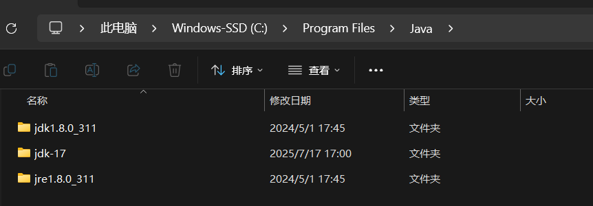

# 切换Java版本

#### 切换Java环境版本（如果显示为17或以上版本可以忽略这部分）

##### 1.删除Path 路径

我以Win11操作系统做演示
<strong>打开设置 -> 系统 -> 系统信息</strong>

<strong>打开高级系统设置 -> 环境变量 -> 点击Path -> 点击编辑</strong>

然后删除<strong>所有</strong>的javapath 

像这些

##### 2.给Path添加变量

点击编辑

添加如下内容

%JAVA_HOME%\bin

%JAVA_HOME%\jre\bin

##### 3.创建系统变量

###### 1.创建 CLASSPATH

变量名： CLASSPATH

变量值    .;%JAVA_HOME%\lib;%JAVA_HOME%\lib\tools.jar
注意不要把 空格 复制进去 

效果

###### 2.创建 JAVA_HOME

变量名：JAVA_HOME

变量值：%JAVA_HOME17% 或者 %JAVA_HOME8%
完成所有步骤后 可以通过改变这个变量的变量值 切换 java8 或 java 17

###### 3.创建 JAVA17 JAVA8 路径

重复创建操作 
<strong>注意！！！</strong>
JAVA_HOME17 

JAVA_HOME8

两个变量对于的内容为 <strong>你java的 jdk文件的路径</strong>

最终效果

<strong>成功了！！！</strong>

最后你就可以通过切换JAVA_HOME的值来实现 Java8 和Java17 的丝滑切换 （我的世界Java模式丝滑切换bushi）

更详细内容请参考https://www.cnblogs.com/interdrp/p/17068514.html
