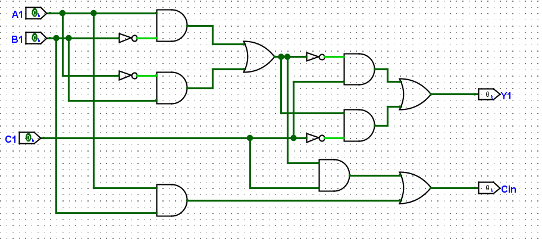
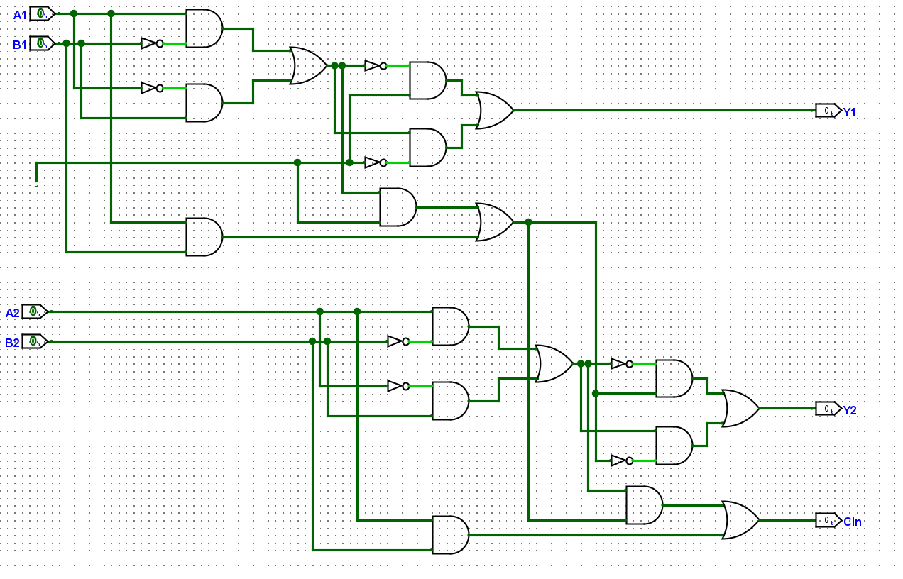
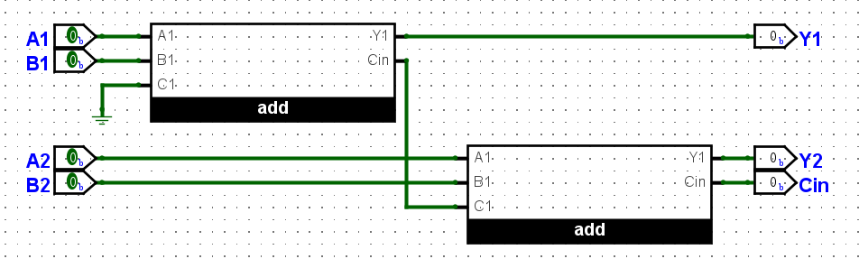
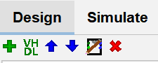
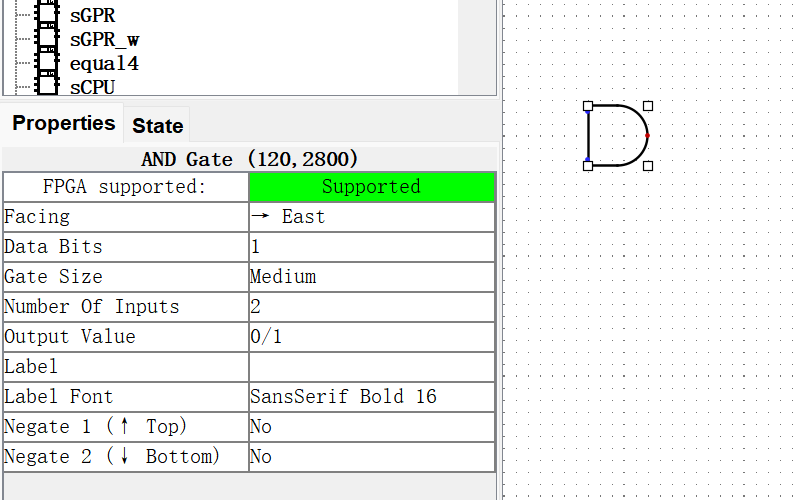
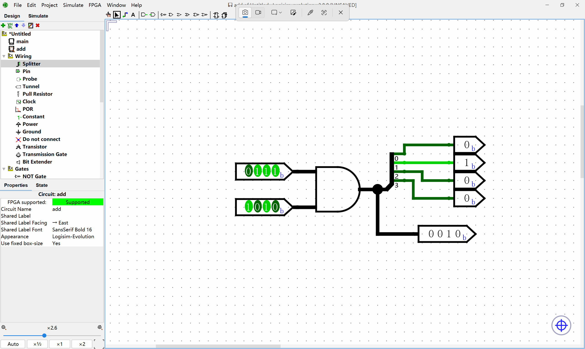
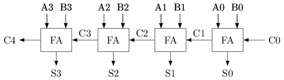
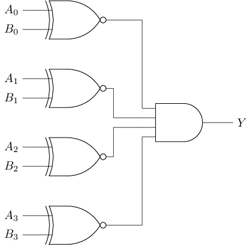
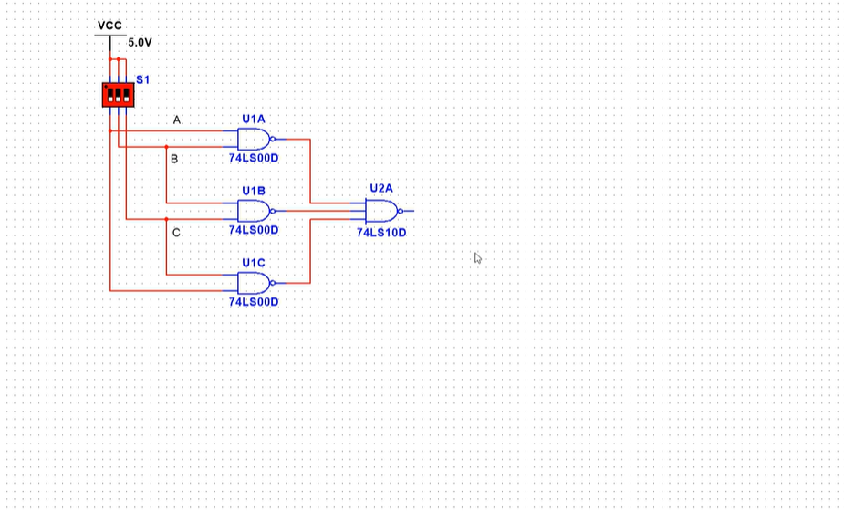

# 太理先研实验室（ACSL）见习学员第二次学习路线

碎碎念：大家学完上周的学习内容后，已经学到了**进制转换，布尔代数，逻辑图波形图**等重要知识点，这些知识点对大家大二一些**学业**的学习也很有帮助，比如：**离散数学**等科目；同时也对后续我们的学习奠定了基础作用，所以好好学还是很重要的，别等到了寒假，要用到数电知识的时候，发现自己学不懂，前置知识都是空白，那就是亡羊补牢了。

本周我们将接触数电比较重要的一块知识，学会用简单门电路搭建很多抽象级更高的部件：加法器，编码器，译码器；这块知识在之后的实践部分还是很重要的，**你能知道自己在搭建什么样的电路。**

这周的任务会比较重，我们将对上周学过的数电知识进行应用，通过 Logisim 来将其搭建出来。这周你可能会频繁地使用卡诺图化简，真值表，逻辑表达式化简。如果你使用的卡诺图化简，这里给大家推荐一个卡诺图化简在线网站 [卡诺图化简网站](https://sublime.tools/zh/%E5%8D%A1%E8%AF%BA%E5%9B%BE/) 。

虽然我们对卡诺图化简等不做要求，但我们还是鼓励同学能够自己手动化简，去独立思考一遍其中的逻辑。

禁止使用AI进行逻辑表达式化简，使用AI节省思考的时间是舍本逐末的学习方式

# 一些Logisim的小技巧

## 实例化思想

类似于C语言部分学过的函数，实例化思想是将你搭建的电路包装成一个一个的子电路模块，来供之后的使用，避免用户重复搭建相同的电路，相应电路只需要设计一次, 后续即可反复实例化。

举个例子：



上面是你搭建出来的一个电路，当你要重复使用这段电路来搭建更复杂电路的时候时，你是要选择：

1、重复连线，最终得到一个非常复杂的线路图，甚至看不清楚连接情况。




2、还是说要应用实例化思想，将上述电路包装成一个类似于C语言函数一样的模块，重复使用：



相信各位自有评定。

每次新建元件的时候，点击**最左边的绿色按钮**新建电路模块，在不同的模块构建不同的电路，这时候你就可以在之后的电路搭建中运用你之前搭建的电路，也能看到最开始搭建的电路有3个输入，2个输出，对应的原件也有3个输入，2个输出，端口也是一一对应的，使用的时候只用简单的拖出来即可。




## 尽量使用实例化电路

**实例化**的思维方式**非常重要**！！！在我们之后的学习和Verilog代码的编写过程中都离不开实例化，所以大家一定要熟悉实例化这种思想，体会实例化的便利！

1. 如果某个层次的设计细节很多，很难把结构示意图话清楚，就可以考虑将这部分逻辑封装成一个模块，将原本复杂的功能抽象成一些接口，有问题直接进入模块内部考虑即可

2. 模块的接口不适合过于复杂。当然，这里的复杂指的是成百个接口这种数量级别，在各位F阶段的学习，这几乎是不可能的

3. 可以在一个设计中被多出使用，也可以被封装成模块。例如：译码器，多路选择器，寄存器堆，RAM等。然而，这些很多已经被logisim给大家封装好了，甚至调试好了。正因为大家缺少了这部分的锻炼，才会导致在真正设计复杂一些的模块的时候完全没有模块化的思想，进而导致学习举步维艰。

4. 对于分布在两个模块中的组合逻辑电路，其之间的交互应该尽量使单方向流动，最多时一去一回的。如果数据在两个模块的组合逻辑之间往返多次，就应该审视一下这里的模块划分是否合理了。不过，这个情况应该会更容易出现在大家设计能执行所有指令的cpu中，就minirv来说，可能性还是比较小的。

5. 然而，即使如此，依旧还是强调模块化的重要性。合理的模块化可以让你的电路更加清晰，也能让你的debug简易化，针对化

## 元件

点击选中门电路，屏幕左下角的`Properties`窗口会显示该电路的具体信息，你可以根据使用需求更改它，



比如当一个与门的`数据位宽(Data Bits)`设置为`4`时，表示每个输入端口可以接受一个4位信号，得到的结果是这两个四位信号每一位各自进行与运算得到的4位输出



如果你需要将一个多位信号分成多个1位信号，或者将多多个1位信号合并为一个多位信号，这就需要用到`Splitter(分线器)`，你可以在Logisim元件库的`Wiring(线路)`类别下找到它，具体使用方式请RTFM。

# 数字电路

# 注意事项

- 视频只是辅助学习知识点，最终以实践为主

- multisim软件不需要大家安装和使用（我们直接使用logisim），大家**只需要跟着课程学习电路搭建即可，**也需要你自己去Logisim中实现自己的想法

- 课程中的仿真环节看懂电路之后就可以跳过，仿真演示不需要全部看，我们的重心不在这里

    - 如下视频中截图的示例，只需要搞懂这个电路有什么效果即可，各器件名称比如“74LS00D”等**不需要学习**


**类似于这样的集成元件也不需要听，直接跳过即可**


## 组合逻辑电路

有了门电路后，我们就可以通过多个门电路的组合来搭建一些在数字电路中常用的模块了。

### **加法器\(Adder\)**

加法是算术运算的基础，因此需要考虑如何通过门电路实现加法。首先考虑1位加法器。加法的输入是两个加数，输出和`S`\(sum\)；加法的结果可能会产生进位，为了不丢失这部分信息，还需要输出进位`C`\(carry\)。根据加法运算的规则，我们很容易列出1位加法器的真值表：

具体地，当且仅当两个加数不同时，和为`1`；当且仅当两个加数都为`1`时，进位为`1`。根据真值表，我们可以得到`S`和`C`的逻辑表达式：`S = A ^ B`，`C = A & B`。

考虑多位加法器，由于低位产生的进位需要参与到高位的加法运算过程，因此我们需要设计一种新的加法器，让其能将从低位传播过来的进位作为输入：具体地，这种加法器有3个输入`A`，`B`，`Cin`，其中`Cin`表示从低位传入的进位；有2个输出`S，Cout`，其中`Cout`表示加法运算产生的进位输出。为了与上文的加法器区别开来，这种输入有进位的加法器称为全加器\(Full Adder, FA\)，上文介绍的输入无进位的加法器称为半加器\(Half Adder, HA\)。

# 搭建1位全加器

你可以先观看以下视频的**第三章内容44****。**

https://www\.bilibili\.com/video/BV1A3411z7Mf?spm\_id\_from=333\.788\.videopod\.episodes\&vd\_source=4ec31615294fd2510d5fd40f0183648f

然后在Logisim中通过门电路搭建一个1位全加器。搭建后，通过仿真检查你的方案是否正确。

有了全加器之后，我们就可以用它来搭建多位加法器了。例如，下图展示了一个4位加法器的电路结构。可以看到，多位加法器的工作原理和小学学习的多位数加法的计算过程很类似，都是从低位到高位逐位计算，只不过小学学习的是十进制加法，这里讨论的是二进制加法。



# 搭建4位加法器

记得最开始的提到的小技巧吗，现在你就要用上它了，尝试实例化4个1位全加器后，连接搭建一个4位全加器，并用一个LED灯指示加法结果是否产生进位。搭建后，通过仿真检查你的方案是否正确，并体会实例化思想的重要性与便捷性。

### 比较器\(COMP\)

比较器用于检查两个输入的每一位是否完全一致。由于异或门\(和同或门\)已经具备比较1位数据的功能，因此可通过异或门\(和同或门\)搭建多位数据的比较器。下图是一个4位比较器的电路结构图：




# 搭建4位比较器

你可以通过观看以下视频的**第三章内容45****。**

https://www\.bilibili\.com/video/BV1A3411z7Mf?spm\_id\_from=333\.788\.videopod\.episodes\&vd\_source=4ec31615294fd2510d5fd40f0183648f

然后尝试在Logisim中通过门电路搭建一个4位比较器，然后通过两组输入对应两组数据来判断是否相等，若相等，则点亮一个LED灯。搭建后，通过仿真检查你的方案是否正确。

### 编码器\(Encoder\)

编码器\(encoder\)用于将**独热码**转换成相应的二进制数值。

# 独热码是什么

输入的第 n 位为`1`，其他位为`0`。由于该输出仅有1位为`1`，所以也叫做“独热码”（one\-hot）。

具体地，编码器有 $ 2^n $位输入，`n`位输出，如果输入为独热码，且第 x 位为1，则输出 x 的二进制数值；如果输入不为独热码，则输出是未定义的。

例如, 一个4\-2编码器有4位输入，有2位输出，其真值表如下。下表在输入不为独热码时，输出为，表示输出**未定义\(undefined\)**，可为任意值。

# 理解未定义的输出

有一些运算或模块需要满足一定的前提条件，才能得到有意义的输出。一个例子是数学上的除法运算。你多少会听说过类似的说法：除数为`0`时，是不能除的。这里的"不能除"这三个字其实是自然语言，并不是数学系统中的语言。如果用数学语言来描述，"除数不为`0`"是进行除法运算的前提条件，当除数为`0`时，这个前提条件不再成立，此时无法定义出一个正确且有意义的计算结果，因此也称结果是未定义的。

上述编码器的例子也是类似的，"输入为独热码”是编码器正确工作的前提条件，当输入不为独热码时，这个前提条件不再成立，此时无法定义出一个正确且有意义的输出。

这背后其实隐含着一种约定：如果编码器的使用者希望编码器能输出正确的结果，就需要保证"输入为独热码"的前提条件得到满足；反之，如果不满足这个前提条件，那就算是编码器的使用者违反约定，此时编码器的输出是无意义的，如果后续电路对这些无意义的输出进行处理，引发的结果由编码器的使用者承担。

具体到数字电路层次，编码器的输出信号要么为`0`，要么为`1`。但在输出结果未定义的情况下，无论输出信号取什么值，都是不具备实际含义的。既然如此，编码器的设计者就可以为这些未定义情况下的输出信号取任意值，因为根据上述的使用约定，编码器的使用者不应该让后续电路处理那些未定义的输出信号。

# 搭建16\-4编码器

你可以先观看以下视频的**第三章内容46\~47****。**

https://www\.bilibili\.com/video/BV1A3411z7Mf?spm\_id\_from=333\.788\.videopod\.episodes\&vd\_source=4ec31615294fd2510d5fd40f0183648f

尝试在Logisim中通过门电路搭建一个16\-4编码器。搭建后，通过仿真检查你的方案是否正确。

上述编码器要求使用者保证输入是独热码，如果希望在输入不为独热码的时候仍然输出有效的信息，则需要使用另一种编码器——优先编码器\(priority encoder\)。优先编码器有$ 2^n $位输入，`n`位输出，和上文介绍的编码器不同，优先编码器允许输入信号中出现多个`1`，此时最高位的`1`将被优先编码。因此，如果输入不全为0，则输出最高位的`1`的位置；如果输入全为0，则输出是未定义的。

例如，一个4\-2优先编码器有4位输入，有2位输出，其真值表如下。


# 搭建4\-2优先编码器

根据上述真值表，尝试在Logisim中通过门电路搭建一个4\-2优先编码器。搭建后，通过仿真检查你的方案是否正确。

思考一下，普通编码器和优先编码器有什么不同。

# 优先编码器的扩展

16\-4优先编码器有16位输入，4位输出。尝试实例化若干个4\-2优先编码器，并添加少量门电路，从而实现16\-4优先编码器的功能。搭建后，通过仿真检查你的方案是否正确。

tips：可以尝试先实例化4\-2优先编码器实现8\-3优先编码器，再通过实例化8\-3优先编码器实现16\-4优先编码器

如果对于如何搭建毫无思路，想想真值表以及逻辑表达式吧！！！

### 译码器\(Decoder\)

译码器与编码器的功能正好相反，是一种将`n`位输入转换成最多$ 2^n $种不同输出的电路。一类常见的译码器是 n选1译码器\(1\-of\-n decoder\)，它有`n`位输入，$ 2^n $位输出。例如：一个2\-4译码器有2位输入，有4位输出，其真值表如下：

# 搭建2\-4译码器

你可以通过观看以下视频的**第三章内容49****。**

https://www\.bilibili\.com/video/BV1A3411z7Mf?spm\_id\_from=333\.788\.videopod\.episodes\&vd\_source=4ec31615294fd2510d5fd40f0183648f

尝试在Logisim中用门电路搭建一个2\-4译码器。搭建后，通过仿真检查你的方案是否正确。

# 译码器的拓展

3\-8译码器有3位输入，8位输出。尝试**实例化**若干个2\-4译码器\(具体数量交给你的思考\)，并添加少量门电路，从而实现3\-8译码器的功能。搭建后，通过仿真检查你的方案是否正确。

另一类常见的译码器是转码器\(code translator\)，它可以按照指定的规则将一种编码的输入转换成另一种编码的输出。和n选1译码器不同，转码器不要求输出中最多包含1个`1`。

转码器的一个常见应用是七段数码管译码器\(7\-segment decoder\)。七段数码管是一个由7段发光二极管按"8"字型排列组成的输出元件，其示意图如下图所示。图中用字母a\-g分别标识每一段发光二极管的位置，只要某控制信号有效，相应的发光二极管就会被点亮。图中还有一个用h标识的小数点，在一些需要使用小数的场景会使用。

```Plain Text
a
  ---
f| g |b
  ---
e|   |c
  ---    .h
   d
```

七段数码管译码器的功能是将一组4位的输入信号解析为二进制整数，然后输出一组用于控制七段数码管亮灭情况的控制信号，使得七段数码管可以显示和输入对应的数字。

# 搭建七段数码管译码器（0）

你可以通过观看以下视频的**第三章内容50****。**

https://www\.bilibili\.com/video/BV1A3411z7Mf?spm\_id\_from=333\.788\.videopod\.episodes\&vd\_source=4ec31615294fd2510d5fd40f0183648f

尝试在Logisim中通过门电路搭建一个七段数码管译码器，它有4位输入和8位输出，分别与拨码开关和七段数码管相连。七段数码管译码器支持十进制数字的显示，即当输入对应0\-9时，七段数码管显示对应的数字；对于其他输入，七段数码管只显示小数点。搭建后，通过仿真检查你的实现是否正确。

# tips

- 七段数码管元件可在元件库中找到，实例化后，可以通过将鼠标指针悬停在元件的端口上，来查看该端口的功能描述以及找到各个发光二极管对应的端口。

- 可以先通过搭建4\-16译码器，使输入的信号生成一组独热码，然后再通过一层或门来分别决定每个发光二极管在哪些输入的情况下应该点亮。

# 搭建七段数码管译码器（1）

尝试在Logisim中通过门电路搭建一个支持十六进制数字的七段数码管译码器。和上述的十进制数字相比，当输入对应10\-15时，七段数码管分别显示A，b，C，d，E，F。搭建后，通过仿真检查你的实现是否正确。

### 多路选择器\(MUX\)

多路选择器可以根据控制端的输入来从多个数据端中选择一路进行输出。多路选择器也称"多路复用器"，或简称"选择器"。最简单的选择器是"1位2选1选择器"，它可以根据控制端的输入**从两路****`1位`****的数据中选择一路进行输出**。1位2选1选择器的逻辑符号，电路结构和真值表如下:


可以看到，选择器中包含了一个n选1译码器，如果把选择器的控制信号看作地址，这个n选1译码器则生成了相应的选择信号，这组选择信号让被选择的一路数据成功通过与门，未被选择的数据通过与门后将会变成`0`，最后通过一个或门将被选择的数据传递到输出端。

# 搭建1位2选1选择器

你可以参考视频的**第三章51学习**。

b站链接：https://www\.bilibili\.com/video/BV1A3411z7Mf?spm\_id\_from=333\.788\.videopod\.episodes\&vd\_source=4ec31615294fd2510d5fd40f0183648f

尝试在Logisim中通过门电路搭建一个**1位2选1选择器****。**搭建后, 通过仿真检查你的方案是否正确。

在计算机中，选择器是使用频率很高的元件，因为计算机的本质是用于处理数据，而数据的来源和处理方式都很多，因此需要大量的选择器来对数据来源和处理结果进行选择。

# 搭建3位4选1选择器

尝试画出3位4选1选择器的电路结构图，然后在Logisim中通过门电路搭建一个**3位4选1选择器****。**搭建后，通过仿真检查你的方案是否正确。


# tips

- 如果你不理解"3位4选1选择器"的含义, 你需要先仔细阅读上文对"1位2选1选择器"的说明

- 对于数据中的每一位, 都可以复用n选1译码器生成的选择信号进行选择

# 搭建七段数码管译码器（2）

通过**5个拨码开关和1个七段数码管**, 实现如下功能:

其中4个拨码开关当作数据输入，剩下1个拨码开关作为进位计数制的选择，当选择信号为`0`时，七段数码管以十进制方式显示数据；当选择信号为`1`时，七段数码管以十六进制方式显示数据。在输入数据为10\-15时，两种显示方式有所不同。

## 整数的机器级表示

在我们之前学习的二进制表示中\(如果你忘了，那么你之前的笔记就派上用场了\)



在这种表示方式中，每一个二进制位都代表数值的大小，这种表示称为"无符号二进制整数"\(unsigned binary integer\)，简称"无符号数"。显然，在一个n位的无符号数中，最小数是0，最大数是$ 2^n - 1 $。而之前你实现的加法器，其实也是一个无符号数的加法器。

那么，计算机应该**如何表示负数**呢? 我们在数学上表示一个负数，是在一个负号`-`后添加这个负数的绝对值，例如`-5`。既然计算机只能处理二进制，那就需要考虑如何用二进制来对包括负数在内的整数进行编码。一个直接的想法是通过一个二进制位来编码整数的符号位，剩下的二进制位用于编码整数的绝对值。这种表示称为"有符号二进制整数"\(signed binary integer\), 简称"有符号数"。

### 原码\(sign\-and\-magnitude\)

原码是一种直观的编码方式, 最高位表示符号位, **`0`****表示正数, ****`1`****表示负数**, 其余位表示对应真值的绝对值\. 例如:（**注意**这里的0b表示接下来的数据为二进制）

```Plain Text
0b00000111 = 7
0b10000111 = -7
0b00100010 = 34
0b10100010 = -34
```

考虑采用**8位的行波进位加法器**进行原码加法:

# **行波进位加法器（Ripple\-carry adder，简称RCA）**

非常好理解，8位的行波进位加法器是由**8个1位全加器**组合而成，之前你们搭建的4位加法器也能够叫做4位的行波进位加法器，之后的讲义我们会将其简称为`RCA`。

```Plain Text
0b00000111 (7)     0b10000111 (-7)     0b10000111 (-7)    0b00000111 (7)
+0b00100010 (34)   +0b10100010 (-34)   +0b00100010 (34)   +0b10000111 (-7)
-----------        -----------         -----------        -----------
 0b00101001 (41)    0b00101001 (41)     0b10101001 (-41)   0b10001110 (-14)
```

通过上述观察, 我们可以得出以下结论:

- 当两数皆为正数时，可以直接通过 RCA 进行原码加法。

- 当两数为负时，RCA 所得结果与数学意义不符，区别在于符号位。因此，在这种情况下，电路需要对符号位进行特殊处理。

- 当仅有一数为负时，RCA 所得结果与数学意义不符，不仅符号位有可能错误，绝对值也错误。因此，在这种情况下，**不能使用 RCA 进行原码加法**。

事实上，在数学意义上计算第三种情况时，应该让绝对值较大的一方减去另一方，符号取绝对值较大的一方。这意味着，**为了计算原码加法，电路上还需要设计一个减法器，然后根据两数符号和绝对值的情况，选择出正确的处理结果。**

# 搭建4位减法器

根据4位加法器的设计思路，尝试在Logisim中通过门电路搭建一个**4位减法器，**用七段数码管按十六进制显示减法器的两个输入和结果，并用一个LED灯指示减法结果是否产生借位。搭建后，通过仿真检查你的方案是否正确。

# 4位原码加法器

理解原码加法器的工作原理，思考如何用加法器，减法器和多路选择器等部件去搭建一个4位原码加法器。用**Markdown**记录你的思路，并放入作业提交的文件夹。

# 搭建4位原码加法器（选做）

尝试用加法器，减法器和多路选择器等部件，根据自己的思路文档在Logisim中搭建一个4位原码加法器。为了显示符号位，你可以额外实例化一个七段数码管，结果为负数时显示负号`-`，否则不显示。搭建后，通过仿真检查你的方案是否正确。

### 反码\(one's complement\)

反码是另一种编码方式, 它尝试解决原码加法中涉及负数的问题。具体地，对于正数和`0`，其表示与原码一致；对于负数，其表示为相应相反数的原码的按位取反。例如：

```Plain Text
0b00000111 = 7
0b11111000 = -7
0b00100010 = 34
0b11011101 = -34
```

考虑采,8位的RCA进行反码加法：

```Plain Text
0b00000111 (7)     0b11111000 (-7)     0b11111000 (-7)    0b00000111 (7)
+0b00100010 (34)   +0b11011101 (-34)   +0b00100010 (34)   +0b11111000 (-7)
-----------        -----------         -----------        -----------
 0b00101001 (41)    0b11010101 (-42)    0b00011010 (26)    0b11111111 (-0)
```

通过上述观察，我们可以得出以下结论： 

- 当两数皆为正数时，可以直接通过 RCA 进行反码加法。

- 当有一数为负时，RCA 所得结果与数学意义不符，虽然符号位正确，但绝对值部分不正确。

- 特别地，当互为相反数的两数相加时，根据反码的定义，结果总是`0b11111111`。按反码解释，所得结果的真值为`-0`，如果将其看成数学意义上的`0`，则RCA结果正确。

但是，让`-0`作为 RCA 的输入进行计算，则又会得到不正确的结果：

```Plain Text
0b00000111 (7)     0b11111000 (-7)
+0b11111111 (-0)   +0b11111111 (-0)
-----------        -----------
 0b00000110 (6)     0b11110111 (-8)
```

上述例子说明，不能直接使用 RCA 计算反码加法。为了计算反码加法, 一种方式是先将反码转换为真值等价的原码, 然后使用原码加法器计算结果, 再将结果转换为真值等价的反码。

### 补码\(two's complement\)

补码是现代计算机中常用的整数编码方式，它进一步修复了反码计算错误时结果的偏差。具体地，对于正数和`0`，其表示与原码一致；对于负数，其表示为相应相反数的原码的按位取反后加`1`。例如：

```Plain Text
0b00000111 = 7
0b11111001 = -7
0b00100010 = 34
0b11011110 = -34
```

对于n位的补码，最大数是`0b011...11`，对应的真值是 $2^{n-1}$ \- 1，最小数是`0b100...00`，对应的真值是 \-$2^{n-1}$\- 1。在补码中，最小数是一个特殊的数，它不能通过对某个正数进行"取反加1"来得到。以8位补码为例，最大数`0b01111111=127`，对其进行"取反加1", 得到的是`0b10000001=-127`；而最小数`0b10000000=-128`，对其进行"取反加1"，得到的是`0b01111111+1=0b10000000=-128`，与其自身相同。这是因为`128`已经超过了8位补码所能表示的范围。

考虑采用8位的RCA进行补码加法：

```Plain Text
0b00000111 (7)     0b11111001 (-7)     0b11111001 (-7)    0b00000111 (7)
+0b00100010 (34)   +0b11011110 (-34)   +0b00100010 (34)   +0b11111001 (-7)
-----------        -----------         -----------        -----------
 0b00101001 (41)    0b11010111 (-41)    0b00011011 (27)    0b00000000 (0)
```

通过上述观察，我们可以看到，用 RCA 计算补码加法时，即使输入包含负数，RCA所得结果仍然符合数学意义。这意味着，我们也可以用 RCA 来计算补码的减法\. 这是因为在数学意义上，`A-B=A+(-B)`，但我们已经说明了，无论`A`和`B`为何值，RCA 所得结果都符合数学意义，因此有:

```Plain Text
用RCA计算A+(-B) = 数学意义上的A+(-B) = 数学意义上的A-B
```

正是由于可以用加法器计算补码的加法和减法，现代计算机中普遍用补码来表示整数。

为什么通过 RCA 计算补码加法可以得出正确的结果呢？以4位二进制数为例，我们将二进制数按顺时针顺序排列，构成一个**时钟模型**：

```Plain Text
0000 (0)
      (-1) 1111  0001 (1)
   (-2) 1110   ^    0010 (2)
 (-3) 1101     |      0011 (3)
(-4) 1100      +       0100 (4)
 (-5) 1011            0101 (5)
   (-6) 1010        0110 (6)
      (-7) 1001  0111 (7)
              1000 (-8)
```

RCA 是在二进制层次上进行加法，加一个正数，相当于把指针按顺时针方向拨动格；加一个负数，相当于把指针按逆时针方向拨动格。而要让某种编码的加法结果符合数学意义，就要使得该编码对应的真值也按顺时针递增。上图的括号`()`展示了补码的例子，可以看到，只要不跨越`7`和`-8`之间的边界，用 RCA 计算补码加法的结果总是符合数学意义。我们会在下文进一步讨论跨越边界的情况。

```Plain Text
原码                                  反码
              0000 (0)                             0000 (0)
      (-7) 1111  0001 (1)                  (-0) 1111  0001 (1)
   (-6) 1110   ^    0010 (2)            (-1) 1110   ^    0010 (2)
 (-5) 1101     |      0011 (3)        (-2) 1101     |      0011 (3)
(-4) 1100      +       0100 (4)      (-3) 1100      +       0100 (4)
 (-3) 1011            0101 (5)        (-4) 1011            0101 (5)
   (-2) 1010        0110 (6)            (-5) 1010        0110 (6)
      (-1) 1001  0111 (7)                  (-6) 1001  0111 (7)
              1000 (-0)                            1000 (-7)
```

而对于原码和反码，就不满足上述性质。具体地，**原码的编码方式**存在两个问题：

1. 在`0b0000`和`0b1111`之间存在一个不连续的边界，在这个边界的两侧，虽然二进制编码是连续的，但编码对应的真值并不连续，从而使得计算结果与数学意义不符。例如，用原码计算`0+(-1)`时，相当于是让指针指向`0`后，往逆时针拨动一格，结果是`-7`，与数学意义不符。

2. 负数的编码方式让真值按顺时针递减，不满足上文提到的"让真值按顺时针递增"的要求，从而使得计算结果与数学意义不符。例如，用原码计算`(-4)+1`时，相当于是让指针指向`-4`后，往顺时针拨动一格，结果是`-5`，与数学意义不符。

反码通过取反操作让负数对应的真值按顺时针递增，修复了源码的第2个问题。但原码的第1个问题，在反码中仍然存在。例如，用反码计算`0+(-1)`时，相当于是让指针指向`0`后，往逆时针拨动一格，结果是`-0`，与数学意义不符。

补码在反码的基础上，通过编码上的`+1`操作，将负数部分的真值往顺时针转动了1格，进一步修复了第1个问题。

如果想要更深入的了解原码，反码，补码可以参考这两篇知乎和CSDN的文章或者自行去STFW

[知乎跳转点我](https://zhuanlan.zhihu.com/p/118432554) 

[CSDN跳转点我](https://blog.csdn.net/LEoe_/article/details/79096568)

### 溢出检测

回顾上文的分析，即使是补码，表示数值也是有边界的，这个边界的编码连续但真值不连续， 即`0b0111...111`和`0b1000...000`之间的边界，它们分别表示最大数和最小数。如果加法的计算跨越了这个边界，计算所得结果将与数学意义不符。因为对于给定的二进制位数，其表示范围总是有限的，因此必定存在超过表示范围的数值，使得真值的分布无法一直连续。这种计算结果超过编码表示范围的情况，称为"溢出"\(overflow\)。显然，如果计算发生溢出，则所得结果肯定与数学意义不符。为此，通常需要在计算加法的同时，检测结果是否发生溢出。


从时钟模型的角度来看, 跨越不连续边界分两种情况：

1. 在正数部分往顺时针方向拨动指针，跨越到负数部分。

2. 在负数部分往逆时针方向拨动指针，跨越到正数部分。


从数学意义的角度来看, 这两种情况分别对应了：

1. 两个正数相加，结果为负数。

2. 两个负数相加，结果为正数。


从这个视角来看，我们只需要考虑**符号位的加法情况**，即可检查是否发生溢出。符号位的加法也是通过全加器来进行的，因此我们可以考虑全加器的真值表：

此处只列出了真值表的前两项\. 给出两个输入$A_n$$B_n$,和进位输入$C_n$, 根据全加器的逻辑, 可以得到进位输出$C_{n+1}$以及和$S_n$。

要根据两个加数以及和的符号位来判断是否溢出，只需要看$A_n$$B_n$和$S_n$即可。例如，第一种情况相当于是"两个正数相加，结果为正数"，因此未发生溢出；而第二种情况相当于是"两个正数相加，结果为负数"，因此发生溢出。

# 检测补码加法是否发生溢出

尝试列出溢出条件的逻辑表达式，然后在Logisim中在4位加法器的基础上添加溢出判断逻辑。添加后，通过仿真检查你的方案是否正确。

# 作业提交

> 陈浩男学长的碎碎念：本周的拔高内容与适应期期间的一个重要差别是：这里的拔高是大家未来的必做任务，也是一个复习C语言的极佳契机，所以，学有余力的同学一定多多尝试。
> 
> 

# **作业提交**

1. 提交你们用Logisim搭建的电路，提交保存后的** ****`main.circ`**** **文件即可，并将这个文件复制到`姓名-专业班级-Great-7`文件夹中。

2. **数字电路部分**也需要提交你的**Markdown**笔记，也放在上述文件夹里并进行压缩。

3. 如果你学有余力完成了下面的拔高内容，则把文件夹重命名，格式为`姓名-专业班级-NewStar-7`。

4. 将你的作业压缩为zip格式并提交到[**见习学员第二周**](https://fa45epzd9c7.feishu.cn/share/base/form/shrcnQPGExV9aCGbSAkKNnKqILd)[**提交表单**](https://fa45epzd9c7.feishu.cn/share/base/form/shrcnQPGExV9aCGbSAkKNnKqILd)中。

考虑到本周有四级考试，本周作业提交截止时间：**12月14号晚23:00**（如果因为自身原因未完成本周作业，在表单**请假说明**一栏填写原因，并写上你的预计提交时间即可）

# 拔高内容

# 巩固你的C语言

虽然我们会有很长一段时间的学习重心都不会放在C语言了，但并不意味着我们对C语言的学习就结束了。在未来的预学习答辩中，C语言的进阶内容是一大考核难点，以及随后会接触到的PA项目同样也需要我们对C语言熟练使用。因此，借着拔高的任务，好好复习C语言

【Learn C the hard way】：https://wizardforcel\.gitbooks\.io/lcthw/content/preface\.html

完成其中的**练习1\~10**。

将你完成的所有练习放入一个名为`lcthw`的文件夹，并将该文件夹放入作业提交文件夹中。