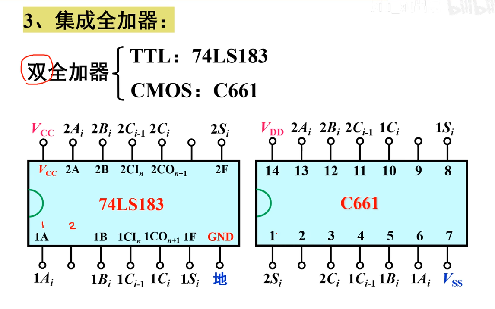
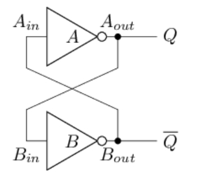

# 太理先研实验室（ACSL）见习学员第三次学习路线

碎碎念：大家学完上周的学习内容后，已经学到了<strong>简单门电路搭建，高级封装部件</strong>等重要知识点，这些是未来搭建电路的基本知识点。

本周我们将接触数电极其重要的一块知识——<strong>寄存器</strong>，同时了解同步电路与异步电路的区别，了解各触发器有什么区别，如果只看理论知识，寄存器这里也是很大的一部分重点内容，<strong>实践角度来说，对于之后的数字设计结合计算机组成原理，构建大型电路非常重要，不然之后接触到时序电路，写自己的芯片时，时序会变成一坨 ^_^ ，然后会经历很多次的重构</strong>。

原逍键学长的碎碎念：寄存器和时序电路是非常重要的一部分，也是数字电路的重难点，希望大家对于这部分可以认真的记好笔记，以及认真的理解细节，否则未来就会被今天的回旋镖打中

# 学习记录表

> [!TIP]
> # 学习记录表的改进
>
> 在实验室线下的交流（拷打）中，我们发现有的同学不清楚学习记录要撰写的内容，因此我们写了一份文档来帮助大家。
>
>
> 阅读以上档，从今天开始改善各位的学习记录吧。
<strong>又双叒叕强调：学习记录会影响大家未来项目学员的答辩考核，慎重对待！</strong>

# 数字电路

> [!WARNING]
> # 注意事项
>
> - 视频只是辅助学习知识点，最终以实践为主
> - multisim软件不需要大家安装和使用（我们直接使用logisim），大家<strong>只需要跟着课程学习电路搭建即可，</strong>也需要你自己去Logisim中实现自己的想法
> - 课程中的仿真环节看懂电路之后就可以跳过，仿真演示不需要全部看，我们的重心不在这里。
>     - 如下视频中截图的示例，只需要搞懂这个电路有什么效果即可，各器件名称比如“74LS00D”等**不需要学习**


<strong>类似于这样的集成元件也不需要听，直接跳过即可</strong>



> [!TIP]
> # 视频
>
> <strong>随后的视频要迁移至百度网盘(b站充电付费)学习，本周将会学习其中的第四章01-16，第5章17-25 ，以及37。</strong>
>
> <strong>建议提前下载好，因为这样可以倍速观看</strong>，度盘的下载速度大家都应该知道有多慢，下载到37节即可，第六章第七章内容我们不会进行学习
>
> 链接: https://pan.baidu.com/s/1N9jjB-78WJ9yrDIForphOw 提取码: rhty

> [!WARNING]
> # 注意
>
> - 视频中提到的同步`SR/D触发器`为一种命名方式。在本学校的教材中，命名改为`门控SR/D锁存器`。在考试过程中大家<strong>以学校教材为准</strong>。

## 时序逻辑电路

上一周介绍的模块有一个共同的特点，其输出完全由当前输入决定。但光靠上周的模块还不能实现所有电路，例如电子表需要实现`新的秒数 = 旧的秒数 + 1`的功能，该电路的当前输出还取决于其旧值。

因此，我们需要实现一种新的电路，它具备以下两种特性：

1. 可以读出电路的旧状态。

2. 可以更新电路的状态。


具备上述特性的电路称为<strong>时序逻辑电路</strong>，它可以存储状态，其输出由当前输入和旧状态共同决定；相对地，上一小节介绍的电路称为<strong>组合逻辑电路</strong>，它们没有新旧状态的概念，只要输入的电信号改变，对应输出几乎就会立刻变化。

### 交叉配对反继器

为此，我们先来考虑如何存储并读出电路的状态。可以存储状态的最简单电路是<strong>交叉配对反相器</strong>(Cross-Coupled Inverters)，其电路结构如下图所示：



可以看到该电路并没有输入，我们假设：

1. $A_{out}$通过线网传播到$B_{in}$, 以及经过反相器传播到 $B_{out}$的总延迟为`T`；

2. $B_{out}$通过线网传播到$A_{in}$, 以及经过反相器传播到$A_{out}$的总延迟也为`T`。
    上述电路的行为分4种情况讨论:

3. 假设一开始$A_{out} = 0$，$B_{out}= 1$，也即$Q = 0$， $\bar{Q} = 1$。经过时间`T`后， $B_{out}$变成$A_{out}$的取反，即`1`，而$A_{out}$变成 $B_{out}$的取反，即`0`，也即, 经过时间`T`后, 仍有$Q = 0$， $\bar{Q} = 1$。 与时间`T`之前一致，因此电路的状态保持不变。

4. 假设一开始$A_{out} = 1$，$B_{out}= 0$，也即$Q = 1$， $\bar{Q} = 0$。同样分析可得，经过时间`T`后, 仍有$Q = 1$， $\bar{Q} = 0$，与时间`T`之前一致，因此电路的状态保持不变。

5. 假设一开始$A_{out} = 0$，$B_{out}= 0$，也即$Q = 0$，$\bar{Q} = 0$。经过时间`T`后， $B_{out}$变成$A_{out}$的取反，即`1`，而$A_{out}$变成 $B_{out}$的取反，即`1`，也即, 经过时间`T`后, 有$Q = 1$， $\bar{Q} = 1$。因此电路的状态发生变化。

6. 假设一开始$A_{out} = 1$，$B_{out}= 1$，也即$Q = 1$， $\bar{Q} = 1$。经过时间`T`后， $B_{out}$变成$A_{out}$的取反，即`0`，而$A_{out}$变成 $B_{out}$的取反，即`0`，也即, 经过时间`T`后, 有$Q = 0$，$\bar{Q} = 0$。因此电路的状态发生变化。


下表总结了交叉配对反相器的行为:

由上述分析可知, 当$Q = 0$，$\bar{Q} = 1$或$Q = 1$，$\bar{Q} = 0$时，电路处于保持不变的稳定状态。我们认为电路此时可以稳定地存储1 bit的信息。

> [!NOTE]
>
> # 亚稳态
>
> 分析上述电路的时候，当$Q = 1$，$\bar{Q} = 1$或$Q = 0$，$\bar{Q} = 0$时，电路会在这两个状态之间反复震荡， Q 端一会为`0`，一会为`1`，无法表示稳定的信息。这个状态称为亚稳态(metastable state)，它可能会破坏电路中的其他信息，使得电路的输出不符合预期，因此在电路设计的过程中需要避免。

> [!NOTE]
> # Logisim无法搭建交叉配对反相器
>
> 由于交叉配对反相器没有输入，Logisim无法决定其初始状态，因而无法搭建可仿真的交叉配对反相器。你只需要了解交叉配对反相器的工作原理即可。

不过，即使上述交叉配对反相器处于稳定状态，我们却无法更新其状态，因为这个电路没有外部输入，我们无法控制它，难以在实际中应用。为了解决这个问题，我们需要一种更实用的存储元件。

### 锁存器

#### S-R锁存器

SR锁存器(S-R Latch)，其中，S表示Set，相应控制端用于对锁存器置位(设置为`1`)；R表示Reset，相应控制端用于对锁存器复位(设置为`0`)。SR锁存器的逻辑符号和电路结构如下：

根据输入的不同，我们可以分4种情况讨论SR锁存器的行为：

1. 当`S=1, R=0`时，上方或非门的行为和反相器一致，下方或非门的输出恒为`0`，此时`Q`为`1`，故将SR锁存器存储的值更新为`1`。

2. 当`S=0, R=1`时，上方或非门的输出恒为`0`，下方或非门的行为和反相器一致，此时`Q`为`0`，故将SR锁存器存储的值更新为`0`。

3. 当`S=0, R=0`时，两个或非门的行为和反相器一致，SR锁存器将保持之前存储的值。

4. 当`S=1, R=1`时，两个或非门的输出恒为`0`，此时无法表示有效的信息。 同时，输入从`S=1, R=1`变为`S=0, R=0`时， 相当于让交叉配对反相器进入$Q = 0$，$\bar{Q} = 0$的状态，这将导致SR锁存器进入亚稳态，因此需要避免。


下表总结了SR锁存器的行为:

> [!TIP]
> # 搭建SR锁存器
>
> 尝试按照上述思路，在Logisim中通过门电路搭建一个SR锁存器。搭建后，通过仿真检查你的方案是否正确。

> [!TIP]
> # 触发亚稳态
>
> 由于手工操作时, 无法通过一次点击直接将两个拨码开关从`11`变成`00`。为了触发亚稳态，你可以在SR锁存器前额外增加若干与门，让另一个拨码开关同时控制这些与门的其中一个输入端，这样就可以通过这一个拨码开关来让SR锁存器的两个输入端同时变成`0`了。 如果你成功触发了亚稳态，Logisim会在窗口底部显示`Oscillation apparent`的信息。此时仿真将无法继续，你需要通过Logisim的`模拟(Simulate)`->`重置仿真(Reset Simulate)`重置仿真，重置之后再选回`自动传播(Auto-Propagate)`。

#### D锁存器

为了从源头避免亚稳态，我们可以在SR锁存器前添加若干门电路，将SR锁存器的4种输入限制成3种合法输入， 这就是D锁存器的基本思想。D锁存器的逻辑符号和电路结构如下，其中`D`为输入数据，`WE`为写使能(Write Enable)。

> [!TIP]
> # 搭建D锁存器
>
> 尝试按照上述思路，在Logisim中通过门电路搭建一个D锁存器。尝试根据电路结构图列出真值表, 分析D锁存器的行为。

> [!TIP]
> # 搭建带复位功能的D锁存器
>
> 尝试为D锁存器添加一个用于复位的输入端和复位功能。当复位信号有效时，D锁存器中存放的值将变为`0`。

> [!TIP]
> # 用D锁存器实现位翻转功能
>
> 实例化一个带复位功能的D锁存器，并将其输出取反后作为输入。我们预期看到D锁存器的输出将在`0`和`1`之间反复变化，但你应该在仿真过程中看到`Oscillation apparent`的信息，请分析原因。

### 触发器

#### D触发器

D触发器(D Flip-Flop)是一种边沿触发的存储元件，它基于<strong>锁存器</strong>搭建，但可以在时钟信号维持电平的时刻巧妙地阻塞输入信号的传播。D触发器的逻辑符号如下图所示，其中左下方的`>`符号表示该端口需要连接<strong>时钟信号</strong>。D触发器有多种实现方式，这里先介绍主从式D触发器，其结构如下图所示。

主从式D触发器由两个D锁存器构成，左边的称为主锁存器，右边的称为从锁存器。两个D锁存器的写使能端分别与时钟信号及其取反结果相连。主从式D触发器的工作过程分为如下阶段：

1. 数据准备阶段。此时时钟信号`clk`处于低电平，故主锁存器的写使能端有效，数据信号`D`可从外部进入主锁存器；但由于从锁存器的写使能端无效，故数据信号无法传播到从锁存器，因而整个D触发器的输出端`Q`保持不变。

2. 采样阶段。当时钟信号`clk`的上升沿到来时，主锁存器的写使能端无效，数据信号`D`无法从外部进入主锁存器，`D`的后续变化将无法对主锁存器造成影响，从而将时钟信号上升沿到来前的外部数据`D`"锁"在主锁存器中。 与此同时，从锁存器的写使能端开始有效，主锁存器中"锁住"的数据将传播到从锁存器，并作为整个D触发器的输出。

3. 维持阶段。此时时钟信号`clk`处于高电平，故主锁存器的写使能端无效，因此不受数据信号`D`变化的影响；从锁存器的写使能端虽然有效，但由于主锁存器保持不变，故从锁存器也保持不变，因而整个D触发器的输出端`Q`保持不变。


从整体上看，当时钟上升沿到来时，数据被写入D触发器，并能在后续时钟周期稳定读出该数据，符合同步电路对存储元件的要求。因此，D触发器是同步电路设计中的基本存储元件。

> [!TIP]
> # 搭建D触发器
>
> 你可以通过观看以下视频的<strong>第四章内容01-16（RS触发器，JK触发器，T触发器跟着学习原理与电路搭建即可，D触发器是我们学习的重点）。</strong>
>
> 链接: https://pan.baidu.com/s/1N9jjB-78WJ9yrDIForphOw 提取码: rhty
>
> 尝试按照上述思路，在Logisim中通过门电路搭建一个D触发器。搭建后，通过仿真检查你的方案是否正确。

> [!TIP]
> # 搭建带复位功能的D触发器
>
> 尝试为D触发器添加一个用于复位的输入端和复位功能。当复位信号有效时，D触发器中存放的值将变为`0`。

> [!TIP]
> # 用D触发器实现位翻转功能
>
> 实例化一个带复位功能的D触发器，并将其输出取反后作为输入。我们预期看到D触发器的输出将在`0`和`1`之间反复变化，尝试和上文的D锁存器的结果进行对比。

有时候我们并不希望无条件更新D触发器，因此需要为D触发器添加一个类似多路选择器的控制信号，称为<strong>使能端。</strong>带使能端的D触发器，其逻辑符号如下图所示。


> [!TIP]
> # 搭建带使能端的D触发器
>
> 尝试在Logisim中通过D触发器和若干电路，搭建一个带使能端的D触发器。搭建后，通过仿真检查你的方案是否正确。

### 同步电路

一个复杂的系统会包含多个模块，如何控制多个模块协同工作是一个需要考虑的问题。例如，某系统包含3个模块，分别是读数据模块，加法模块和写数据模块. 我们期望按顺序发生以下事件：

1. 读数据模块先工作

2. 读出数据后, 加法模块才开始计算

3. 加法模块的结果计算好后, 再将结果写入目标存储元件


因此，我们需要实现一种同步关系：让事件A在事件B之后发生。这需要额外的机制来支撑，总体上有两种：

- 同步电路：通过全局的周期性时钟信号来实现同步。时钟信号是如下图所示的脉冲信号，它在高低电平之间来回翻转，一次高电平和一次低电平加起来称为一个周期。在同步电路中，存储元件仅在时钟信号正边沿(positive edge，从低电平翻转为高电平，也称上升沿) 或负边沿(negative edge，从高电平翻转为低电平，也称下降沿)达到时写入数据，且能在后续时钟周期稳定读出该数据。有了这一特性，我们可以把需要同步的事件划分到不同的周期中，由时钟信号来控制这些事件的先后顺序。

    ```
    时钟信号示例
                +--- positive edge          +--- negative edge
                V                           V
        +---+   +---+   +---+   +---+   +---+   +---+   +---+   +---+
        |   |   |   |   |   |   |   |   |   |   |   |   |   |   |   |
    +---+   +---+   +---+   +---+   +---+   +---+   +---+   +---+   +
    ```

- 异步电路：通过模块之间的局部通信信号来实现同步。

相对于异步电路，同步电路的设计较简单，对同步电路的分析也比较容易，尽管由于引入了周期性翻转的时钟信号，其功耗要高于异步电路，同步电路仍然被业界广泛采用。我们后续的学习也会基于同步电路。

但是，D锁存器作为存储元件，却无法满足同步电路的要求，即使将时钟信号连接到D锁存器的写使能端，也仍然不满足上述要求。如下图所示，我们期望数据在时钟上升沿到来时写入存储元件，且在后续时钟周期能从存储元件稳定读出该数据，但图中红圈处违反了该特性。


这是因为锁存器属于电平触发(level-triggered)的存储元件，只要输入发生变化，锁存器就能立即感知，并将该变化传播到输出端。相比之下，我们需要一种边沿触发(edge-triggered)的存储元件，只有信号边沿到来时，才将输入传播到输出端。

> [!TIP]
> # 同步与异步电路设计
>
> 你可以通过观看以下视频的<strong>第五章内容17-25。</strong>
>
> 链接: https://pan.baidu.com/s/1N9jjB-78WJ9yrDIForphOw 提取码: rhty

### 寄存器

上述的D触发器只能存储1位数据，但有时候需要将多位数据作为一个整体来存储和处理。寄存器(register)是由<strong>多个D触发器</strong>组成的存储元件，其电路结构如下图所示。这些D触发器之间共享相同的时钟信号和使能信号，从而实现整体存储的效果。


> [!TIP]
> # 搭建4位寄存器
>
> 你可以通过观看以下视频的<strong>第五章内容37</strong>
>
> 链接: https://pan.baidu.com/s/1N9jjB-78WJ9yrDIForphOw 提取码: rhty
>
> 尝试在Logisim中通过D触发器搭建一个具备复位功能的4位寄存器。搭建后，尝试从拨码开关向寄存器写入4位数据，并将寄存器的输出接到七段数码管进行显示。

# 作业提交

陈浩男学长的碎碎念：本周的拔高内容与适应期期间的一个重要差别是：这里的拔高是大家未来的必做任务，也是一个复习C语言的极佳契机，所以，学有余力一定多多尝试。

> [!NOTE]
> # <strong>作业提交</strong>
>
> 1. 提交你们用Logisim搭建的电路，提交保存后的`main.circ`文件即可，并将这个文件复制到`姓名-专业班级-Great-8`文件夹中。
> 
> 2. <strong>数字电路部分</strong>也需要提交你的<strong>Markdown</strong>笔记，也放在上述文件夹里并进行压缩。
> 
> 3. 如果你学有余力完成了下面的拔高内容，则把文件夹重命名，格式为`姓名-专业班级-NewStar-8`。
> 
> 4. 将你的作业压缩为zip格式并提交到<strong>见习学员第三周提交表单</strong>中。
> 

# 拔高内容

Tips: 如果上周没有完成拔高作业，可以从lcthw的练习1开始做起。此项目为各位之后的必做项目，如果有余力尽力尝试！

> [!TIP]
> # 巩固你的C语言
>
> 虽然我们会有很长一段时间的学习主力都不会放在C语言了，但并不意味着我们对C语言的学习就结束了。在未来的预学习答辩中，C语言的进阶内容是一大考核难点，以及随后会接触到的PA项目同样也需要我们对C语言熟练使用。因此，借着拔高的任务，好好复习C语言
>
> 【Learn C the hard way】：https://wizardforcel.gitbooks.io/lcthw/content/preface.html
>
> 完成其中的<strong>练习11~17</strong>。
>
> 将你完成的所有练习放入一个名为`lcthw`的文件夹，并将该文件夹放入作业提交文件夹中。
