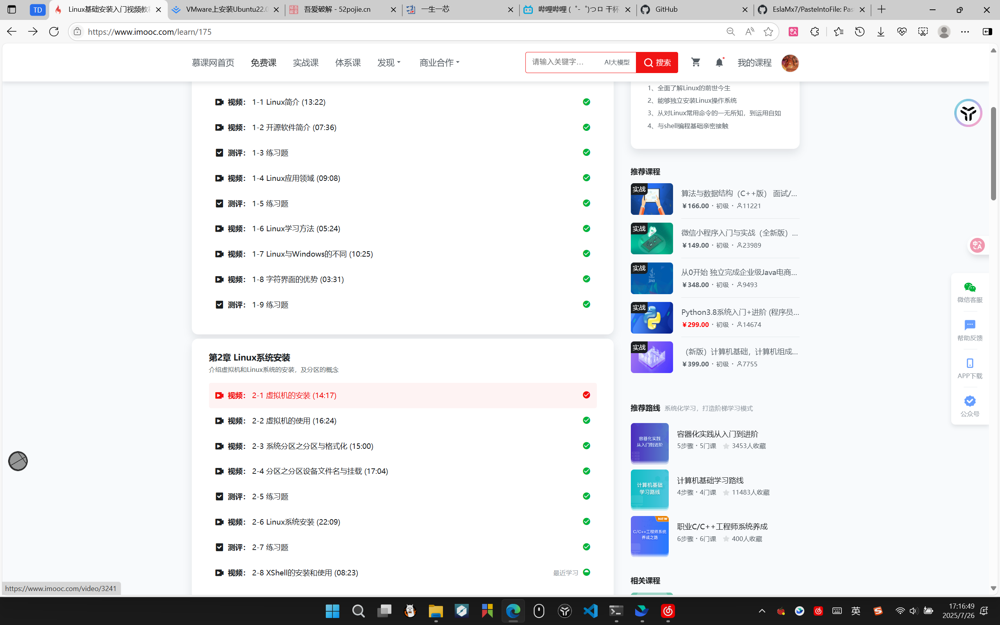
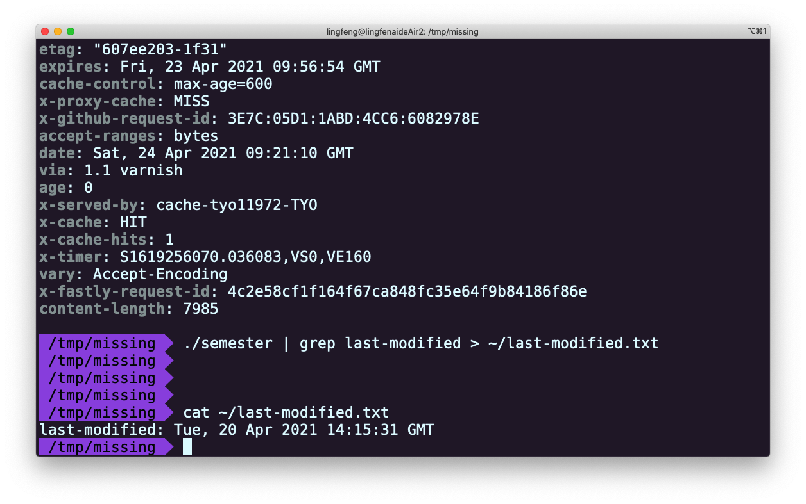

<div align="center">

# 太原理工大学先进计算机系统实验室（ACSL）适应期学员第一次学习路线

旅途首站

难度指数：012

报酬：计算机入门基础

</div>

---

接下来就是长达一个半月的适应期了，期间不会有太困难的任务。在适应期结束后，能够独立完成所有必做任务的同学将会有一次升组考核。完成该考核代表适应期正式结束，你将进入下一阶段的学习，能够获得一些奖励，同时也意味着你向成为专业程序员迈出了关键一步。

# 信息框说明（一定要看完）


> [!TIP]
>
> # **必做任务**
> 作为必做任务，大家需要在**本周完成**。如实在无法完成，可提交适当文字说明原因，可附上未做完任务的完成思路。
>
> 作业提交格式一般为：xxx\-Great

> [!TIP]
>
> # **拔高任务**
> 所有本类任务不强制要求完成，也**不会影响后续任务的完成**，但可能会影响后续任务的完成速度和完成质量。
>
> 作业提交格式一般为：xxx\-NewStar

> [!NOTE]
> # 解释段落
> 其实也会有一些小故事。

> [!WARNING]
> # 注意事项
> **要是不看可能会吃大亏**，是这样的东西。
>
> 有时候会让你在遇到无法解决的问题时联系学长学姐，但他们不会直接告诉你答案，而是尝试引导你发现解决问题的思路。不过要是太困难的问题还是会直接帮你解决了的，我们也会尽力避免这样的问题出现。

> [!NOTE]
> # **作业提交**
> 没有描述作业提交要求的 任务类板块中的 任务 不用提交。特殊地，选做任务若给出了作业提交格式则为选择性提交。

> **另外，要求重命名文件的时候不要把文件后缀改没了。**
>
> [!NOTE]
> # 结束标识
> 出现在讲义最后。是结束，更是开始。

# 计算机基础认识

## 计算机基操（有计算机基础可跳过）

### 超链接

在一些软件上，有些文字被标蓝并配上了下划线。这样的文字就被称为超链接文本。[你只需要用鼠标点击即可进行跳转](https://example.com)。显然，飞书的超链接并没有自动添加下划线。但为了能清楚表达`“这里有超链接”`的意思，我们会在以后所有超链接部分加上下划线。

### 搜索引擎常用技巧

- 考虑到大家查资料主要用电脑浏览器，所以建议大家不要使用百度、360等浏览器，我们推荐使用[Edge](https://www.microsoft.com/zh-cn/edge/download)/[火狐](https://www.firefox.com.cn/)

- 搜索引擎建议选择谷歌或Bing，也就是把浏览器默认搜索引擎替换为谷歌或Bing

    - 谷歌国内访问困难，建议使用Bing

- 精准搜索

    - 现代的搜索引擎越来越智能，特别是加入AI搜索后，一般问题已经用不上精准搜索了

    - 格式：`搜索内容 "关键词"` 或 `搜索内容 +`` ``关键词`

    - 比如你想搜索`芯片 一生一芯` 但是你只想看到和`包云岗`有关的结果，那只需要改成`芯片 一生一芯 "包云岗"`或者`芯片 一生一芯 +包云岗`

- 排除结果

    - 或许你的浏览器里有黑名单功能，但可能有时候也会想去看看呢？

    - 格式：`搜索内容 -关键字`

    - 比如你想搜索`C语言结构体`，但是不想看到CSDN怎么办？只需要改成`C语言结构体 -csdn`

- 站内搜索

    - *真是完蛋，这网站怎么连个搜索栏都没有。*这时候就需要借助搜索引擎来查找了

    - 格式：`搜索内容 site:网站域名`

    - 此处不给出示例，尝试自己使用吧

更多信息可以尝试使用浏览器搜索`bing Advanced search site:``microsoft.com`

你也可以参考以下三个博客：

[让你搜索效率翻倍的技巧](https://www.cnblogs.com/PeterJXL/p/18730569)  

[搜索引擎的使用技巧](https://www.cnblogs.com/aeolian/p/9718931.html)  

[必应高级搜索](https://www.cnblogs.com/harder-summer/p/17112905.html)

### 认识文件后缀

- exe（可执行文件）：可以直接双击打开的文件\(仅Windows\)

- **zip/rar/tar/tar\.gz/tar\.xz等（压缩文件）：需要解压缩软件（如7\-zip，bandizip）才能打开的文件，可以将多个文件或文件夹打包为一个文件**

- iso（光盘映像文件）：广义上将这个格式也算是一种压缩文件，可以使用解压缩软件打开。一般这种格式的文件中存放的是系统的安装程序或影像音频（DVD，VCD等）。这种文件格式可以将其存储的内容刻录到实体光盘中

- md（Markdown文档）：一种以纯文本格式存储的文件，可以被支持Markdown的编辑器渲染为带格式的文档。将来我们会经常使用

- txt（纯文本文档）：一种以纯文本格式存储的文件，不含任何格式

- c（C语言源码）：一种以纯文本格式存储的文件

- cpp/cc（C\+\+语言源码）：一种以纯文本格式存储的文件

- py（Python语言源码）：一种以纯文本格式存储的文件

- v（Verilog语言源码）：一种以纯文本格式存储的文件

- bin（binary，二进制值文件）：一种以二进制储存数据的文件，因此可以作为任何文件的后缀

### 剪贴板

剪贴板是临时存放你复制/剪切了内容的地方，里面的内容可以是文字，也可以是图片，甚至文件

在Windows可使用`win + v`打开剪切板

### 如何截图

- 使用Windows/Linux自带的截图工具。

    - 按下PrintScreen（PrtSc）之后，你的操作系统会自动打开自带的截图工具。

    - 如果没有打开，则已经直接将整个画面放在了剪贴板上了，一般也会储存在自带的图片文件夹中，直接在需要用的地方粘贴即可（Windows下也可以用Win\+Shift\+S组合键呼出截图工具）

    - Windows一般不能直接粘贴到文件目录，需要找到Windows自带的图片文件夹再转存，也可以在QQ聊天栏粘贴转存

- 使用第三方截图工具（QQ/微信，**snipaste\(很推荐\)**，flameshot等）

- 学会截图后尽量**避免使用拍屏**发送消息


## 什么是计算机（Computer）

对于目前的大部分同学来说，计算机还仅仅是个可以用来娱乐、聊天和学习工作的机器而已。但既然来到了这里，那就有必要带你**稍微**深入去了解这个神奇的东西。它可以简单地看做是几个重要元器件和运行在其上面的程序的组合，它们各司其职完成一个计算机应该能完成的工作，便成了计算机。其实，你的手机也是计算机的一类。

### CPU

CPU（Central Processing Unit，中央处理器）是整个计算机的核心部件，也是我们将来最主要学习的部件之一。它要完成的任务很简单——不停地计算。通过这些“简单”的计算，CPU能完成许多复杂到连恐怖直立猿都无法做到的事。

如果你在此前了解过一些相关知识，可能还看到或听过“SOC”这样的名词。至于什么是SOC，在不远的未来我们将会亲手实现它，而现在的你只需要理解CPU就足够了。

举个例子，你在买电脑的时候听到的Intel酷睿i9\-13900HX，AMD锐龙9 7845HX，这些都是CPU。

### GPU

GPU（Graphics Processing Unit，图形处理器（显卡））是绝大多现代计算机都会装配的器件，它的工作也是计算，但在图形方面的计算相比CPU更加强大。

如果你找不到你正在使用的观看设备的GPU，那大概率只是与这个设备的CPU住在一起了，这种的GPU我们一般称之为核显（Integrated Graphics）。而独立出来能够让你轻易找到的，被称为独显（Dedicated Graphics），他们完成的任务都是一样的，但性能可能有所不同。
例如最有名的显卡公司英伟达（Nvidia）发行的RTX4060，RTX5060就是显卡，一般被我们称为N卡，是独立显卡。另外被称为A卡的就是AMD公司的显卡，不要误认为A卡是集显。

### 其他设备

其他常用设备包括但不限于键盘、鼠标、显示器、声卡、内存、硬盘。这些设备是什么，又是如何与CPU/GPU进行连接、交互，CPU/GPU又是如何处理这些设备传输的信息，在未来的学习中我们都会学习了解，甚至实现它们。

### 操作系统（OS）

你知道吗，其实操作系统也是个程序，像是你正在使用的Windows、安卓、苹果甚至鸿蒙，它们都是程序，所以你有时能通过一些手段在同一设备运行另一个系统，但操作系统并不是普通的程序。未来，我们将在自己设计的CPU上运行各种程序，甚至操作系统！

### 文件

文件是什么，这还是考研八股里的一部分呢，那里写着`“文件是储存在存储设备中的一段数据流”`，但是什么是数据流、什么是内存，和大家平时说的手机`“内存”`有什么区别，这里不做掌握要求，我们鼓励大家自行**STFW**。


## 大佬三连——STFW/RTFM/RTFSC

突然出现了好多大写英文，是不是要开始不说人话了？请放心，标题下的**难度系数**才12呢，怎么会难为你们呢。既然提到了难度系数，那么就先解释一下吧。

难度系数，顾名思义，这就是描述讲义必学知识难易程度的一个参数。其值大约表示大家需要花费在其中的大致时间（小时）。再多考虑一些~~摸鱼~~中场休息时间，这意味着你在本篇花费的学习和理解时间最好不要超过12\*1\.25 = 15小时。当然，如果超过了这个时间也不用沮丧，回想一下自己是不是不小心走了弯路呢？

讲义一般每周布置一节，10小时的时间还是能很容易抽出来的。我们也会把难度控制在合理的范围，保证大家仍能拥有足够的娱乐时间。

另外，如果你花的时间小于难度系数，那说明你在计算机学习领域是个不可多得的好苗子！所以努力在15h内完成吧。

这可不是说走了弯路就是错的！也许一不小心走了弯路能给你带来许多其他有趣的知识和经历呢。假如你看完了前面的讲义突然对操作系统很感兴趣，然后就先去学OS了呢，这对以后的很多学习都会有很大的帮助哇。

另外，虽然讲义每周新开放一节，但我们并不要求大家必须在一周内完成相应的全部内容，我们也从不会对认真学习但实在挤不出时间完成讲义的同学抱有偏见！

### 名词解释：STFW/RTFM/RTFSC

这三个缩写的含义如下：

|STFW|Search The Friendly Web|
|---|---|
|RTFM|Read The Friendly Manual|
|RTFSC|Read The Friendly Source Code|

理解了这三个缩写的意思，我们也终于可以进行一些实践了！

# 阅读“提问的智慧”（一生一芯版）（必做）

这是你在预学习阶段遇到的第一个真正意义上的任务，请仔细阅读[“提问的智慧”（一生一芯版）](https://fa45epzd9c7.feishu.cn/docx/KMnFdHMgIozXL5xGmHHcpuU8nre)这篇文章。我们设置这道题并不是为了故意浪费大家的时间，也不是为了阻止大家提出任何问题，而是为了让大家知道“怎么提问是正确的”。 当你愿意为这些“正确的做法”去努力，并且尝试用专业的方式提出问题的时候，你就已经迈出了成为“成为专业人士”的第一步。

（文章结尾处的链接打不开？我们在拔高部分放了一些提示，不妨试试看？）

# 不要小看STFW

看完你是不是觉得**STFW**很简单？随便动动手就好了？尽管事实如此，但仍有许多同学到了大二还不会使用**STFW**大法。

未来你可能就会经历这样的事——你的舍友/朋友一直解决不了某个问题，一直向AI“提问”也无法解决，但你随便**STFW**就把这“棘手的”问题解决了。

# 环境搭建

面对即将到来的正式学习，我们很有必要先准备一些**舒适的环境**还有**好用的工具**。

## Linux

Linux是有别于Windows的另一个操作系统，覆盖的领域非常广，从手机到个人电脑再到服务器，都有它的身影，安卓系统就是基于Linux开发的。而更重要的是，Linux是开源的！

> **『笔者』**发现这样一个现象——许多的同学到了大二依旧不知道Linux是什么，甚至认为Linux就是虚拟机，其中还包括一些计算机专业排名靠前的同学。所以希望你能记住上面对Linux的简要介绍。
> 
> 

我们选择使用Ubuntu作为接下来开发的主要系统环境。Ubuntu是一个Linux发行版，以入门门槛低闻名，而且我们需要使用的工具链在Ubuntu上也被验证可行。所以接下来我们将开始学习Linux使用的第一步——安装。

你可以从以下两种安装方式**选择其一**，我们推荐大家将VMware作为第一选择。

# **安装Ubuntu虚拟机（选择WSL2\-Ubuntu的同学本任务为选做）**

具体安装教程请查看[虚拟机安装Ubuntu22\.04指北](subdocument/虚拟机安装Ubuntu22.04指北.md)。

# 安装WSL2\-Ubuntu——（支线）

因为WSL没有桌面，所以

**无基础不建议使用WSL**

**无基础不建议使用WSL**

**无基础不建议使用WSL**

使用WSL需要你非常熟悉并完全接受Linux命令行操作，这是一般小白无法接受的

WSL安装教程请查看微软[官方文档](https://learn.microsoft.com/zh-cn/windows/wsl/install)或[官方文档pdf版（建议下载后观看）](https://xcnlirxdrdxr.feishu.cn/wiki/LsuXwmLKBijKrIkkiFUcHs2zn6e)。并参考[虚拟机安装Ubuntu22\.04指北](subdocument/虚拟机安装Ubuntu22.04指北.md)完成必做任务。

### 学会使用Linux

观看并学习【Linux安装与操作教学视频】

内容：【1\-1】到【1\-9】、【2\-3】到【2\-4】：[https://www\.imooc\.com/learn/175](https://www.imooc.com/learn/175) 

# 注意

这些视频主要是为了加深大家对Linux的理解，所有**安装**VMware/**安装**Linux系统的教学都建议以我们提供的文档为准。这些教学视频虽然很优秀，但年代久远，不适合大家跟随操作！

# 记录学习（必做）

除了完成我们在[虚拟机安装Ubuntu22\.04指北](subdocument/虚拟机安装Ubuntu22.04指北.md)中布置的【截图】任务，你还需要将【Linux安装与操作教学视频】完成的截图保存下来，注意截图包括右下角的时间。下方为示例截图。**将你的截图重命名为**`Linux`



# C语言学习（一）——  C程序入门

C 语言是一种通用的高级语言，1972年被实现，至今仍十分热门，学习门槛也低，极其适合作为小白学习的第一门编程语言。

# 为什么是C语言

或许你已经知道了很多编程语言，比如Python, Rust, C\+\+等等，这些语言似乎在互联网中比C语言更受欢迎。那么C语言除了学习门槛低，还有其他优势吗？

答案是肯定的，我们使用的系统内核主要就是用C语言编写。C语言能够让我们自由处理程序运行时拥有的各种资源，这对学习计算机底层原理的我们来说有无可替代的优势！如果你有足够的好奇心，在之后的学习路线中你们会逐渐理解这一优势。

如果你没看懂以上文字，那么你现在就可以毫无负担地开始C语言的学习！

## 一个简单的C语言示例

```C
int main() {
    int a = 0;
    int b = 1;
    printf("a + b = %d\n", a + b);
    return 0;
}
```

这是一个简单的加法计算程序。计算`0 + 1`的值并通过`printf`函数输出。如果你不知道`printf`是怎么工作的，甚至不知道什么是`printf`函数，那么快来学习这门基础语言吧！

# 学习C语言（必做）

在学习C语言之前，我们需要一个新手可以用的**C语言工具**，例如：Dev\-cpp。

可直接通过这个链接下载Dev\-cpp：https://sourceforge\.net/projects/orwelldevcpp/

也可以在qq群文件中进行下载。


选择适合自己的方式学习C语言基础，并完成对应练习题。

以下是3种学习C语言的方式（视频，网站，书籍）：

视频链接：[翁恺C语言](https://www.bilibili.com/video/BV1XZ4y1S7e1?spm_id_from=333.788.videopod.episodes&vd_source=7b1b18b421fa2d33ec9aaf4a8aba4561)，完成至少前5章的学习（翁恺老师课程时间极长，可根据自己理解情况适当开启倍速播放。如果无法适应这种倍速播放的学习方式，可以先尝试其他的学习方式）

慕课网**C语言入门**：https://www\.imooc\.com/learn/249，完成1\-4章的学习。

群文件的【C语言相关】文件中由一些学习C语言的书籍，也可以阅读学习。

Tips: 推荐学习方式：**知识点\+编程实践**

若选择群文件中的电子书，则需要学习到**变量，判断，循环**知识点所在章节。

# 实现一个简单终端（必做）

请不要感到惊讶，这其实并不难，只要你完成了上述知识点的学习。

详见文档：[实现简单终端作业](subdocument/实现简单终端作业.md)

# 更聪明的终端（必做）

详见文档：[更聪明的终端](subdocument/更聪明的终端.md)，同时保持上一个任务的命名。

# Dev\-cpp用起来怎么样？

你肯定也感觉有点怪怪的吧！有时候居然没有头文件也能运行！不过值得一提的是，Dev\-cpp的确是一个非常经典编程环境，特别是对于新手而言，我们太理的C语言课程也是以Dev\-cpp为主要环境和工具，有的比赛似乎也要求使用Dev\-cpp。但它实在太老旧了，似乎配不上“先进”一词，如果你哪天不小心入职到某个小公司还发现他们用的是Dev\-cpp，请拔腿就跑\.\.\.扯远了！

Dev\-cpp几乎完全不能用来维护比基础教学规模更大的代码，而且Dev\-cpp很难帮助我们学习更加底层的计算机原理。为了成为更加专业的程序员，除开学校教学和某些比赛需求，之后我们将不再使用Dev\-cpp。

> [!NOTE]
> # **作业提交**
> 1. 基础作业截图提交要求：将Linux相关作业的两张截图放在一个文件夹里，`文件夹`命名格式为`姓名-专业班级-Great-1`。截图文件命名规则查看任务布置处要求。
>
> 2. 基础作业源代码提交要求：将你的C语言源代码文件也放在上述文件夹中，命名要求见任务布置处。
>
> 3. 将文件夹压缩为zip格式，保持压缩包名字与文件夹名字相同并提交至 [第一周适应期作业提交链接](https://fa45epzd9c7.feishu.cn/share/base/form/shrcn9hBWKkpVrY0NEFQ4AYixdc)。
>
> 4. 如果你学有余力完成了下面的拔高内容，则把文件夹重命名，格式为`姓名-专业班级-NewStar-1`。不要忘记更新你的源代码和截图，还有提交作业。
>
> 本周作业提交截止时间：**10月19号晚23:00**（如果因为自身原因未完成本周作业，在文件夹中额外提交一份说明文档即可）
>
# 拔高内容

Hey\! 既然完成的基础内容的学习，想不想来挑战一下自己？

## 探索\-初识开源

对于刚刚真正接触计算机的你来说，开源还是个十分遥远的名词。

或许你已经在像B站这样的平台上上看到了许多和开源有关的视频，但那都是被动的接受。今天就让我们主动一次吧，走出第一步！

# **寻找开源**

该从哪里开始呢？我们为你准备了几个小任务。

1\.在浏览器中搜索github是什么

2\.搜索Linux是什么

3\.搜索开源与免费的区别

我们希望你能通过**STFW**来寻找，而不是直接询问大佬，这也是一个小训练。在你找到后，把你认为可以作为任务结束标志的截图保存，未来的你或许会用上呢。

**怎么回事，为什么我不能打开github的网页？**

不用担心，这只是一次初步探索。无论能否打开网页都不影响最终作业提交，而且这个任务我们也不要求你进行提交。如果你对如何打开github感兴趣，尝试使用[Watt Toolkit](https://steampp.net/)。

## 命令行基础

# missing\-semester

既然都开始用Linux了，那就来学习一些基本操作吧。

完成[计算机教育中缺失的一课](https://missing-semester-cn.github.io/)第一章[课程概览与Shell](https://missing-semester-cn.github.io/2020/course-shell/)的学习并完成所有课后练习。最后将含有`cat last-modified.txt`命令结果的终端截图作为作业提交。截图重命名为`missing-semester`

你可能会用上的教程：[https:/cn\.bing\.com/search?q=](https://cn.bing.com/search?q=Linux+Ubuntu+%E5%91%BD%E4%BB%A4%E6%95%99%E7%A8%8B+-csdn)[**Linux\+Ubuntu\+命令教程**](https://cn.bing.com/search?q=Linux+Ubuntu+%E5%91%BD%E4%BB%A4%E6%95%99%E7%A8%8B+-csdn)[\+\-csdn](https://cn.bing.com/search?q=Linux+Ubuntu+%E5%91%BD%E4%BB%A4%E6%95%99%E7%A8%8B+-csdn)

你可能需要的科普：[https:/cn\.bing\.com/search?q=](https://cn.bing.com/search?q=%E7%9B%AE%E5%BD%95%E5%92%8C%E6%96%87%E4%BB%B6%E7%9A%84%E5%8C%BA%E5%88%AB+-csdn+-baidu+%2Blinux)[**目录和文件的区别**](https://cn.bing.com/search?q=%E7%9B%AE%E5%BD%95%E5%92%8C%E6%96%87%E4%BB%B6%E7%9A%84%E5%8C%BA%E5%88%AB+-csdn+-baidu+%2Blinux)[\+\-csdn\+\-baidu\+%2Blinux](https://cn.bing.com/search?q=%E7%9B%AE%E5%BD%95%E5%92%8C%E6%96%87%E4%BB%B6%E7%9A%84%E5%8C%BA%E5%88%AB+-csdn+-baidu+%2Blinux)

截图示例：



# 试试用Windows操作（难度大）

一般在Windows无法运行Linux的Shell的脚本，所以我们需要换种形式。Windows中有种文件叫做批处理文件（\.bat），我们可以试试用它解决问题！当然，你需要自行STFW学习bat脚本的编写和使用。


不过你不需要实现missing\-semester里提到的功能，你只需要完成`输出当前时间戳到某一个特定文本文件中`的功能，了解Windows的命令行的基本使用。

注：如果你未来想从事Windows上的各种开发工作，这是一个很简单的入门基础

本任务为选择性提交任务，不要求提交完成截图或\.bat文件。但你仍可以用`姓名-专业班级-NewStar-1`的格式创建并命名一个新文件夹，接着放入图片/\.bat文件后压缩提交。图片/\.bat文件命名无要求。

> [!NOTE]
> # 温馨提示
> 第一次学习路线到此结束，请别忘了将作业按要求提交到指定表单

# 碎碎念

**李振杰学长的碎碎念（并非成功学鸡汤，只是大学两年来自己的些许感悟）**

作为一名大三的老东西，再过几个月我就要投入考研备考了。看到你们如今充满朝气的样子，我瞬间就被拉回了自己刚踏入大学校园的那年。首先，真心恭喜各位顺利进入高等教育的殿堂，开启人生新阶段。

大学与过去学习阶段最大的不同，在于它第一次要求你认真思考：未来要成为一个什么样的人。这远不止于考取高分、完成课程任务，更在于你在精进学业的同时，逐步构建自己的道德观念，形成对世界的独立理解 —— 简单说，大学是让你从 “被动学习” 转向 “主动成长” 的关键时期。

毫无疑问，接下来的日子里，你们很快会被焦虑与迷茫缠上。这种情绪从来不是空穴来风：可能是刚考完高数，看到身边同学轻松拿了 90 分，自己却在及格线徘徊时的自我怀疑；可能是深夜刷到学长学姐的分享，有人早早进了大厂实习，有人跟着导师发了论文，而自己连 “未来想做什么” 都没理清，越对比越觉得 “自己落后了”。

其实这些焦虑的核心，都藏着对 “不确定性” 的恐惧，和对 “正确路径” 的执念。我们习惯了中学时 “努力就能考高分” 的明确反馈，到了大学却突然发现：没有一本教材会告诉你 “选这个专业一定有好工作”，没有一位老师能打包票 “做这个项目就能保研”，甚至连 “认真学了这门课” 都未必能立刻看到回报。这种 “付出与结果不挂钩” 的落差，很容易让我们陷入 “我是不是做错了” 的自我否定。

但我想和你们说：大学的珍贵之处，恰恰在于这份 “不确定”。如果从入学第一天起，你的人生就被标好了 “最优路线”，那这份青春未免太无趣了。而且你们或许没意识到，人生的容错率远比你想象的要高 —— 我身边有同学大一选错专业，大二转专业后照样拿到国奖；有朋友第一次考研失败，二战时调整方向反而考上了更心仪的院校；甚至我自己当初自学计算机时，也走了不少弯路，比如花两个月啃一本根本看不懂的专业书，又比如第一次做项目时写的代码全是 bug。但正是这些 “走偏的路”“做错的事”，让我们慢慢摸清了自己真正想要什么、能做好什么。

所以别害怕焦虑，更别因为一次试错就停下脚步。当你因为 “不知道选什么” 而焦虑时，其实是在认真思考自己的方向；当你因为 “做得不够好” 而焦虑时，说明你还在乎成长。而这份 “带着焦虑仍敢探索” 的勇气，恰恰是打破 “专业束缚” 的关键 —— 我们不妨先从 “重新定义专业” 开始：专业不是限制选择的牢笼，而是探索世界的起点。

此外，别让 “专业标签” 成为束缚你的枷锁。我就读于矿业工程学院，学的是矿物加工工程，和我现在深耕的计算机领域可谓毫不相关。但这从未阻止我探索计算机世界的脚步：通过 “一生一芯”，我明白了 CPU 是怎么工作的，操作系统的 “魔法” 是什么，应用为什么如此丰富。这段 “跨专业探索” 的经历让我深刻明白：很多所谓的 “专业壁垒”，其实只存在于我们的想象之中。

我身边有不少计算机、软件工程专业的同学，总觉得设计 CPU、探究计算机底层原理是电子信息专业的事，和自己无关。其实不然 —— 设计 CPU 的过程中，你会深入理解硬件的运行逻辑、软件与硬件的交互原理，这种 “从底层看系统” 的视角，能帮你更精准地定位代码漏洞、优化程序运行效率。哪怕你未来想做软件开发，这种对 “底层逻辑” 的认知，也会让你比只懂上层应用的同行更有竞争力。如果你有转行或跨考的想法，这种打破专业边界的探索，更是帮你搭建新领域知识体系的绝佳阶梯。

说到这里，我们不妨问问自己：是不是把 “有用” 看得太重了？对一个大学生来说，能在青春岁月里亲手设计出一块 CPU，带着它完成学业 —— 这件事本身，不就足够酷、足够有意义了吗？不必把探索看得太功利，兴趣本身就是最正当的理由。

正是带着这份对计算机的热爱，我在两年里慢慢积累：从跟着讲义做入门学习，到成为 “一生一芯” 项目组的助教，再到和团队一起冲击竞赛 —— 今年，我们不仅拿到了 “龙芯杯” 全国大学生计算机系统能力大赛 CPU 设计赛道的团队二等奖，还斩获了集成电路创新创业大赛西北分赛区二等奖；更幸运的是，我入选了中国科学院大学的 “拔尖计划” 暑期学校，有机会聆听多位院士与行业专家分享前沿技术动态。这些收获不是 “等来的”，而是每一次主动尝试、每一次克服困难后自然的结果。

机会从来都是自己创造的。最后想送给大家一句我很喜欢的话：“The sky is the limit\.（天空才是你的极限）”，愿你们都能打破标签束缚，在大学时光里，活成自己真正喜欢的样子。


**旮旯高手（王溢震）学长的碎碎念**

大家好，初上大学并且第一次接触这种形式的培养方式，相信大部分人都觉得很困难或是感到无从下手，我去年也是这样走过来的，作为一位零计算机基础上大学的小白，我可以说，过程虽然艰辛，但收获一定是美满的，重在坚持，沿途会有迷茫的时候，但到最后回头，只会感慨一句“真是充实的大一生活啊”

大一我觉得最重要的是考虑好将来想从事的行业以及想做的方向，可能有的同学因为各种各样的原因不会跟随我们方向的学习到最后，我们也欢迎鼓励同学们在大一**多尝试**找到更适合自己的方向。对所有同学我们都一视同仁，只要你交作业，我们就帮你批改，找问题。不会因为你之后不跟我们方向学习就对你敷衍了事，在这里也祝愿你们都能找到将来真正想做的事（毕竟有的人大三都没想清楚，甚至是没考虑过）

我们都是因为“一生一芯”企划而受益的人，因此也想把它推荐给更多的人，这就是我们的初心。


**吉他Hero（白鹏辉）学长的碎碎念**

大家好，看完第一周的讲义后，你或许是第一次接触这种形式的任务。
没错——**你已经是一名大学生了**。今后不会再像以前那样，有人把所有需要的知识直接告诉你，也不会再有随手可查的“标准答案”。那些日子已经过去了。接下来的学习，需要你**主动**去探索、去理解、去构建自己的知识体系。

- *怎么什么都要我干，这东西直接告我不就行了* 

- *我这么完成的效果对吗？到底怎么才能找到正确的方向。*

这些疑问很正常。但正是这种主动寻找答案的过程，才是我们在未来社会中独立生存的必备能力。

同时，我想说，虽然我们鼓励彼此互相帮助，但更重要的是学会在独立思考之后再去寻求他人的意见。因为真正的收获，往往是在自己思考、尝试、碰壁的过程中产生的。别人给的答案只是参考，你亲手找到的答案，才会成为你的能力。

你需要意识到，大学阶段的任务，不仅仅是为了交作业，更是为了锻炼你独立解决问题的能力。等你进入社会，面对模糊甚至没有标准答案的挑战时，今天培养的思维方式和探索习惯，才会成为你最大的底气。

我想提醒大家，不要只盯着眼前的分数或任务完成度，而是要多想想你想成为什么样的人。今天你投入的每一分钟，不只是为了完成作业，而是在为未来的自己打地基——越坚实，越能撑得久。

所以我们鼓励大家多思考，多提问，多实践。
不用害怕后续的任务——只要你尽自己所能去完成，有收获、有成长，对得起自己，这就足够了。


**『笔者』张勇俊——致新生**

朝雾已散，懵懂不再——这就是我现在的感觉。感谢你还能看到这里，也再次欢迎你来到ACSL，我就是各位适应期大作业前讲义的主笔人——可惜往后就不由我负责了。

在宣讲会的时候大家应该就能注意到了，很多学长学姐其实都是大二的学生，但是好像已经变成了很厉害、懂了很多知识的人。不过暂且不谈能力，正是因为是大二这个年级，我们与各位在社交上不会有太大的隔阂存在。所以在遇到了棘手的问题时也希望你能和我们一起探讨，而不是把我们当做“长辈”一样的角色。

来猜一猜你是什么样的人吧。你可能是刚刚脱离高考后“古井无波”的长假，糜烂了近三个月，再经受军训劳苦后想要努力一把，脱离这糜烂的生活？也有可能是个一直对大学时光很期待的人，又希望能够学到技术——特别是计算机方面的技术，才来到这里？又可能单纯地看见我们宣传单中“中国科学院大学”有关的字眼以及提到的各种福利感到心动？不管怎样都好，你都会有些上进心在里面吧？其实我们最需要的就是这个！相比考虑你有没有所谓的计算机基础，我们更希望你能有“好好学习，天天向上”的上进心，这才是一切目标能够实现的根源，也是许多组织所忽略的。

而且大学四年的一开始就只选择自己会的东西，也的确很没意思。相信会有不少和我一样想法的人。

你可能还想问：“我们这些零基础的同学一年后也能学会这么多的东西吗？”答案是靠自己——还有我们，千万不要把ACSL看做是自学社团这样的组织。

作为主笔，再谈一谈讲义本身吧。我负责的这部分讲义其实对各位来说有不小的难度，不过大家肯定是能够完成的。里面也加入了许多扩展知识，这些知识学校不会教，其他学习组织想必也不会过多提及，这样也才符合我们先进的名头嘛。至于为什么？希望看到最后的你能意识到——我们不是培训班或速成班，而是引导你去真正学习知识的指路牌。而能走多远，不是指路牌能完全决定的。


