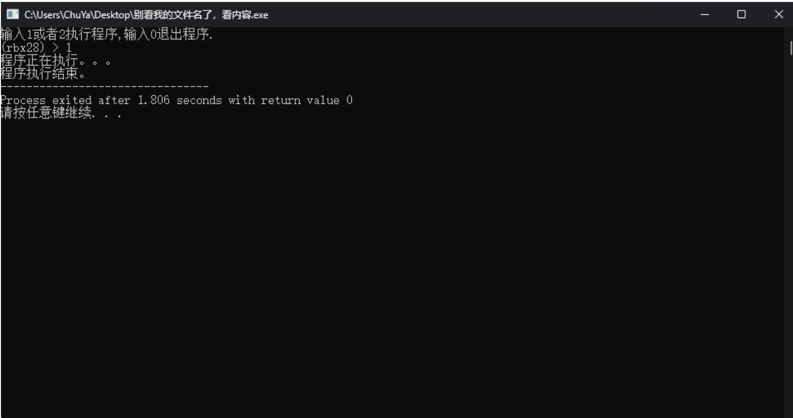

# 实现简单终端作业

先完成，后完美

难度指数：002

---

# **实现一个自己的Shell**

1. 用户启动程序后，可以看到提示符 **\(terminal\) \>** 的输出，并且打印提示性文字**输入1或者 2执行程序，输出0退出程序。 **

示例如下：

2. 需要注意的是，上述的**terminal**请替换为名字拼音首字母缩写\+学号后两位。例如：姓名是 张呆呆，学号是2023011323，那么这⾥就替换为：**\(zdd23\) \>** 。

3. 注意，在\(zdd23\) \> ，右括号与右尖角号之后各有⼀个空格以追求美观，如行首红色部分所示。

4. 键入 1 或者 2 可以继续执行程序，打印出** 程序正在执行。。。 **后换行，继续打印程序执行结束。 后结束程序。

如图所示：

5. 键入0后直接结束程序

如图所示：        

6. 如果用户输入了不存在的指令，也就是除了1、2和0之外的指令，输出** 指令错误！ **并结束程序。

如图所示：

7. 最后，**将你的终端源代码文件重命名为**Terminal

