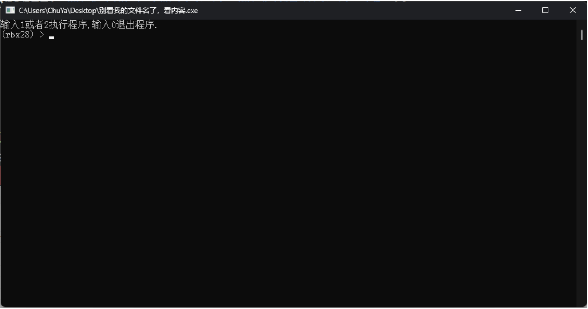
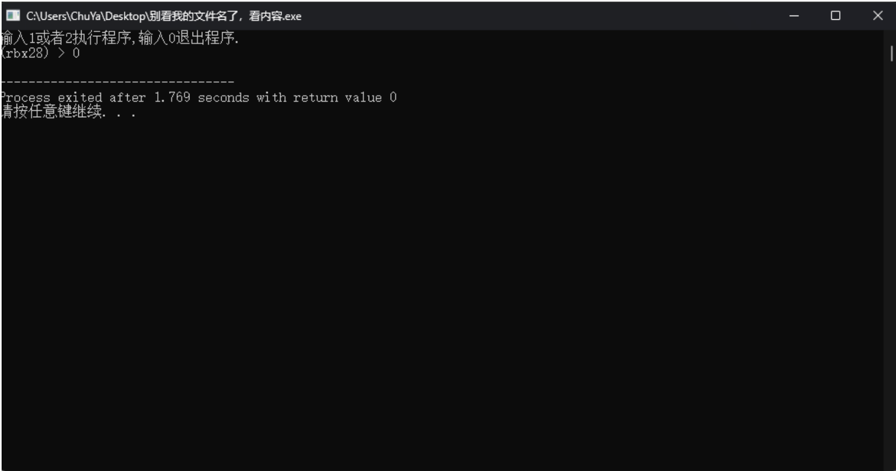
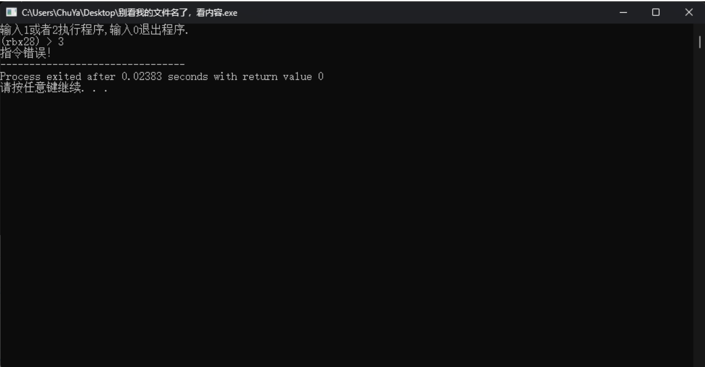

# 实现简单终端作业

先完成，后完美

难度指数：002

---

# <strong>实现一个自己的Shell</strong>

1. 用户启动程序后，可以看到提示符<strong>(terminal) ></strong>的输出，并且打印提示性文字<strong>输入1或者 2执行程序，输出0退出程序。</strong>

示例如下：

1. 需要注意的是，上述的<strong>terminal</strong>请替换为名字拼音首字母缩写+学号后两位。例如：姓名是 张呆呆，学号是2023011323，那么这⾥就替换为：<strong>(zdd23) ></strong> 。

2. 注意，在<strong>(zdd23)</strong><strong>></strong>，右括号与右尖角号之后各有⼀个空格以追求美观，如行首红色部分所示。

3. 键入 <strong>1 或者 2</strong>可以继续执行程序，打印出<strong> 程序正在执行。。。</strong>后换行，继续打印程序执行结束。 后结束程序。

如图所示：

1. 键入<strong>0</strong>后直接结束程序

如图所示：        

1. 如果用户输入了不存在的指令，也就是除了1、2和0之外的指令，输出<strong> 指令错误！</strong>并结束程序。

 如图所示：

1. 最后，<strong>将你的终端源代码文件重命名为</strong>Terminal
