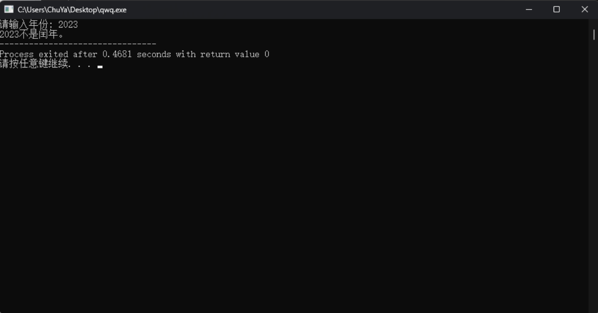
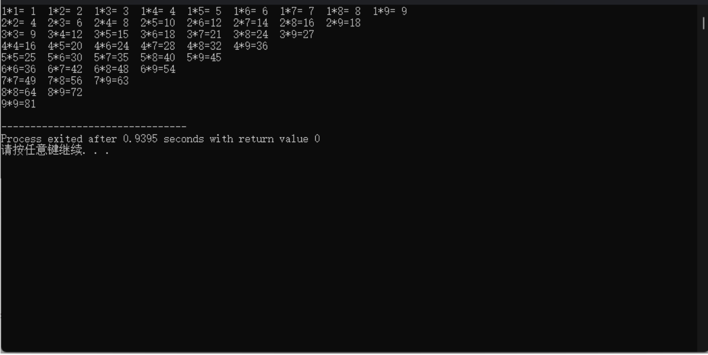

# 更聪明的终端

在设计完成之后，想一想这样的模拟器可以做到什么？又如何做到输入1或2运行程序后<strong>不退出</strong>，还可以再次输入1或2后运行程序呢？那么可不可以把输入1和2运行的程序不再是只输出字符，而是<strong>换成真正的程序</strong>呢？

如果以上问题你有答案，那么就请将你设计的程序进一步改进吧！

我们这里提供两个程序供大家完成：

请试着让你的终端在<strong>输入</strong>`<strong>1</strong>`<strong>指令</strong>时执行判断闰年程序，在<strong>输入</strong>`<strong>2</strong>`<strong>指令</strong>时执行输出乘法表程序。

1. 请使用C语言设计程序以判断闰年，能够接收用户输⼊的年份，输出当前年份是不是闰年。（如果 不知道什么是闰年，请百度。。。）
    效果如下：
    

2. 请使用C语⾔设计⼀个九九乘法表输出程序，在软件运行时，输出⼀个九九乘法表。输出内容正确即可，格式不限。

效果如下：

<strong>在完成这些之后</strong>，大家可以试着想一想怎么样可读性更强，怎么优化自己的代码？或许在你C语言进一步学习之后会有思路，如果你有你的思路，就请实践然后用注释的方法注明你的想法

- <strong>心得：</strong>理解<strong>“先完成，后完美”</strong>的开发思想，以最快的速度，写出⼀版可以使⽤的Demo，尽管它存在各种问题，但是你应该感到自豪！

自豪之余，请切记，我们刚踏⼊万里长征的第一步。请保持⼀颗好奇的⼼，计算机的世界仍有大片未知等着你探索。不断修改迭代你的代码吧。千里之行，始于足下。

- <strong>碎碎念：这个作业可以在Windows上完成，但是之后我们就会到Linux上编程，因此鼓励大家除此之外去探究linux上【你的虚拟机】如何编程，跑程序。</strong>
- **如果你进度超前/有一定的基础，欢迎继续往后学习**

<strong>（——py学长注：目前不清楚大家水平如何，如果所有这些作业加拔高作业很快就全部完成，并且觉得过于简单，欢迎来联系我们，我将提供下一步的拔高作业！）</strong>
