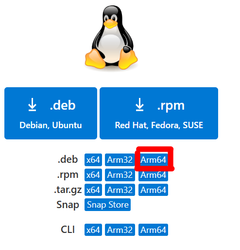

# Ubuntu安装VScode指西

# VMware虚拟机安装VScode

使用WSL的同学直接跳转到后方链接：链接-WSL。

注意，这里的操作都要在你的虚拟机中进行。

## 使用命令行安装VScode

### apt安装

1. 从[VScode下载官网链接](https://code.visualstudio.com/Download)找到需要下载的deb包。

    a. 普通用户选择这个：

    b. mac用户选这个：
  

2. 在虚拟机完成deb包的下载

3. 下载完成后执行命令`sudo apt install ~/Downloads/[包名字].deb`（包名字在图中位置查看）

    a. 期间微软会把自己的仓库链接过来，你可以自行选择是否接受（yes是接受）

    b. 在接受后未来可以直接用apt安装微软提供的软件

    c. 安装完毕后可能会有报错，忽略即可

4. 安装成功后的下一条执行`rm -iv !$`（可选，用来删除你的安装包）

    d. 注意是<strong>紧接着的下一条</strong>，不然容易误删文件

5. 阅读`code -h`或`code --help`命令结果，了解其使用。

6. 在终端输入`code`命令打开VScode。

7. 在左侧扩展列表中通过搜索找到以下插件并安装：

    e. C/C++

    f. Chinese（Simplified）

8. 然后你就可以把VScode关掉了

9. 跳转后方链接，学习VScode快捷键使用：跳转链接-快捷键。

    g. 你只需要有印象即可，在未来你想要这些功能时可以回来再看

# WSL安装VScode（用虚拟机的跳过）

1. 骗你的，WSL安装VScode不在WSL，而在Windows。

2. Windows访问官网下载安装即可使用：https://code.visualstudio.com/

    a. 你都用WSL了，说明你有自己解决问题的觉悟和能力，这种小问题不在话下

3. 跳转到链接处完成必要配置：配置指导

# VScode的快捷键

> [!TIP]
> # <strong>阅读快捷键手册</strong>
>
> 和Shell类似，VScode也有自己的命令系统，你能通过命令把手册叫出来，按`F1`或`Ctrl + shift + P`即可使用。然后你需要输入`Help:Keyboard Shortcuts Reference`打开快捷键文档手册。
>
> 你至少要学会以下快捷键：
>
> - Ctrl+Shift+P 或者 F1    调出VScode的命令行
> - Ctrl+`                        调出终端
> - Ctrl+Click 或者 Ctrl+Alt+ ↑ / ↓     多行编辑
> - Ctrl+S                        保存文件
> - Ctrl+Z                        撤销
> - Ctrl+Y                        撤销你的撤销(或许可以试试)
> - Ctrl+W                       关掉当前窗口
> - Ctrl+F                        当页搜索
> - Ctrl+shift+F                全局搜索
>
> 有些快捷键因为冲突原因已经不能使用，有的甚至不在手册中（这个手册只是简要版的，VScode全部快捷键比这多得多），所以在你记住前需要于VScode中实操一遍。如果你特别想要某个快捷键却无法使用，尝试通过<strong>STFW或RTFM</strong>修改VScode快捷键完成。
