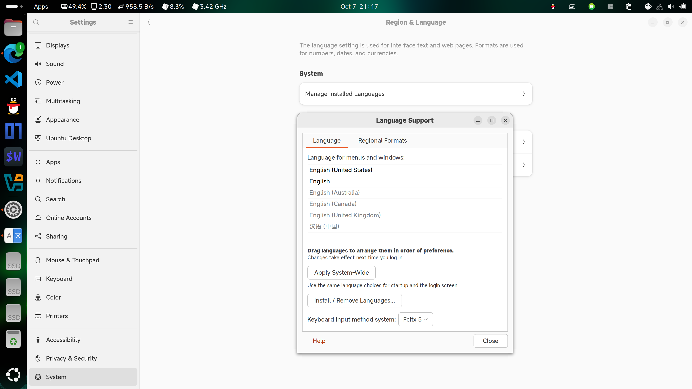
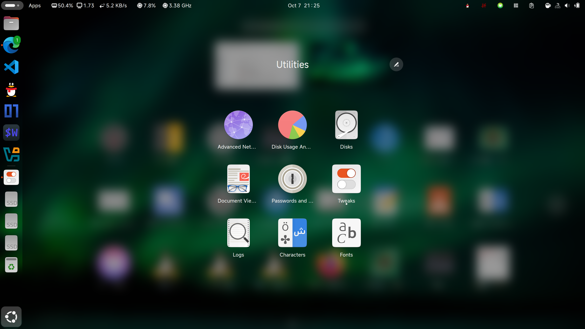

# 中文输入法安装教程

### 中文输入法（使用fcitx5后端）（安装使用即可）

众所周知，在计算机的世界里要输入中文，需要中文输入法，我们来引导大家安装中文输入法

- 检查系统中文环境

在系统设置（Setting）—— 系统（system）—— 区域与语言（Region & Language）——管理安装语言（Manage Installed Languages）——Install/Remove Languages里找到Chinese（simplified）并选中，最后Apply System Wide

- 安装fcitx5



```
$ sudo apt install fcitx5
$ sudo apt install fcitx5-chinese-addons
$ sudo apt install fcitx5-frontend-gtk3 fcitx5-frontend-gtk2
$ sudo apt install fcitx5-frontend-qt5 kde-config-fcitx5
```

- 卸载ibus（ibus与fcitx5之间可能有点冲突）

```
$ sudo apt remove ibus
```

- 配置默认输入法，在终端中输入然后选择fcitx5

```
$ im-config
```

- 使用gnome-tweaks来设置fcitx5为开机自启动

首先安装gnome-tweaks

```
$ sudo apt install gnome-tweaks
```



从应用菜单中找到tweaks（在Utilities文件夹里）并打开，将fcitx5设置为开机自启动


- 设置拼音输入法

在应用菜单中找到Fcitx5 Configuration，从右侧菜单中找到“Pinyin”添加到左侧，然后Apply，就大功告成啦！


<strong>PS：fcitx5的其他配置请自行STFW；安装也可以参照网上的其他教程。</strong>

<strong>PSS：fcitx5中英文切换默认是Ctrl+Space</strong>
