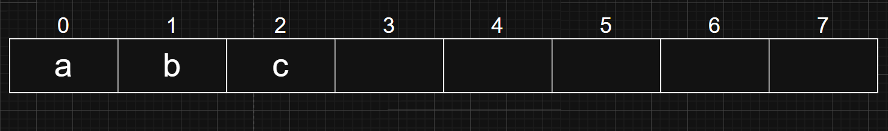
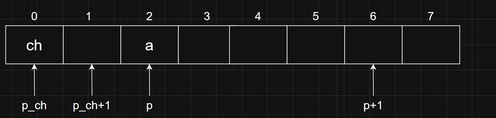

# 指针/结构体教程

# 指针

什么是指针？与之前大家学到的`int`,`char`一样，指针也是一种数据类型。`int`存储的是整型数字，而指针存储的是<strong>内存地址</strong>。

那什么是内存？什么是地址？

### 内存 地址

我们在买电脑的时候，会听到这台电脑内存是8GB/16GB/32GB等，依照我们的常识，内存越大意味着这台电脑的性能越好，使用起来越流畅。我们可以先这样简单理解：计算机本质上是在进行数据计算，而<strong>内存</strong>是计算机存放数据的地方。内存越大，可以放的数据越多，相同时间下能计算的数据越多，表现出来的画面自然就越流畅。

 内存的结构就像一个快递柜，每一个单元中存放的是一个特定的数据，如下图：



就像每一个快递柜有一个编号，大家照着短信中收到的编号就可以快速找到快递。<strong>地址</strong>就是内存的编号，便于计算机快速找到需要计算的数据。

### 指针

指针变量就是用来储存<strong>地址</strong>的变量，指针变量的定义如下：

```c
数据类型* 变量名 = 地址;
```

`*`的位置也可以靠近变量名，这两种定义是等价的。

```c
数据类型 *变量名 = 地址;
```

其中`*`指示这个变量是个指针，无论位置更靠近`数据类型`还是`变量名`都可以被编译器正确解析。这里给出如下示例：

```
#include <stdio.h>
int main(){
    int a = 1;
    int *p = &a;
    printf("address of a = %p\n", p);
}

```

其中`&a`表示获取变量a的地址。这段代码运行的结果为`address of a = 0x... `，这里的`0x`表示这是一个16进制数。而这里的具体数字就是变量a的地址。

> [!NOTE]
> # 什么是16进制？
>
> 类比十进制，10进制是逢十进一，如：9+1=10。而16进制就是逢十六进一，一位上可以表示`0-15`的全部16个整数。数字`10-15`分别用`a-f`表示。在16进制下，1位数字就可以表示16个数值，那么8位数字就可16^8个数值。计算机要存储的数据是非常大的，16进制可以更高效地表示大量的数据。

### 解引用

既然指针表示了某个数据的地址，我们自然可以通过指针来访问这个数据。这个过程叫做<strong>解引用指针，</strong>通过操作符`*`来实现<strong>。</strong>

```c
#include <stdio.h>

int main(){
    int a = 1;
    int *p = &a
    printf("value of a = %d\n", *p);
}
```

将上一段示例代码的`p`改为`*p`，打印的结果应该是`value of a = 1`。

值得注意的是，`*``*`<strong>这里的号与定义指针的号功能并不一致</strong>。虽然是同样的符号，但是在不同的场景下起到的作用是完全不同的。

## 指针与数组

### 指针运算

指针变量与其他变量似乎有一些不同，那他是否能用来进行运算呢？

#### 指针与整数

```c
#include <stdio.h>

int main(){
  
    //char
    char ch = '1';
    char *p_ch = &ch;
    printf("p_ch = %p\n", p_ch);
    printf("p_ch + 1 = %p\n", p_ch + 1);
    printf("address move %d", (p_ch + 1) - (p_ch));
    
      //int
    int a = 1;
    int *p_int = &a;
    printf("p_int = %p\n", p_int);
    printf("p_int + 1 = %p\n", p_int + 1);
    printf("address move %d", (p_int + 1) - (p_int));
}
```

观察这段代码的`char`部分输出结果，我们会发现`p_ch`与`p_ch + 1`输出的值正好差1，与我们的预期相符合。也就是说，指针可以与整数进行运算，我们可以通过指针+整数的形式来让指针移动。

但观察`int`部分输出结果，我们会发现`p_int `与 `p_int + 1`输出的值差了4。这是为什么呢？仔细观察两段代码的不同，不难发现最大的区别就是两个指针指向的数据类型，也就是`int`和`char`。我们不妨回忆一下，之前学数据类型的时候，是不是学过各个数据类型的表示范围。这里差值的不同正是因为他们的数据范围不同！

我们首先为大家讲解两个新的概念：<strong>比特（bit）</strong>与<strong>字节（Byte）：</strong>比特是计算机能识别和处理的最小数据单位。也被称为“位”，指二进制数字中的一位，只能表示0或1这两种状态。字节是计算机中最小的、可直接操作的数据块，1Byte = 8Bit，总共能组合出 2^8 = 256 种状态（从 00000000 到 11111111），刚好能覆盖英文大小写字母、数字、标点符号（如A-Z、a-z、0-9、!@$%）的数据容量需求。

理解了这两个概念，结合上述代码的现象，我们不难联想到：这里一个单位的内存能存储的数据量，正是1字节！而1个字节的容量，正好与`char`的数据大小一致，`p_ch + 1`与`p_ch`差值为1。

但int就不一样了，int的数据范围是-`2^31~2^31-1`，共`2^32`种状态，也就是4个字节。这样一来，各位曾经在某个地方听过的`int`是4字节大小的数据类型，是不是有了新的理解。以及，这里的`p+1`与`p`差值为1的原因，是不是也不言而喻了呢？

很明显，内存的地址是按照字节进行分配的。



#### 指针与指针

首先想到的是两个指针相加，这代表的意义是，你把两个地址加起来了。类比一下之前提到的快递柜例子，各位能想到把两个快递柜的编号加起来有什么意义吗？显然是没有的，因此这样的运算事实上没有意义。

其次是两个指针相减。事实上，这种运算是有意义的。比如我们要找213快递柜，但我们先看见的是215快递柜，这是不是意味着我们在往旁边找两个就能找到213快递柜呢？

两个指针相减，得到的是两个指针在内存中的距离（以数据类型为单位，而不是字节。例如两个`int`类型的指针相差1，他们在内存中其实差了4个字节，在上图中其实也可以体现这种关系）。而这样的运算，在后文学习到指针与数组的联系，大家会进一步进行学习与研究。

### 数组

大家通过上文内存的提示图，是否联想到了上周学习到的数组知识？事实上，数组就是一段存储了相同数据类型变量的连续内存指针还有个和数组有关的用法——当做数组的起始使用。代码示例如下：

```c
int arr[10] = {0,1,2,3,4,5,6,7,8,9};
int *p = &arr[0];
printf("arr[2] = p[2] = %d\n", p[2]);
```

这样编译器会把p[2]解析为*(p+2)。按照刚刚的对p的定义，这里恰好就是*(arr + 2)，也就是arr[2]。

然而由于指针没有限定可使用的内存区域，比如*(p+12)或*(p-1)就是非法的内存访问，我们使用指针时需要保证代码没有访问到非法的内存。

为了简化指针对数组的指向，C语言中的数组名还有特殊的功能。当数组名作为等式右侧的值时，其会被编译器cast（解析）为指向数组首元素的指针。所以上述代码可以写成如下形式：

```c
int arr[10] = {0,1,2,3,4,5,6,7,8,9};
int *p = arr;
printf("arr[9] = %d, arr[9] = %d\n", arr[9], *(p+9));
```

> [!TIP]
> # 指针练习（0）
>
> 完成头歌7-1前两题以及7-2的第二题：https://www.educoder.net/paths/klbm7gto
>
> (tips: 第一题提到的指针法可以用到指针和数组的联系)

# 结构体

## 结构体基础

在实际问题中，有时候我们需要几种不同的数据类型一起来描述某个变量，例如要描述一个学生的信息就需要姓名（`char*`），学号（`int`），年龄（`int`）等等。这些数据类型都不同但是他们又属于一个整体，要把他们联系起来，那么我们就需要一个新的数据类型——结构体，它就将不同类型的数据存放在一起，作为一个整体进行处理。

结构体是C语言中一类重要的数据结构，我们先看如何定义一个结构体并创建一个结构体变量：

```c
struct struct_name {
    type_name1 var1;
    type_name2 var2;
    ......
};    // 用 ; 结束结构体定义

struct struct_name S = {var1, var2, ...};    //可以为空
```

像这样就完成了一个结构体的创建并初始化。我们用更具体的代码来作为引入：

```c
struct student {
    char name[20];
    int  grade;
};
struct student S = {}；
```

```c
struct student {
    char name[20];
    int  grade;
} S = {};
```

我们在此定义了一个名为`student`的结构体，同时又创建了一个名为S的结构体变量，该变量类型为`struct student`。可以看到结构体的定义和创建变量不仅可以分开进行，也可以在同一个语句中。以上两种方式都可以成功创建结构体变量并进行初始化，我们在后续的示例代码中采用第二种。

学会定义后，我们还需要学会对结构体变量进行赋值和读取。

```c
#include <stdio.h>
#include <string.h>

struct student {
    char name[20];
    unsigned int grade;
} S = {};    // 在全局区定义结构体和结构体变量，你也可以在这里初始化为其他
// 全局区变量在全局区只能初始化，不能再更改

int main(){
    S.grade = 94;
    strcpy(S.name, "Zhang San");
    ......
}
```

就像上述代码中写的一样，结构体最基本的赋值就是靠`.`运算符完成，这叫做成员访问运算符，当运算符前为结构体变量时`.`将会被解析为该运算符。字符串的赋值不能靠单纯的“等于号”进行赋值，通常需要借助外部函数。

但结构体的赋值还可以用下面这种近似等效的方法：

```c
struct student {
    char name[20];
    unsigned int  grade;
} S = {};

int main(){
    S = (struct student){"Zhang San", 94};
    ......
}
```

这是C语言的一种语法，经常用于为变量进行初始化和赋值，特别是数组和结构体。这种方法又和以下赋值语句近似等效，但这种方法利用了<strong>中间变量</strong>。

```c
    struct student temp = {"Zhang San", 94};    // 中间变量初始化
    S = temp;    // 相当于 S.name = temp.name; S.grade = temp.grade;
```

不过为了更清楚地表示结构体的赋值，C语言允许使用`.`运算符指示结构体成员并进行指定对象赋值。如下：

```c
S = (struct student){.name = "Zhang San", .grade = 94};
// 其同样可用于对结构体的初始化
struct student S2 = {.name = "Li Si", .grade = 93};
```

此外应注意的是，虽然[像这样](/v2509/pre_trainees/lecture3/指针_结构体教程)能用结构体变量给其他同类型的结构体赋值，但结构体是不能直接比较大小的，编译器也不认为前者和一般的赋值语句含义相同。

## 结构体数组

在最开始学结构体的时候我们说，可以用结构体来描述一个学生的基本信息，但一个学校中可不止一个学生，总不能一个学生创建一个结构体吧。而这时候就可以联系到上一次学习路线中我们所学的数组了，当要定义 10 个整型变量时，可以使用数组的形式。当要定义 10 个结构体类型变量时，也可以使用数组的形式，这时的数组被称为结构体数组。

```c
struct student {
    char name[20];
    int  grade;
} S[10];
```

上面的代码定义了一个结构体数组，其中每个元素都为struct student类型，相当于可以存10个同学的信息了，而且赋值方式也是类似的。

```c
struct student {
    char name[20];
    int  grade;
} S[10] = {{"zhang san",94},
           {"Li si",83},
           {"wang wu",98}}; //分别给S[0],S[1],S[2]赋值
```

```c
struct student {
    char name[20];
    int  grade;
};

int main(){
    struct student S[3];
    S[0].grade = 94;
    strcpy(S[0].name, "zhang san");
    S[1].grade = 83;
    ......
}
```

> [!TIP]
> # 结构体练习（1）
>
> 有了上述结构体的基础知识，做几道题来练练手吧
>
> 完成头歌8-1前三题：https://www.educoder.net/paths/klbm7gto

## struct里藏struct

嵌套是程序员很喜欢做的事情，这将为你未来学习链表打下重要基础。

结构体里面能够放int类型变量，能放字符串（数组），还能放指针，那肯定也能放结构体吧。我们给出如下代码：

```c
#include <stdio.h>

struct many_grades {
    int math;
    int english;
    int chinese;
};

struct student {
    const char *name;
    struct many_grades grades;
} S1 = {}, S2 = {};

int main(){
    const char name_s1[20] = "Zhang San";
    const char name_s2[20] = "Zhang Ming";
    S1 = (struct student){.name = name_s1, .grades = (struct many_grades){94, 80, 85} };
    S2 = (struct student){.name = name_s2, .grades = (struct many_grades){60, 60, 60} };
    printf("name : %s, math grade : %u\n", S1.name, S1.grades.math );
    printf("name : %s, math grade : %u\n", S2.name, S2.grades.math);
}
```

这个似乎并不难，多RTFSC去理解吧。

> [!TIP]
> # 结构体练习（2）
>
> 完成头歌8-1第四题：https://www.educoder.net/paths/klbm7gto
>
> 这道题好像和上面学的知识无关？你可以尝试直接根据题目要求独立写完所有代码，而不是使用头歌中给出的模版再填充，这样就可以用上刚刚学会的知识了。毕竟你连终端都实现了，不是吗？
