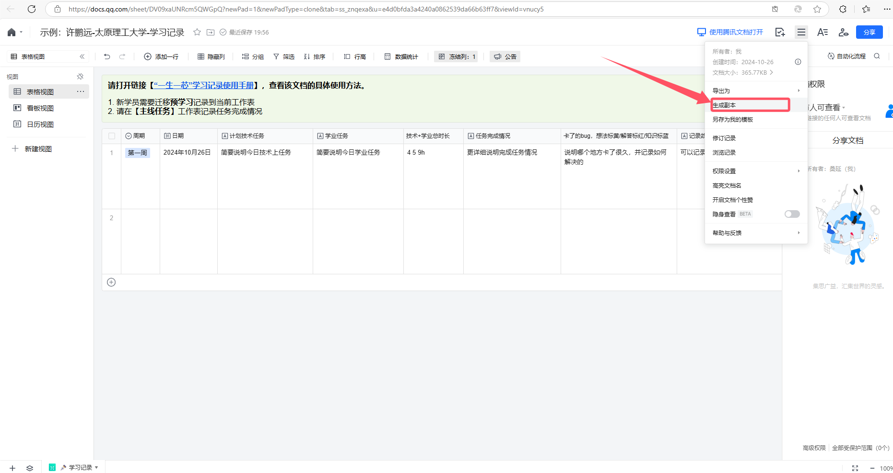
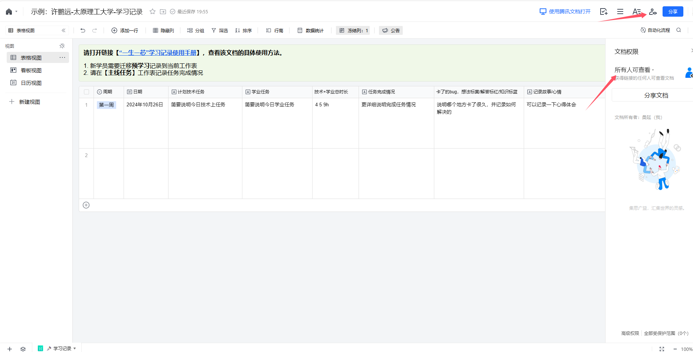
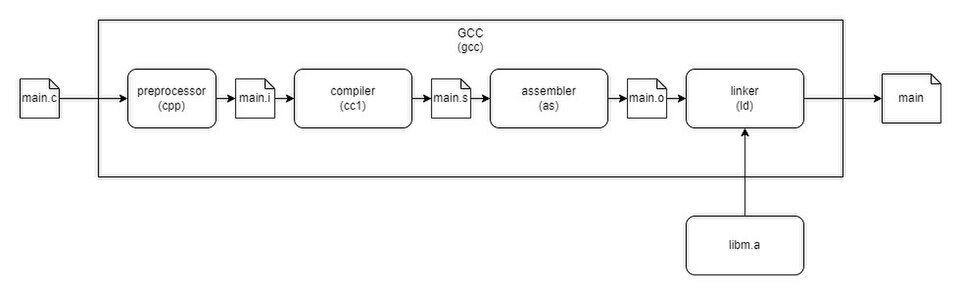

# 太原理工大学先进计算机系统实验室（ACSL）适应期学员第四次学习路线

The mechine is always right

难度指数：015

报酬：专业程序员基础（3）

---

本周作业提交跳转：作业提交

果然不管什么都还是得从简单的地方开始吧。总之啊——先来个简单的。

# 学习记录

## 准备学习记录表

学习记录副本：[xxx-太原理工大学-学习记录](https://docs.qq.com/sheet/DV09xaUNRcm5QWGpQ?newPad=1&newPadType=clone&tab=ss_znqexa&viewId=vnucy5&u=e4d0bfda3a4240a0862539da66b63ff7)

1. 以上是记录表的副本，点开链接后如下操作：
  

2. 创建一个自己的副本，其中表格内容自己可以更改，随后切换权限到所有人可查看
  

3. 随后将你的表格放入这里：[先进计算机系统研究实验室学习记录表](https://docs.qq.com/sheet/DTm9XVFRidkpvTkpW?tab=BB08J2) （大家只需要填写姓名、学习链接和当前进度，其他不填）


> [!WARNING]
> 学习记录表是大家接下来的好帮手，能很好地帮助大家复盘每一天遇到的问题，用处非常大，这里给大家提供一份学长的学习记录表：（可以看到的是随意发癫，问题不大，没必要非常严肃地写相关内容）
>
> https://docs.qq.com/sheet/DWk9BdXVrRXdvcHJl?tab=ss_znqexa&_t=1717317532016&viewId=vnucy5&u=e4d0bfda3a4240a0862539da66b63ff7
>
> 在大家进入“一生一芯”学习时，学习记录也是一份凭证，从预学习答辩开始，会跟着你走完整个“一生一芯”学习阶段；之后我们进入实验室见习学员学习和寒假阶段的面试这也是参考内容；同时在之后大家写简历时，学习记录表是可以写到简历上的，含金量很高，用处很大。
>
> 要注意的是：每天晚上或早晨进行复盘，顺带就进行学习记录，养成良好的习惯，未来你会感谢你自己的。

# C语言——文件操作（0）

前几节讲义我们学习了shell的文件操作，但要是我们的C程序需要文件呢？比如我们熟悉的游戏，大部分游戏都需要用文件保存其数据。就像我们的游戏进度（存档），它就会被存入到一个或多个文件中，这样在下次启动游戏或读取存档时就会读取它们并得到其自动存入的进度或由我们手动存入的进度。

> [!TIP]
> # <strong>C语言学习——文件操作</strong>
>
> 阅读C语言文件操作简易教程，学会其使用并至少完成其中的必做作业。
>
>

# 最后的终端改进

> [!TIP]
> # <strong>功能追加与参数处理</strong>
>
> 学习了这么多的命令行工具（它们也是程序），你早就发现了大部分命令行工具都有参数处理的能力。比如我们使用的`ls -a`，其中`-a`就是它的参数，`ls`的输出就会因为有`-a`的存在而不同。为了进一步完善我们的模拟终端，这次我们也要为自己的终端新增参数处理的能力，让我们自定义的不同命令的输出能够随参数的不同而变化。具体要求查看后方文档：

# Git

> [!NOTE]
> # 为什么要使用git
>
> 这是一个很久之前的真实发生的恐怖故事，那日阳光明媚，有一位学长在经过预学习答辩的考验之后，他正打算开始新的学习，就在这时他的电脑系统居然离奇死机了，在reboot之后他的代码竟离奇失踪，只有一部分被git保存的代码存活了下来，没有被git保存的只能再做一遍，相当于耗费了两倍（甚至更多）的时间来完成，这不仅是对时间的消耗，也会在一定程度上打击你继续学习的积极性，毕竟谁都不想被某些地方引起的bug第二次折磨一遍。从那以后，他痛改前非，爱上了使用git，这个让他又爱又恨的工具。

> [!TIP]
> # <strong>使用git</strong>
>
> git是一个高效的版本控制系统，能够追踪你的代码更改并储存你的更改历史，让你能够方便地对代码版本进行回退。为了使用git，你至少需要学会以下提到的几条git命令：
>
> - git init
> - git branch
> - git switch
> - git add
> - git commit
> - git reset
> - git merge
>
> 推荐的学习网站：https://www.liaoxuefeng.com/wiki/896043488029600（到“删除文件”一节即可——完成第五部分）。
>
> 必做任务：https://learngitbranching.js.org/?locale=zh_CN   完成基础篇即可。
>
> 完成后<strong>将你的完成截图重命名为</strong>`git_game`并放入`姓名-专业班级-Great-4`文件夹等待作业提交。

> [!TIP]
> # 创建本地git仓库
>
> 1. 在这开始前，我们需要你执行这样的命令：`mkdir ~/try_git; cd ~/try_git; echo "I am a test" > test.txt`
> 
> 2. 用前面提到的命令创建一个`git仓库`并对当中的`test.txt`文件进行`commit`，内容为`start`。
> 
> 3. 用你喜欢的编辑器将`test.txt`中的内容更改成`Hello,git!`并再次`commit`，内容为`end`。
> 
> 4. 最后将你的整个`try_git`文件夹<strong>复制</strong>到作业提交文件夹中，等待作业提交。
> 

# C语言——C程序参数

刚刚我们的自制终端处理了一些由我们定义的终端`指令参数`，这就是我们自制的终端——集I/O和处理与一体。那么我们的C语言程序理应也能做到吧？C语言程序同样能够通过处理其`程序参数`来获得不同的运行结果。接下来我们将带大家通过RTFM理解C程序的参数。

> [!WARNING]
> 我们自制终端的参数获取本质上还是程序的I/O，但程序参数是随程序执行一同进入程序的。也就是说程序运行后已经不能再获取参数了。

> [!TIP]
> # <strong>接收C程序参数</strong>
>
> C程序接收参数其实和其他函数接收参数没有什么太大的不同，只是需要受到一些限制。main函数能接受的参数有两个，在需要使用时需要明确写出：`int main(int argc, char *argv[]) {/* ... */}`
>
> 其中`argc`和`argv`的使用你需要查看[C语言官方文档（节选pdf）](https://xcnlirxdrdxr.feishu.cn/wiki/NAT3wppJEi4VhTkeG2rceeAXn4g)（或者后方的中文翻译版）获取，只需要阅读`5.1.2.3.2 Program startup`中与`argc`和`argv`有关的部分内容，<strong>并结合STFW</strong>获取答案。同时不要忘记你所学过的指针数组相关知识，这样你才能更好地阅读这个文档。
>
> 这是这部分文档的翻译：[文档翻译](https://xcnlirxdrdxr.feishu.cn/wiki/CAg7we1GTicDbMksjM6cquzbnkc?from=from_copylink)
>
> 学会使用后实现一个C语言程序，能够将所有传入的参数一行一行地输出到终端，包括程序名（执行示例如下）。
>
> 然后将<strong>你的程序源代码重命名为</strong>`C_echo`并放入`姓名-专业班级-Great-4`文件夹等待作业提交。

```bash
$ ls
C_echo.c
$ gcc C_echo.c -o C_echo
$ ./C_echo I will be echo
./C_echo I will be echo
```

# 作业提交

> [!NOTE]
> # <strong>作业提交</strong>
>
> 1. 非拔高 截图提交要求：将你完成`git_game`的截图放入`姓名-专业班级-Great-4`文件夹。
> 
> 2. 非拔高 源代码提交要求：将你完成的源代码文件也放在上述文件夹中。命名见练习题目要求。
> 
> 3. 将文件夹<strong>压缩</strong>并提交到第四次作业提交表单。
> 
> 4. 如果你学有余力完成了下面的拔高内容，则把文件夹重命名，格式为`姓名-专业班级-NewStar-4`。不要忘记更新你的源代码和截图，还有发送邮件。
> 
> 5. 支线任务不要求提交，但你仍可按格式提交作业压缩包。
> 
>
> 本周作业提交截止时间：<strong>11月15号晚23:00</strong>（如果因为自身原因未完成本周作业，在表单<strong>请假说明</strong>一栏填写原因，并写上你的预计提交时间即可）
>
> 必做：链接1 链接2 链接3 链接4
>
> 拔高：链接1 链接2 链接3

# 拔高

## 程序到底是怎么执行的？（一）

其实我们所熟知的C程序从`main`开始执行并不完全正确，在`main`之前还有一些被我们所不了解的部分，它们被操作系统隐藏了起来。那么既然C程序不是从`main函数`开始执行，它是又从哪里开始的呢？

其实这也是我把C程序参数放到这之前的原因，有了C程序参数你才会有`“程序并不是从main函数开始执行的”`这样恍然大悟的感觉。毕竟main函数也要像普通函数一样要先等待参数准备好才能开始执行，参数都没有给怎么执行呢？毕竟我们的代码只会处理参数，但却不会获取参数啊。

以`GNU/Linux`为例，默认状态下由`_start`函数作为程序的真正入口，并从`_start`函数开始将`main`函数需要的参数传给它。不过在真正传参给`main`函数并执行`main`函数前，其实还有许多事情。。。

未完待续。。。

To be continued...

下一集：<strong>程序到底是怎么执行的？（二）</strong>

> [!WARNING]
> 但是main函数真的叫做程序的执行入口，C语言标准手册里也写着`The function called at program startup is named main.` 
>
> 所以考试的时候可别写错了

## 更多的Linux操作

### shopt（Bash特供Shell option）

> [!TIP]
> # RTFM
>
> 通过`help shopt`命令，学会其参数使用。然后用`man bash`学习其详细选项。
>
> 在`man bash`查找shopt比较困难，这里给出用于查找的关键句：`Toggle the values of settings controlling optional shell behavior.`
>
> 在`man`中使用`/关键字`即可全文查找。

然后你就会找到一些选项，以下是我们推荐你打开的选项：

- `autocd`：当输入的命令名为一个目录名时，它会被当做`cd`命令的参数并执行`cd`命令。此选项仅在交互式shell中有效。
- `dirspell`：如果设置了此选项，当单词补全时所提供的目录名最初不存在，bash 将尝试对目录名进行拼写纠正。
- `cdable_vars`：当命令`cd`的参数不是一个目录时，会假设该参数是某个变量的名字，这个变量的值就是要切换到的目录
- `cdspell`：当`cd`命令中的目录名拼写有一些小错误时会自动纠正。检查的错误类型包括：字符顺序颠倒，少写字符，多写字符。 如果找到了修正方式，shell会打印出修正后的目录名，并继续执行该命令。仅在交互式shell有效。
- `checkjobs`：`bash`在退出交互式shell之前会列出所有已停止和正在运行的进程。如果有进程正在运行，退出会被推迟，除非你再次尝试退出并且中间没有执行其他指令。如果有进程处于停滞状态，shell会推迟退出。
- `nullglob`：如果启用，当某个文件匹配操作（见上文的路径名展开部分）没有匹配到任何文件时，它会被展开为空字符串，而不是保留原样进行echo输出。例如：`echo *.abc`命令
- `nocaseglob`：当 `bash` 执行路径名展开时，会忽略大小写来匹配文件名。

> [!TIP]
> # <strong>写注释</strong>
>
> 将以上`shopt`的打开命令写入`.bashrc`并附上注释，然后将你的`.bashrc`复制到`姓名-专业班级-Great-4`文件夹等待作业提交。

## Github

刚刚学完git，可能你还没有完全搞明白怎么用git。不过github倒不是一定要会用git才能使用。

> [!TIP]
> # 注册github账户
>
> 如果你还没有`github`账户，我们墙裂推荐你现在就注册一个。访问[github官网](http://github.com)，准备好邮箱即可注册。如果你无法访问，可以尝试使用[Watt Toolkit](https://steampp.net/download)。
>
> 未来，你可以使用github来存储你的代码，如果你现在就想要使用这样的功能，可以参考[github手册-ssh](https://docs.github.com/zh/authentication/connecting-to-github-with-ssh)创建一个`ssh`。

> [!TIP]
> # 注册gitee账户
>
> 要是仍然无法访问github，那你只好先用`gitee`了。不过即使你能够访问并注册github，我们也推荐你注册一个gitee账户，因为参加某些比赛你可能就得用上gitee。

## 多文件编程

在学习多文件编程之前，我们需要先了解一些编译相关的前置知识，也就是我们的源代码文件如何变成可执行文件。

### 编译

以`GNU/Linux`上的编译路径为例，C语言代码的编译要经过四个步骤：<strong>预处理、编译、汇编和链接</strong>，其中前两个步骤中产生的文件都是我们人类能够看懂的，尽管会比源代码更加难以理解。



#### 1、预处理

如上图，源代码文件通过预处理后将会生成`main.i`临时文件。为了能够获得这个文件，我们需要利用gcc的一个编译选项。

```c
$ gcc -E example.c > output
```

因为gcc会默认将这个文件输出到终端中。所以我们需要进行一个重定向，或者也可以这样做：

```c
$ gcc -E example.c -o example.i
```

预处理器（`cpp`）的任务是处理代码中的所有预处理指令（宏），例如 `#include`、`#define` 等。经过这一步，源文件 `main.c` 会被扩展为一个新文件 `main.i`，其中所有的宏都被替换（简简单单的字符串替换），头文件内容被展开。预处理的结果不会改变程序逻辑，但会影响后续的编译，因此如果遇到头文件找不到或者宏替换错误，我们的编译器就会在这时候报错并提醒。

比如我们定义了如下宏：

```c
#define N 32

int arr[N];
```

那么，经过预处理后它就会变成这样：

```c
int arr[32];
```

还有一种常见的宏使用，它就是`#include`，其行为就是将指定的文件整个复制并替换过来，如果找不到指定的文件，那么编译器会报错自然也就不奇怪了。

#### 2、编译

这一阶段编译器会对我们预处理后的`.i`文件进行语法分析和翻译操作。期间，编译器会检查我们的语法是否符合C语言标准规范，比如[C23标准](https://xcnlirxdrdxr.feishu.cn/wiki/APVaw25OuijCclkXyTFcXf3inKV)。如果不符合规范，就会报错并终止编译，你也就看不到`.s`文件了。

但有些规范并没有写进标准手册里，或者标准手册没有对这些行为进行规定，那么这时候编译器也检查不出错误，会让这一错误通过编译。

检查后还有一步操作才能生成`.s`文件，那就是翻译。检查后成功进入翻译环节的话，编译器就会把我们的代码文件根据不同<strong>指令集平台</strong>翻译成汇编代码并生成`.s`临时文件。

我们可以利用`-S`选项生成并保留`.s`文件。<strong>从源代码（.c文件）开始就可以</strong>。这次会生成文件而不是输出到终端：

```c
$ gcc -S example.c
# 或这样
$ gcc -S example.i
```

比如以下C语言程序源代码就可以编译成右侧的汇编代码（asm）文件（请于PC端查看）。

`int main(){
int a = 9;
char ch = '9';
return 0;
}``        .file        "example.c"
        .option pic
        .text
        .align        1
        .globl        main      # 声明 main 是一个全局符号，供链接器使用
        .type        main, @function
main:
        addi      sp,sp,-32     # 设置栈指针，栈空间大小为32字节
        sd        s0,24(sp)     # 保存s0寄存器的值到栈
        addi      s0,sp,32      # 将s0寄存器的值替换为栈指针
        li        a5,9          # 将a5寄存器赋值为9
        sw        a5,-20(s0)    # 将赋值为9<strong>变量a</strong>
        li        a5,57         # 将a5寄存器赋值为57，也就是'9'
        sb        a5,-21(s0)    # 将赋值为'9'<strong>变量ch</strong>
        li        a5,0          # 退出流程return 0
        mv        a0,a5
        ld        s0,24(sp)     # 取回一开始保存到栈的原值
        addi      sp,sp,32      # 释放栈空间
        jr        ra
        .size        main, .-main
        .ident        "GCC: (Ubuntu 11.4.0-1ubuntu1~22.04) 11.4.0"
        .section        .note.GNU-stack,"",@progbits`

不过我们获得的汇编代码文件好像不太一样？其实是因为我们选择的指令集平台不一样。编译器会为指定的平台进行翻译，比如可以选择翻译成x86指令集或者RISC-V指令集。而我们提供的就是翻译成RISC-V指令集的汇编文件。

不仅如此，我们还加了几条注释，将最终程序的行为和某些汇编代码联系了起来（比如赋值操作实际就是内存写入），这也有助于你理解[上一节讲义开头提到的内存分配顺序](/v2509/pre_trainees/lecture3/指针_结构体教程)。当然前提还是你要能读懂汇编代码。如果现在就你对此感兴趣可以尝试使用这个网站：[Compiler Explorer](https://godbolt.org/)

#### 3、汇编

汇编代码已经很接近计算机能够识别的语言了，但终究还不是机器能“直接看懂”的东西。因此我们还需要把汇编代码继续转换成机器可读的二进制代码的形式。但这时候就不是编译器能干的事了，它只负责把代码变成汇编代码。

之后出场的是——汇编器（e.g., GNU Assembler (` as `)）。

汇编器能将汇编代码（`example.s`）转换成目标文件（`example.o`），即机器能够直接识别的<strong>二进制代码</strong>。用gcc的-c选项即可获得：

```
gcc -c example.c
# 或这样
$ gcc -c example.s
```

不过为什么我们用gcc就可以了呢？它不是编译器吗？其实gcc不仅是编译器，更是一个工具链——从源代码到可执行文件的工具链！

#### 4、链接

尽管汇编流程后机器就能够直接识别这当中的二进制代码了，但这个阶段的二进制文件依然不能独立地被执行。即便有手段强制运行也会导致段错误。因为此时还缺少许多运行依赖的东西，就比如前面提到的`_start`函数，`_start`就是在这时候被加进来的，这其实是程序运行必要的入口函数，被用来调用main函数。

可要怎么加进来呢？这时候就到了链接器登场了。

链接器（`ld`）的任务是将目标文件（`example.o`）与必要的库文件（如 `glibc`、`libc`）结合起来，生成最终的可执行文件（如 `a.out`）。在这个过程中，链接器会有以下行为：

- 将外部符号（如 `_start`、`printf`）与库函数的定义关联起来；
- 合并多个目标文件（如果有）；
- 优化重定位符号的地址。

我们可以用gcc，也可以用ld来将.o文件和库文件进行链接生成可执行文件。不过由于我们还不知道缺少了什么，就先用智能的gcc吧。这次不用加任何参数。

```
gcc example.c
# 或这样
$ gcc example.o
```

### 多文件编程

刚刚提到的合并多个目标文件其实就是我们能实现多文件编程的诀窍。尽管可能有同学已经试过用直接用gcc把所有源代码文件放到参数列表，最后成功生成可执行文件。但在以后代码量越来越多，代码文件也越来越多的时候，这样的方法就不好用了。<strong>尤其是当你需要排除某些源代码文件时</strong>。

因此把最终的目标文件（汇编后但还未链接的`.o`文件）集中起来，检查哪些目标文件需要改动，更新需要改动的目标文件再集中链接才是做<strong>大型项目</strong>的一个更好的选择。

> [!NOTE]
> 可要如何检查目标文件是否要更新呢？其中一个办法是检查目标文件的更新时间和源代码的更新时间是否一致。不过我们不要求你现在就掌握这些。现在就先只做到前半部分吧。

每次都要自己重新做一遍汇编操作还是太麻烦了，你还记得我们前面学过的[<strong>source命令</strong>](/v2509/pre_trainees/lecture3/index)吗？尝试用source命令生成目标文件和最终的可执行文件吧。其中源文件有三个，文件名在左上角，且都在同一目录下：

```c
int adder(int a, int b){
    return a + b;
}
```

```c
int subber(int a, int b){
    return a - b;
}
```

```c
#include <stdio.h>
int adder(int a, int b);
int subber(int a, int b);

int main(){
    int a = 4;
    int b = 5;
    printf("a + b = %d\n", adder(a,b));
    printf("a - b = %d\n", subber(a,b));
}
```

> [!TIP]
> # <strong>特殊的“脚本”</strong>
>
> 你需要编写一个特殊的“脚本”，但这应是一个没有可执行权限的“脚本”。要求如下：
>
> 1. 这个文件需要是可读的，因为我们要用[<strong>source命令</strong>](/v2509/pre_trainees/lecture3/index)或者` . `指令来执行这个“脚本”。
> 
> 2. 其中逐条存放能将这三个C语言源代码文件转换为目标文件的命令。
> 
> 3. 在全部转换为目标文件后，将所有目标文件链接并形成可执行文件。
> 
>     a. 用gcc即可。
> 
> 
>
> 这并不难，只要你把你需要执行的指令按顺序写进去就好了。
>
> 完成后将你的“脚本”文件重命名为fake-scripts并放入`姓名-专业班级-NewStar-4`文件夹等待作业提交。

> [!NOTE]
> 虽然知道了如何分文件编译成可执行文件，但要怎么写代码比较好呢？
>
> 你可以把功能相似或有很强联系的函数定义集中到一个文件中，这样就做到了利用文件对代码进行分类。然后在你要使用其他文件的函数时再加上该函数的声明到合适的位置，这样就可以做到比较优雅地多文件编程了。

> [!WARNING]
> 不要随便制作头文件，也就是`.h`文件。现在的你大概率还没有制作它并发挥其用处的能力。

## C语言——文件操作（1）

刚刚学习的文件操作都是对于字符串的读写，可有时候我们并不只想要读写字符串，而是单纯的数据。

比如我们的程序想要读取一张图片的数据，然后复制到另一处。但是图片显然不是字符串，而是一连串的二进制数据，不适合用fscanf函数读取，这该怎么办呢？

C语言的文件操作当然不可能只有这点东西，不然就不可能完成像实现系统内核这样复杂的任务了。

在C语言中的文件操作中还有对二进制数据进行读写的函数，它们就是`fread`和`fwrite`。

> [!TIP]
> # <strong>C语言学习——文件操作之二进制</strong>
>
> 阅读并完成内部和下方的必做练习。

> [!TIP]
> # 简易数据库
>
> 像是游戏里的存档操作，一般都会把你此时游玩的状态存储为一个文件，在读取进度时只要读取文件并恢复状态即可。这样的文件用字符串来储存简直是太麻烦了，还会让游戏性能受到不小的损耗。对于其他需要保存类似数据的程序也一样，用二进制存取才能获取更好的性能。
>
> 你需要完成一个只有收集数据和解读数据功能的程序：
>
> 1. 像终端一样，你要实现像这样的指令：`r <name> <age>`
> 
>     b. 收集用户输入的名字和年龄，然后存入结构体中。规定输入的名字大小不能超过19个字节。
> 
>     c. 结构体中有两个成员：长度为20字节的char数组作为名字储存和int类型的变量作为年龄储存
> 
>     d. 将获得的<strong>结构体</strong>的数据用fwrite写入当前目录下的build/list.dat文件路径，如果没有build路径记得自己创建
> 
> 
> 2. 你还需要实现另一个指令：`list`
> 
>     e. 执行后会将所有数据库（build/list.dat）中的数据进行解析输出，每行输出的格式为：
> 
> 
> 3. 本题不要求实现循环执行，也不需要实现exit指令。也就是说这个程序可以只执行完一个指令就退出。
> 
> 4. 同样的，你也不需要实现删除数据的命令。这是个只能向数据库`追加写入`或`从头读取`的程序。
> 
>
> 注意灵活使用你在前面学到的结构体有关知识，比如[结构体的大小](/v2509/pre_trainees/lecture3/指针_结构体教程)。还有文件操作有关的知识，比如文件打开模式。
>
> 完成后将源代码文件重命名为`opofbin`并放入`姓名-专业班级-NewStar-4`文件夹等待作业提交。

> [!TIP]
> # 温馨提示
>
> 第四次学习路线到此结束，准备好迎接适应期最后的考核了吗

本作品《"太理先进计算机系统研究实验室前置讲义适应期培养篇"》由 张勇俊 创作，并采用 CC BY-SA 4.0 协议进行授权。

遵循CC BY-SA 4.0开源协议：https://creativecommons.org/licenses/by-nc-sa/4.0/deed.en

转载或使用请标注所有者：张勇俊，太理先进计算机系统研究实验室
