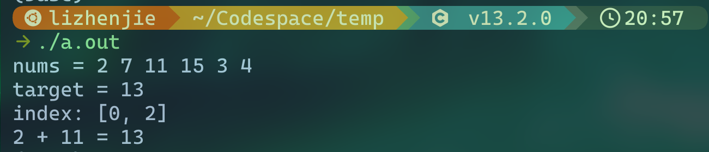
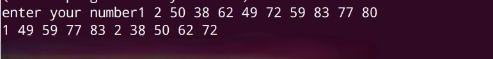
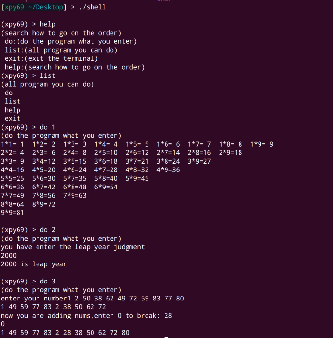

# 最后的终端改进

# 新增功能

在之前完成的终端程序中新增功能，新增程序依旧要用到<strong>函数思想</strong>来完成：

## 1.两数之和

给定一个整数数组nums（自己代码中定义一个或者自己输入一个数组都行）和一个整数目标值target（自己出一个），在该数组中找出和为目标值target的那两个整数，并返回它们的数组下标。

要求：

- 每个数只能用一次；
- 返回顺序无所谓。

<strong>PS：不要面向结果编程！！！</strong>

<strong>输出效果演示（输出格式按照这个来）：</strong>

## 2.排序

用户需<strong>输入10个整数</strong>，程序对其进行排序，奇数全在前面，偶数全在后面，并且按照从小到大的顺序输出。

<strong>例如</strong>：

输入：9  96  23  21  6  200  2  28  92  10

输出：9  21  23  2  6  10  28  92  96  200

<strong>优化</strong>：完成排序并输出后增加选择：

- 输入1可以添加新的数字加入排序，仍要求奇数全在前面，偶数全在后面，并且按照从小到大的顺序输出。
- 输入0退出排序程序。

# 参数处理

1. 不再使用原始的数字指令来调用程序，使用 do 命令调用，调用时将 program1  替换为用户程序的名字，如：do sum调用求和程序，do sort调用排序程序。

2. 添加更多指令：

    a. do [arg1]  ：[arg1]参数用于传递所执行的程序的名字

    b. list  ：列出所有可执行的程序名字

    c. help  ：列出所有Shell可执行命令与其功能描述

    d. exit  ：退出Shell程序

3. 能够将命令本身和命令的参数分开

    e. 示例：命令本身为 do ，其参数为 sum  ，执行程序1时，输入 do sum，二者可分开。

    f. 如果命令参数不含调用的程序那么就提示换一个程序，并执行list命令。

4. 为每个指令添加一个功能描述，描述自行设计，请全部以英文书写。（用于help调出查看每个命令功能）

5. 可以试着使用`fgets`函数，然后学习使用`sscanf`进行读取，用`strcmp`进行比较（<strong>用其他方式实现也是可以的）</strong>

效果如下：

> [!WARNING]
> 其中的1，2，3换成自己程序的名字，调用结果也按自己的来，英文注释部分大家按自己的想法来，不用看此处示例

> [!TIP]
> # <strong>提交</strong>
>
> <strong>完成后将源代码重命名为</strong>`Terminal3`。
