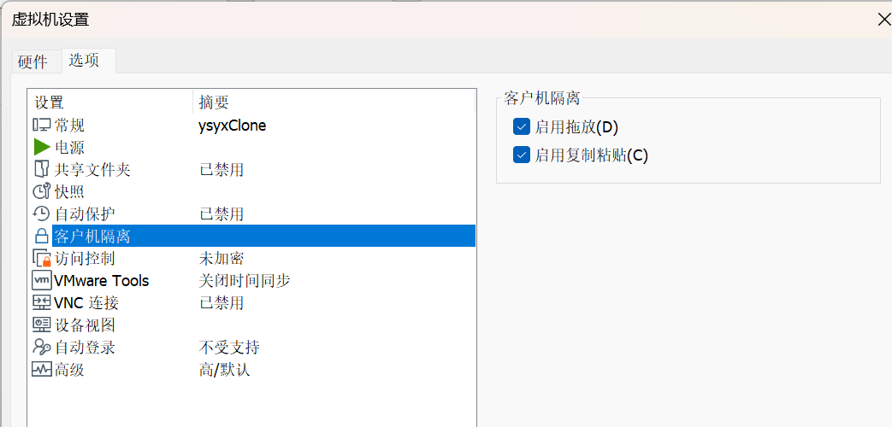

# 终端改进辅助说明

# 代码迁移及虚拟机使用共享文件夹

**（使用WSL的同学可以直接跳过，你应该STFW）**

- 正常情况下你可以直接复制文件到虚拟机，但不一定可以从虚拟机复制到主机

    - Linux的复制是`Crt``l`` + C`，粘贴是`Crtl + V`（终端里是`Ctrl + Shift + C` `Crtl + Shift + V`）

    - 具体的就是在Windows里`Ctrl + C`后在Linux文件夹界面`Crtl + V`

- 如果无法复制，在终端输入以下命令：

    ```Bash
    $ sudo apt install open-vm-tools-desktop -y    # **sudo需要你再输入你刚刚设置的密码**
    ```

检查客户机隔离选项（编辑虚拟机设置\-\>选项）



- 不过你也可以通过互联网中转的方式来让你的主机获取文件，例如在虚拟机里安装QQ，然后在QQ上进行文件的传输。

- 你也可以直接在虚拟机提交作业表单。


（如果你喜欢折腾你的电脑，可以尝试这个方法）

- 若你仍无法复制，参考下面的文档（语言可选择简体中文），创建共享文件夹

    - 阅读官方文档1：[文档1](https://techdocs.broadcom.com/us/en/vmware-cis/desktop-hypervisors/workstation-pro/17-0/using-vmware-workstation-player-for-windows-17-0/setting-up-shared-folders-for-a-virtual-machine-win/enable-a-shared-folder-for-a-virtual-machine-win.html)


    - 注：右上角可以改成中文
    
    - 阅读官方文档2：[文档2](https://techdocs.broadcom.com/us/en/vmware-cis/desktop-hypervisors/workstation-pro/17-0/using-vmware-workstation-player-for-windows-17-0/setting-up-shared-folders-for-a-virtual-machine-win/mounting-shared-folders-in-a-linux-guest-win.html)（必须操作）
    
    - 你需要阅读这两篇文档，完成共享文件夹的装载和使用。


# 中文字符乱码（学习了解即可）

根据以下链接学习字符编码与乱码原因相关内容，**之后提交的源码都要使用UTF\-8编码**（**Linux默认就是**，Devcpp默认是GB2312/GBK编码）。如果使用不匹配的编码打开文件会乱码（比如说使用UTF\-8编码方式打开GBK编码的文件）。

https://www\.paicoding\.com/article/detail/305
https://www\.hello\-algo\.com/chapter\_data\_structure/character\_encoding/

https://blog\.csdn\.net/xuan196/article/details/115127416

## 转换编码的方法

### 使用VScode进行编码转换

可以通过VScode直接转换，VScode的右下角有一个UTF\-8的选项，这就是VScode默认的编码


从GBK转成UTF\-8：

用 通过GBK模式重新打开，再用 通过UTF\-8保存，关掉你的代码文件，再重新打开就好。


