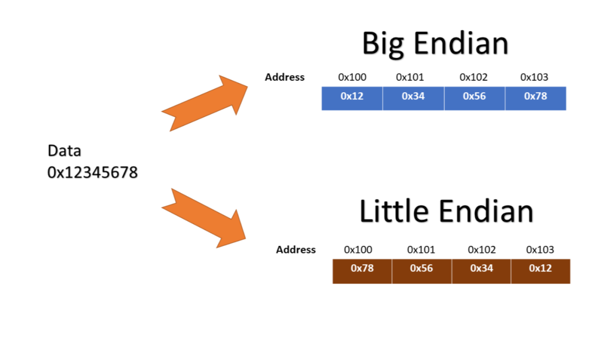
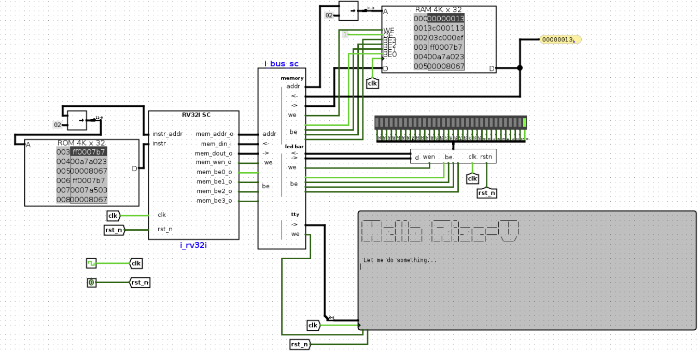

# 太理先研实验室（ACSL）寒假研学第二次学习路线

**学习情况**：掌握了部分计算机组成原理，体系结构的知识，重点知道了处理器的运行原理，并且根据sISA搭建了最简单的处理器，即使它只能运行简单的3条指令。

**学习目标**：虽然实现sCPU这个处理器确实让我们对处理器如何工作有更深入的认识，但从实用性的角度来看，sCPU由于各种限制，无法运行更复杂的程序。这周就需要更进一步，我们需要根据上周所查的RISC\-V的手册，完成一个基于riscv32e指令集的带有图片展示效果的处理器。


# 复习数电

在之前面试的时候，我们发现很多同学对于数电部分的知识是有些遗忘的，但在本周真正需要你去搭建一个处理器的时候，数电基础就显得尤为重要了，因此我们在此处提出一些数电部分的基础问题。

1. 异或门和同或门有什么区别。

2. 时序逻辑电路和组合逻辑电路的区别。

3. D锁存器与D触发器的区别。

4. D锁存器是边沿触发还是电平触发，而D触发器是边沿触发还是电平触发。

5. 异步电路和同步电路有什么区别。

6. 什么是亚稳态，为什么电路会震荡。

7. 什么是原码，反码，补码，有什么区别。

将上述问题的答案写入一份Markdown文档，放入本周作业提交的文件夹中。

# 如何RTFM

经过上周大家的反馈，大部分人都是第一次接触这种专业级别的文档，看不懂是非常正常的事，甚至于一些文章你们的学长也不一定能完全看明白，但RISC\-V手册是大家之后相对来说比较常看的手册，这里稍微简单介绍一些阅读的技巧。

1. 不要从头到尾通读，只找你目前需要的内容，带着明确问题去读，而不是“随便翻翻”。

    1. 先问自己“我现在要解决什么具体问题？”

    2. 然后去**查目录**或者**搜对应关键词或章节**。 常见问题例子与对应查找位置：

    |    我想知道什么|    去哪里找（目录）|    关键词建议|
    |---|---|---|
    |    addi 指令是什么|    第 2\.4 节 Integer Computational Instructions → I\-type|    “ADDI” 或 “I\-type”|
    |    指令的基本格式是什么|    第 2\.2 节 Base Instruction Formats|    “instruction formats”|

    3. 查找工具：Ctrl \+ F。

2. 先看表格和图，再看正文，手册里最有价值的信息往往集中在：

    - 指令格式图。例如第34章的地方几乎汇总了RV32所有的指令格式。

    - Opcode/funct3/funct7 表格。

3. 遇到看不懂的，记下来，去STFW，会有很多博主做过相应的指令解析。

    1. **注意：博客中的毕竟是夹杂着博主的个人理解，不一定百分百正确，但相对来说要好理解的多，最终指令规范请以手册为准。**


"查阅资料"是一种与领域无关的基本能力，无论身处哪一个行业都需要具备，如果你不想以后工作的时候被查阅资料的能力影响了自己的前途，从现在开始就努力锻炼吧！

这周依旧存在大量需要RTFM的地方，这也是你之后接触大型项目的必备技能。

# 拓展阅读：大端与小端：字节该怎么“排队”？

我们的 CPU 处理的数字通常很长（32 位，占 4 个字节），但内存里的每个格子很小，只能塞进 1 个字节。 这就好比你要把一个32位整数 **“0x12345678”** 存进四个只能放一个字节的小抽屉里，你得把“12、34、56、78”拆开来放。

那么问题来了：**0 号抽屉（最开头的那个）应该放 12 还是放 78？**

## **大端模式 \(Big\-Endian\)：按人类习惯存**

- **做法：** 按照我们写数字的直觉，先写最左边的那位。

- **抽屉长这样：**

    - 0 号抽屉：12

    - 1 号抽屉：34

    - 2 号抽屉：56

    - 3 号抽屉：78

- **感觉：** 非常自然。你在 Logisim 里顺着地址读过去，正好就是 `12 34 56 78`。

## **小端模式 \(Little\-Endian\)：按电脑直觉存**

- **做法：** 把数字的“尾巴”塞在最前面。

- **抽屉长这样：**

    - 0 号抽屉：78

    - 1 号抽屉：56

    - 2 号抽屉：34

    - 3 号抽屉：12

- **感觉：** 看着是反的，但在计算机眼里，它觉得这样“从低位存起”处理起来最省事。

> [!NOTE]
> # 为什么小端模式效率高？
>
> 虽然对我们人类来说，看小端序（Little\-Endian）就像在读倒过来的字，但对计算机的硬件电路来说，这种“倒着放”其实是一种**极其优雅的偷懒方式**。
>
> 1. 小端序让不同长度的数字在存储上有了**统一的“起点”。**
>
>     想象你有一个 32 位的超长数字（比如 `0x12345678`），但你现在只需要它的**最后 8 位**（也就是 `0x78`）。
>
>     - **小端序：**最低位字节永远在**最低地址（0 号抽屉）。**
>      👉 CPU 打开第一个抽屉，直接拿走。
>
>     - **大端序：**最低位在最后。
>
>         👉 CPU 还得先想：“这是 16 位？32 位？64 位？我该数到第几个抽屉？”
>
> 2. 小端更符合计算机的计算顺序。
>
> 计算机做运算时总是：**从低位开始算，再一步步向高位进位**而小端的存储方式正好是：低位字节在低地址；地址从低到高，计算从低到高 **存储顺序 = 计算顺序，**硬件自然就更容易做。
>
> 在理解了大小端的概念之后，我们就可以给出具体定义了：
>
> **Little\-Endian（小端模式）：**低位字节排放在内存的低地址端，高位字节排放在内存的高地址端。
>
> **Big\-Endian（大端模式）：**高位字节排放在内存的低地址端，低位字节排放在内存的高地址端。
>
> 用计算机的内存视角重写一遍，例如十六进制数`0x12345678`在内存中的表示形式为：
>
> ||低地址 \-\-\-\-\-\-\-\-\-\-\-\-\-\-\-\-\-\> 高地址|
> |---|---|
> |大端模式|0x12  \|  0x34  \|  0x56  \|  0x78|
> |小端模式|0x78  \|  0x56  \|  0x34  \|  0x12|
>
> 
>
> 如果混淆了大端和小端，会发生什么事？
>
> 补充几点：
>
> - 我们所用的RISC\-V便是小端模式。
>
> - RISC\-V指令本身也是小端模式存储的，这意味着即使你用调试器看内存，指令的字节顺序也是“反的”。
>
> 那么小端既然这么好，那为什么还会有大端存在呢？其实历史原因是占大头的，感兴趣可以自行STFW。
>
# 功能完备的迷你RISC\-V处理器

> [!WARNING]
> # 注意事项
> - **建议不要直接开始搭建，可以先通读一遍讲义。**
>
> - 上周要求大家认真查阅手册，既然说过本周的处理器是基于RISC\-V来搭建的，那么说明那就是本周处理器搭建的基础。
>
> - 推荐使用模块化搭建电路，毕竟只有在保证各模块正常工作的情况下，你的处理器才会正常工作，也更容易debug。
>
> - 如果你对于很多细节部分的知识依旧有不清楚的，请积极**STFW RTFM**。
>
> - 本周任务完成后即可申请**先研实验室见习学员考核\(F 考核\)**，考核在开学前会一直持续开放申请，即使考核不通过，可以重新申请，但我们鼓励大家尽快在年前通过，毕竟之后的学习之路还非常长。
>
> RV32I共有42条指令，通过实现RV32I，处理器已经足够完成绝大部分的计算工作。不过为了进一步降低开发的工作量，一生一芯提出了一个"迷你RISC\-V"的指令集minirv，即从RV32I中选出了8条指令，用它们来替代其他RV32I指令的功能，使得RV32I能完成的工作，minirv也能完成。这样，我们就不必实现完整的42条RV32I指令，也能让处理器运行更复杂的程序了。
>
> 结合上周查过的RISC\-V手册，我们在这里给出minirv这一ISA的规范, 具体如下:
>
> - PC初值为`0`。
>
> - GPR数量与**RV32E**中定义的GPR数量一致。
>
> - 支持如下8条指令: `add`, `addi`, `lui`, `lw`, `lbu`, `sw`, `sb`, `jalr`。
>
> - 其他的ISA细节与RV32I相同。
>
> 那么知道规范之后就可以正式开始了！你好，你即将前往的可是地狱啊！
>
## 只有两条指令的minirv处理器

minirv有8条指令，我们先实现其中的两条: `addi`，`jalr`。首先考虑`addi`指令：

> [!TIP]
> # RTFM\(1\)
>
> 查阅RISC\-V手册，找到`addi`指令的编码和相应的功能描述。在第34章`RV32/64G Instruction Set Listings`中有一些指令表，可以帮助你快速查阅`addi`指令的编码。
>
> 依旧从指令周期的角度阐述：
>
> ### 取指
>
> 针对取指（取指令）这个步骤，你需要改两样东西：
>
> - ROM的宽度（存储的数据有多少位）。
>
> - PC寄存器的位数（能存多大的地址）。
>
> 之前你用门电路自己搭多路选择器，已经理解它是如何工作的了。现在再搭更大的选择器其实就是重复连线，没什么新的东西可以学。所以我们建议你直接使用Logisim自带的`Multiplexer(多路复用器)`这个现成元件。你可以在左侧元件库里找`Plexers(复用器)`这个分类，拖出来用就行。放好以后双击它，就能很方便地改输入路数、数据位宽这些参数。
>
> 同样的，PC寄存器也直接使用在元件库的`Memory(存储库)`分类里找`Register(寄存器)`，关于这两种组件的具体使用方式，请RTFM。
>
> 另外再简单说一句，“存储器”这个词在两种层面都会出现：
>
> - 电路层面：就是我们现在用的ROM、RAM、Register这些元件。
>
> - ISA（指令集）层面：简单理解其实就是指CPU能通过lw/sw指令访问的那一大块内存。
>
> 内存的本质是什么？或者说内存与RAM之间的关系是什么？
>
> 你现在要思考的是：怎么用电路里的这些小存储元件（ROM，RAM，Register等），去实现ISA里说的“内存”功能。

> [!TIP]
> # RTFM\(2\)
>
> 为了了解RISC\-V对存储器的若干约定，你需要阅读RISC\-V手册第1\.4节的**第一段**，从ISA的层面了解存储器的规格，尤其是宽度的定义。
>
> RISC\-V 内存是“按字节编号的”，但你的 ROM 是“按字（4 字节）存一条指令的”。它的宽度可能是32 bit（一次读4个字节），这时候直接把PC的值当地址去选ROM的某一行，通常是对不上的。

> [!WARNING]
> # 非常重要的问题
>
> PC在sISA里是每次\+1，但在minirv里还是\+1吗？
>
> 所以你需要想一个办法，让电路层面的 ROM 能够配合RISC\-V“按字节编号”的规则正常工作。
>
> ### 译码
>
> #### 指令的译码
>
> 在这个 minirv CPU 中，取出指令后，我们要解决的核心问题是：**”如何让电路认出现在执行的是哪条指令“？**
>
> 虽然元件库里有现成的“Decoder”，但在 `minirv` 设计中，强行使用它会带来极大的麻烦：
>
> - **资源浪费：** RISC\-V 的 Opcode 为 7 位，标准译码器会有 $2^7=128$ 个输出引脚。而我们的指令集只有 8 条指令，这意味着 95% 以上的引脚都会闲置。
>
> - **分布稀疏：** 关键指令的操作码在数值上往往离得很远。
>
>     - 例如：`addi` 为 `0b0010011` \(19\)，而 `add` 为 `0b0110011` \(51\)。
>
>     - 如果使用译码器，这两个信号在物理位置上相隔 32 个引脚。在 Logisim 里连线时，你会发现线缆横跨整个屏幕，极其杂乱。
>
> 所以更推荐的做法是：**直接用比较器来判断**。
>
> 由于指令很少，我们只需要判断指令的“特征”是否符合要求。比如想知道“这是不是addi指令”，就看两条条件同时满足：
>
> - Opcode 匹配：指令的低7位（inst\[6:0\]）是不是等于addi的opcode。
>
> - 功能位匹配：指令的funct3字段（inst\[14:12\]）是不是等于addi的funct3。
>
> 写成类似这样的判断：
>
> ```Plain Text
> is_addi = (inst[6:0] == ?) && (inst[14:12] == ?)
> ```
>
> 其中`inst`表示取出的指令，`?`需要根据你查阅手册的结果来决定。你可以在元件库的`Arithmetic(运算器)`类别下找到`Comparator(比较器)`，用于方便地实现比较功能。
>
> #### 操作数的译码
>
> 大家在查手册的时候也都能看到，指令里带的立即数（imm）通常只有很少几位（比如addi里是12位），那我们要如何拿它跟寄存器里的32位数做运算呢？
>
> 那答案似乎也挺明显的，必须先把这个小数字“拉长”到32位。这个拉长的方式主要有两种：
>
> 1. **零扩展**（zero\-extend）：高位全部补0
>
>     例如：`0000 0000 0001`（12位） → `0000 0000 … 0000 0001`（32位）
>
>     什么时候用？请 RTFM。
>
> 2. **符号扩展**（sign\-extend）高位全部填充原来的最高位（符号位） 例子： 
>
>     1. 正数`0000 0000 0111` → `0000 … 0000 0111`。
>
>     2. 负数`1111 1111 1000` → `1111 … 1111 1000`。
>
>     你可以在元件库的`Wiring(线路)`类别下找到`Bit Extender(位扩展器)`，可根据配置实现不同的扩展方式。
>
> 符号拓展前后，补码的真值是否保持一致？为什么？
>
>
>
> ### 执行
>
> 针对执行过程，你可以在元件库的`Arithmetic(运算器)`类别下找到`Adder(加法器)`，用于方便地实现加法功能。
>
> ### GPR 和 PC
>
> 对于GPR，其设计思路和之前类似，不过你可以使用元件库中的`Register(寄存器)`，`Multiplexer(多路复用器)`和`Plexers(复用器)`类别下的`Decoder(译码器)`来帮助你节省设计的工作量。特别地，译码器中可将`Include Enable?(包含使能?)`属性配置为`Yes(是)`，此时译码器将多出一个`Enable(启用)`端口，你可以考虑如何使用它方便地实现写使能的功能。此外，在RISC\-V中，`R[0]`的功能比较特殊，你还需要考虑如何正确实现它。
>
> 由于GPR需要进行较多的连线工作，为了减轻大家的负担，我们准备了一个预先完成大量连线工作的[GPR子模块](https://ysyx.oscc.cc/slides/2407/resources/code/logisim/GPR.circ)。下载后，通过Logisim打开文件`GPR.circ`，即可看到GPR的电路设计，你可以整体选择这个电路后，通过复制和粘贴将其加入到你工程中。不过，这个电路并没有实现GPR的完整功能，你需要根据你对GPR的理解完善它。
>
> 手册中对于PC规定为**32位**（4字节），由于RISC\-V的指令位宽与sISA不同，因此你还需要思考如何更新PC，才能让PC正确地指向下一条指令。

> [!TIP]
> # RTFM\(3\)
>
> 查阅RISC\-V手册，找到`jalr`指令的编码和相应的功能描述。

> [!TIP]
> # 实现两条指令的minirv处理器
>
> 理解`addi`和`jalr`指令的功能后，根据你之前设计sISA处理器的经验，尝试设计一个支持这两条RISC\-V指令的处理器。
>
> 为了帮助你对处理器进行简单的测试，我们准备了如下测试程序。在下面的汇编指令中，GPR采用了**ABI助记符\(mnemonic\)**，名称更能反映其功能，例如，用`zero`表示编号为`0`的GPR。汇编指令中还有`a0`和`ra`，你可以通过解析相应的指令编码得知对应的GPR编号。
>
> 尝试通过指令集的状态机理解这个程序的功能。理解后，将程序放置在**ROM**中，并尝试运行你的处理器，然后检查处理器的运行结果是否符合预期。
>
> ```Plain Text
> 00000000 <_start>:
>    0:        01400513                  addi        a0,zero,20
>    4:        010000e7                  jalr        ra,16(zero) # 10 <fun>
>    8:        00c000e7                  jalr        ra,12(zero) # c <halt>
>
> 0000000c <halt>:
>    c:        00c00067                  jalr        zero,12(zero) # c <halt>
>
> 00000010 <fun>:
>   10:        00a50513                  addi        a0,a0,10
>   14:        00008067                  jalr        zero,0(ra)
> ```

> [!TIP]
> # 测试addi指令
>
> 在上述测试程序中，`addi`指令的立即数比较小。为了测试**符号扩展**的实现是否正确，你需要让处理器执行一些立即数为负数的`addi`指令。尝试编写若干条这种类型的`addi`指令，并放置到ROM中，检查你的实现是否正确。
>
> ## 实现完整的minirv处理器
>
> 接下来，我们考虑如何实现minirv的剩余6条指令。RTFM后你会发现，`add`指令的功能与sISA中的`add`指令非常类似，因此不难实现。而对于`lui`指令，则和sISA中的`li`指令很相似，只不过要考虑不同类型的立即数格式。

> [!TIP]
> # 实现完整的minirv处理器（0）
>
> 实现`add`和`lui`指令。实现后，尝试编写一些简单的指令序列放置到ROM中，来初步检查你的实现是否正确。
>
> 不要用AI来帮你写指令，血的教训，AI写的全是错的。
>
> 剩余的4条指令都是访存指令，它们都需要访问存储器。访存操作分为读内存\(load\)和写内存\(store\)两种。由于store指令需要写入内存，因此ROM无法满足这一要求，我们需要采用RAM。
>
# RAM

我们使用Logisim提供的`RAM`组件，你可以在元件库的`Memory(存储库)`类别下找到它。实例化后，你需要按照以下配置修改其中的一些关键参数:

- Address Bit Width\(地址位宽\) \- 根据后续的程序大小和你的理解进行配置

- Data Bit Width\(数据位宽\) \- 32

- Enables\(启用方式\) \- Use byte enables\(使用字节启用\)

- Ram type\(RAM型\) \- non volatile\(非易失性\)

- Use clear pin\(使用清除销\) \- No\(否\)

- Trigger\(触发器\) \- Rising Edge\(上升沿\)

- Asynchronous read\(异步读取\) \- Yes\(是\)

- Read write control\(读写控制\) \- Use byte enables\(使用字节启用\)

- Data bus implementation\(数据总线实现\) \- Separate data bus for read and write\(用于读写的独立数据总线\)

RAM组件的端口包括: 读写地址`A`，写使能`WE`，读使能`OE`，字节写使能`BE0`，`BE1`，`BE2`，`BE3`， 写数据`D`\(输入\)，读数据`D`\(输出\)，以及时钟。在进一步考虑如何将RAM接入处理器的数据通路前，你还需要了解RISC\-V对存储器的约定，以及相应访存指令的具体行为。

> [!TIP]
> # RTFM\(4\)
>
> 查阅RISC\-V手册，找到`lw`，`lbu`，`sw`和`sb`这4条指令的编码和相应的功能描述。手册中还介绍了`EEI`和不对齐访存的相关内容，目前暂不使用，因此你可以忽略这些内容。
>
> `lw` 指令实现起来比较简单：先计算出要访问的内存地址，然后把这个地址连到 RAM 上，并让 RAM 的读使能信号`OE`生效，这样就能从对应地址读出数据了。这和之前讨论的取指令过程很像，不过电路层面的存储器设置和 ISA 层面的定义有点不一样，你需要想想怎么正确连地址线。另外，因为读操作不会改动存储器的内容，为了简化设计，你可以一直让`OE`保持生效状态。
>
> `sw`指令的实现也挺容易的，除了要处理不同类型的立即数格式，还需要连上要写的数据、写使能信号和字节写使能信号。因为写操作会改变存储器的内容，所以只有在执行 store 指令时，才把写使能设为生效。字节写使能的作用是控制一个字（通常是 4 字节）里哪些字节要更新，没使能的字节就不会被改动。关于怎么给`sw`指令设置正确的字节写使能，就留给你自己想一想了。

> [!NOTE]
> # 不对齐访存
>
> 如果访存地址`addr`除以访存指令的数据位宽`w`，余数为`0`，则表示此次访存是对齐的。对于`lw`和`sw`，有`w = 4`，因此如果满足`addr % 4 == 0`\(`%`为求余操作\)，则访存是对齐的；如果不满足，则访存是不对齐的，类比一下：
>
> **把内存想象成一个“大柜子**”
>
> 假设你有一个储物柜，这个柜子被设计成一排排整齐的小格子。每个格子的大小都一样，并且都有一个门牌号（地址）。
>
> - 每个格子可以放 1个玩具（代表 1个字节）。
>
> - 如果你要存或取 1个玩具，你可以打开任何一个格子门，这很简单。这就像电脑访问 1个字节，从任何地址开始都行。
>
> **当你需要存取“一套玩具”时**
>
> 现在，假如你有一套乐高城市套装，它很大，需要连续占用4个格子才能放下（相当于电脑里的一个字 = 4个字节）。你选择了从 0号、4号、8号、12号\.\.\. 这些编号开始放。
>
> 为了高效和方便，柜子设计了一个规矩：
>
> 要存/取这套4格玩具，你必须从编号是“4的倍数”的格子开始放/拿走。
>
> 如果你从想从 1号、5号、9号\.\.\. 这些编号开始取走，标准RISC\-V的处理器就直接报错并交给你的操作系统进行处理了，而一些高级设计内部会自动帮你分成2次操作，比如先抓5\-7号格子，再抓8号格子，然后自己拼起来。
>
> ```Assembly language
> 内存地址:  0x...00   01   02   03   04   05   06   07   08   09   0A   0B   0C ...
>            ┌────┬────┬────┬────┬────┬────┬────┬────┬────┬────┬────┬────┬────┐
> 对齐访存：  │ B0 │ B1 │ B2 │ B3 │ B4 │ B5 │ B6 │ B7 │ B8 │ B9 │ BA │ BB │ BC │  
>            └────┴────┴────┴────┘                   └────┴────┘
>            ┌───────────────────┐                   ┌─────────┐
>            │       4字节       │                    │  2字节  │
>            └───────────────────┘                   └─────────┘
>               ↑ 地址 0x...00 (4字节对齐)               ↑ 地址 0x...08 (2字节对齐)
>
>            ┌────┬────┬────┬────┬────┬────┬────┬────┬────┬────┬────┬────┬────┐
> 不对齐访存：│ B0 │ B1 │ B2 │ B3 │ B4 │ B5 │ B6 │ B7 │ B8 │ B9 │ BA │ BB │ BC │  
>                 └────┴────┴────┴────┘         └────┴────┘ 
>
>                 ┌───────────────────┐         ┌─────────┐
>                 │       4字节       │          │  2字节  │
>                 └───────────────────┘         └─────────┘
>                      ↑ 地址 0x...01           ↑ 地址 0x...07
>                      (mod 4=1，不对齐)         (mod 2=1，不对齐)
> ```
>
> **本次任务不考虑不对齐访存的情况。**

> [!TIP]
> # 实现完整的minirv处理器（1）
>
> 实现`lw`和`sw`指令，然后编写一些简单的指令序列放置到ROM中，来初步检查你的实现是否正确。特别地，你可以用鼠标右键点击RAM组件，然后通过`Edit Contents`在RAM中放置一些数据，来帮助你测试访存指令的行为。
>
> `lbu`指令只需要读出一个字节，但RAM的宽度比一个字节大。你需要根据具体的访存地址，从读出的数据中选择出相应的字节，并写回目的寄存器。

> [!TIP]
> # 实现完整的minirv处理器（2）
>
> 实现`lbu`指令，并通过一些指令序列来初步检查你的实现是否正确。

> [!NOTE]
> # tips
>
> 你可以先在RAM中放置一个4字节的数据`0x12345678`，并通过`lw`指令读出它\(假设数据位于内存地址`a`\)，确认读出结果为`0x12345678`。然后通过若干条`lbu`指令分别从内存地址`a`, `a+1`, `a+2`, `a+3`中读出数据，我们预期这些`lbu`指令分别读出`0x78`\(对应地址`a`\)，`0x56`，`0x34`，`0x12`\(对应地址`a+3`\)。
>
> `sb`则相反, 它只需要往目标地址写入一个字节，因此需要通过具体的访存地址生成合适的字节写使能信号，从而控制哪一个字节被写入。

> [!TIP]
> # 实现完整的minirv处理器（3）
>
> 实现`sb`指令，并通过一些指令序列来初步检查你的实现是否正确。

> [!NOTE]
> # tips
>
> 你可以先在RAM中放置一个4字节的数据`0x12345678`，并通过`lw`指令读出它\(假设数据位于内存地址`a`\)，确认读出结果为`0x12345678`。然后通过若干条`sb`指令分别往内存地址`a+3`，`a+2`，`a+1`，`a+0` 中写入`0x90`\(对应地址`a+3`\)，`0xab`，`0xcd`，`0xef`\(对应地址`a`\)；写入之前，可以通过`addi`指令配合零号寄存器，来向目的寄存器写入一个立即数，从而实现sISA中`li`指令的效果。最后再次通过`lw`指令读出新数据，我们预期读出结果为`0x90abcdef`。
>
> 你已经完成了完整的minirv处理器，现在为了更全面地测试它，需要在上面运行更多、更复杂的程序。之前我们都是手动写指令序列，然后一条条放进ROM里，但如果程序规模大了，这种方法就很麻烦了。为此，我们准备了一些C程序，并把它们编译成minirv的指令。你可以点击[这里](https://ysyx.oscc.cc/slides/resources/archive/logisim-bin.tar.bz2)下载编译结果（`.hex`文件，能直接被Logisim加载）和反汇编文件（`.txt`文件）。
>
# ROM

这些程序的指令很多，为了快速把指令序列放进ROM，我们建议用Logisim的ROM组件。你可以在元件库的`"Memory"(存储)`类别下找到它。放好组件后，需要改一些关键参数：

- Address Bit Width（地址位宽） \- 根据程序大小和你自己的理解来设置

- Data Bit Width（数据位宽） \- 32

- Line size（行大小） \- Single（单行）

- Allow misaligned?（是否允许未对齐？） \- No（否）

以mem程序为例，用鼠标右键点击ROM组件，选择`"Load Image"(加载图像)`，然后选`mem.hex`文件。这样就把`mem.hex`里的内容按顺序加载到ROM了。其实，`.hex`文件不只包含程序的指令，还包含程序要处理的数据。程序会用访存指令访问这些数据，所以我们还需要把`.hex`文件加载到RAM里，操作和ROM差不多。这相当于把同一个`.hex`文件同时加载到ROM和RAM，导致ROM里有数据，RAM里有指令。但程序本身的设计保证了它不会乱访问RAM里的指令，也不会把ROM里的数据当成指令来执行，所以不会影响程序的正确运行。

这些程序运行时需要执行很多指令，为了检查程序是否正确运行，我们需要验证两点：

1. 程序已经运行结束。对于这点，我们让程序在结束时进入一个死循环，在指令层面就是不断重复几条指令。但每个程序结束的时间不确定，所以我们给出相应程序结束需要的周期数。你可以额外做一个64位的计数器，每个周期加`1`，当计数器超过给定的周期数，就认为执行结束了，然后检查第二点。

2. 程序的结束状态符合预期。对于这点，我们让程序结束时的PC值总是靠近一个叫halt的函数。具体来说，当第一点满足时，看看当时的PC值，在反汇编文件里找这个PC，你应该看到它在halt函数附近。另外，程序结束时a0寄存器的值应该是0，也就是说，当第一点满足时，检查a0应该是0。

> [!TIP]
> # 在minirv处理器上执行C程序
>
> 分别加载并运行`mem.hex`和`sum.hex`。运行指定时间后，检查处理器的状态，若PC位于`halt`函数附近，且`a0`寄存器为`0`，则说明程序运行正确\. 两个程序的预期运行时间如下：
>
> - `mem.hex` \- 6000周期
>
> - `sum.hex` \- 6000周期
>
> 如果你发现运行指定时间后，PC位于其他位置，或`a0`寄存器不为`0`，则说明程序运行错误。但由于这个过程中已经运行了上千条指令，很难发现是哪一条指令执行出错，因此我们还是推荐你做好上一道必做题的验证工作，通过一些简单的指令序列来检查你的处理器实现是否正确。
>
> ## debug技巧
>
> 往届很多学长学姐对于这里的的bug感到非常棘手，一上来直接运行大程序（例如mem\.hex，sum\.hex），跑完发现不对，然后对于debug无从下手？这里提供两种思路：
>
> ### 手册理解
>
> 是否对手册上指令的理解有误，如果从一开始的理解出错了，那就更不用谈之后的实现了，尤其是对于访问内存这4条指令，是非常容易出现错误的，如果还不会RTFM请参照本周讲义最开始的[如何RTFM](https://tqdy06h5fq.feishu.cn/docx/C88pdcbEfotxhVxqR6JcbnWfnOc#share-ERTxdDi3zoGGc5xZxA0chdmrncC)。
>
> ### 写指令测试集
>
> 在学过汇编与RISC\-V指令的现在，你完全可以根据规范自己写一串关于你实现的处理器运行的测试集，这个测试集可能只有简单2\~3个指令，但却可以帮你看出来某个指令是否有错误。
>
> 这也是我们tips中一直在提醒大家的事，毕竟只有你发现问题之后才知道如何去解决。
>
> ### Difftest
>
> Differential Testing（差分测试），核心思想就是找一个完全正确的处理器和你自己的处理器搭在一起，取指之后将指令分别输入2个处理器同时进行处理，输出的结果搭建比较器进行比较，这样在哪一步出现不一样的结果就说明是这一步指令出的问题，方便你针对特定指令发现问题。
>
> https://github\.com/meiniKi/RV32I\_SC\_Logisim/tree/main（需要魔法上网）
>
> 
>
> 这个是github上的一个基于riscv32i搭建的单周期处理器，你可以不用管它的其他设备，只把他的核心处理器拉出来，从同一个ROM中读出指令，分别在2个处理器中运行，如果得出的结果一致，则该指令实现正确，如果在某一步出现不一致的情况，则说明该步指令的实现错误。
>
> 但同时连接16个寄存器也太麻烦了，你可以换一个角度来考虑，从写地址，读地址，写数据，读数据，寄存器地址的地方来进行比较。
>
> ## 为minirv处理器添加图形显示功能
>
> 你已经实现了minirv的处理器了，原则上来说，RV32I指令集能完成的功能，这个处理器也可以完成。接下来我们给这个minirv处理器添加一个"屏幕"，并通过运行程序在这个屏幕上显示一张图片。
>
# RGB

你需要在Logisim中实例化一个屏幕组件，你可以在元件库的`Input/Output(输入/输出)`类别下找到`RGB Video(RGB视频)`组件。实例化后，你需要按照以下配置修改其中的一些关键参数：

- Cursor\(光标\) \- No Cursor

- Reset Behavior\(重置行为\) \- Asynchronous

- Color Model\(颜色模式\) \- 888 RGB \(24 bit\)

- Width\(宽度\) \- 256

- Height\(高度\) \- 256

实例化后可以看到，`RGB Video`组件包含以下端口：时钟，复位，写使能，X坐标，Y坐标，以及待写入像素数据\(要写的像素颜色\)。不难得知，其功能是：在写使能有效时，将像素数据更新到组件的X\-Y坐标处。接下来我们需要考虑的是，处理器如何通过指令来向`RGB Video`组件写入像素。

### 外设

对于处理器来说，类似这种`RGB Video`的部件叫做外部设备，简称"外设"，他们一般不参与处理器的运算，但可以拓展计算机的功能。例如大家经常用的键盘，耳机，游戏手柄，这些外设装备各有各的用途，他们能够为不同的场景提供便利。而**如何访问外设**是属于ISA规范里的一部分。

具体到RISC\-V，访问外设是通过**"内存映射I/O"\(Memory\-mapped I/O\)**方式来进行的，举个例子：

我们假装屏幕也是一块“内存”，给它分配一段地址。

- 这一块地址与屏幕上的像素点一一对应。

- 程序用指令往这个地址范围写数据 → 实际上就是在往屏幕写像素。

- 往其他地址写 → 还是写到普通的 RAM。

所以我们需要一个“地址裁判”来判断：“这个地址是给屏幕的，还是给 RAM 的？这种方式的本质是，根据访存地址的范围来决定处理器的访问对象是内存还是外设。

### Logisim实现

具体到`RGB Video`中，根据上述配置，一个像素数据占3字节。但为了方便处理，我们可以将其视为4字节。这样，整个屏幕所存储的像素数据大小为`256x256x4B=256KB`。我们约定屏幕上的每个像素数据对应的地址是连续的，因此我们需要为整个屏幕的像素数据划分出一段连续的地址区域，例如`[0x20000000, 0x20040000)`。当访存指令的目标地址落在这个范围之内，相应指令将访问`RGB Video`，而不是访问RAM。

而"地址裁判"则可以在数据通路里加一个模块，输入一个访存地址（mem\_addr），输出两个信号：

- 当`mem_addr`在 \[0x20000000, 0x20040000\) 范围内，`isVGA` = 1。

- 当不在这个范围（也就是正常内存），`isMem` = 1。

对`RGB Video`来说

- 只有 **是 store 指令** 并且 **isVGA == 1** 时，才让 RGB Video 的`we`= 1

- sw 要写的数据（32 位）直接连到 RGB Video 的 data（低 24 位就够用，高 8 位忽略或补 0）

> [!NOTE]
> # X 和 Y 坐标怎么来？
>
> 这其实也不难理解，因为我们约定地址是连续的，像素从左到右、从上到下排： 
>
> 地址`0x20000000` → \(x=0, y=0\) 
>
> 地址`0x20000004` → \(x=1, y=0\) 
>
> \.\.\.
>
> 地址`0x20000408` → \(x=2, y=1\) 
>
> \.\.\.
>
> 每行 256 个像素，所以每行占 256×4 = 1024 字节
>
> 对RAM来说，其写操作也需要受到`isMem`信号的控制，从而避免在访问`RGB Video`时错误地往RAM中写入。

> [!TIP]
> # 添加图形显示功能
>
> 在处理器的数据通路上添加`RGB Video`组件。我们约定，屏幕像素对应的存储区域是`[0x20000000, 0x20040000)`。
>
> 添加组件后，加载并运行`vga.hex`程序。这个程序的预期运行时间是628000周期，你可能需要等待1\~2分钟\(4\.0\.0版本的Loigisim，如果是3\.8\.0的可能需要半小时以上\)。如果你的实现正确，你将看到程序运行结束时，`RGB Video`组件中显示"一生一芯"logo。
>
> ## 迈向现代化的处理器设计
>
> 到此为止，你已经亲手用‘连线’的方式赋予了这块虚拟芯片灵魂。恭喜你，你已经成功在 Logisim 中设计出一个真正实用的处理器了。但你会发现，随着指令增多，Logisim 的画布已经快放不下了，仿真速度也变得像幻灯片一样卡顿。这正是人类计算机发展史上的共同困境：**我们不能永远靠‘手工织布’来造衣服。**在 Logisim 中设计处理器有很多缺陷：
>
> - **设计繁琐。**虽然拖动元件和连线让你确实有设计电路的感觉，但当设计的规模增加后，这些操作将会变得繁琐。目前你设计的 minirv 处理器只有 8 条指令，但完整的 RV32I 有 42 条指令；而要实现一个可以启动现代操作系统的 RISC\-V 处理器，需要实现上百条指令；如果考虑现代的 Intel 和 ARM 这些成熟的商业处理器，它们需要支持上千条指令，光是 ISA 手册就有几千页，芯片的晶体管数量更是到达几百亿的量级。
>
> - **仿真速度慢。**一方面，Logisim 的仿真效率本身就不高，而随着设计规模变得复杂，仿真速度也会因为元件数量增多而变得越来越慢。另一方面，虽然 minirv 原则上可以实现 RV32I 指令集的所有功能，但为了这一点，我们将那些不属于 minirv 中的 RV32I 指令翻译成行为等价的几条甚至几十条 minirv 指令，也即，对于一个程序，相比于将其编译到 RV32I，将其编译到 minirv 的执行效率将会降低数倍甚至数十倍。从目前的仿真情况来看，通过执行程序在 RGB Video 组件中显示一张 256×256 的图片，都要花费 1～2 分钟。即使 minirv 具备运行超级玛丽游戏的潜能，游戏体验也会因为仿真效率过低而变得难以忍受。
>
> - **调试困难。**只要在设计过程中不小心连错了一根线，处理器运行程序的结果就可能不符合预期。如果程序规模不大，我们还能逐条指令地检查处理器的执行状态是否与 ISA 的状态一致；但对于上面的 mem\.hex 和 sum\.hex，就已经要执行 6000 多条指令；而 vga\.hex 甚至要执行 628000 条指令，要找到哪一条指令的执行不符合预期，是非常困难的；如果要运行超级玛丽，执行的指令数量将会是一个天文数字！而在这么多的指令中找到错误，简直比大海捞针还难！
>
>
>
> 在接下来的学习中，我们将告别鼠标连线，转向更现代、更强大的**硬件描述语言（HDL）**。你将体验到像写程序一样‘写’出一个拥有上亿晶体管的怪物处理器。准备好告别图形界面，进入真正的专业领域了吗？”

> [!NOTE]
> # **作业提交**
> 1. 提交你们用Logisim搭建的`minirv`，提交保存后的`main.circ`文件即可，并将这个文件复制到`姓名-专业班级-Great-11`文件夹中。
>
> 2. 数电部分回答所整理的**Markdown**文档也放在上述文件夹里。
>
> 3. 如果你学有余力完成了下面的拔高内容，则把文件夹重命名，格式为`姓名-专业班级-NewStar-11`。
>
> 4. 将你的作业压缩为zip格式并提交到[作业提交表单](https://fa45epzd9c7.feishu.cn/share/base/form/shrcn50PJnEOqpQkdlo8LXcB7Zc)。
>
> 5. 本次作业结束之后，复习好数电基础，计组，体系机构（只会涉及讲义基础部分知识），即可申请F阶段考核了，详情请参照[ACSL【F阶段考核】申请指南](https://tqdy06h5fq.feishu.cn/docx/NNT6do1JIoaCKjxZfcFcvmkQnwd?from=from_copylink)，以及[考核申请链接](https://fa45epzd9c7.feishu.cn/share/base/form/shrcnPF6dxfOb3aLcmuoSTiTv1B)，考核通过之后即成为先研实验室正式成员。
>
# 拔高内容

## 数据结构

想必有不少同学之前或多或少都做了不少lcthw的内容，你可能会产生这样的疑惑：“这玩意怎么这么难，这都是怎么想到的，学不会啊”，这是因为lcthw要求你的相关思想和基础都很过关，但是**缺少了数据结构——考研408之一**，做lcthw很多内容会**极度痛苦**，同时不理解堆栈的相关概念将使得计组的学习举步维艰。

那么接下来的一部分路线就是：**学习数据结构，补足缺下的知识和思想，再去完成lcthw。**

在这一部分学习过程中，我们会学到线性结构的所有知识，关于**栈，堆，队列，链表，表达式求值**等等；同时这些知识很快我们就会在lcthw中进行实践。

> [!TIP]
> # 数据结构
>
> 我们推荐下列方式进行数据结构的学习，可以选择适合自己的方式：
>
> 1、b站视频学习
>
> https://www\.bilibili\.com/video/BV1tNpbekEht/?spm\_id\_from=333\.337\.search\-card\.all\.click\&vd\_source=0ec8697614b7c28a28c8b55a23639096
>
> 具体的，你需要查看3\-7节，如果你对前面的基础概念有遗忘或疑惑，也可以查看前两节。
>
> 2、可视化网站
>
> https://www\.hello\-algo\.com/chapter\_array\_and\_linkedlist/linked\_list/
>
> 3、书籍
>
> 这里推荐《大话数据结构》，是一本通过可视化描述来介绍抽象数据结构的书籍，如果你对数据结构不敏感，不妨看看其中的例子，飞书群文件中可以找到。
>
> 我们目前只需要学习到有关**栈，堆，队列，链表，表达式求值**的知识，依旧是提交你的**Markdown**笔记。
>
> ## Learn C the hard way
>
> **这是“一生一芯”的必须完成部分如下**：
>
> 
>
> 虽然一生一芯的讲义划定了学习的范围，但想要技术很强的话，我们建议都可以试着去学习。

> [!TIP]
> # Learn C the hard way
>
> 其中的**26、37\-41、43、45\-47不需要学习**，性价比比较低，不推荐学习，**其他内容我们都很推荐学习**，想要技术很强的话，都可以试着去学习，并在其中锻炼自己gdb等debug工具使用和相关能力思维。
>
> 【Learn C the hard way】：https://wizardforcel\.gitbooks\.io/lcthw/content/preface\.html
>
> 将你完成的所有练习放入一个名为`lcthw`的文件夹，并将该文件夹放入作业提交文件夹中。
>
> ## 计算机组成原理
>
> 寒假第一周的基础部分其实已经涉及到一点计算机组成原理的知识，但大部分都是我们提取出大家需要马上实践的部分来学习，仅仅是这个庞大科目的冰山一角，如果你学有余力，想要系统性的学习计组，请参考下面。

> [!NOTE]
> # 学习内容
>
> 记得随手typora记录笔记和继续自己的学习记录哦！（所有指令是不需要大家记忆的，需要用到的时候查手册即可），我们提供了2门视频课程，请同学们结合自己的实际选择。
>
> [计算机组成原理/计算机组成与设计](https://www.bilibili.com/video/BV1Ba4y1V7GD/?vd_source=4ec31615294fd2510d5fd40f0183648f)（**CH3\-CH4的内容学习，**该课程体系完善，效果好，但理解起来较为困难）
>
> [王道计算机考研 计算机组成原理](https://www.bilibili.com/video/BV1ps4y1d73V?p=45&vd_source=a0f18116091f002e00fcf6cb57719ced)（**第三章，第四章的内容学习，**该课程更为通俗易懂，对于0基础学生更为友好）
>
> 两门课程的知识学习顺序不一样，但最终学习到的知识是一样的，**具体的指令是不需要你学习的，我们之后用的是RISC\-V的指令集，视频中的了解即可，**依旧是提交你的**Markdown**笔记。
>
# 注意

第一个视频课程是使用教材为**MIPS指令集版本**，我们基础部分讲述的与之后设计芯片，使用的是**RISC\-V指令集版本**，但是考虑到该课程体系完善，效果好，指令集思想是相通的，因此我们仍然选择了该视频课程，配套书籍为黑皮书：计算机组成与设计：硬件软件接口，图示如下（**飞书群内有电子版资料**），想搭配书籍的同学可以参考——不推荐纯看书，黑皮书阅读难度大，知识点深而且广，很难理清知识点。

因此，**也可以选择更适合你的计组课程或者硬啃黑皮书**，学到知识就好


**难度这么高几乎无法完成，那拔高作业布置这么多是为什么？**

1. 想让大家明白自己要学的内容还有很多。

2. 让大家可以自由选择拔高的学习内容，以上两项，皆可自由选择学习，不存在非常强烈的关联先后关系。

3. 并没有要求大家拔高作业全部完成，而是根据自己情况，可以完成多少就完成多少。

**也请大家劳逸结合，考虑自己的能力和精力，合理学习，不要为了求快，去燃烧自己的热情与生命，这样是非常得不偿失的**

