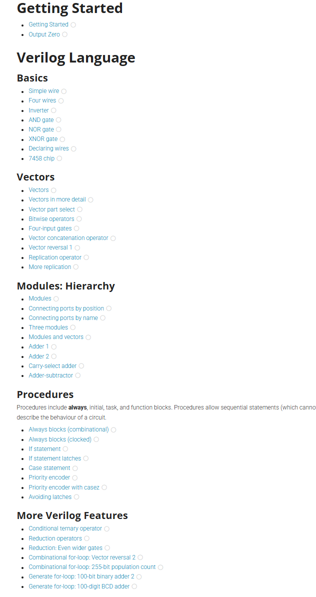
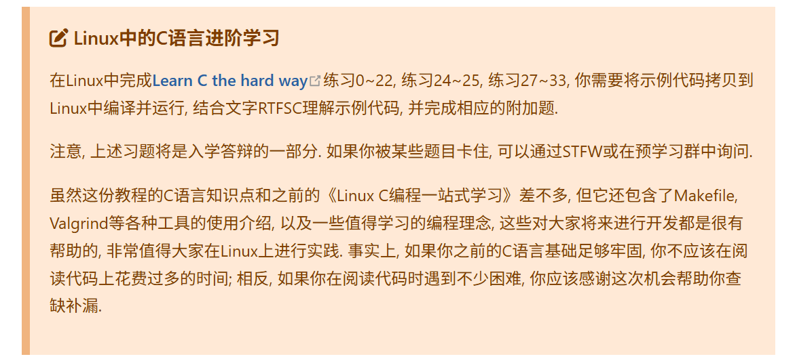

# 太原理工大学先进计算机系统实验室（ACSL）寒假研学第三次学习路线

**学习情况**：根据所查的RISC\-V的手册完成一个基于riscv32e指令集的带有图片展示效果的处理器。并且已经通过见习学员考核，成为了正式学员。

**学习目标**：我们将告别连线，转向更现代、更强大的**硬件描述语言（HDL）**。我们将体验到像写程序一样‘写’出一个拥有上亿晶体管的处理器。准备好进入真正的专业领域了吗？除此之外还有LCTHW实战，有能力的同学彻底完结计组知识。

# 数字设计

在亲身体会过Logisim之后，你应该也或多或少体会到Logisim并不适合设计更复杂的电路。事实上，现代处理器都是通过**硬件描述语言（Hardware Description Language，HDL）**来设计的，接下来，我们将来学习如何通过HDL来设计数字电路。

我们在这之前学习了C语言，markdown，或许有人还学了一部分shell脚本语言；但我们今天要开始学习一门全新且与众不同的，用于**硬件编程**的语言——Verilog。

## 什么是硬件编程

我们先用最直白的方式，和大家之前学过的 **C语言（软件编程）**做对比：

**一句话总结两者的本质区别：**

- **软件编程**：用代码告诉**已存在的硬件**去干什么。

- **硬件编程**：用代码**定义出新的硬件**应该长什么样、做什么事。

当你写下 Verilog 代码时，你实际上是在用一种语言去描述：哪些寄存器存在、数据如何在它们之间流动、这些流动在时钟的驱动下如何发生变化。这种思维方式和软件编程有本质区别，但也正是这种区别，让 Verilog 成为连接“想法”与“真实硅片”的关键工具。而Verilog代码的核心在于描述了数据在寄存器之间传递时是如何转换的，因此也被称为`RTL`代码，即**寄存器传输级（Register Transfer Level，RTL\)***。*

那为什么会有这么一门专门用来描述硬件的语言呢？

## **为什么会有这样一门语言**

还记得当时的宣讲会吗？随着**集成电路规模越来越大，电路越来越复杂**，传统的画图或连线的设计方法已不再适用；于是人们开始思考：能不能像写程序一样，用**文字代码**来描述整个电路呢？此时就诞生了这样一门硬件编程语言，利用**代码生成庞杂的电路**。使用过Logisim的你们应该体会更深，当电路稍微复杂一点，连线就乱成一团，修改非常痛苦，也几乎没办法做版本管理或多人协作。

## **Verilog的实际应用与价值**

- 设计者可以通过编程来实现加法器、计数器、寄存器等基础电路，同时也能够设计出CPU、存储器等复杂系统。这个过程中，设计者不仅能够提高自己的逻辑思维能力，还能学会如何优化电路设计，使之高效运行。

- 编写仿真测试。验证自己设计的电路没有致命问题，如果开始生产才出现问题，那就浪费了极大的金钱成本。

- 支持**两大主流硬件实现方式：**

    - **现场可编程逻辑门阵列\(Field\-Programmable Gate Array，FPGA\)**：快速验证、灵活修改、适合原型开发和小批量产品。

    - **专用集成电路\(Application\-Specific Integrated Circuit，ASIC\)**：通过定制化设计实现特定功能的最大化效率、适合大规模量产（如手机芯片、AI 芯片、汽车芯片等）。

    - 这两种技术几乎支撑了当今所有高性能、定制化的电子产品，而 Verilog 正是连接“代码”与“真实硅片”的关键桥梁。

- 多领域发展，包括但不限于**嵌入式系统**、**人工智能**、**物联网**等前沿技术领域。

    - **嵌入式系统**中经常会用到FPGA来处理特定的高速或并行计算任务，而Verilog则是实现这一目的的关键工具。

    - **人工智能**领域，Verilog可以用来设计高效的机器学习硬件加速器。

    - **物联网设备**也常常需要低功耗且高性能的定制电路，Verilog编程在这里同样发挥着重要作用。

你现在应该明白这一门语言的特殊性和重要性了，如果还是没什么头绪的话的话，可以看一下这个视频：30分钟了解verilog特性：[verilog入门视频](https://www.bilibili.com/video/BV1PS4y1s7XW)。

# 学习Verilog

我们推荐下列方式进行Verilog的学习，可以选择适合自己的方式：

1. b站视频学习：

    https://www\.bilibili\.com/video/BV1cZ4y157XS?（第一次学习建议先看这个，细节更多）

    https://b23\.tv/9vrb7DV （全是语法知识，非常简短）

2. 书籍：

    Verilog HDL数字设计与综合（飞书**群文件中有电子版**）**第2\~7章（所有延迟相关的知识都可以不用看，比如forever循环，并行块，命名块等等\)。**

3. 博客：

[Verilog实践部分文档学习](https://vlab.ustc.edu.cn/guide/doc_verilog.html)（可以在这上面直接学习相关的语法\)。

本周你需要完成[HDLBits](https://hdlbits.01xz.net/wiki/Main_Page)中的如下任务，提交你的重命名为`Verilog`截图与理论知识学习的`Markdown`笔记即可。\(在这里推荐一个浏览器插件：**沉浸式翻译**，如果看不懂的话，就用这个插件配合学习吧！\)。

我们需要培养的是硬件思维，需要头脑中先有电路再下手写代码，这也是为什么我们需要学习使用Logisim搭建数字电路，再来学习数字设计，虽然我们后面不再使用Logisim进行处理器设计，但Logisim的使用经验应该已经帮助你建立了"电路思维"：数字电路设计只做两件事，"实例化"和"连线"。你接下来使用HDL来设计数字电路时，头脑中也需要将HDL代码和Logisim的使用经验建立关联：你只不过是换了一种方式来设计电路，但本质上还是在进行"实例化"和"连线"的工作，因此你应该能根据你编写的代码想象到电路的逻辑结构，**要记住Verilog的本质是硬件描述语言而不是传统的编程语言。**

## RTL 设计核心原则——警惕“行为级建模”的陷阱

写RTL代码时是描述功能还是描述电路？

毫无疑问，我们最终的目标应当是通过代码来获得电路，而不是功能（这是应当交给构筑软件的语言），这便决定了我们写代码的基础规范——让代码能够变成电路。

让代码变成电路的这一步我们一般称为综合（Synthesis）。综合简单来说就是将我们的代码逻辑映射到相应的电路逻辑，比如`“+”`会变成加法器而非我们在C语言中的普通加法操作，这是硬件描述语言与C语言这类语言之间最大的不同。

想要让代码能够变成电路，也就是说让综合是可进行的，需要我们编写的代码满足一定的可综合规范。

# Verilog为什么会存在不可综合的语法？

Verilog一开始不是为了“综合”而设计的语言，它首先是为了“仿真”而诞生的。这些仿真的语法往往无法被综合，或者综合后行为与仿真不一致（与我们预期得到的电路不相符）。仿真按字面意思来理解，就是`通过模拟来进行趋近于真实情况的测试`，Verilog仿真的对象自然就是电路。

为了完成仿真这一任务，Verilog会存在许多与硬件描述无关的语法，它们有时候甚至会影响仿真与综合的结果，不可综合的语法通常会直接导致综合失败。而其中不少语法被归属于接下来将要讲到的行为级建模！

在此之前，我们需要了解Verilog的三种电路建模方式，它们彼此间在抽象层次、可综合性、可读性以及可维护性上有较大的区别：

|类型|特点|
|---|---|
|**行为级建模**  |- 最接近高级语言的写法，语法最灵活。 - 大量使用 always、for 循环、if\-else、case\-endcase、等高级结构。 - 写起来最快、最接近软件思维，但很多写法不可综合或综合结果不可控。|
|**数据流建模**|- 主要使用连续赋值语句 assign。 - 描述的是**组合逻辑**的数据流和功能关系。 - 介于行为级和结构级之间，比较清晰。|
|**结构级建模**|- 通过实例化已有模块（module instantiation）来搭建电路。 - 或者直接使用基本的门级原语（and、or、nand、nor、not 等）。 - 最接近最终硬件的实现结构。|

> 原语（Primitive）:是计算机科学中由若干机器指令构成的、用于完成特定功能的不可分割的程序段。
> 
> 门级原语：门级原语就是在硬件设计中不可分割的Verilog内置了一些逻辑门的模型，可以通过实例化引用这些模型，从而对模块进行门级的描述。
> 
> 

现代数字 IC 设计（ASIC）的核心要求是：

- 你写的代码能不能被工具“翻译”成真正的电路**（可综合\)**。

- 翻译出来的电路能不能跑得更快、省电、省面积（综合出的结果可以优化\)。

- 代码**可读、可维护、可复用、可验证。**

而行为级建模在以上几乎所有关键指标上都表现最差，因此在**可综合的 RTL 设计**中，业界普遍的做法是：

- 能用** assign** 就尽量用 **assign**。

- 如果是**时序逻辑**（带时钟的寄存器、状态机\)，就用清晰的 **always @\(posedge clk\)** 写法，并且用 **非阻塞赋值**（\<=）。

- **严格限制或明确禁止**在 RTL 代码中使用 initial、wait、fork\-join、disable、while、\#延时等典型行为级特性。

Verilog 虽然允许你用非常灵活的方式写代码，但“能写”不等于“应该写”。写出可综合、可维护的高质量的 RTL 代码，才是现代硬件工程师的核心能力，因此我们不推荐使用行为级建模。

# Learn C the hard way

# Learn C the hard way

可能有的同学已经忘记了，我们的C语言程序是要在**Linux环境**上写的，本周完成其中的第**1\~14**章

【Learn C the hard way】：https://wizardforcel\.gitbooks\.io/lcthw/content/preface\.html

将你完成的所有练习放入一个名为`lcthw`的文件夹，并将该文件夹放入作业提交文件夹中。

如果你已经做完，可以选择复习一遍，或移步拔高。

> [!NOTE]
> # **作业提交**
> 1. HDLBits 的截图命名为`verilog`并放到`姓名-专业班级-Great-12`文件夹中。
>
> 2. `lcthw`文件夹也放在上述文件夹里。
>
> 3. 如果你学有余力完成了下面的拔高内容，则把文件夹重命名，格式为`姓名-专业班级-NewStar-12`。
>
> 4. 将你的作业压缩为zip格式并提交到[作业提交表单](https://fa45epzd9c7.feishu.cn/share/base/form/shrcn6DVhk7ERr88AMgimO6YJXw)。
>
# 拔高内容

## 计算机组成原理

寒假第一周的基础部分其实已经涉及到一点计算机组成原理的知识，但大部分都是我们提取出大家需要马上实践的部分来学习，仅仅是这个庞大科目的冰山一角，如果你学有余力，想要系统性的学习计组，请参考下面。

> [!NOTE]
> # 学习内容
>
> 记得随手typora记录笔记和继续自己的学习记录哦！（所有指令是不需要大家记忆的，需要用到的时候查手册即可），我们提供了2门视频课程，请同学们结合自己的实际选择。
>
> [计算机组成原理/计算机组成与设计](https://www.bilibili.com/video/BV1Ba4y1V7GD/?vd_source=4ec31615294fd2510d5fd40f0183648f)（**CH5的内容学习，**该课程体系完善，效果好，但理解起来较为困难）
>
> [王道计算机考研 计算机组成原理](https://www.bilibili.com/video/BV1ps4y1d73V?p=45&vd_source=a0f18116091f002e00fcf6cb57719ced)（**第五章的内容学习，**该课程更为通俗易懂，对于0基础学生更为友好）
>
> 第二个视频的第六七章的IO和总线部分难度大且内容多，大家在后续才会接触，因此到第5章计组的学习就算是结束了，依旧是提交你的**Markdown**笔记。

# 注意

第一个视频课程是使用教材为**MIPS指令集版本**，我们基础部分讲述的与之后设计芯片，使用的是**RISC\-V指令集版本**，但是考虑到该课程体系完善，效果好，指令集思想是相通的，因此我们仍然选择了该视频课程，配套书籍为黑皮书：计算机组成与设计：硬件软件接口，图示如下（**飞书群内有电子版资料**），想搭配书籍的同学可以参考——不推荐纯看书，黑皮书阅读难度大，知识点深而且广，很难理清知识点。

因此，也可以选择**更适合你的计组课程或者硬啃黑皮书**，学到知识就好

## Learn C the hard way

**这是“一生一芯”的必须完成部分如下**：

虽然一生一芯的讲义划定了学习的范围，但想要技术很强的话，我们建议都可以试着去学习。

# Learn C the hard way

其中的**26、37\-41、43、45\-47不需要学习**，性价比比较低，不推荐学习，**其他内容我们都很推荐学习**，想要技术很强的话，都可以试着去学习，并在其中锻炼自己gdb等debug工具使用和相关能力思维。

【Learn C the hard way】：https://wizardforcel\.gitbooks\.io/lcthw/content/preface\.html

将你完成的所有练习放入一个名为`lcthw`的文件夹，并将该文件夹放入作业提交文件夹中。

## 一生一芯课程PA

PA是我们后续学习中非常重要的一部分内容，目前我们已经把PA0相关的基础知识进行了补全，大家**可以去尝试PA0的相关内容学习**，不过想开PA1还需要一些时间，PA1的内容需要数据结构，lchtw都学到不错的地步并具备一定的编程思想，然后就需要你的时间和精力花费了。

https://ysyx\.oscc\.cc/docs/ics\-pa/PA0\.html

说这么多，其实就是告诉大家**PA1部分的学习内容难度很高**，可能会花费不少时间，同时这也是后续预学习答辩的重要内容之一，所以如果**你想挑战自己的能力极限**，那现在去做PA1也是可以的，加油！

**难度这么高几乎无法完成，那拔高作业布置这么多是为什么？**

1. 想让大家明白自己要学的内容还有很多。

2. 让大家可以自由选择拔高的学习内容，以上两项，皆可自由选择学习，不存在非常强烈的关联先后关系。

3. 并没有要求大家拔高作业全部完成，而是根据自己情况，可以完成多少就完成多少。

**也请大家劳逸结合，考虑自己的能力和精力，合理学习，不要为了求快，去燃烧自己的热情与生命，这样是非常得不偿失的。**

