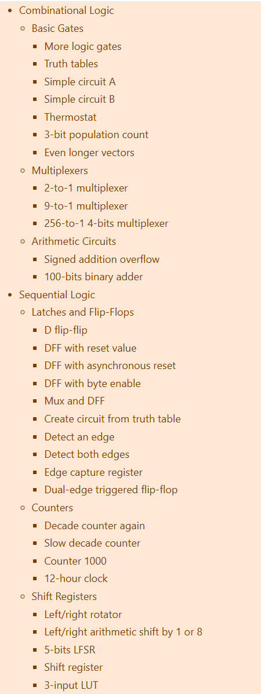

# 太原理工大学先进计算机系统实验室（ACSL）寒假研学最终学习路线

<strong>学习情况</strong>：初次接触Verilog，相关实战，LCTHW的实战，有能力的同学彻底完结计组知识。

<strong>学习目标</strong>：完成数据结构的学习，继续Verilog实践练习和LCTHW实践。本次寒假结营之后，Verilog实践与LCTHW实践应该还会持续一阵子，之后接轨一生一芯官方的学习路线，届时相信大家已经有足够的能力完成更加困难的挑战了。

# 数字设计

> [!TIP]
> # Verilog
>
> 本周你需要完成[HDLBits](https://hdlbits.01xz.net/wiki/Main_Page)中的如下任务，提交你的截图即可。（在这里推荐一个浏览器插件：<strong>沉浸式翻译</strong>，如果看不懂的话，就用这个插件配合学习吧！）

> [!WARNING]
> 我们培养的是硬件思维，需要头脑中先有电路再下手写代码，这也是为什么我们需要先学习使用Logisim搭建数字电路，再来学习数字设计，虽然我们后面不再使用Logisim进行处理器设计，但Logisim的使用经验应该已经帮助你建立了"电路思维"：数字电路设计只做两件事，"实例化"和"连线"。你接下来使用HDL来设计数字电路时，头脑中也需要将HDL代码和Logisim的使用经验建立关联：你只不过是换了一种方式来设计电路，但本质上还是在进行"实例化"和"连线"的工作，因此你应该能根据你编写的代码想象到电路的逻辑结构，<strong>要记住Verilog的本质是硬件描述语言而不是传统的编程语言。</strong>

# 数据结构

想必有不少同学之前都或多或少做了lcthw的内容，你可能会产生这样的疑惑：“这玩意怎么这么难，这都是怎么想到的，学不会啊”，这是因为lcthw要求你的相关思想和基础都很过关，但是<strong>缺少了数据结构</strong>部分的知识积累，做lcthw中的很多内容都会<strong>极其痛苦</strong>。

那么接下来的一部分路线就是：<strong>学习数据结构，补足缺下的知识和思想，再去完成lcthw。</strong>

> [!TIP]
> 在这一部分学习过程中，我们会学到线性结构中关于<strong>栈，队列，链表，以及表达式求值的相关知识，</strong>同时这些知识我们很快就会在lcthw中得到实践。

> [!TIP]
> # 数据结构
>
> 我们推荐下列方式之一进行数据结构的学习，你可以选择适合自己的方式：
>
> 1、b站视频学习
>
> https://www.bilibili.com/video/BV1tNpbekEht/?spm_id_from=333.337.search-card.all.click&vd_source=0ec8697614b7c28a28c8b55a23639096
>
> 具体的，你需要查看3-7节，如果你对前面的基础概念有遗忘或者困惑，也可以查看前两节。
>
> 2、可视化网站
>
> https://www.hello-algo.com/chapter_array_and_linkedlist/linked_list/
>
> 3、书籍
>
> 这里推荐《大话数据结构》，是一本通过可视化描述来介绍抽象数据结构的书籍，如果你对数据结构不敏感，不妨看看其中的例子，可以在飞书群文件中找到。
>
> 我们目前只需要学习到有关<strong>栈，队列，链表，以及表达式求值</strong>的知识，依旧是提交你的<strong>Markdown</strong>笔记。

# Learn C the hard way

> [!TIP]
> # Learn C the hard way
>
> 可能有的同学已经忘记了，我们的C语言程序是要在<strong>Linux环境</strong>上写的，本周完成其中的第<strong>15~17</strong>章
>
> 【Learn C the hard way】：https://wizardforcel.gitbooks.io/lcthw/content/preface.html
>
> 将你完成的所有练习放入一个名为`lcthw`的文件夹，并将该文件夹放入作业提交文件夹中。

> [!WARNING]
> 如果你已经做完，可以选择继续推进HDLBits或LCTHW中的任务，或移步拔高。

## RTFSC

可能有部分同学在写第17篇的时候遇到过框架代码读不懂、看着看着就不知道在说什么了，这其实是正常现象并且你无需害怕，读框架代码是一种能力，这种能力在同学们之后会接触的PA实验中尤其重要，本次任务也恰恰是锻炼同学们读框架代码能力的好机会。

不管对于什么阶段的程序员来说，读源码都是一个好处颇多的事情，特别对于初学者而言，这能迅速吸收优秀框架代码的精华，迅速成长。阅读源码就是观摩高手出招的过程，我们以第17篇为例，讲述之后遇到类似读不懂框架代码的时候该做的事情。

### 读英语

一般来说，好的框架代码的命名与功能是强相关的，大部分优秀框架的命名其实遵循“<strong>动词+名词</strong>”或“<strong>名词+动词</strong>”的模式，所以<strong>优先看动词</strong>往往能更快抓住函数意图，例如：第17篇的`Database`（数据库）结构体， `Database_set`（设置数据库），`Database_write`（写入数据库），`Database_delete`（删除数据库），从函数名称揣测函数功能，然后再去详细观察具体的功能实现。

> [!NOTE]
> <strong>现在请重新思考一下，你的变量，函数命名规范吗？这个行为的意义是什么？</strong>

### 调试

根据细分的每个模块（函数），要对模块功能有个整体的把握，如何去做到这个“把握”呢？除了文档和网上查阅的资料，最好的办法就是写一个简单的 Demo，写一些测试，验证函数的功能，增加一些调试信息，自然能理清楚在框架代码运行中，每一步分别需要调用哪个模块，简单来说就是增加一些`printf()`，在你认为可能存在问题的地方或是你不理解的地方打印出确定的值来验证你的想法或解决你的疑问。

最好的“理解”从来不是靠脑补，而是靠“<strong>让代码自己告诉你它在干什么</strong>”。

### <strong>静态代码分析</strong>

静态代码分析，就是沿着函数调用链，“顺藤摸瓜”一路点击下去。通常能够对整体流程有一个大概的了解。从微观到宏观，那么当然是从main函数入手，顺着函数的调用逐渐搞清楚所有的功能与流程。

可以试试画调用链 / 流程图：`main → Database_create →  Database_write →  Database_close`，很多时候梳理完这个流程，80%的迷雾就散了，同理宏定义的嵌套也是如此。

举个例子就是，框架源码就是一颗枝繁叶茂的参天大树，而你要做的事情是从根部往上爬。树有非常多的分支，时间又非常宝贵，阅读的策略很重要。我们的阅读路径，要以主要流程为主（也就是树的主躯干，这样才能尽可能快的到达顶点），对于一些细枝末节，在这之后再来慢慢啃（或者有必要的时候）。

### 坚持不放弃

技术策略得当，遇到棘手过不去的问题也很正常，这个时候考验的就是毅力了，继续调试、搜索资料、或者找个大佬来问一问都行，只要不放弃就好~~

### 多交流

无论是和学长交流，还是和你的组员/组长进行交流，或许都会收到<strong>意料之外的收获,</strong>这也是工作室存在的重要意义之一，不要忘记你的同伴。

# 作业提交

> [!NOTE]
> 1. HDLBits的截图命名为`Verilog`并放到`姓名-专业班级-Great-13`文件夹中。
> 
> 2. 数据结构的`Markdown`笔记也放在上述文件夹里。
> 
> 3. `lcthw`文件夹也放在上述文件夹里。
> 
> 4. 如果你学有余力完成了下面的拔高内容，则把文件夹重命名，格式为`姓名-专业班级-NewStar-13`。
> 
> 5. 将你的作业压缩为zip格式并提交到作业提交表单。
> 

# 拔高内容

## Learn C the hard way

<strong>这是“一生一芯”的必须完成部分如下</strong>：

虽然一生一芯的讲义划定了学习的范围，但想要技术很强的话，我们建议都可以试着去学习。

> [!TIP]
> # Learn C the hard way
>
> 其中的<strong>26、37-41、43、45-47不需要学习</strong>，性价比比较低，不推荐学习，<strong>其他内容我们都很推荐学习</strong>，想要技术很强的话，都可以试着去学习，并在其中锻炼自己gdb等debug工具使用和相关能力思维。
>
> 【Learn C the hard way】：https://wizardforcel.gitbooks.io/lcthw/content/preface.html
>
> 将你完成的所有练习放入一个名为`lcthw`的文件夹，并将该文件夹放入作业提交文件夹中。

## 一生一芯课程PA

PA是我们后续学习中非常重要的一部分内容，目前我们已经把PA0相关的基础知识进行了补全，大家<strong>可以去尝试PA0的相关内容学习</strong>，不过想开PA1还需要一些时间，PA1的内容需要数据结构，lchtw都学到不错的地步并具备一定的编程思想，然后就需要你的时间和精力花费了。

https://ysyx.oscc.cc/docs/ics-pa/PA0.html

> [!WARNING]
> 说这么多，其实就是告诉大家<strong>PA1部分的学习内容难度很高</strong>，可能会花费不少时间，同时这也是后续预学习答辩的重要内容之一，所以如果<strong>你想挑战自己的能力极限</strong>，那现在去做PA1也是可以的，加油！

> [!WARNING]
> 当你发现如下提醒时，阅读该讲义:https://ysyx.oscc.cc/docs/2407/e/3.html获取属于一生一芯的代码框架

> [!NOTE]
> <strong>难度这么高几乎无法完成，那拔高作业布置这么多是为什么？</strong>
>
> 1. 想让大家明白自己要学的内容还有很多。
> 
> 2. 让大家可以自由选择拔高的学习内容，以上两项，皆可自由选择学习，不存在非常强烈的关联先后关系。
> 
> 3. 并没有要求大家拔高作业全部完成，而是根据自己情况，可以完成多少就完成多少。
> 

<strong>也请大家劳逸结合，考虑自己的能力和精力，合理学习，不要为了求快，去燃烧自己的热情与生命，这样是非常得不偿失的。</strong>
