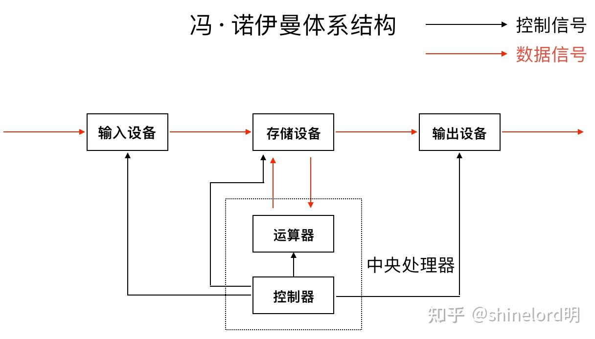
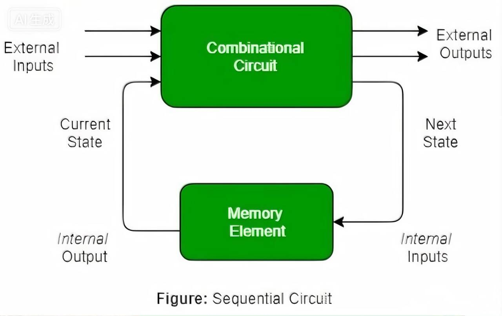

# 计算机组成原理与体系结构

# 计算机体系结构

## 冯·诺依曼体系结构

在进一步理解处理器的原理之前，我们先补充一个**计算机体系结构**中的核心概念，那就是冯·诺依曼体系结构。



现代计算机的运行机制看似复杂，但从世界上第一台计算机到现在几乎所有通用计算机都离不开一块基石——冯·诺依曼体系结构。该体系定义了计算机的五大基本部件：运算器，控制器，存储器，输入设备和输出设备。

- **控制器**，是整个计算机的“指挥中心”，通过信号来协调其他各部件之间的运作，包括但不限于从存储器中取出并解析程序指令，随后向运算器发出控制信号以执行相应操作。

- **运算器**，进行算术运算，逻辑运算的地方，也相当于是指令解析出来之后执行的部分，例如上文的add指令，真正将两个寄存器中的数值相加就是在运算器中完成。

**处理器核心组成：**控制器与运算器合称为**中央处理器（CPU），**所以存储器其实是不包含在CPU内部的，但这并不意味着CPU没有存储的设备，例如寄存器，缓存等等。


- **存储器**，计算机的“记忆系统”，用于存放数据和程序，程序和数据以相同方式存储，这也是冯·诺依曼结构的革命性创新。在本周的实践部分会专门去实现[2种不同的存储器](https://tqdy06h5fq.feishu.cn/wiki/A1SWwU2QYij8WTkXkt1cLVkNn1c#share-KxASdzrtPoBvggxgOjkcnkXSnqd)。

- **输入输出**则实现了人机交互与外部通讯，在本周及下周的实践中，我们暂不涉及输入输出设备的电路实现。

### 存储程序

上文提到的冯·诺依曼体系结构将数据和程序放入存储器中，这其实体现了冯·诺依曼体系结构的一个核心思想，即“存储程序”思想，其核心特征是指令和数据以相同方式存储在内存中并且由二进制表示所有数据和指令。

在冯·诺依曼体系结构中，CPU被设计成一个通用的、固定的指令执行引擎。它具体的运算逻辑不再是物理结构决定的，而是由存储在内存中的指令序列\(软件\)动态定义的。

这就是"存储程序"的精髓：**程序本身被当作一种特殊的数据，和处理的数据一起存放在内存中**。但"存储程序"作为一个专业名词，其所含的内容也远远超出了将程序存储本身，还有如何让存储的程序正确工作。

### 顺序自动执行

关于如何让存储的程序正常工作，我们还需要让CPU这个"机器厨师"能够自动、不停歇地按照"菜谱"（程序）执行下去。

当计算机执行完一条指令之后，就继续执行下一条指令。为了能让计算机知道下一条指令在哪里，还需要有一个用于指示当前执行到哪条指令的部件，这个部件称为“**程序计数器**”\(Program Counter, PC\)（注意和你的个人计算机 PC\(Personal Computer\) 区分开\)。

从此以后，计算机只需要做一件事情：

```Plain Text
重复以下步骤:
  从PC指示的存储器位置取出指令
  执行指令
  写回存储器
  更新PC
```

这样，我们只要将一段指令序列放置在存储器中，然后让PC指向第一条指令，计算机就会自动执行这一段指令序列，永不停止。真正将人类从"一步一步操控机器"的苦力中解放出来。

那么经过上面的学习，我们就可以对存储程序思想下一个定义了。

存储程序思想是指将计算机要执行的指令\(程序\)和处理所需的数据，均以二进制编码的形式，不加区分地存放在同一个存储器中，并由中央处理器\(CPU\)通过程序计数器\(PC\)自动、顺序地从存储器中取出并执行指令，从而实现通用、自动计算的设计理念。

如今的各种主流计算机，本质上都是"存储程序"计算机。这里只是简单阐明一下后续电路搭建处理器时候的结构层次，在Logisim中进行搭建的时候可以参照冯诺依曼体系来进行。如果想要更深入的了解冯诺依曼架构可以参考这两篇文章或者自行去STFW。

[三分钟带你了解冯\.诺依曼结构](https://zhuanlan.zhihu.com/p/136748306)

[【硬件系统架构】冯·诺依曼架构](https://zhuanlan.zhihu.com/p/1896486274103224312)


## **指令集架构（**ISA）

从我们学到的冯诺依曼结构来看，程序与数据都会存在内存里，CPU会自动执行。那么CPU和内存之间，究竟传递的是什么东西？内存里那些0和1，CPU怎么知道哪些是"数据"，哪些是"命令"？CPU又是如何理解这些"命令"的呢？这就涉及到计算机软件与硬件之间的交流了，例如：

CPU从内存中读出一串数据00101101，他究竟代表的是数字45，还是一条“加法”指令。

数据或是指令中的0和1本身没有什么不同。真正的奥秘在于 CPU 和编译器之间，事先约定好的一套极其严格的《密码规则手册》。例如这个手册规定，前2位是00，则执行加法指令，前2位是01则执行减法，第3\~4位代表第一个数据\.\.\.，而这个《密码规则手册》就是**指令集架构**\(Instruction Set Architecture，缩写为**ISA**，也简称指令集\)

ISA的本质是一系列**规范**，这些规范通常记录在相应的手册中，它们定义了一台计算机的功能和行为。ISA可以类比为一份对于软件与硬件之间的规范，双方都必须遵守，以保证软硬件之间的协同。

|对软件方规定|你写的程序，必须按照我规定的格式和资源来生成指令。|
|---|---|
|对硬件方规定|你必须能正确理解并执行所有我定义的指令，保证它们的效果和我描述的一模一样。|

可以理解为指令集架构是一本包含完整烹饪流程的规范，只要写食谱的人（软件）和主厨（硬件）都严格遵守这本规范，厨房就能有条不紊地运作——哪怕换另一个遵守相同规范的主厨（不同品牌的CPU），也能做出一样的菜（运行相同的程序）

因此，我们在进行处理器设计的时候，就是思考如何用门电路，时钟信号根据ISA中规定的标准，当接收到特定二进制指令的时候，做出相应的行为。简单来讲就是实现ISA中规定的指令。（思考如何用门电路按照ISA中规定的标准，当接收到特定二进制指令的时候，做出相应的行为）

## 拓展：指令集之间的差异

不同ISA的硬件设计思想：

- RISC：精简指令集计算机。核心思想是“少即是多”。

    - 特点：指令集数量少，每条指令格式固定、长度固定（通常4字节）、功能简单（通常在一个时钟周期内完成），执行效率高。它依赖更多的通用寄存器来存放中间数据。

    - 代表：ARM, RISC\-V等。

- CISC：复杂指令集计算机。核心思想是“用硬件完成复杂工作”。

    - 特点：指令集丰富，包含许多能直接完成复杂操作（如字符串处理、复杂数学计算）的指令。指令格式复杂、长度可变。其设计目标是用最少的指令完成工作，以节省宝贵的内存空间。

    - x86 及其64位扩展 x86\-64等。

常见的ISA：

- x86：由英特尔和AMD主导，是传统Windows电脑的“母语”。

- ARM：由ARM公司设计授权，是几乎所有手机（安卓、iOS）、苹果Mac（M系列芯片）和嵌入式设备的“母语”。

- RISC\-V：近几年新兴的、完全开源免费的ISA。任何公司都可以基于其标准设计自己的CPU芯片。

顺带一提，我们后续学习的是RISC\-V指令集。

思考一下：为什么ARM芯片不能直接运行为x86编译的程序？

而ISA到底规定了什么呢，其实主要就是4件事，依旧拿上文的"机器厨师"来举例：

||核心问题|示例|比喻|
|---|---|---|---|
|指令的格式|一条指令长什么样？|\[opcode\]\[operand\]<br>规定了指令的哪些部分是操作，哪些是需要操作的数据|规定了菜谱的格式，比如<br>\[动作\]\[食材1\]\[食材2\]|
|操作类型|能让它做什么？|加减乘除的算数运算，与或非的逻辑运算|厨师的动作清单：“切菜、加热、搅拌\.\.\.”|
|寄存器|它手边有哪些快速工作台？|有几个，叫什么\(R0\~R15,PC\)，每个有多大（多少位的）|厨师手边的碗：数量、大小、标签都是固定的|
|寻址方式|数据在哪里？怎么找到它？|是在寄存器里，还是在内存里，或者是指令直接给的数|去食材的方式：从“3号碗里拿\(寄存器\)”,"去冰箱第5格拿\(内存地址\)","直接用我手里的\(立即数\)"|

ISA是计算机软硬件之间沟通的桥梁，掌握了它，我们也就拿到了指挥硬件的“资格”了。接下来，我们要跨过计算机大的框架，去探究计算机这个黑盒子内部的秘密。

# 计算机组成原理

## 处理器的工作原理

从我们学到的冯诺依曼结构来看，控制器从存储器中取出程序指令，解析之后在运算器中执行，最后将结果写回寄存器或者内存中，所以其实处理器就是一个机械地进行数据处理的装置，这里的"机械"是指其原理可以很直白地理解，并无神秘之处。中央处理器\(CPU\)作为计算机的大脑, 其实也是这样的装置。

- 错误理解：处理器 = 聪明的大脑

- 正确理解：处理器 = 听话的工具

处理器是一个机械地进行数据处理的装置，它要做何种处理，就应该是**受到某种方式的控制**，而不存在可以自己思考的智能。这种控制处理器的方式，就是上文提到的**指令**。

### 指令及其编码

举个例子：我们可以通过加法的指令来控制处理器对两个数据相加，这相当于我们在计算器中输入`1+2=`

要"用加法指令来控制处理器对两个数据进行相加"，说明一条指令需要给出两方面的信息：

- 一方面，计算机中的数据那么多，指令需要说明要处理的是哪两个，这称为指令的**"操作数"\(operand\)**字段；

- 另一方面，计算机处理数据的方式也有很多种，比如，加减乘除等算术运算，与或非等逻辑运算，都是指令可以操作的选项，因此指令中也需要指定用何种方式处理数据，这称为指令的**"操作码"\(opcode\)**字段。

```Plain Text
+--------+---------------+
| opcode |    operand    |
+--------+---------------+
```

我们以一个加法指令为例：

```Plain Text
7  6 5  4 3   2 1   0
+----+----+-----+-----+
| 00 | rd | rs1 | rs2 | R[rd]=R[rs1]+R[rs2]    add指令, 寄存器相加
+----+----+-----+-----+
```

- 高两位代表操作码，而操作码为00代表的就是执行加法指令。

- 后面0\~1，2\~3，4\~5位分别代表的是rs2，rs1，rd的寄存器。

那寄存器又是什么？

#### 寄存器

还记得我们在学习数电的时候搭建的寄存器吗，那时候我们实现了最基本的数据存储功能。现在，让我们把这个概念扩展到真实的处理器中。

# 为什么需要寄存器

想象一下你做一道复杂的数学题，比如：`1 + 2 + 3 + ... + 10`

你不能一口气算完，需要一步步计算：

1. 先算 `1 + 2 = 3`

2. 再算 `3 + 3 = 6`

3. 然后 `6 + 4 = 10`

问题来了：中间的那个“3”和“6”放在哪里？

处理器在计算时也面临同样的问题。一条指令就像一次简单的计算（比如加法），只能处理两个数，得到的结果需要暂时保存，供下一条指令使用。而寄存器，就是承担保存这个结果的角色。

# 写到内存里不也是一样的效果吗

寄存器在CPU的内部，内存是在CPU的外部，寄存器的实现也使用的是速度快但成本也相对更高的材料，也因此CPU访问寄存器的速度是非常快的，是CPU专门开辟的一片极速数据中转站，它存在的目的是为了将最频繁访问的中间数据留在CPU内部，最大限度的减少对慢速内存的访问

再联想一下我们用到的计算机，强大的运算能力显然不是一两个寄存器就能满足运算需求的。因此通常来说这样的寄存器不只一个，而是由多个寄存器组成一个**"寄存器组"**\(Register File，称其为"寄存器堆"\)。由于这样的寄存器组用于处理一般数据，因此也称其为**通用寄存器\(General Purpose Register, GPR\)**。相对地，有一些寄存器的功能并非用于处理一般的数据，它们不属于GPR，例如上文提到的**程序计数器PC**。

在上面的计算`1+2+...+10`的例子中，由于一条加法指令只能计算两个数据相加的结果，因此需要将`1+2`的结果保存在GPR中的某个寄存器`r`中，然后计算`r+3`等等。这样，指令就需要在**操作数字段**中指定从哪个GPR中读出数据，以及将计算结果存入哪个GPR中。至于操作码，处理器只需要约定好每种操作码代表何种操作即可。

处理器作为一个数字电路，所有信息都可以用`0`和`1`来表示，指令也不例外。例如，**某简单处理器有4个GPR**，支持3种指令，其中2种如下：

```Plain Text
7  6 5  4 3   2 1   0
+----+----+-----+-----+
| 00 | rd | rs1 | rs2 | R[rd]=R[rs1]+R[rs2]    add指令, 寄存器相加
+----+----+-----+-----+
| 10 | rd |    imm    | R[rd]=imm              li指令, 装入立即数, 高位补0
+----+----+-----+-----+
```

让我们来一点一点解释：

由于指令只有3种，因此最少可以用2位操作码就能区分所有指令。在上述例子中，操作码是`00`，表示`add`指令；操作码是`10`，表示`li`指令。为了方便叙述，指令通常有相应的名称，如`add`指令和`li`指令。

关于操作数，因为GPR只有4个，因此可以用2位来指定一个GPR的地址\(`00`, `01`, `10`, `11`\)。操作数据的来源称为"源寄存器"，上述的`add`指令需要从两个源寄存器中获取加数，

- 两个源寄存器的地址分别记为`rs1`和`rs2`，分别用`R[rs1]`和`R[rs2]`来表示GPR中存放的内容；

- 操作需要写入的目的称为"目的寄存器"，一般记为`rd`，则`R[rd]`表示目的寄存器中存放的内容。

- 其中，第2条`li`指令的操作数稍有不同，其源操作数不再是GPR，而是直接将指令中的`imm`字段解析成一个**二进制数**来使用，这种操作数称为**"立即数"**。

# 立即数（Immediate Value）

立即数是我们在解析指令的时候解析出的操作码作为操作数直接参与处理器运算，无需访问内存或寄存器就能立刻获取的常量，常用于初始化寄存器或进行简单的计算，它作为指令的一部分。

综上，上述指令的长度都是8位。我们可以根据上述的指令编码规则来理解一条指令的含义，一些具体的指令例子如下：

```Plain Text
00100001   add指令, 将R[0]和R[1]相加, 结果写入R[2]
10110000   li指令, 将立即数0000写入R[3]
10000101   li指令, 将立即数0101写入R[0]
```

既然 PC 存储了当前执行指令的位置，那 [**PC 也应该是一个寄存器**](https://tqdy06h5fq.feishu.cn/wiki/A1SWwU2QYij8WTkXkt1cLVkNn1c#share-JBVtdOVkdoLI3rxEMstc6Bstnob)，这样的话，我们还可以设计相应的指令来修改它，从而增加程序执行过程的灵活性。例如，我们可以在上文提到的2条指令的基础上，再添加第3条指令：

```Plain Text
7  6 5         2 1  0
+----+---- -----+-----+
| 11 |   addr   | rs2 | if (R[0]!=R[rs2]) PC=addr bner0指令, 若不等于R[0]则跳转
+----+----------+-----+
```

这条`bner0`指令十分特殊，它是`Branch if Not Equal r0`的缩写，如果执行这条指令的时候`R[rs2]`与`R[0]`不相等，则将PC寄存器更新为`addr`，即让PC指向`addr`处的指令。上述可以执行3条指令的的例子，其实也是一种ISA，这里我们将其称为**sISA**\(simple ISA\)。

# 实践环节

本周所搭建的最简单的处理器，就是依据sISA所设计的。在真正开始实践环节前，你可以提前思考：如何通过数字电路实现指令的读取，并据此生成相应的控制信号。

### 指令周期

事实上，无论是执行什么指令，其步骤都是类似的，有一个叫**"指令周期"\(instruction cycle\)**的概念专门描述这些步骤：

1. 取指\(fetch\)：根据当前PC，在存储器中找到一条指令。

2. 译码\(decode\): 看这条指令具体是什么指令, 操作数是哪些。

    - 以`li`指令为例，操作数需要看立即数是多少，需要写入哪个目的寄存器。

3. 执行\(execute\): 对操作数进行处理，运算。

    1. 访存：一些涉及到内存的指令会有的操作，即根据处理之后的地址来进行对内存部分的访问。

4. 写回\(write back\)：将计算得来的结果写回指定的目的寄存器或者内存地址

5. 更新PC：让PC指向下一条指令。

# 注意区分时钟周期与指令周期

记得我们在学习数电部分的时钟周期吗？和指令周期又有什么区别？仔细思考一下，你或许需要STFW单周期处理器，多周期处理器的概念。

### 编译

计算机只能执行指令，它无法理解C程序的含义，因此也无法执行类似`sum = sum + i;`这样的代码。那怎么让计算机执行C程序呢？

有印象的同学应该记得我们在适应期第四周讲义的拔高部分讲述过C语言的编译流程，在这里就必须把他当成一个必做的知识点掌握了，当时没有学习过的[请点击这里](https://xcnlirxdrdxr.feishu.cn/wiki/KF1FwCebBidqk1kr2dTcdmy5nne#share-Vi1BdR5WWocZMUxS2Phc4ICvn2b)。

那个时候提到了汇编代码的概念，你可能当时不是特别理解，现在回头看你就能发现，他不过就是我们上文中所提到的指令罢了，只不过汇编语言是指令的符号化表示。而汇编代码转化的机器指令就是计算机真正能够读懂并且执行的语言了。

从原则上讲，编译的工作可以人工进行，但现代程序的规模很大，人工进行编译是非常繁琐的，因此通常由一类特殊的程序来开展编译工作，这类特殊的程序称为"编译器"\(compiler\)。

以我们学过的C语言为例，编译器所要做的便是：

- 将C语言的语句翻译为指令序列。

- 将变量对应到ISA的GPR或内存，例如分配到哪个通用寄存器，或存放在内存的哪个地址。

- 除此之外，编译器还会进行大量的优化以保证代码的高效性。

# **在****Compiler Explorer****中理解编译器的工作**

点击[**Compiler Explorer**](https://godbolt.org/)进入网站。

具体地，点击编辑器上方工具栏的`Add new...`，选择`Compiler`，即可弹出相应汇编代码的窗口。汇编代码默认采用x86指令集，你不一定能理解每一条指令的具体含义，但通过背景颜色的高亮和鼠标移动，你可以看到C程序片段和汇编代码片段之间的对应关系。

如果你想要获取运行结果，点击编辑器上方工具栏的`Add new...`，选择`Execution Only`，即可弹出执行结果的终端窗口。

在理解C语言与指令的关系之后，我们继续从指令角度理解程序。

### 一个数列求和的例子

让我们用指令来计算`1+2+...+10`这一数列的和。为了方便理解，我们先不采用`0`和`1`来表示指令。我们用`r0`，`r1`，`r2`和`r3`分别指代4个GPR，并且用逗号来分隔指令的操作数。假设以下指令序列存放在存储器中，用于计算上述数列之和，其中`:`前的数字表示PC，`#`及其后的文字表示注释：

```Assembly language
0: li r0, 10   # 这里是十进制的10
1: li r1, 0
2: li r2, 0
3: li r3, 1
4: add r1, r1, r3
5: add r2, r2, r1
6: bner0 r1, 4
7: bner0 r3, 7
```

乍眼一看，你可能很难理解上面的指令序列如何实现数列求和。让我们来把自己当作处理器，通过执行一条条指令来理解这个过程。为了理解指令执行的过程，我们还需要记录寄存器的变化。我们用`(PC, r0, r1, r2, r3)`的格式来记录寄存器的值，这一格式也反映了处理器所处的状态。例如`(7, 2, 3, 1, 8)`表示接下来将要执行编号为`7`的指令，且当前4个GPR的值分别为`2`，`3`，`1`，`8`。我们约定在开始的时刻，处理器的状态是`(0, 0, 0, 0, 0)`。以下是处理器执行前若干条指令的过程：

```Plain Text
PC r0 r1 r2 r3
(0,  0, 0, 0, 0)   # 初始状态
(1, 10, 0, 0, 0)  # 执行PC为0的指令后, r0更新为10, PC更新为下一条指令的位置
(2, 10, 0, 0, 0)  # 执行PC为1的指令后, r1更新为0, PC更新为下一条指令的位置
(3, 10, 0, 0, 0)  # 执行PC为2的指令后, r2更新为0, PC更新为下一条指令的位置
(4, 10, 0, 0, 1)  # 执行PC为3的指令后, r3更新为1, PC更新为下一条指令的位置
(5, 10, 1, 0, 1)  # 执行PC为4的指令后, r1更新为r1+r3, PC更新为下一条指令的位置
(6, 10, 1, 1, 1)  # 执行PC为5的指令后, r2更新为r2+r1, PC更新为下一条指令的位置
(4, 10, 1, 1, 1)  # 执行PC为6的指令后, 因r1不等于r0, 故PC更新为4
(5, 10, 2, 1, 1)  # 执行PC为4的指令后, r1更新为r1+r3, PC更新为下一条指令的位置
......
```

# **继续执行上述指令**

尝试继续执行指令，记录寄存器的状态变化过程。你发现执行到最后时，处理器处于什么样的状态？上述数列的求和结果在哪个寄存器中？将问题的答案汇总到文档中。

可以看到，处理器的工作过程就是按照指令的含义机械地更新寄存器的状态。到此为止，你已经理解处理器工作的基本原理了。

事实上，计算机的优势在于其极快的运算速度：现代处理器的主频已经到GHz量级了，以2GHz为例，这意味着处理器在1秒内会经过2000000000个时钟周期。而用上述指令序列计算`1+2+...+10`只需要不到40条指令，如果按每周期执行1条指令来计算，现代处理器只需要花费0\.00000002s，即20ns，即可完成计算。如果我们人工按电子计算器，1秒按10个键已经算是手速非常快了，但输入`1+2+...+10=`需要按22次按键，算下来也需要2s。如果要计算`1+2+...+10000`，我们只需要将上述PC为0的指令改为`li r0, 10000`即可 \(不过需要更长的指令来表示`10000`这个立即数\)，按同样的方式计算，需要执行约30000条指令，也只需要花费0\.000015s，即15us。如果人工按电子计算器，则需要按48894次按键，算下来需要4889s！即使我们用等差数列的求和公式心算\(`(10000 + 1) * 10000 / 2`\)，也需要若干秒才能算出正确答案，和强大的计算机相比可谓是相形见绌。

## 状态机

在计算机科学和相关领域，有限状态机FSM（Finite State Machine）简称状态机，用于描述系统在不同状态下的行为及状态间的转换。是一个在有限个状态间进行转换和动作的模型。

它是一个对我们理解计算机系统非常重要的数学模型，一个状态机通常包含以下几个基本要素：

- **状态（States）**：系统可以存在的不同情况或模式。

- **激励事件（Events）**：触发状态转移的条件或动作。

- **转移（Transitions）**：从一个状态到另一个状态的变化过程。

举个生活中的例子：

```Plain Text
状态：{ 未登录，登录中，已登录，失败 }
事件：{ 点击登录，网络响应成功，网络响应失败 }

转移规则：
未登录 + 点击登录 → 登录中
登录中 + 网络响应成功 → 已登录
登录中 + 网络响应失败 → 失败
失败 + 点击登录 → 登录中  *// 重新尝试*
```

那我们这里也可以看出来，状态机本质上就是一个在不同状态之间按规则切换的系统，那我们学习他有什么用呢？我们可以先分别从ISA，C语言，数字电路的视角来理解它：

### ISA视角的状态机

这时候回过头看上文数列求和的例子，你就能看出来了，处理器在处理指令程序的时候也就是在不同的状态之间来回切换罢了。

- 状态：所有寄存器的值，PC所处的位置，以至于内存所存储的数据都是当前处理器的状态。

- 事件：当然就是指令，在ISA中，执行指令会改变处理器的状态。  

- 转移：执行指令之后，寄存器，控制信号，PC变换到下一个状态。

事实上，计算机自从诞生以来，其工作过程就是一个数学游戏，状态机模型只不过是这个数学游戏的规则。

无论是上面的指令集，还是程序和处理器，这些计算机的核心概念在本质上都是一致的：它们都是状态机这个数学游戏。因此，如果你已经掌握了上面的游戏规则，你就已经做好了理解计算机的准备。

### C语言视角的状态机

我们用C语言来考虑数列求和，可以得出：

```C
#include <stdio.h>

/* 1 */ int main() {
/* 2 */     int sum = 0;
/* 3 */     int i = 1; 
/* 4 */     while (i <= 10) {
/* 5 */         sum = sum + i; 
/* 6 */         i = i + 1;   
/* 7 */     }
/* 8 */     printf("sum = %d\n", sum);
/* 9 */     return 0;
/* 10*/ }
```

再从状态机视角来考虑它：

- 状态集合。在C程序中，最直接的状态就是变量，因为它们是存储信息的对象。除此之外，在C程序的执行过程中，还需要有一个用于指示当前执行到哪条语句的隐含变量，这个隐含变量就是C语言的“程序计数器”\(PC\)，它也应该属于状态的一部分。

- 激励事件集合。在C程序中，执行语句会改变状态，因此执行语句就是这个状态机的激励事件。

- 状态转移规则，按照C程序的行为，状态转移规则用于描述“在某个状态下执行某语句后的次态”，也即语句的语义，它约定了执行某语句后，状态应该发生怎么样的变化，从而从一个状态转移到另一个。

- 初始状态。在未执行任何语句之前的状态。

根据上述程序的行为, 前若干条语句的执行过程如下:

```Plain Text
PC sum i
(2, ?, ?)    # 初始状态
(3, 0, ?)    # 执行PC为2的语句后, sum更新为0, PC更新为下一条语句的位置
(4, 0, 1)    # 执行PC为7的语句后, 由于循环条件i <= 10成立, 因此进入循环体
(5, 0, 1)    # 执行PC为3的语句后, i更新为1, PC更新为下一条语句的位置(第4行无有效操作, 跳过)
(6, 1, 1)    # 执行PC为5的语句后, sum更新为sum + i, PC更新为下一条语句的位置
(4, 1, 2)    # 执行PC为6的语句后, i更新为i + 1, PC更新为下一条语句的位置
(5, 1, 2)    # 执行PC为4的语句后, 由于循环条件i <= 10成立, 因此重新进入循环体
......
```

和上文的汇编语言相比，我们至少看到了用C语言开发程序的两点优势：

1. 变量的命名可以更直观地反映出其用途，但汇编语言中，GPR的用途只能根据上下文推断。

2. 循环的表达更清晰，可以直接区别循环条件和循环体，但在汇编语言中，循环条件和循环体都是指令，需要根据上下文推断。


### 数字电路视角的状态机

细心的大家肯定知道我们在本周是需要通过数字电路实现一个最简单的处理器，这意味着，数字电路也能和ISA建立某种关联，那我们是否也能从状态机的视角去理解数字电路的行为呢？经过上文的讲述，以及我们之前学习的`数字逻辑电路 = 组合逻辑电路 + 时序逻辑电路`，你其实就很轻易能够理解数字电路视角的状态机了。

状态：只有时序逻辑电路才能存储信息，因此一个状态是时序逻辑元件所存储的具体信息。具体包括寄存器，存储器，触发器等。

事件：时序逻辑元件表征了数字电路的状态，而时序逻辑元件的内部状态可以通过其输入端改变（例如可以通过输入端将数据写入D触发器），我们可以将数字电路看成以下模型：



让时序逻辑元件的状态发生变化的，其实是组合逻辑电路输出的信号，因此组合逻辑电路就是这个状态机的激励事件。

- 状态转移规则。时序逻辑元件的状态具体应如何变化，是由组合逻辑电路的具体逻辑决定的。

- 初始状态。即电路在复位时，时序逻辑元件的状态。

# **从状态机视角理解数列求和电路的工作过程**

在之前的学习中，你已经通过寄存器和加法器搭建出一个简单数列求和电路，用于计算`1+2+...+10`。在文档中列出电路状态的变化过程。

# 说了这么多，那状态机模型有什么用

计算机的强大能力就源于这个简单但深刻的原理：任何复杂计算都可以分解为一系列简单的状态转移。也就是说计算机本质上也是状态机。

所以状态机模型是理解复杂系统的一种有效方法，有些概念和问题从状态机模型思考可以给我们带来新的启发。随着之后"一生一芯"的学习的深入，我们还会使用状态机模型来分析一些关键的问题，并提出一些有效的解决方法。

# 程序，ISA和CPU之间的关系

至此，我们已经知道：

1. 程序是人类目的的表述，我们用高级语言（例如C语言，Python等）来表达，它相对简洁，但计算机看不懂。

2. ISA是计算机的母语，编译器作为一名“翻译官”，将我们写的高级语言根据相应的ISA手册翻译成机器能够看懂的指令序列。

3. CPU是执行引擎。通过运行指令来完成计算，存储和控制等任务。

它们之间的关系并非简单的线性关系，而是一个以 ISA 为中心、软硬件协同的精密系统。我们来简单梳理程序，ISA和CPU之间的联系：

1. 根据ISA手册的功能描述, 画一张CPU的结构图 \-\> 处理器微结构设计

2. 根据结构图设计具体的电路 \-\> 逻辑设计

3. 开发程序 \-\> 软件编程

4. 将程序翻译成ISA手册中描述的指令序列 \-\> 编译

5. 在CPU上执行程序 = 用程序编译出的指令序列控制CPU电路进行状态转移


这三者的关系揭示了计算机发展的底层逻辑——通过稳定的接口实现软硬件的关注点分离：

|对软件|ISA提供了一个稳定不变的功能抽象层。只要契约不变，软件工程师就可以持续的开发，创新，无需关心硬件如何日新月异的发展。|
|---|---|
|对硬件|ISA划定了一个明确无误的行为规范。在此约束下，硬件工程师可以尽情追求物理性能，只要最终结果符合规范。|

# 重新审视编程

虽然大家之前接触过C语言的编程语言，但是各位有没有思考过编程的本质。所谓编程，实际上是利用给定功能的组合来完成复杂任务的过程。大家接触过的C语言，以及将来可能会接触的C\+\+，Python等编程语言，这些都属于高级编程语言。而上述通过指令的组合来实现数列求和的例子，其实也是编程！

上述的`add`和`li`等指令，在计算机领域里面属于汇编语言的范畴。与汇编语言相比，还有更底层的机器语言，它就是指令的二进制表示，可以被通过数字电路实现的处理器直接执行。例如，上述数列求和程序的机器语言表示如下：

```Plain Text
10001010    # 0: li r0, 10
10010000    # 1: li r1, 0
10100000    # 2: li r2, 0
10110001    # 3: li r3, 1
00010111    # 4: add r1, r1, r3
00101001    # 5: add r2, r2, r1
11010001    # 6: bner0 r1, 4
11011111    # 7: bner0 r3, 7
```

事实上，上述机器语言表示就是根据前文的sISA规范将汇编语言翻译成`0`和`1`的序列。只要了解指令的编码规则，汇编语言和机器语言可以互相转换。不过如果只看机器语言，程序员是很难理解的；相比之下，汇编语言能更直观地表示指令的操作码和操作数，可读性比机器语言更好。

# **计算10以内的奇数之和**

尝试用上述指令编写一个程序，求出10以内的奇数之和，即计算`1+3+5+7+9`。编写后，在文档中列出指令，并列出处理器状态的变化过程，以此来检查你编写的程序是否正确。

# **机器永远是对的**

这里再给大家传达一条重要的观念：**机器永远是对的**。计算机系统的行为是按照官方手册的描述精确发生的，系统的每一次状态转移都有手册依据。换句话说，如果你不理解计算机系统的行为，很大概率是因为你不了解相关手册中的某些关键细节。

你在之后学习的过程中可能会感受到未知的事物像潮水一般袭来。但只有树立正确的观念，才有助于解决问题。有的初学者会提出"是不是操作系统有问题"，"是不是编译器有bug"等疑问，这些不专业的想法并不能帮助你真正解决问题，不能帮助你获得真正的成长。

当然，这里的"永远"并不是说不能质疑机器。事实上，商业产品也会有bug，例如历史上著名的Intel奔腾的[浮点除法bug](https://math.mit.edu/~edelman/homepage/papers/pentiumbug.pdf)\)。但专业人士在质疑的时候，都会拿出证据，来证明自己的质疑并非无中生有。而且越是不可能发生的问题，求证过程越谨慎。你所使用的计算机系统大概率是具有一定成熟度的，你恰好遇上bug的概率本身就很小；如果你拿不出让人信服的证据，机器出错的概率就更低了。

# 迈向现代计算机系统

你或许觉得上文举的示例过于简单，我们使用的现代计算机真的是这样工作的吗？现在我们来揭开现代计算机的神秘面纱。

我们已经知道，通过使用补码表示，计算机可以借助同一套加法器硬件来实现算术上的加法和减法，通过提供一条新的减法指令, 程序就可以进行减法操作了。通过跳转指令实现的循环来重复执行加法指令，我们就实现了算术上的乘法功能；而重复执行减法指令，则可以实现算术上的除法功能。

上面已经实现了整数的四则运算，要实现小数的运算也不难。我们知道在数学中可以通过科学记数法来表示一个小数，计算机也可以用类似的方式来表示小数，只不过采用的是二进制的科学记数法。具体地，任何一个小数$x$都可以表示成$1.\alpha\times 2^{\beta}$。$\alpha$其中是二进制表示的无符号数，$\beta$是二进制表示的有符号数。计算机只要将$\alpha$和$\beta$记录下来，就相当于通过二进制方式表示了小数$x$。显然，小数之间的四则运算也可以转换成$\alpha$和$\beta$相关的四则运算。

实现了小数的四则运算后，就可以计算数学意义上的基本初等函数了，包括常函数，幂函数，指数函数，对数函数，三角函数，反三角函数。具体地，除常函数外，其他5种基本初等函数都可以通过幂级数展开进行计算，而幂级数可以通过四则运算和循环进行计算。

实现了基本初等函数的计算后，就可以通过基本初等函数之间的有限次有理运算和复合操作，来计算所有初等函数了。对于复合操作，我们可以通过程序中的函数调用功能来实现。

我们还能继续对函数进行求导和积分。根据导数的定义，我们只需要代入一个很小的，就能近似计算出函数在某一点的导数。而根据定积分定义，我们可以将被积区间分成足够多份，然后用被积函数在区间内的某点取值近似代替区间中的取值，然后通过求和计算出函数在被积区间上的黎曼和。当然，这些都是简单直观的计算方法，为了在计算机中计算出更精确的导数和积分，科学家还提出了一系列的数值分析算法。

上述计算都是在实数域上进行，要将计算扩展到复数域其实也不难。具体地，我们只需要对实数分量和虚数分量分别进行计算，另外再应用相关的规则处理虚数单位即可。尽管复数域的有些操作和实数域有所不同，但只要能用数学语言描述出计算方式，都有办法将其归约到上文的操作中。

支持复数域的求导和积分后，我们就可以在程序中实现各种物理引擎，对真实世界中的各种物理规律进行模拟。各种力学，电磁学，光学，热学的计算公式，**在程序中都是通过一条条简单的指令来完成计算**，从而让用户在计算机世界中感受到和物理世界一致的体验。我们在计算机中感受到的一切，都是通过计算实现的！

当然，为了让计算过程更高效，现代ISA还提供了更多的指令，包括乘除指令，逻辑运算指令\(计算与, 或, 非等\)，浮点指令，原子指令等。例如，相比于通过循环实现乘法，计算机提供了乘法指令和乘法器电路，可以让程序通过乘法指令高效地计算乘法。一些ISA甚至还提供直接计算初等函数的指令，如开方指令，三角函数指令等。不难想象，要在电路层次提供计算这些初等函数的功能。是需要电子工程师仔细考量的。

除了提供更丰富的指令，计算机架构师还致力于设计出能更高效执行指令的计算机。例如，通过流水线技术可以提升计算机执行指令的吞吐，通过超标量技术可以让计算机在一个周期内执行多条指令，通过缓存技术则可以提升计算机访问内存的效率，通过GPU等处理器加速特定任务的执行效率\.\.\. 这些技术最终都会让计算机用户获得越来越快的性能体验。


