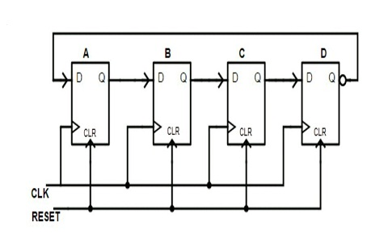
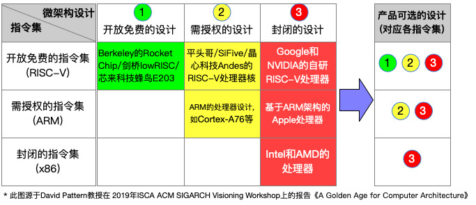

# 计算机组成原理与体系结构ver\.0

# 冯诺依曼体系结构

在进一步理解处理器的原理之前，我们先补充一个计算机体系结构中的核心概念，那就是冯诺依曼体系结构。


现代计算机的运行机制看似复杂，但从世界上第一台计算机到现在几乎所有通用计算机都离不开一块基石——冯诺依曼体系结构。该体系定义了计算机的五大基本部件：运算器，控制器，存储器，输入设备和输出设备。

- **控制器**，是整个计算机的“指挥中心”，通过信号来协调其他各部件之间的运作，包括从存储器中取出并解析程序指令，随后向运算器发出控制信号以执行相应操作。

- **运算器**，进行算术运算，逻辑运算的地方，也相当于是指令解析出来之后执行的部分，例如上文的add指令，真正将两个寄存器中的数值相加就是在运算器中完成。

    - **处理器核心组成：**控制器与运算器合称为**中央处理器（CPU），**所以存储器其实是不包含在CPU内部的，但这并不意味着CPU没有存储的设备，例如寄存器，缓存等等。

- **存储器**，计算机的“记忆系统”，用于存放数据和程序，程序和数据以相同方式存储，这也是冯·诺依曼结构的革命性创新。在本周的实践部分会专门去实现2种不同的存储器。

- **输入输出**则实现了人机交互与外部通讯，在本周及下周的实践中，我们暂不涉及输入输出设备的电路实现。

其核心特征是指令和数据以相同方式存储在内存中并且由二进制表示所有数据和指令。这里只是简单阐明一下后续电路搭建处理器时候的结构层次，在Logisim中进行搭建的时候可以参照冯诺依曼体系来进行。如果想要更深入的了解冯诺依曼架构可以参考这两篇文章或者自行去STFW。

[三分钟带你了解冯\.诺依曼结构](https://zhuanlan.zhihu.com/p/136748306)

[【硬件系统架构】冯·诺依曼架构](https://zhuanlan.zhihu.com/p/1896486274103224312)

# 处理器的组合与工作原理

从我们学到的冯诺依曼结构来看，控制器从存储器中取出程序，解析之后在运算器中执行，所以其实处理器就是一个机械地进行数据处理的装置，这里的"机械"是指其原理可以很直白地理解，并无神秘之处。中央处理器\(CPU\)作为计算机的大脑, 其实也是这样的装置。

- 错误理解：处理器 = 聪明的大脑

- 正确理解：处理器 = 听话的工具

处理器是一个机械地进行数据处理的装置，它要做何种处理，就应该是**受到某种方式的控制**，而不存在可以自己思考的智能。这种控制的处理器的方式，就是**指令**。

## 指令及其编码

举个例子：我们可以通过加法的指令来控制处理器对两个数据相加，这相当于我们在计算器中输入`1+2=`

要"用加法指令来控制处理器对两个数据进行相加"，说明一条指令需要给出两方面的信息：

- 一方面，计算机中的数据那么多，指令需要说明要处理的是哪两个，这称为指令的**"操作数"\(operand\)**字段；

- 另一方面，计算机处理数据的方式也有很多种，比如，加减乘除等算术运算，与或非等逻辑运算，都是指令可以操作的选项，因此指令中也需要指定用何种方式处理数据，这称为指令的**"操作码"\(opcode\)**字段。

```Plain Text
+--------+---------------+
| opcode |    operand    |
+--------+---------------+
```

# 生活中的"处理器": 厨房\(0\)

事实上，处理器中的很多概念，都可以在生活中找到相似的例子。例如，厨房是一个加工食材的场所，厨师会根据菜谱对食材进行加工处理，最终做出一道道菜。

处理器的工作方式和厨房中发生的事件非常类似。例如，指令就像是菜单，厨师按照菜单做菜，也可以理解成菜单"控制"着厨师做菜。而菜单中，也有类似"操作数"和"操作码"的概念。例如，"番茄炒鸡蛋"中的"番茄"和"鸡蛋"就类似"操作数"，说明这道菜是要对"番茄"和"鸡蛋"这两种食材进行加工处理；而"炒"就类似"操作码"，指示了需要对食材进行哪种烹饪操作。类似回锅肉，清蒸鲈鱼这些菜单上的菜，都可以从指令的角度理解它们。

还记得我们在学习数电的时候搭建的寄存器吗，那时候我们实现了最基本的数据存储功能。现在，让我们把这个概念扩展到真实的处理器中。

# 为什么需要寄存器

想象一下你做一道复杂的数学题，比如：

`1 + 2 + 3 + ... + 10`

你不能一口气算完，需要一步步计算：

1. 先算 `1 + 2 = 3`

2. 再算 `3 + 3 = 6`

3. 然后 `6 + 4 = 10`

问题来了：中间的那个“3”和“6”放在哪里？

处理器在计算时也面临同样的问题。一条指令就像一次简单的计算（比如加法），只能处理两个数，得到的结果需要暂时保存，供下一条指令使用。而寄存器，就是承担保存这个结果的角色。

联想一下我们用到的计算机，强大的运算能力显然不是一两个寄存器就能满足运算需求的。因此通常来说这样的寄存器不只一个，而是由多个寄存器组成一个**"寄存器组"**\(Register Set，有的教科书也称其为"寄存器堆"，英文为Register File\)。由于这样的寄存器组用于处理一般数据，因此也称其为**通用寄存器\(General Purpose Register, GPR\)**。相对地，有一些寄存器的功能并非用于处理一般的处理，它们不属于GPR，等后文我们遇到的时候再去讨论它们。

在上面的计算`1+2+...+10`的例子中，由于一条加法指令只能计算两个数据相加的结果，因此需要将`1+2`的结果保存在GPR中的某个寄存器`r`中，然后计算`r+3`等等。这样，指令就需要在**操作数字段**中指定从哪个GPR中读出数据，以及将计算结果存入哪个GPR中。至于操作码，处理器只需要约定好每种操作码代表何种操作即可。

处理器作为一个数字电路，所有信息都可以用`0`和`1`来表示，指令也不例外。例如，**某简单处理器有4个GPR，支持3种指令**，其中2种如下：

```Plain Text
7  6 5  4 3   2 1   0
+----+----+-----+-----+
| 00 | rd | rs1 | rs2 | R[rd]=R[rs1]+R[rs2]    add指令, 寄存器相加
+----+----+-----+-----+
| 10 | rd |    imm    | R[rd]=imm              li指令, 装入立即数, 高位补0
+----+----+-----+-----+
```

让我们来一点一点解释：

由于指令只有3种，因此最少可以用2位操作码就能区分所有指令。在上述例子中，操作码是`00`，表示`add`指令；操作码是`10`，表示`li`指令。为了方便叙述，指令通常有相应的名称，如`add`指令和`li`指令。

关于操作数，因为GPR只有4个，因此可以用2位来指定一个GPR的地址\(`00`, `01`, `10`, `11`\)。操作数据的来源称为"源寄存器"，上述的`add`指令需要从两个源寄存器中获取加数，

- 两个源寄存器的地址分别记为`rs1`和`rs2`，分别用`R[rs1]`和`R[rs2]`来表示GPR中存放的内容；

- 操作需要写入的目的称为"目的寄存器"，一般记为`rd`，则`R[rd]`表示目的寄存器中存放的内容。

- 其中，第2条`li`指令的操作数稍有不同，其源操作数不再是GPR，而是直接将指令中的`imm`字段解析成一个**二进制数**来使用，这种操作数称为**"立即数"**。

# 立即数（Immediate Value）

立即数是我们在解析指令的时候解析出的操作码作为操作数直接参与处理器运算，无需访问内存或寄存器就能立刻获取的常量，常用于初始化寄存器或进行简单的计算，它作为指令的一部分。

综上，上述指令的长度都是8位。我们可以根据上述的指令编码规则来理解一条指令的含义，一些具体的指令例子如下：

```Plain Text
00100001   add指令, 将R[0]和R[1]相加, 结果写入R[2]
10110000   li指令, 将立即数0000写入R[3]
10000101   li指令, 将立即数0101写入R[0]
```

## 存储程序

事实上，在我们认识中几乎无所不能的计算机，就是靠不断执行一条条指令来完成各种复杂任务的。你在计算机上运行的各种软件程序，最终也是在执行一条条的指令。因此，程序的本质就是一段指令序列。说起来你可能不信，毕竟上面这些指令的行为非常简单，和电子计算器没什么区别，那计算机凭什么能比电子计算器强大那么多呢？

答案在于计算机的工作机制：它可以让程序来自动控制计算机的执行。具体地，我们可以先把一段指令序列放在存储器\(如现代计算机的内存\)中，让计算机从内存中取出指令来执行；重要的是，当计算机执行完一条指令之后，就继续执行下一条指令。为了能让计算机知道下一条指令在哪里，还需要有一个用于指示当前执行到哪条指令的部件，这个部件称为“**程序计数器**”\(Program Counter, PC\)（注意和你的个人计算机 PC\(Personal Computer\)区分开\)。

从此以后，计算机只需要做一件事情：

```Plain Text
重复以下步骤:
  从PC指示的存储器位置取出指令
  执行指令
  更新PC
```

这样，我们只要将一段指令序列放置在存储器中，然后让PC指向第一条指令，计算机就会自动执行这一段指令序列，永不停止。这就是"**存储程序**"\(Stored\-Program\)的基本思想。如今的各种主流计算机，本质上都是"存储程序"计算机。

还有更巧妙的设计！既然 PC 存储了当前执行指令的位置，那 **PC 也应该是一个寄存器**，这样的话，我们还可以设计相应的指令来修改它，从而增加程序执行过程的灵活性。例如，我们可以在上文提到的2条指令的基础上，再添加第3条指令：

```Plain Text
7  6 5         2 1  0
+----+---- -----+-----+
| 11 |   addr   | rs2 | if (R[0]!=R[rs2]) PC=addr bner0指令, 若不等于R[0]则跳转
+----+----------+-----+
```

这条`bner0`指令十分特殊，它是`Branch if Not Equal r0`的缩写，如果执行这条指令的时候`R[rs2]`与`R[0]`不相等，则将PC寄存器更新为`addr`，即让PC指向`addr`处的指令。不过，PC寄存器并不是用于处理一般数据，因此它不属于GPR。

有了上面这些指令，我们就可以让计算机做一些不简单的事情了。

## 一个数列求和的例子

让我们用指令来计算`1+2+...+10`这一数列的和。为了方便理解，我们先不采用`0`和`1`来表示指令。我们用`r0`，`r1`，`r2`和`r3`分别指代4个GPR，并且用逗号来分隔指令的操作数。假设以下指令序列存放在存储器中，用于计算上述数列之和，其中`:`前的数字表示PC，`#`及其后的文字表示注释：

```Plain Text
0: li r0, 10   # 这里是十进制的10
1: li r1, 0
2: li r2, 0
3: li r3, 1
4: add r1, r1, r3
5: add r2, r2, r1
6: bner0 r1, 4
7: bner0 r3, 7
```

乍眼一看，你可能很难理解上面的指令序列如何实现数列求和。让我们来把自己当作处理器，通过执行一条条指令来理解这个过程。为了理解指令执行的过程，我们还需要记录寄存器的变化。我们用`(PC, r0, r1, r2, r3)`的格式来记录寄存器的值，这一格式也反映了处理器所处的状态。例如`(7, 2, 3, 1, 8)`表示接下来将要执行编号为`7`的指令，且当前4个GPR的值分别为`2`，`3`，`1`，`8`。我们约定在开始的时刻，处理器的状态是`(0, 0, 0, 0, 0)`。以下是处理器执行前若干条指令的过程：

```Plain Text
PC r0 r1 r2 r3
(0, 0, 0, 0, 0)   # 初始状态
(1, 10, 0, 0, 0)  # 执行PC为0的指令后, r0更新为10, PC更新为下一条指令的位置
(2, 10, 0, 0, 0)  # 执行PC为1的指令后, r1更新为0, PC更新为下一条指令的位置
(3, 10, 0, 0, 0)  # 执行PC为2的指令后, r2更新为0, PC更新为下一条指令的位置
(4, 10, 0, 0, 1)  # 执行PC为3的指令后, r3更新为1, PC更新为下一条指令的位置
(5, 10, 1, 0, 1)  # 执行PC为4的指令后, r1更新为r1+r3, PC更新为下一条指令的位置
(6, 10, 1, 1, 1)  # 执行PC为5的指令后, r2更新为r2+r1, PC更新为下一条指令的位置
(4, 10, 1, 1, 1)  # 执行PC为6的指令后, 因r1不等于r0, 故PC更新为4
(5, 10, 2, 1, 1)  # 执行PC为4的指令后, r1更新为r1+r3, PC更新为下一条指令的位置
......
```

# **继续执行上述指令**

尝试继续执行指令，记录寄存器的状态变化过程。你发现执行到最后时，处理器处于什么样的状态？上述数列的求和结果在哪个寄存器中？

可以看到，处理器的工作过程就是按照指令的含义机械地更新寄存器的状态。到此为止，你已经理解处理器工作的基本原理了。

事实上，计算机的优势在于其极快的运算速度：现代处理器的主频已经到GHz量级了，以2GHz为例，这意味着处理器在1秒内会经过2000000000个时钟周期。而用上述指令序列计算`1+2+...+10`只需要不到40条指令，如果按每周期执行1条指令来计算，现代处理器只需要花费0\.00000002s，即20ns，即可完成计算。如果我们人工按电子计算器，1秒按10个键已经算是手速非常快了，但输入`1+2+...+10=`需要按22次按键，算下来也需要2s。如果要计算`1+2+...+10000`，我们只需要将上述PC为0的指令改为`li r0, 10000`即可 \(不过需要更长的指令来表示`10000`这个立即数\)，按同样的方式计算，需要执行约30000条指令，也只需要花费0\.000015s，即15us。如果人工按电子计算器，则需要按48894次按键，算下来需要4889s！即使我们用等差数列的求和公式心算\(`(10000 + 1) * 10000 / 2`\)，也需要若干秒才能算出正确答案，和强大的计算机相比可谓是相形见绌。

## 重新审视编程

虽然大家之前接触过C语言的编程语言，但是各位有没有思考过编程的本质。所谓编程，实际上是利用给定功能的组合来完成复杂任务的过程。大家接触过的C语言，以及将来可能会接触的C\+\+，Python等编程语言，这些都属于高级编程语言。而上述通过指令的组合来实现数列求和的例子，其实也是编程！

上述的`add`和`li`等指令，在计算机领域里面属于汇编语言的范畴。汇编语言是指令的符号化表示。与汇编语言相比，还有更底层的机器语言，它就是指令的二进制表示，可以被通过数字电路实现的处理器直接执行。例如，上述数列求和程序的机器语言表示如下：

```Plain Text
10001010    # 0: li r0, 10
10010000    # 1: li r1, 0
10100000    # 2: li r2, 0
10110001    # 3: li r3, 1
00010111    # 4: add r1, r1, r3
00101001    # 5: add r2, r2, r1
11010001    # 6: bner0 r1, 4
11011111    # 7: bner0 r3, 7
```

事实上，上述机器语言表示就是根据前文约定的指令编码将汇编语言翻译成`0`和`1`的序列。只要了解指令的编码规则，汇编语言和机器语言可以互相转换。不过如果只看机器语言，程序员是很难理解的；相比之下，汇编语言能更直观地表示指令的操作码和操作数，可读性比机器语言更好。

# **计算10以内的奇数之和**

尝试用上述指令编写一个程序，求出10以内的奇数之和，即计算`1+3+5+7+9`。编写后，列出处理器状态的变化过程，以此来检查你编写的程序是否正确。

# 状态机模型

在计算机科学和相关领域，状态机（State Machine）是一种强大的工具，用于描述系统在不同状态下的行为及状态间的转换。

它是一个对我们理解计算机系统非常重要的数学模型，一个状态机通常包含以下几个基本要素：

- **状态（States）**：系统可以存在的不同情况或模式。

- **事件（Events）**：触发状态转移的条件或动作。

- **转移（Transitions）**：从一个状态到另一个状态的变化过程。

举个生活中的例子：

```Plain Text
状态：{ 未登录，登录中，已登录，失败 }
事件：{ 点击登录，网络响应成功，网络响应失败 }

转移规则：
未登录 + 点击登录 → 登录中
登录中 + 网络响应成功 → 已登录
登录中 + 网络响应失败 → 失败
失败 + 点击登录 → 登录中  *// 重新尝试*
```

用数学的思想来描述

- 状态集合$S=\{S_1,S_2,...\}
$

- 激励事件集合$E$

- 状态转移规则$S \times E \rightarrow S$

    - 描述每个状态在不同激励事件下的次态\(next state\), 即二元函数$next(S,E)$给出了在状态下接收到激励事件$E$后的次态

- 初始状态$S_0 \in S$

虽然上述定义在数学意义上并非100%严谨，但这对我们理解计算机系统的行为来说已经足够了。

## 指令集架构的状态机模型

上文介绍的GPR，PC，存储器，指令及其执行过程，在计算机领域中属于**指令集架构**\(Instruction Set Architecture，缩写为ISA，也简称指令集\)的范畴。

你可能听说过x86，ARM，RISC\-V等概念，它们其实都是ISA。上文提到的那个只有3条指令的例子，其实也是一种ISA，为了方便叙述，我们将其称为sISA\(simple ISA\)。

ISA的本质是一系列**规范**，这些规范通常记录在相应的手册中，它们定义了一台模型机的功能和行为。所谓的模型机就是一台只存在于思维中的机器，我们只讨论其具备的功能和行为，而不讨论其具体实现。因此。围绕模型机开展学习可以将原理和实现细节分离，有助于大家理解处理器的本质。等到我们把这台思维中的模型机通过数字电路实现出来，我们就得到了一台真正的计算机。

现在我们来从状态机的视角去理解ISA：

- 状态集合。回忆时序逻辑电路的相关内容，状态是那些可以稳定存储信息的元素。对这个含义进行引申，在ISA中，状态应该包含**PC，GPR和内存**。也即，ISA中的一个状态是一组具体的PC，GPR和内存，而全体状态的集合$S$则是PC，GPR和内存所有取值的组合，即$S=\{(PC,R,M)\}$。

- 激励事件集合。在ISA中，执行指令会改变状态，因此执行指令就是这个状态机的激励事件。

- 状态转移规则。按照定义，在ISA中，状态转移规则用于描述“在某个状态下执行某指令后的次态”，也即指令的语义，它约定了执行某指令后，状态应该发生怎么样的变化，从而从一个状态转移到另一个。

- 初始状态，在未执行任何指令之前的状态。


以上述的sISA为例, 其状态机模型如下:

- 状态集合$S=\{(PC,R,M)\}=\{(PC,r0,r1,r2,r3,M)\}$。例如, 在数列求和例子中, 某个状态可表示为:

$S_k=(5,10,1,0,1,[10001010,10010000,101000000,10110001,
00010111,00101001,11010001,11011111])$

其中$[]$表示内存中存储的信息，这里就是上文指令序列的（二进制）编码。不过由于在sISA中，指令并不会修改内存中存储的信息，为了简化表示，我们可以省略状态中对内存的描述：$S_k=(5,10,1,0,1)$。

- sISA作为一种具体的ISA，激励事件同样是执行指令。

- 在sISA中，状态转移规则就是以下3条指令的语义：

```Plain Text
7  6 5  4 3   2 1   0
+----+----+-----+-----+
| 00 | rd | rs1 | rs2 | R[rd]=R[rs1]+R[rs2]       add指令, 寄存器相加
+----+----+-----+-----+
| 10 | rd |    imm    | R[rd]=imm                 li指令, 装入立即数, 高位补0
+----+----+-----+-----+
| 11 |   addr   | rs2 | if (R[0]!=R[rs2]) PC=addr bner0指令, 若不等于R[0]则跳转
+----+----------+-----+
```

- 例如$S_{k+1}=next(S_k,00101001)$表示, 在状态为时执行指令`00101001`后的次态为$S_{k+1}$。根据上文，该指令的行为是`R[2] = R[2] + R[1]`，因此$S_{k+1}=(6,10,1,1,1)$。这其实是上述数列求和例子执行过程中的其中一步。

- 初始状态$S_0=(0,0,0,0,0)$。

# 人生如戏

我们在上文中已经用自然语言和数列求和的例子解释了计算机的工作原理。我们之所以还要给大家介绍充满数学符号的状态机模型, 是为了帮助大家揭开计算机的神秘面纱：计算机自从诞生以来，其工作过程就是一个数学游戏，状态机模型只不过是这个数学游戏的规则。

事实上，无论是上面的指令集，还是后面我们要介绍的程序和处理器，这些计算机的核心概念在本质上都是一致的：它们都是状态机这个数学游戏。因此，如果你已经掌握了上面的游戏规则，你就已经做好了理解计算机的准备。

而对于x86，ARM，RISC\-V这些商业级别的真实ISA，它们的GPR数量更多，指令数量更多，指令行为也更复杂。但其本质原理和上述只有3条指令的sISA并没有本质区别，因此，如果你将来需要理解它们，你只需要阅读相应的手册，了解更多指令的细节即可。

## C语言的状态机模型

也许你已经隐约感觉到，C语言中的变量和语句的概念，和上文提到ISA的GPR和指令的概念，是有那么一点相似之处。事实上，从计算机系统的视角来看，它们之间还真的具有十分密切的关系。和ISA类似，我们也可以从状态机的视角来理解C程序：

- 状态集合。在C程序中，最直接的状态就是变量，因为它们是存储信息的对象。除此之外，我们在上文还提到： `大括号中的语句默认按顺序执行`。很自然地，在C程序的执行过程中，还需要有一个用于指示当前执行到哪条语句的隐含变量，这个隐含变量就是C语言的“程序计数器”\(PC\)，它也应该属于状态的一部分。因此，在C程序中，一个状态是一组具体的变量和PC，而全体状态的集合$S$则是变量和PC所有取值的组合，即$S=\{(PC,V)\}$，其中$V$表示程序中所有变量的取值。

- 激励事件集合。在C程序中，执行语句会改变状态，因此执行语句就是这个状态机的激励事件。

- 状态转移规则，按照C程序的行为，状态转移规则用于描述“在某个状态下执行某语句后的次态”，也即语句的语义，它约定了执行某语句后，状态应该发生怎么样的变化，从而从一个状态转移到另一个。

- 初始状态。在未执行任何语句之前的状态，即$S=\{(main函数第一条语句的位置,V)\}$

我们用C语言来考虑数列求和，可以得出：

```C
#include <stdio.h>

/* 1 */ int main() {
/* 2 */   int sum = 0;
/* 3 */   int i = 1;
/* 4 */   do {
/* 5 */     sum = sum + i;
/* 6 */     i = i + 1;
/* 7 */   } while (i <= 10);
/* 8 */   printf("sum = %d\n", sum);
/* 9 */   return 0;
/* 10*/ }
```

和上文的汇编语言相比，我们至少看到了用C语言开发程序的两点优势：

1. 变量的命名可以更直观地反映出其用途，但汇编语言中，GPR的用途只能根据上下文推断。

2. 循环的表达更清晰，可以直接区别循环条件和循环体，但在汇编语言中，循环条件和循环体都是指令，需要根据上下文推断。

根据上述程序的行为, 前若干条语句的执行过程如下:

```Plain Text
PC sum i
(2, ?, ?)    # 初始状态
(3, 0, ?)    # 执行PC为2的语句后, sum更新为0, PC更新为下一条语句的位置
(5, 0, 1)    # 执行PC为3的语句后, i更新为1, PC更新为下一条语句的位置(第4行无有效操作, 跳过)
(6, 1, 1)    # 执行PC为5的语句后, sum更新为sum + i, PC更新为下一条语句的位置
(7, 1, 2)    # 执行PC为6的语句后, i更新为i + 1, PC更新为下一条语句的位置
(5, 1, 2)    # 执行PC为7的语句后, 由于循环条件i <= 10成立, 因此重新进入循环体
......
```

## 数字电路的状态机模型

我们在上文提到"把这台思维中的模型机通过数字电路实现出来"，这意味着，数字电路也能和ISA建立某种关联，那我们是否也能从状态机的视角去理解数字电路的行为呢？

答案是肯定的！根据上一节数字电路的知识，我们可以很容易地归纳出数字电路的状态机模型：

- 状态集合。在数字电路中，只有时序逻辑电路才能存储信息，因此一个状态是时序逻辑元件所存储的具体信息，而全体状态的集合则是时序逻辑元件所能存储信息的所有组合。

- 激励事件集合。既然时序逻辑元件表征了数字电路的状态，而时序逻辑元件的内部状态可以通过其输入端改变\(例如可以通过输入端将数据写入D触发器\)，我们可以将数字电路看成以下模型：

```Plain Text
+------------------+
+-->| Sequential Logic |----+
|   +------------------+    |
| next state                | current state
|                           |
|  +---------------------+  |
+--| Combinational Logic |<-+
   +---------------------+
```

也即，让时序逻辑元件的状态发生变化的，其实是组合逻辑电路输出的信号，因此组合逻辑电路就是这个状态机的激励事件。

- 状态转移规则。时序逻辑元件的状态具体应如何变化，是由组合逻辑电路的具体逻辑决定的。

- 初始状态。即电路在复位时，时序逻辑元件的状态。

例如，一个Johnson计数器的电路结构如下: 



根据电路结构的逻辑, 我们可以从状态机视角来理解上述Johnson计数器的工作过程:

```Plain Text
A  B  C  D
(0, 0, 0, 0)    # 初始状态
(1, 0, 0, 0)
(1, 1, 0, 0)
(1, 1, 1, 0)
(1, 1, 1, 1)
(0, 1, 1, 1)
(0, 0, 1, 1)
(0, 0, 0, 1)
(0, 0, 0, 0)    # 与初始状态一致
```

# **从状态机视角理解数列求和电路的工作过程**

在上一小节中，你已经通过寄存器和加法器搭建出一个简单数列求和电路，用于计算`1+2+...+10`。列出电路状态的变化过程。

当然，这个Johnson计数器的例子与CPU区别很大，但如果CPU能用数字电路设计出来，它一定也包含时序逻辑电路和组合逻辑电路，因而也一定能从状态机视角来理解CPU的工作过程。

# 程序，ISA和CPU之间的关系

## 编译 = 将C程序翻译成指令序列

有印象的同学应该记得我们在适应期第四周讲义的拔高部分讲述过C语言的编译流程，在这里就必须把他当成一个必做的知识点掌握了，当时没有学习过的[请点击这里](https://xcnlirxdrdxr.feishu.cn/wiki/KF1FwCebBidqk1kr2dTcdmy5nne#share-Vi1BdR5WWocZMUxS2Phc4ICvn2b)。

那个时候提到了汇编代码的概念，你可能当时不是特别理解，现在回头看你就能发现，他不过就是我们上文中所提到的指令罢了，而汇编代码转化的机器指令就是计算机真正能够读懂的语言了。

从原则上讲，编译的工作可以人工进行，但现代程序的规模很大，人工进行编译是非常繁琐的，因此通常由一类特殊的程序来开展编译工作，这类特殊的程序称为"编译器"\(compiler\)。

既然执行C程序和执行指令序列都可以从状态机视角去理解，我们也可以尝试去了解编译器需要完成哪些工作。我们先将两个状态机的内容列出来\(此处暂不关心初始状态\)：

因此，编译器的工作就是将C程序的状态机翻译成ISA的状态机，也即，构造：

$\begin{array}{l}
compile_S:\{PC, V\}\to\{PC, R, M\}\
\end{array}$

$\begin{array}{l}
compile_E:\{语句\}\to\{指令序列\}
\end{array}$

使得：

$compile_S(next(S{C,k}, 语句))=next(compile_S(S{C,k}), compile_E(语句))$

从而有

$\begin{array}{rl}
&compile_S(S_{C,k+1})\\
=&compile_S(next(S_{C,k}, 语句) \\
=&next(compile_S(S_{C,k}), compile_E(语句)) \\
=&next(S_{ISA,k},指令序列) \\
=&S_{ISA,k+1} \\
\end{array}$


具体地, 对比两个状态机后可以得知, 编译器需要完成以下工作:

- 将C程序的状态翻译成ISA的状态, 也即

    - 将C程序的PC对应到ISA的PC

    - 将C程序的变量对应到ISA的GPR或内存

- 将C程序的状态转移规则翻译成ISA的状态转移规则, 也即, 将语句翻译成指令序列

# **在**[**Compiler Explorer**](https://godbolt.org/)**中理解编译器的工作**

具体地，点击编辑器上方工具栏的`Add new...`，选择`Compiler`，即可弹出相应汇编代码的窗口。汇编代码默认采用x86指令集，你不一定能理解每一条指令的具体含义，但通过背景颜色的高亮和鼠标移动，你可以看到C程序片段和汇编代码片段之间的对应关系。

如果你想要获取运行结果，点击编辑器上方工具栏的`Add new...`，选择`Execution Only`，即可弹出执行结果的终端窗口。

## CPU设计 = 根据ISA设计数字电路

同样地，既然ISA和数字电路都可以从状态机视角去理解，我们也可以尝试去了解CPU设计应该如何开展。我们先将两个状态机的内容列出来\(此处暂不关心初始状态\)：

因此，CPU设计的工作就是用数字电路的状态机实现ISA的状态机，也即，构造

$\begin{array}{l}
CPUdesign_S:{PC, R, M}\to{时序逻辑电路}\\
CPUdesign_E:{指令}\to{组合逻辑电路}
\end{array}$   

使得：

$CPUdesign_S(next(S{ISA,k}, 指令))=next(CPUdeisgn_S(S{ISA,k}), CPUdesign_E(指令))$

从而有:

$\begin{array}{rl} \\
&CPUdesign_S(S_{ISA,k+1}) \\
=&CPUdesign_S(next(S_{ISA,k}, 指令) \\
=&next(CPUdesign_S(S_{ISA,k}), CPUdesign_E(指令)) \\
=&next(S_{CPU,k},组合逻辑电路) \\
=&S_{CPU,k+1} \\
\end{array}$

其中，表示CPU电路状态机的第个状态。用自然语言来描述，则是：ISA执行一条和指令后的状态，与设计出的CPU在组合逻辑电路控制下的次态，语义上是等价的。

具体地，对比两个状态机后可以得知，CPU设计需要完成以下工作：

- 用数字电路的状态实现ISA的状态，也即，用时序逻辑电路实现PC，GPR和内存。

- 用数字电路的状态转移规则实现ISA的状态转移规则，也即，用组合逻辑电路实现指令的功能。

## 总结

至此，我们可以来简单梳理程序，ISA和CPU之间的联系：

1. 根据ISA手册的功能描述, 画一张CPU的结构图 \-\> 处理器微结构设计

2. 根据结构图设计具体的电路 \-\> 逻辑设计

3. 开发程序 \-\> 软件编程

4. 将程序翻译成ISA手册中描述的指令序列 \-\> 编译

5. 在CPU上执行程序 = 用程序编译出的指令序列控制CPU电路进行状态转移

    - 此时, 三个状态机产生联系: $S_C\sim S_{ISA}\sim S_{CPU}$

# 一句话就能说清楚, 为什么搞那么复杂? 

这是因为，状态机模型是理解复杂系统的一种有效方法，有些概念和问题从状态机模型思考可以给我们带来新的启发。随着"一生一芯"的学习的深入，我们还会使用状态机模型来分析一些关键的问题，并提出一些有效的解决方法。

不过，最重要的是给大家传达这样一种观念：**机器永远是对的**。计算机系统的行为是按照官方手册的描述精确发生的，系统的每一次状态转移都有手册依据。换句话说，如果你不理解计算机系统的行为，很大概率是因为你不了解相关手册中的某些关键细节。

你在刚学习"一生一芯"的时候可能会感受到未知的事物像潮水一般袭来。但只有树立正确的观念，才有助于解决问题。有的初学者会提出"是不是操作系统有问题"，"是不是编译器有bug"等疑问，这些不专业的想法并不能帮助你真正解决问题，不能帮助你获得真正的成长。

当然，这里的"永远"并不是说不能质疑机器。事实上，商业产品也会有bug，例如历史上著名的Intel奔腾的[浮点除法bug](https://math.mit.edu/~edelman/homepage/papers/pentiumbug.pdf)\)。但专业人士在质疑的时候，都会拿出证据，来证明自己的质疑并非无中生有。而且越是不可能发生的问题，求证过程越谨慎。你所使用的计算机系统大概率是具有一定成熟度的，你恰好遇上bug的概率本身就很小；如果你拿不出让人信服的证据，机器出错的概率就更低了。


**从一到无穷大**

你或许觉得上文举的示例过于简单，我们使用的现代计算机真的是这样工作的吗？现在我们来揭开现代计算机的神秘面纱。

我们已经知道，通过使用补码表示，计算机可以借助同一套加法器硬件来实现算术上的加法和减法，通过提供一条新的减法指令, 程序就可以进行减法操作了。通过跳转指令实现的循环来重复执行加法指令，我们就实现了算术上的乘法功能；而重复执行减法指令，则可以实现算术上的除法功能。

上面已经实现了整数的四则运算，要实现小数的运算也不难。我们知道在数学中可以通过科学记数法来表示一个小数，计算机也可以用类似的方式来表示小数，只不过采用的是二进制的科学记数法。具体地，任何一个小数$x$都可以表示成$1.\alpha\times 2^{\beta}$。$\alpha$其中是二进制表示的无符号数，$\beta$是二进制表示的有符号数。计算机只要将$\alpha$和$\beta$记录下来，就相当于通过二进制方式表示了小数$x$。显然，小数之间的四则运算也可以转换成$\alpha$和$\beta$相关的四则运算。

实现了小数的四则运算后，就可以计算数学意义上的基本初等函数了，包括常函数，幂函数，指数函数，对数函数，三角函数，反三角函数。具体地，除常函数外，其他5种基本初等函数都可以通过幂级数展开进行计算，而幂级数可以通过四则运算和循环进行计算。

实现了基本初等函数的计算后，就可以通过基本初等函数之间的有限次有理运算和复合操作，来计算所有初等函数了。对于复合操作，我们可以通过程序中的函数调用功能来实现。

我们还能继续对函数进行求导和积分。根据导数的定义，我们只需要代入一个很小的，就能近似计算出函数在某一点的导数。而根据定积分定义，我们可以将被积区间分成足够多份，然后用被积函数在区间内的某点取值近似代替区间中的取值，然后通过求和计算出函数在被积区间上的黎曼和。当然，这些都是简单直观的计算方法，为了在计算机中计算出更精确的导数和积分，科学家还提出了一系列的数值分析算法。

上述计算都是在实数域上进行，要将计算扩展到复数域其实也不难。具体地，我们只需要对实数分量和虚数分量分别进行计算，另外再应用相关的规则处理虚数单位即可。尽管复数域的有些操作和实数域有所不同，但只要能用数学语言描述出计算方式，都有办法将其归约到上文的操作中。

支持复数域的求导和积分后，我们就可以在程序中实现各种物理引擎，对真实世界中的各种物理规律进行模拟。各种力学，电磁学，光学，热学的计算公式，**在程序中都是通过一条条简单的指令来完成计算**，从而让用户在计算机世界中感受到和物理世界一致的体验。我们在计算机中感受到的一切，都是通过计算实现的！

当然，为了让计算过程更高效，现代ISA还提供了更多的指令，包括乘除指令，逻辑运算指令\(计算与, 或, 非等\)，浮点指令，原子指令等。例如，相比于通过循环实现乘法，计算机提供了乘法指令和乘法器电路，可以让程序通过乘法指令高效地计算乘法。一些ISA甚至还提供直接计算初等函数的指令，如开方指令，三角函数指令等。不难想象，要在电路层次提供计算这些初等函数的功能。是需要电子工程师仔细考量的。

除了提供更丰富的指令，计算机架构师还致力于设计出能更高效执行指令的计算机。例如，通过流水线技术可以提升计算机执行指令的吞吐，通过超标量技术可以让计算机在一个周期内执行多条指令，通过缓存技术则可以提升计算机访问内存的效率，通过GPU等处理器加速特定任务的执行效率\.\.\. 这些技术最终都会让计算机用户获得越来越快的性能体验。


**指令集和处理器是不同层次的概念**

随着RISC\-V的流行，越来越多人了解到处理器芯片的相关概念。不过由于"指令集"是一个相对抽象的概念，不少非专业人士并不能完全理解，从而得出了不符合实际情况的结论。

事实上，指令集和处理器是不同层次的概念，前者是规范，后者是具体实现。两者各自有3种知识产权模式：

1. 开放免费\(Open \& Free\)，不花钱就能用。

2. 可授权\(Licensable\)，花钱就能用。

3. 封闭\(Closed\)，花钱也不能用。

两个层次各自的3种知识产权模式，可以组合出一个3x3的矩阵。下图出自[《关于RISC\-V和开源处理器的一些解读》](https://mp.weixin.qq.com/s/9PX5n_ZPjWM1OyqnijlIPw)。 



从图中可以得出两个结论：

1. 封闭指令集不可能做出开源处理器，因此矩阵的左下三角都是空白。

2. 开放指令集并不意味着做出的处理器必须开源，因此矩阵的右上三角并非空白。

第2个结论足够说明，指令集和处理器是两个不同层次的概念。对非专业人士来说，它们之所以不易区分，一个原因是过去只有可授权和封闭这两种模式，非专业人士大多只看到矩阵的对角线，从而将指令集和处理器划上等号。


事实上, 无论是1941年平均每秒执行$3\times 10^{-1}$次乘法操作的[Z3计算机](https://en.wikipedia.org/wiki/Z3_(computer))，还是[2024年11月在Top500](https://www.top500.org/lists/top500/2024/11/)排名第一，峰值计算能力达到每秒$2.746\times 10^{18}$次浮点操作的超级计算机，其工作原理都是一脉相承的。虽然上文列举的例子都经过高度简化，但它们已经足够帮助你理解计算机系统中最本质的要素及其关联。在后续学习的过程中，我们将不断细化这些概念，最终了解如何根据真实的ISA设计一颗真实的CPU芯片，并在其上运行真实的程序。


